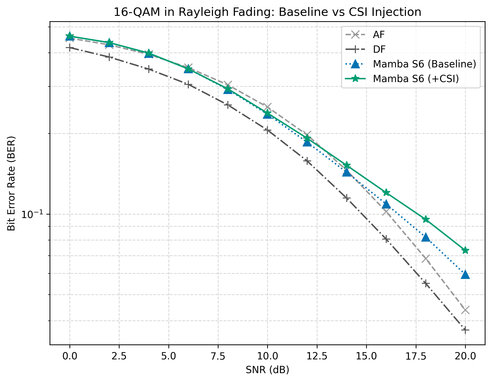

# Experiments {#sec:experiments}

The experiments chapter walks through the goals, trials, and conclusions from each experiment, following a systematic evaluation of relay strategies across diverse configurations.

## Channel Model Validation {#sec:channel-model-validation}

**Goal:** Validate the simulation framework against closed-form theoretical BER expressions to ensure baseline accuracy before evaluating AI relays.

**Trials:** - **Topology:** SISO, MIMO 2x2 - **Modulation scheme:** BPSK - **Channel:** AWGN, Rayleigh, Rician (K=3) - **Equalizers (in MIMO only):** None (SISO), ZF, MMSE, SIC - **Demod:** Hard decision only

**Conclusion: (Equation [\[eq:psk16-decision\]](#eq:psk16-decision){reference-type="ref" reference="eq:psk16-decision"})** Monte Carlo simulations match theoretical predictions within 95% confidence intervals across all channel models and topologies. AWGN follows the expected exponential decay (Equation [\[eq:awgn-ber\]](#eq:awgn-ber){reference-type="ref" reference="eq:awgn-ber"}), Rayleigh validates the $1/(4\bar{\gamma})$ high-SNR slope (Equation [\[eq:rayleigh-ber-approx\]](#eq:rayleigh-ber-approx){reference-type="ref" reference="eq:rayleigh-ber-approx"}), Rician falls between the two, and MIMO equalization correctly exhibits the expected ZF \< MMSE \< SIC performance hierarchy (Equation [\[eq:zf-snr\]](#eq:zf-snr){reference-type="ref" reference="eq:zf-snr"}).

### Results Figures {#sec:results-figures}

<figure data-latex-placement="H">

<figcaption>Figure 1: AWGN Channel — Theoretical vs. Simulative BER. Single-hop, two-hop AF, and two-hop DF: closed-form theory (solid lines) versus Monte Carlo simulation (markers with 95% CI). Theory and simulation match within the confidence interval at all SNR points.</figcaption>
</figure>

*Figure 1 --- End-to-end two-hop relay signal flow.*

<figure data-latex-placement="H">

<figcaption>Rayleigh fading — theory vs. simulation for single-hop and two-hop DF. The characteristic 1/SNR slope (compared to the steeper exponential AWGN curve) is clearly visible.</figcaption>
</figure>

<figure data-latex-placement="H">

<figcaption>Rician fading (K=3) — theory vs. simulation for single-hop and two-hop DF.</figcaption>
</figure>

<figure data-latex-placement="H">

<figcaption>Left — PDF of |<em>h</em>| for Rayleigh and Rician (<em>K</em> = 1, 3, 10). Right — CDF (outage probability). Rayleigh has the highest deep-fade probability at any threshold.</figcaption>
</figure>

<figure data-latex-placement="H">

<figcaption>2×2 MIMO Rayleigh — single-hop BER with ZF, MMSE, and SIC equalization. Theoretical approximations (solid/dashed lines) overlaid with Monte Carlo simulation (markers with 95% CI). MMSE provides ~1–2 dB gain over ZF; SIC provides an additional ~0.5–1 dB gain.</figcaption>
</figure>

<figure data-latex-placement="H">

<figcaption>Consolidated 2×3 grid of all channel model validations. Top row: (a) AWGN, (b) Rayleigh, (c) Rician K=3 — theory (blue) vs. simulation (red). Bottom row: (d) all SISO channels compared, (e) fading PDFs, (f) MIMO equalizer comparison.</figcaption>
</figure>

<figure data-latex-placement="H">

<figcaption>Single-hop BPSK BER for all three SISO channel models. AWGN provides the best BER (no fading), Rician K=3 is intermediate, and Rayleigh is the most challenging. The SNR penalty for Rayleigh relative to AWGN exceeds 15 dB at BER = 10−3, motivating the use of diversity techniques such as MIMO.</figcaption>
</figure>

## SISO BPSK Performance (Baseline Relay Comparison) {#sec:siso-bpsk-performance-baseline-relay-comparison}

**Goal:** Evaluate baseline classical and AI-based relay strategies on single-antenna configurations across different fading environments.

**Trials:** - **Topology:** SISO - **Modulation scheme:** BPSK - **Channel:** AWGN, Rayleigh, Rician (K=3) - **Equalizers:** None - **NN architecture:** Supervised (MLP, Hybrid), Generative (VAE, CGAN), Sequence (Transformer, Mamba S6, Mamba-2 SSD) - **NN activation:** tanh

**Conclusion:** AI relays selectively outperform AF and, on selected channels (AWGN, Rician), DF at low SNR (0--4 dB). However, under Rayleigh fading, classical DF dominates even at low SNR. Across all channels, classical DF remains dominant at medium-to-high SNR ($\geq 6$ dB), matching or exceeding all AI methods with zero parameters.

### Results Tables {#sec:results-tables}

::: {#tbl:table1}
<table>
<caption>BER comparison of all nine relay strategies on the AWGN channel.</caption>
<thead>
<tr>
<th style="text-align: left;">

SNR (dB)

</th>
<th style="text-align: left;">

AF

</th>
<th style="text-align: left;">

DF

</th>
<th style="text-align: left;">

MLP (169p)

</th>
<th style="text-align: left;">

Hybrid

</th>
<th style="text-align: left;">

VAE

</th>
<th style="text-align: left;">

CGAN

</th>
<th style="text-align: left;">

Transformer

</th>
<th style="text-align: left;">

Mamba S6

</th>
<th style="text-align: left;">

Mamba-2 SSD

</th>
</tr>
</thead>
<tbody>
<tr>
<td style="text-align: left;">

SNR (dB)

</td>
<td style="text-align: left;">

AF

</td>
<td style="text-align: left;">

DF

</td>
<td style="text-align: left;">

MLP (169p)

</td>
<td style="text-align: left;">

Hybrid

</td>
<td style="text-align: left;">

VAE

</td>
<td style="text-align: left;">

CGAN

</td>
<td style="text-align: left;">

Transformer

</td>
<td style="text-align: left;">

Mamba S6

</td>
<td style="text-align: left;">

Mamba-2 SSD

</td>
</tr>
<tr>
<td style="text-align: left;"></td>
<td style="text-align: left;"></td>
<td style="text-align: left;"></td>
<td style="text-align: left;"></td>
<td style="text-align: left;"></td>
<td style="text-align: left;"></td>
<td style="text-align: left;"><strong>0.261</strong></td>
<td style="text-align: left;"></td>
<td style="text-align: left;"></td>
<td style="text-align: left;"></td>
</tr>
<tr>
<td style="text-align: left;"></td>
<td style="text-align: left;"></td>
<td style="text-align: left;"></td>
<td style="text-align: left;"></td>
<td style="text-align: left;"></td>
<td style="text-align: left;"></td>
<td style="text-align: left;"><strong>0.111</strong></td>
<td style="text-align: left;"></td>
<td style="text-align: left;"></td>
<td style="text-align: left;"><strong>0.111</strong></td>
</tr>
<tr>
<td style="text-align: left;"></td>
<td style="text-align: left;"></td>
<td style="text-align: left;"><strong>0.010</strong></td>
<td style="text-align: left;"></td>
<td style="text-align: left;"><strong>0.010</strong></td>
<td style="text-align: left;"></td>
<td style="text-align: left;"></td>
<td style="text-align: left;"></td>
<td style="text-align: left;"><strong>0.010</strong></td>
<td style="text-align: left;"></td>
</tr>
<tr>
<td style="text-align: left;"></td>
<td style="text-align: left;"></td>
<td style="text-align: left;"><strong>1.67e-04</strong></td>
<td style="text-align: left;"><strong>1.67e-04</strong></td>
<td style="text-align: left;"><strong>1.67e-04</strong></td>
<td style="text-align: left;"></td>
<td style="text-align: left;">3.33e-04</td>
<td style="text-align: left;">3.33e-04</td>
<td style="text-align: left;"><strong>1.67e-04</strong></td>
<td style="text-align: left;"><strong>1.67e-04</strong></td>
</tr>
<tr>
<td style="text-align: left;"></td>
<td style="text-align: left;"><strong>0</strong></td>
<td style="text-align: left;"><strong>0</strong></td>
<td style="text-align: left;"><strong>0</strong></td>
<td style="text-align: left;"><strong>0</strong></td>
<td style="text-align: left;"></td>
<td style="text-align: left;"><strong>0</strong></td>
<td style="text-align: left;"><strong>0</strong></td>
<td style="text-align: left;"><strong>0</strong></td>
<td style="text-align: left;"><strong>0</strong></td>
</tr>
<tr>
<td style="text-align: left;"></td>
<td style="text-align: left;"><strong>0</strong></td>
<td style="text-align: left;"><strong>0</strong></td>
<td style="text-align: left;"><strong>0</strong></td>
<td style="text-align: left;"><strong>0</strong></td>
<td style="text-align: left;"></td>
<td style="text-align: left;"><strong>0</strong></td>
<td style="text-align: left;"><strong>0</strong></td>
<td style="text-align: left;"><strong>0</strong></td>
<td style="text-align: left;"><strong>0</strong></td>
</tr>
</tbody>
</table>
:::

::: {#tbl:table2}
<table>
<caption>BER comparison on the Rayleigh fading channel (SISO).</caption>
<thead>
<tr>
<th style="text-align: left;">

SNR (dB)

</th>
<th style="text-align: left;">

AF

</th>
<th style="text-align: left;">

DF

</th>
<th style="text-align: left;">

MLP (169p)

</th>
<th style="text-align: left;">

Hybrid

</th>
<th style="text-align: left;">

VAE

</th>
<th style="text-align: left;">

CGAN

</th>
<th style="text-align: left;">

Transformer

</th>
<th style="text-align: left;">

Mamba S6

</th>
<th style="text-align: left;">

Mamba-2 SSD

</th>
</tr>
</thead>
<tbody>
<tr>
<td style="text-align: left;">

SNR (dB)

</td>
<td style="text-align: left;">

AF

</td>
<td style="text-align: left;">

DF

</td>
<td style="text-align: left;">

MLP (169p)

</td>
<td style="text-align: left;">

Hybrid

</td>
<td style="text-align: left;">

VAE

</td>
<td style="text-align: left;">

CGAN

</td>
<td style="text-align: left;">

Transformer

</td>
<td style="text-align: left;">

Mamba S6

</td>
<td style="text-align: left;">

Mamba-2 SSD

</td>
</tr>
<tr>
<td style="text-align: left;"></td>
<td style="text-align: left;"></td>
<td style="text-align: left;"><strong>0.245</strong></td>
<td style="text-align: left;"></td>
<td style="text-align: left;"></td>
<td style="text-align: left;"></td>
<td style="text-align: left;"></td>
<td style="text-align: left;"></td>
<td style="text-align: left;"></td>
<td style="text-align: left;"></td>
</tr>
<tr>
<td style="text-align: left;"></td>
<td style="text-align: left;"></td>
<td style="text-align: left;"></td>
<td style="text-align: left;"></td>
<td style="text-align: left;"></td>
<td style="text-align: left;"></td>
<td style="text-align: left;"><strong>0.138</strong></td>
<td style="text-align: left;"></td>
<td style="text-align: left;"></td>
<td style="text-align: left;"></td>
</tr>
<tr>
<td style="text-align: left;"></td>
<td style="text-align: left;"></td>
<td style="text-align: left;"><strong>0.068</strong></td>
<td style="text-align: left;"></td>
<td style="text-align: left;"></td>
<td style="text-align: left;"></td>
<td style="text-align: left;"></td>
<td style="text-align: left;"></td>
<td style="text-align: left;"></td>
<td style="text-align: left;"></td>
</tr>
<tr>
<td style="text-align: left;"></td>
<td style="text-align: left;"></td>
<td style="text-align: left;"><strong>0.031</strong></td>
<td style="text-align: left;"></td>
<td style="text-align: left;"></td>
<td style="text-align: left;"></td>
<td style="text-align: left;"></td>
<td style="text-align: left;"></td>
<td style="text-align: left;"></td>
<td style="text-align: left;"></td>
</tr>
<tr>
<td style="text-align: left;"></td>
<td style="text-align: left;"></td>
<td style="text-align: left;"></td>
<td style="text-align: left;"></td>
<td style="text-align: left;"></td>
<td style="text-align: left;"></td>
<td style="text-align: left;"></td>
<td style="text-align: left;"></td>
<td style="text-align: left;"><strong>0.013</strong></td>
<td style="text-align: left;"></td>
</tr>
<tr>
<td style="text-align: left;"></td>
<td style="text-align: left;"></td>
<td style="text-align: left;"><strong>0.0047</strong></td>
<td style="text-align: left;"><strong>0.0047</strong></td>
<td style="text-align: left;"><strong>0.0047</strong></td>
<td style="text-align: left;"></td>
<td style="text-align: left;"></td>
<td style="text-align: left;"></td>
<td style="text-align: left;"></td>
<td style="text-align: left;"><strong>0.0047</strong></td>
</tr>
</tbody>
</table>
:::

::: {#tbl:table3}
<table>
<caption>BER comparison on the Rician fading channel with K-factor = 3.</caption>
<thead>
<tr>
<th style="text-align: left;">

SNR (dB)

</th>
<th style="text-align: left;">

AF

</th>
<th style="text-align: left;">

DF

</th>
<th style="text-align: left;">

MLP (169p)

</th>
<th style="text-align: left;">

Hybrid

</th>
<th style="text-align: left;">

VAE

</th>
<th style="text-align: left;">

CGAN

</th>
<th style="text-align: left;">

Transformer

</th>
<th style="text-align: left;">

Mamba S6

</th>
<th style="text-align: left;">

Mamba-2 SSD

</th>
</tr>
</thead>
<tbody>
<tr>
<td style="text-align: left;">

SNR (dB)

</td>
<td style="text-align: left;">

AF

</td>
<td style="text-align: left;">

DF

</td>
<td style="text-align: left;">

MLP (169p)

</td>
<td style="text-align: left;">

Hybrid

</td>
<td style="text-align: left;">

VAE

</td>
<td style="text-align: left;">

CGAN

</td>
<td style="text-align: left;">

Transformer

</td>
<td style="text-align: left;">

Mamba S6

</td>
<td style="text-align: left;">

Mamba-2 SSD

</td>
</tr>
<tr>
<td style="text-align: left;"></td>
<td style="text-align: left;"></td>
<td style="text-align: left;"></td>
<td style="text-align: left;"></td>
<td style="text-align: left;"></td>
<td style="text-align: left;"></td>
<td style="text-align: left;"><strong>0.203</strong></td>
<td style="text-align: left;"></td>
<td style="text-align: left;"></td>
<td style="text-align: left;"></td>
</tr>
<tr>
<td style="text-align: left;"></td>
<td style="text-align: left;"></td>
<td style="text-align: left;"><strong>0.090</strong></td>
<td style="text-align: left;"></td>
<td style="text-align: left;"></td>
<td style="text-align: left;"></td>
<td style="text-align: left;"></td>
<td style="text-align: left;"></td>
<td style="text-align: left;"></td>
<td style="text-align: left;"></td>
</tr>
<tr>
<td style="text-align: left;"></td>
<td style="text-align: left;"></td>
<td style="text-align: left;"><strong>0.028</strong></td>
<td style="text-align: left;"></td>
<td style="text-align: left;"></td>
<td style="text-align: left;"></td>
<td style="text-align: left;"></td>
<td style="text-align: left;"></td>
<td style="text-align: left;"></td>
<td style="text-align: left;"></td>
</tr>
<tr>
<td style="text-align: left;"></td>
<td style="text-align: left;"></td>
<td style="text-align: left;"></td>
<td style="text-align: left;"><strong>0.0068</strong></td>
<td style="text-align: left;"></td>
<td style="text-align: left;"></td>
<td style="text-align: left;"></td>
<td style="text-align: left;"></td>
<td style="text-align: left;"><strong>0.0068</strong></td>
<td style="text-align: left;"></td>
</tr>
<tr>
<td style="text-align: left;"></td>
<td style="text-align: left;"></td>
<td style="text-align: left;"></td>
<td style="text-align: left;"><strong>0.0017</strong></td>
<td style="text-align: left;"></td>
<td style="text-align: left;"></td>
<td style="text-align: left;"></td>
<td style="text-align: left;"></td>
<td style="text-align: left;"><strong>0.0017</strong></td>
<td style="text-align: left;"><strong>0.0017</strong></td>
</tr>
<tr>
<td style="text-align: left;"></td>
<td style="text-align: left;"><strong>6.67e-04</strong></td>
<td style="text-align: left;"><strong>6.67e-04</strong></td>
<td style="text-align: left;"><strong>6.67e-04</strong></td>
<td style="text-align: left;"><strong>6.67e-04</strong></td>
<td style="text-align: left;"></td>
<td style="text-align: left;">8.33e-04</td>
<td style="text-align: left;"><strong>6.67e-04</strong></td>
<td style="text-align: left;"><strong>6.67e-04</strong></td>
<td style="text-align: left;"><strong>6.67e-04</strong></td>
</tr>
</tbody>
</table>
:::

### Results Figures {#sec:results-figures-1}

<figure id="fig:fig9" data-latex-placement="H">

<figcaption>AWGN channel — BER vs. SNR for all nine relay strategies with 95% CI. AI relays outperform classical methods at low SNR; DF dominates at medium-to-high SNR.</figcaption>
</figure>

<figure id="fig:fig10" data-latex-placement="H">

<figcaption>Rayleigh fading — BER vs. SNR for all nine relay strategies with 95% CI.</figcaption>
</figure>

<figure id="fig:fig11" data-latex-placement="H">

<figcaption>Rician fading (K=3) — BER vs. SNR for all nine relay strategies with 95% CI.</figcaption>
</figure>

## MIMO 2x2 BPSK Performance {#sec:mimo-2x2-bpsk-performance}

**Goal:** Evaluate relay strategies under spatial multiplexing and various interference cancellation techniques.

**Trials:** - **Topology:** MIMO 2x2 - **Modulation scheme:** BPSK - **Channel:** Rayleigh - **Equalizers (in MIMO only):** ZF, MMSE, SIC - **NN architecture:** Supervised (MLP, Hybrid), Generative (VAE, CGAN), Sequence (Transformer, Mamba S6, Mamba-2 SSD) - **NN activation:** tanh

**Conclusion:** The MIMO equalization hierarchy (ZF \< MMSE \< SIC) holds for all relay types. The AI advantage at low SNR is preserved under ZF and MMSE (where Mamba S6 achieves the lowest BER), but under the superior SIC equalization, classical DF provides the lowest BER at all low-to-medium SNR points. Relay processing gains and MIMO equalization gains are additive.

### Results Tables {#sec:results-tables-1}

::: {#tbl:table4}
<table>
<caption>BER comparison on 2×2 MIMO Rayleigh channel with ZF equalization.</caption>
<thead>
<tr>
<th style="text-align: left;">

SNR (dB)

</th>
<th style="text-align: left;">

AF

</th>
<th style="text-align: left;">

DF

</th>
<th style="text-align: left;">

MLP (169p)

</th>
<th style="text-align: left;">

Hybrid

</th>
<th style="text-align: left;">

VAE

</th>
<th style="text-align: left;">

CGAN

</th>
<th style="text-align: left;">

Transformer

</th>
<th style="text-align: left;">

Mamba S6

</th>
<th style="text-align: left;">

Mamba-2 SSD

</th>
</tr>
</thead>
<tbody>
<tr>
<td style="text-align: left;">

SNR (dB)

</td>
<td style="text-align: left;">

AF

</td>
<td style="text-align: left;">

DF

</td>
<td style="text-align: left;">

MLP (169p)

</td>
<td style="text-align: left;">

Hybrid

</td>
<td style="text-align: left;">

VAE

</td>
<td style="text-align: left;">

CGAN

</td>
<td style="text-align: left;">

Transformer

</td>
<td style="text-align: left;">

Mamba S6

</td>
<td style="text-align: left;">

Mamba-2 SSD

</td>
</tr>
<tr>
<td style="text-align: left;"></td>
<td style="text-align: left;"></td>
<td style="text-align: left;"></td>
<td style="text-align: left;"><strong>0.250</strong></td>
<td style="text-align: left;"></td>
<td style="text-align: left;"></td>
<td style="text-align: left;"></td>
<td style="text-align: left;"></td>
<td style="text-align: left;"></td>
<td style="text-align: left;"></td>
</tr>
<tr>
<td style="text-align: left;"></td>
<td style="text-align: left;"></td>
<td style="text-align: left;"><strong>0.140</strong></td>
<td style="text-align: left;"></td>
<td style="text-align: left;"></td>
<td style="text-align: left;"></td>
<td style="text-align: left;"></td>
<td style="text-align: left;"></td>
<td style="text-align: left;"></td>
<td style="text-align: left;"></td>
</tr>
<tr>
<td style="text-align: left;"></td>
<td style="text-align: left;"></td>
<td style="text-align: left;"><strong>0.071</strong></td>
<td style="text-align: left;"></td>
<td style="text-align: left;"></td>
<td style="text-align: left;"></td>
<td style="text-align: left;"></td>
<td style="text-align: left;"></td>
<td style="text-align: left;"></td>
<td style="text-align: left;"></td>
</tr>
<tr>
<td style="text-align: left;"></td>
<td style="text-align: left;"></td>
<td style="text-align: left;"><strong>0.032</strong></td>
<td style="text-align: left;"><strong>0.032</strong></td>
<td style="text-align: left;"><strong>0.032</strong></td>
<td style="text-align: left;"></td>
<td style="text-align: left;"></td>
<td style="text-align: left;"></td>
<td style="text-align: left;"></td>
<td style="text-align: left;"></td>
</tr>
<tr>
<td style="text-align: left;"></td>
<td style="text-align: left;"></td>
<td style="text-align: left;"></td>
<td style="text-align: left;"><strong>0.013</strong></td>
<td style="text-align: left;"></td>
<td style="text-align: left;"></td>
<td style="text-align: left;"></td>
<td style="text-align: left;"></td>
<td style="text-align: left;"></td>
<td style="text-align: left;"></td>
</tr>
<tr>
<td style="text-align: left;"></td>
<td style="text-align: left;"></td>
<td style="text-align: left;"><strong>0.0037</strong></td>
<td style="text-align: left;"></td>
<td style="text-align: left;"><strong>0.0037</strong></td>
<td style="text-align: left;"></td>
<td style="text-align: left;"><strong>0.0037</strong></td>
<td style="text-align: left;"></td>
<td style="text-align: left;"></td>
<td style="text-align: left;"></td>
</tr>
</tbody>
</table>
:::

::: {#tbl:table5}
<table>
<caption>BER comparison on 2×2 MIMO Rayleigh channel with MMSE equalization.</caption>
<thead>
<tr>
<th style="text-align: left;">

SNR (dB)

</th>
<th style="text-align: left;">

AF

</th>
<th style="text-align: left;">

DF

</th>
<th style="text-align: left;">

MLP (169p)

</th>
<th style="text-align: left;">

Hybrid

</th>
<th style="text-align: left;">

VAE

</th>
<th style="text-align: left;">

CGAN

</th>
<th style="text-align: left;">

Transformer

</th>
<th style="text-align: left;">

Mamba S6

</th>
<th style="text-align: left;">

Mamba-2 SSD

</th>
</tr>
</thead>
<tbody>
<tr>
<td style="text-align: left;">

SNR (dB)

</td>
<td style="text-align: left;">

AF

</td>
<td style="text-align: left;">

DF

</td>
<td style="text-align: left;">

MLP (169p)

</td>
<td style="text-align: left;">

Hybrid

</td>
<td style="text-align: left;">

VAE

</td>
<td style="text-align: left;">

CGAN

</td>
<td style="text-align: left;">

Transformer

</td>
<td style="text-align: left;">

Mamba S6

</td>
<td style="text-align: left;">

Mamba-2 SSD

</td>
</tr>
<tr>
<td style="text-align: left;"></td>
<td style="text-align: left;"></td>
<td style="text-align: left;"></td>
<td style="text-align: left;"></td>
<td style="text-align: left;"></td>
<td style="text-align: left;"></td>
<td style="text-align: left;"></td>
<td style="text-align: left;"></td>
<td style="text-align: left;"><strong>0.163</strong></td>
<td style="text-align: left;"></td>
</tr>
<tr>
<td style="text-align: left;"></td>
<td style="text-align: left;"></td>
<td style="text-align: left;"><strong>0.086</strong></td>
<td style="text-align: left;"></td>
<td style="text-align: left;"><strong>0.086</strong></td>
<td style="text-align: left;"></td>
<td style="text-align: left;"></td>
<td style="text-align: left;"></td>
<td style="text-align: left;"></td>
<td style="text-align: left;"></td>
</tr>
<tr>
<td style="text-align: left;"></td>
<td style="text-align: left;"></td>
<td style="text-align: left;"><strong>0.040</strong></td>
<td style="text-align: left;"></td>
<td style="text-align: left;"><strong>0.040</strong></td>
<td style="text-align: left;"></td>
<td style="text-align: left;"></td>
<td style="text-align: left;"></td>
<td style="text-align: left;"></td>
<td style="text-align: left;"></td>
</tr>
<tr>
<td style="text-align: left;"></td>
<td style="text-align: left;"></td>
<td style="text-align: left;"><strong>0.018</strong></td>
<td style="text-align: left;"></td>
<td style="text-align: left;"><strong>0.018</strong></td>
<td style="text-align: left;"></td>
<td style="text-align: left;"></td>
<td style="text-align: left;"></td>
<td style="text-align: left;"></td>
<td style="text-align: left;"></td>
</tr>
<tr>
<td style="text-align: left;"></td>
<td style="text-align: left;"></td>
<td style="text-align: left;"><strong>0.0067</strong></td>
<td style="text-align: left;"></td>
<td style="text-align: left;"><strong>0.0067</strong></td>
<td style="text-align: left;"></td>
<td style="text-align: left;"></td>
<td style="text-align: left;"></td>
<td style="text-align: left;"></td>
<td style="text-align: left;"></td>
</tr>
<tr>
<td style="text-align: left;"></td>
<td style="text-align: left;"></td>
<td style="text-align: left;"></td>
<td style="text-align: left;"></td>
<td style="text-align: left;"></td>
<td style="text-align: left;"></td>
<td style="text-align: left;"></td>
<td style="text-align: left;"></td>
<td style="text-align: left;"><strong>0.0015</strong></td>
<td style="text-align: left;"></td>
</tr>
</tbody>
</table>
:::

::: {#tbl:table6}
<table>
<caption>BER comparison on 2×2 MIMO Rayleigh channel with MMSE-SIC equalization.</caption>
<thead>
<tr>
<th style="text-align: left;">

SNR (dB)

</th>
<th style="text-align: left;">

AF

</th>
<th style="text-align: left;">

DF

</th>
<th style="text-align: left;">

MLP (169p)

</th>
<th style="text-align: left;">

Hybrid

</th>
<th style="text-align: left;">

VAE

</th>
<th style="text-align: left;">

CGAN

</th>
<th style="text-align: left;">

Transformer

</th>
<th style="text-align: left;">

Mamba S6

</th>
<th style="text-align: left;">

Mamba-2 SSD

</th>
</tr>
</thead>
<tbody>
<tr>
<td style="text-align: left;">

SNR (dB)

</td>
<td style="text-align: left;">

AF

</td>
<td style="text-align: left;">

DF

</td>
<td style="text-align: left;">

MLP (169p)

</td>
<td style="text-align: left;">

Hybrid

</td>
<td style="text-align: left;">

VAE

</td>
<td style="text-align: left;">

CGAN

</td>
<td style="text-align: left;">

Transformer

</td>
<td style="text-align: left;">

Mamba S6

</td>
<td style="text-align: left;">

Mamba-2 SSD

</td>
</tr>
<tr>
<td style="text-align: left;"></td>
<td style="text-align: left;"></td>
<td style="text-align: left;"><strong>0.134</strong></td>
<td style="text-align: left;"></td>
<td style="text-align: left;"></td>
<td style="text-align: left;"></td>
<td style="text-align: left;"></td>
<td style="text-align: left;"></td>
<td style="text-align: left;"></td>
<td style="text-align: left;"></td>
</tr>
<tr>
<td style="text-align: left;"></td>
<td style="text-align: left;"></td>
<td style="text-align: left;"><strong>0.045</strong></td>
<td style="text-align: left;"></td>
<td style="text-align: left;"><strong>0.045</strong></td>
<td style="text-align: left;"></td>
<td style="text-align: left;"></td>
<td style="text-align: left;"></td>
<td style="text-align: left;"></td>
<td style="text-align: left;"></td>
</tr>
<tr>
<td style="text-align: left;"></td>
<td style="text-align: left;"></td>
<td style="text-align: left;"><strong>0.011</strong></td>
<td style="text-align: left;"></td>
<td style="text-align: left;"><strong>0.011</strong></td>
<td style="text-align: left;"></td>
<td style="text-align: left;"></td>
<td style="text-align: left;"></td>
<td style="text-align: left;"></td>
<td style="text-align: left;"></td>
</tr>
<tr>
<td style="text-align: left;"></td>
<td style="text-align: left;"></td>
<td style="text-align: left;"><strong>0.0037</strong></td>
<td style="text-align: left;"></td>
<td style="text-align: left;"><strong>0.0037</strong></td>
<td style="text-align: left;"></td>
<td style="text-align: left;"></td>
<td style="text-align: left;"></td>
<td style="text-align: left;"></td>
<td style="text-align: left;"></td>
</tr>
<tr>
<td style="text-align: left;"></td>
<td style="text-align: left;"></td>
<td style="text-align: left;"></td>
<td style="text-align: left;"></td>
<td style="text-align: left;"></td>
<td style="text-align: left;"></td>
<td style="text-align: left;"></td>
<td style="text-align: left;"><strong>0.0010</strong></td>
<td style="text-align: left;"></td>
<td style="text-align: left;"></td>
</tr>
<tr>
<td style="text-align: left;"></td>
<td style="text-align: left;">1.67e-04</td>
<td style="text-align: left;"><strong>0</strong></td>
<td style="text-align: left;"><strong>0</strong></td>
<td style="text-align: left;"><strong>0</strong></td>
<td style="text-align: left;"></td>
<td style="text-align: left;"><strong>0</strong></td>
<td style="text-align: left;"><strong>0</strong></td>
<td style="text-align: left;">1.67e-04</td>
<td style="text-align: left;"><strong>0</strong></td>
</tr>
</tbody>
</table>
:::

### Results Figures {#sec:results-figures-2}

<figure id="fig:fig12" data-latex-placement="H">

<figcaption>2×2 MIMO with ZF equalization — BER vs. SNR for all nine relay strategies with 95% CI.</figcaption>
</figure>

<figure id="fig:fig13" data-latex-placement="H">

<figcaption>2×2 MIMO with MMSE equalization — BER vs. SNR for all nine relay strategies with 95% CI.</figcaption>
</figure>

<figure id="fig:fig14" data-latex-placement="H">

<figcaption>2×2 MIMO with MMSE-SIC equalization — BER vs. SNR for all nine relay strategies with 95% CI.</figcaption>
</figure>

## Parameter Normalization & Complexity Trade-off {#sec:parameter-normalization-complexity-trade-off}

**Goal:** Isolate architectural inductive biases from parameter count effects and characterize the complexity-performance trade-off for relay denoising.

**Trials:** - **Topology:** SISO, MIMO 2x2 - **Modulation scheme:** BPSK - **Channel:** AWGN, Rayleigh, Rician, MIMO (ZF, MMSE, SIC) - **Equalizers (in MIMO only):** None, ZF, MMSE, SIC - **NN architecture:** All normalized to \~3,000 parameters, plus original sizes (169 to 26K) - **NN activation:** tanh

**Conclusion:** The relay denoising task exhibits an inverted-U complexity relationship: a minimal 169-parameter MLP matches models 140x larger, while excessive parameters (11K+) lead to overfitting. At a normalized scale of 3,000 parameters, the performance gap between feedforward and sequence architectures narrows to \~1% BER, indicating that parameter count rather than architectural choice is the primary performance driver. Generative VAE is a consistent underperformer due to probabilistic overhead.

### Results Tables {#sec:results-tables-2}

::: {#tbl:table7}
+--------------+--------------+--------------+--------------+----------------+--------------+--------------+--------------+--------------+
| ::: minipage | ::: minipage | ::: minipage | ::: minipage | ::: minipage   | ::: minipage | ::: minipage | ::: minipage | ::: minipage |
| SNR (dB)     | MLP-3K       | Hybrid-3K    | VAE-3K       | Transformer-3K | Mamba-3K     | Mamba2-3K    | AF           | DF           |
| :::          | :::          | :::          | :::          | :::            | :::          | :::          | :::          | :::          |
+:=============+:=============+:=============+:=============+:===============+:=============+:=============+:=============+:=============+
| ::: minipage | ::: minipage | ::: minipage | ::: minipage | ::: minipage   | ::: minipage | ::: minipage | ::: minipage | ::: minipage |
| SNR (dB)     | MLP-3K       | Hybrid-3K    | VAE-3K       | Transformer-3K | Mamba-3K     | Mamba2-3K    | AF           | DF           |
| :::          | :::          | :::          | :::          | :::            | :::          | :::          | :::          | :::          |
+--------------+--------------+--------------+--------------+----------------+--------------+--------------+--------------+--------------+
|              | **0.267**    |              |              |                |              |              |              |              |
+--------------+--------------+--------------+--------------+----------------+--------------+--------------+--------------+--------------+
|              |              |              |              |                | **0.112**    |              |              |              |
+--------------+--------------+--------------+--------------+----------------+--------------+--------------+--------------+--------------+
|              |              | **0.0012**   |              |                |              |              |              |              |
+--------------+--------------+--------------+--------------+----------------+--------------+--------------+--------------+--------------+
|              | **0**        | **0**        |              | **0**          | **0**        | **0**        |              |              |
+--------------+--------------+--------------+--------------+----------------+--------------+--------------+--------------+--------------+
|              | **0**        | **0**        |              | **0**          | **0**        | **0**        |              |              |
+--------------+--------------+--------------+--------------+----------------+--------------+--------------+--------------+--------------+

: Normalized 3K BER results --- AWGN channel.
:::

::: {#tbl:table8}
+--------------+--------------+--------------+--------------+----------------+--------------+--------------+--------------+--------------+
| ::: minipage | ::: minipage | ::: minipage | ::: minipage | ::: minipage   | ::: minipage | ::: minipage | ::: minipage | ::: minipage |
| SNR (dB)     | MLP-3K       | Hybrid-3K    | VAE-3K       | Transformer-3K | Mamba-3K     | Mamba2-3K    | AF           | DF           |
| :::          | :::          | :::          | :::          | :::            | :::          | :::          | :::          | :::          |
+:=============+:=============+:=============+:=============+:===============+:=============+:=============+:=============+:=============+
| ::: minipage | ::: minipage | ::: minipage | ::: minipage | ::: minipage   | ::: minipage | ::: minipage | ::: minipage | ::: minipage |
| SNR (dB)     | MLP-3K       | Hybrid-3K    | VAE-3K       | Transformer-3K | Mamba-3K     | Mamba2-3K    | AF           | DF           |
| :::          | :::          | :::          | :::          | :::            | :::          | :::          | :::          | :::          |
+--------------+--------------+--------------+--------------+----------------+--------------+--------------+--------------+--------------+
|              | **0.252**    |              |              |                |              |              |              |              |
+--------------+--------------+--------------+--------------+----------------+--------------+--------------+--------------+--------------+
|              |              | **0.145**    |              |                |              |              |              |              |
+--------------+--------------+--------------+--------------+----------------+--------------+--------------+--------------+--------------+
|              |              | **0.047**    |              |                |              |              |              |              |
+--------------+--------------+--------------+--------------+----------------+--------------+--------------+--------------+--------------+
|              |              |              |              |                | **0.014**    |              |              |              |
+--------------+--------------+--------------+--------------+----------------+--------------+--------------+--------------+--------------+
|              |              | **0.0047**   |              | **0.0047**     | **0.0047**   | **0.0047**   |              |              |
+--------------+--------------+--------------+--------------+----------------+--------------+--------------+--------------+--------------+

: Normalized 3K BER results --- Rayleigh fading channel.
:::

::: {#tbl:table9}
+--------------+--------------+--------------+--------------+----------------+--------------+--------------+--------------+--------------+
| ::: minipage | ::: minipage | ::: minipage | ::: minipage | ::: minipage   | ::: minipage | ::: minipage | ::: minipage | ::: minipage |
| SNR (dB)     | MLP-3K       | Hybrid-3K    | VAE-3K       | Transformer-3K | Mamba-3K     | Mamba2-3K    | AF           | DF           |
| :::          | :::          | :::          | :::          | :::            | :::          | :::          | :::          | :::          |
+:=============+:=============+:=============+:=============+:===============+:=============+:=============+:=============+:=============+
| ::: minipage | ::: minipage | ::: minipage | ::: minipage | ::: minipage   | ::: minipage | ::: minipage | ::: minipage | ::: minipage |
| SNR (dB)     | MLP-3K       | Hybrid-3K    | VAE-3K       | Transformer-3K | Mamba-3K     | Mamba2-3K    | AF           | DF           |
| :::          | :::          | :::          | :::          | :::            | :::          | :::          | :::          | :::          |
+--------------+--------------+--------------+--------------+----------------+--------------+--------------+--------------+--------------+
|              |              | **0.211**    |              |                |              |              |              |              |
+--------------+--------------+--------------+--------------+----------------+--------------+--------------+--------------+--------------+
|              | **0.095**    |              |              |                |              |              |              |              |
+--------------+--------------+--------------+--------------+----------------+--------------+--------------+--------------+--------------+
|              |              | **0.015**    |              |                |              |              |              |              |
+--------------+--------------+--------------+--------------+----------------+--------------+--------------+--------------+--------------+
|              | **0.0015**   |              |              | **0.0015**     |              | **0.0015**   |              |              |
+--------------+--------------+--------------+--------------+----------------+--------------+--------------+--------------+--------------+
|              | **6.67e-04** | **6.67e-04** |              | **6.67e-04**   | **6.67e-04** | **6.67e-04** | 6.67e-04     | 6.67e-04     |
+--------------+--------------+--------------+--------------+----------------+--------------+--------------+--------------+--------------+

: Normalized 3K BER results --- Rician K=3 fading channel.
:::

::: {#tbl:table10}
+--------------+--------------+--------------+--------------+----------------+--------------+--------------+--------------+--------------+
| ::: minipage | ::: minipage | ::: minipage | ::: minipage | ::: minipage   | ::: minipage | ::: minipage | ::: minipage | ::: minipage |
| SNR (dB)     | MLP-3K       | Hybrid-3K    | VAE-3K       | Transformer-3K | Mamba-3K     | Mamba2-3K    | AF           | DF           |
| :::          | :::          | :::          | :::          | :::            | :::          | :::          | :::          | :::          |
+:=============+:=============+:=============+:=============+:===============+:=============+:=============+:=============+:=============+
| ::: minipage | ::: minipage | ::: minipage | ::: minipage | ::: minipage   | ::: minipage | ::: minipage | ::: minipage | ::: minipage |
| SNR (dB)     | MLP-3K       | Hybrid-3K    | VAE-3K       | Transformer-3K | Mamba-3K     | Mamba2-3K    | AF           | DF           |
| :::          | :::          | :::          | :::          | :::            | :::          | :::          | :::          | :::          |
+--------------+--------------+--------------+--------------+----------------+--------------+--------------+--------------+--------------+
|              | **0.256**    |              |              |                |              |              |              |              |
+--------------+--------------+--------------+--------------+----------------+--------------+--------------+--------------+--------------+
|              | **0.146**    |              |              |                |              |              |              |              |
+--------------+--------------+--------------+--------------+----------------+--------------+--------------+--------------+--------------+
|              | **0.049**    |              |              |                |              |              |              |              |
+--------------+--------------+--------------+--------------+----------------+--------------+--------------+--------------+--------------+
|              |              | **0.014**    |              |                |              |              |              |              |
+--------------+--------------+--------------+--------------+----------------+--------------+--------------+--------------+--------------+
|              |              | **0.0037**   |              |                |              |              |              |              |
+--------------+--------------+--------------+--------------+----------------+--------------+--------------+--------------+--------------+

: Normalized 3K BER results --- 2Ã---2 MIMO ZF.
:::

::: {#tbl:table11}
+--------------+--------------+--------------+--------------+----------------+--------------+--------------+--------------+--------------+
| ::: minipage | ::: minipage | ::: minipage | ::: minipage | ::: minipage   | ::: minipage | ::: minipage | ::: minipage | ::: minipage |
| SNR (dB)     | MLP-3K       | Hybrid-3K    | VAE-3K       | Transformer-3K | Mamba-3K     | Mamba2-3K    | AF           | DF           |
| :::          | :::          | :::          | :::          | :::            | :::          | :::          | :::          | :::          |
+:=============+:=============+:=============+:=============+:===============+:=============+:=============+:=============+:=============+
| ::: minipage | ::: minipage | ::: minipage | ::: minipage | ::: minipage   | ::: minipage | ::: minipage | ::: minipage | ::: minipage |
| SNR (dB)     | MLP-3K       | Hybrid-3K    | VAE-3K       | Transformer-3K | Mamba-3K     | Mamba2-3K    | AF           | DF           |
| :::          | :::          | :::          | :::          | :::            | :::          | :::          | :::          | :::          |
+--------------+--------------+--------------+--------------+----------------+--------------+--------------+--------------+--------------+
|              |              | **0.164**    |              |                |              |              |              |              |
+--------------+--------------+--------------+--------------+----------------+--------------+--------------+--------------+--------------+
|              |              | **0.086**    |              |                |              |              |              |              |
+--------------+--------------+--------------+--------------+----------------+--------------+--------------+--------------+--------------+
|              |              |              |              |                | **0.026**    |              |              |              |
+--------------+--------------+--------------+--------------+----------------+--------------+--------------+--------------+--------------+
|              |              |              |              | **0.0067**     |              |              |              |              |
+--------------+--------------+--------------+--------------+----------------+--------------+--------------+--------------+--------------+
|              |              | **0.0018**   |              | **0.0018**     | **0.0018**   | **0.0018**   |              |              |
+--------------+--------------+--------------+--------------+----------------+--------------+--------------+--------------+--------------+

: Normalized 3K BER results --- 2Ã---2 MIMO MMSE.
:::

::: {#tbl:table12}
+--------------+--------------+--------------+--------------+----------------+--------------+--------------+--------------+--------------+
| ::: minipage | ::: minipage | ::: minipage | ::: minipage | ::: minipage   | ::: minipage | ::: minipage | ::: minipage | ::: minipage |
| SNR (dB)     | MLP-3K       | Hybrid-3K    | VAE-3K       | Transformer-3K | Mamba-3K     | Mamba2-3K    | AF           | DF           |
| :::          | :::          | :::          | :::          | :::            | :::          | :::          | :::          | :::          |
+:=============+:=============+:=============+:=============+:===============+:=============+:=============+:=============+:=============+
| ::: minipage | ::: minipage | ::: minipage | ::: minipage | ::: minipage   | ::: minipage | ::: minipage | ::: minipage | ::: minipage |
| SNR (dB)     | MLP-3K       | Hybrid-3K    | VAE-3K       | Transformer-3K | Mamba-3K     | Mamba2-3K    | AF           | DF           |
| :::          | :::          | :::          | :::          | :::            | :::          | :::          | :::          | :::          |
+--------------+--------------+--------------+--------------+----------------+--------------+--------------+--------------+--------------+
|              |              | **0.137**    |              |                |              |              |              |              |
+--------------+--------------+--------------+--------------+----------------+--------------+--------------+--------------+--------------+
|              |              | **0.045**    |              |                |              |              |              |              |
+--------------+--------------+--------------+--------------+----------------+--------------+--------------+--------------+--------------+
|              |              | **0.0057**   |              |                | **0.0057**   |              |              |              |
+--------------+--------------+--------------+--------------+----------------+--------------+--------------+--------------+--------------+
|              |              |              |              | **0.0010**     |              |              |              |              |
+--------------+--------------+--------------+--------------+----------------+--------------+--------------+--------------+--------------+
|              | 1.67e-04     | **0**        |              | **0**          | **0**        | **0**        | 1.67e-04     |              |
+--------------+--------------+--------------+--------------+----------------+--------------+--------------+--------------+--------------+

: Normalized 3K BER results --- 2Ã---2 MIMO SIC.
:::

::: {#tbl:table13}
+------------------+--------------+--------------+------------------------+------------------+-----------------+
| ::: minipage     | ::: minipage | ::: minipage | ::: minipage           | ::: minipage     | ::: minipage    |
| Model            | Parameters   | Device       | Training Time          | Eval Time (AWGN) | Eval Time (SIC) |
| :::              | :::          | :::          | :::                    | :::              | :::             |
+:=================+:=============+:=============+:=======================+:=================+:================+
| ::: minipage     | ::: minipage | ::: minipage | ::: minipage           | ::: minipage     | ::: minipage    |
| Model            | Parameters   | Device       | Training Time          | Eval Time (AWGN) | Eval Time (SIC) |
| :::              | :::          | :::          | :::                    | :::              | :::             |
+------------------+--------------+--------------+------------------------+------------------+-----------------+
| AF               |              | ---          | s                      | s                | s               |
+------------------+--------------+--------------+------------------------+------------------+-----------------+
| DF               |              | ---          | s                      | s                | s               |
+------------------+--------------+--------------+------------------------+------------------+-----------------+
| MLP (169p)       |              | CPU          | s                      | s                | s               |
+------------------+--------------+--------------+------------------------+------------------+-----------------+
| Hybrid           |              | CPU          | s                      | s                | s               |
+------------------+--------------+--------------+------------------------+------------------+-----------------+
| VAE              | ,777         | CPU          | s                      | s                | s               |
+------------------+--------------+--------------+------------------------+------------------+-----------------+
| CGAN (WGAN-GP)   | ,946         | CUDA         | ,293 s (\~2 h)         | s                | s               |
+------------------+--------------+--------------+------------------------+------------------+-----------------+
| Transformer      | ,697         | CUDA         | s (\~8 min)            | s                | s               |
+------------------+--------------+--------------+------------------------+------------------+-----------------+
| **Mamba S6**     | **24,001**   | **CUDA**     | **2,141 s (\~36 min)** | **1.88 s**       | **3.02 s**      |
+------------------+--------------+--------------+------------------------+------------------+-----------------+
| **Mamba2 (SSD)** | **26,179**   | **CUDA**     | **1,438 s (\~24 min)** | **4.11 s**       | **5.61 s**      |
+------------------+--------------+--------------+------------------------+------------------+-----------------+

: Model complexity and timing comparison (experiment-specific training settings; Monte Carlo evaluation over 11 SNR points Ã--- 10 trials Ã--- 10,000 bits). All inference uses batched window extraction and a single forward pass per signal block.
:::

### Results Figures {#sec:results-figures-3}

<figure id="fig:fig15" data-latex-placement="H">

<figcaption>Normalized 3K-parameter comparison across all channels. At equal parameter budgets, all architectures converge to similar BER, with VAE being the consistent underperformer.</figcaption>
</figure>

<figure id="fig:fig16" data-latex-placement="H">

<figcaption>Normalized 3K-parameter BER comparison on AWGN. Mamba-3K and Transformer-3K produce nearly identical BER, eliminating the gap seen at original parameter counts.</figcaption>
</figure>

<figure id="fig:fig17" data-latex-placement="H">

<figcaption>Normalized 3K-parameter BER comparison on Rayleigh fading.</figcaption>
</figure>

<figure id="fig:fig18" data-latex-placement="H">

<figcaption>Normalized 3K-parameter BER comparison on Rician fading (K=3).</figcaption>
</figure>

<figure id="fig:fig19" data-latex-placement="H">

<figcaption>Complexity–performance trade-off. Training time vs. parameter count vs. BER improvement over DF at low SNR. The Minimal MLP (169 params) achieves the best efficiency.</figcaption>
</figure>

<figure id="fig:fig20" data-latex-placement="H">

<figcaption>Master BER comparison — consolidated view of all nine relay strategies across all six channel/topology configurations.</figcaption>
</figure>

## Higher-Order Modulation Scalability (Constellation-Aware Training) {#sec:higher-order-modulation-scalability-constellation-aware-training}

**Goal:** Evaluate the generalizability of BPSK-trained relays to complex constellations and resolve the multi-level amplitude bottleneck.

**Trials:** - **Topology:** SISO - **Modulation scheme:** QPSK, 16-QAM - **Channel:** AWGN, Rayleigh - **Equalizers:** None - **NN architecture:** Supervised (MLP, Hybrid), Generative (VAE, CGAN), Sequence (Transformer, Mamba S6, Mamba-2 SSD) - **NN activation:** tanh, linear, clipped tanh (hardtanh), scaled tanh, scaled sigmoid - **Special case:** Constellation Aware training

**Conclusion:** QPSK performance mirrors BPSK perfectly due to I/Q independence. On 16-QAM, standard tanh compression causes a severe, irreducible BER floor (\~0.22 at 16 dB). Replacing tanh with constellation-aware bounded activations (hardtanh, scaled tanh) bounded to the precise signal amplitude ($3/\sqrt{10}$) and retraining eliminates this floor. Sequence models benefit most, reducing their BER floor by 5x, though a gap to classical DF persists due to per-axis error accumulation.

### Results Tables {#sec:results-tables-3}

::: {#tbl:table14}
+----------------+--------------+--------------+--------------+--------------+--------------+--------------+--------------+
| ::: minipage   | ::: minipage | ::: minipage | ::: minipage | ::: minipage | ::: minipage | ::: minipage | ::: minipage |
| Relay          | BPSK 0 dB    | BPSK 10 dB   | QPSK 0 dB    | QPSK 10 dB   | 16-QAM 0 dB  | 16-QAM 10 dB | 16-QAM 16 dB |
| :::            | :::          | :::          | :::          | :::          | :::          | :::          | :::          |
+:===============+:=============+:=============+:=============+:=============+:=============+:=============+:=============+
| ::: minipage   | ::: minipage | ::: minipage | ::: minipage | ::: minipage | ::: minipage | ::: minipage | ::: minipage |
| Relay          | BPSK 0 dB    | BPSK 10 dB   | QPSK 0 dB    | QPSK 10 dB   | 16-QAM 0 dB  | 16-QAM 10 dB | 16-QAM 16 dB |
| :::            | :::          | :::          | :::          | :::          | :::          | :::          | :::          |
+----------------+--------------+--------------+--------------+--------------+--------------+--------------+--------------+
| AF             |              |              |              |              |              |              |              |
+----------------+--------------+--------------+--------------+--------------+--------------+--------------+--------------+
| DF             |              |              |              |              |              |              |              |
+----------------+--------------+--------------+--------------+--------------+--------------+--------------+--------------+
| MLP (169p)     |              |              |              |              |              |              |              |
+----------------+--------------+--------------+--------------+--------------+--------------+--------------+--------------+
| Hybrid         |              |              |              |              |              |              |              |
+----------------+--------------+--------------+--------------+--------------+--------------+--------------+--------------+
| VAE            |              |              |              |              |              |              |              |
+----------------+--------------+--------------+--------------+--------------+--------------+--------------+--------------+
| CGAN (WGAN-GP) |              |              |              |              |              |              |              |
+----------------+--------------+--------------+--------------+--------------+--------------+--------------+--------------+
| Transformer    |              |              |              |              |              |              |              |
+----------------+--------------+--------------+--------------+--------------+--------------+--------------+--------------+
| Mamba S6       |              |              |              |              |              |              |              |
+----------------+--------------+--------------+--------------+--------------+--------------+--------------+--------------+
| Mamba2 (SSD)   |              |              |              |              |              |              |              |
+----------------+--------------+--------------+--------------+--------------+--------------+--------------+--------------+

: BER comparison across modulations at selected SNR points (AWGN channel). All nine relay strategies.
:::

Table 15 shows the BER at 16 dB for all relays across the three activation variants and both channel types.

::: {#tbl:table15}
+--------------+--------------+----------------+------------------+--------------+----------------+------------------+
| ::: minipage | ::: minipage | ::: minipage   | ::: minipage     | ::: minipage | ::: minipage   | ::: minipage     |
| Relay        | tanh (BPSK)  | linear (QAM16) | hardtanh (QAM16) | tanh (BPSK)  | linear (QAM16) | hardtanh (QAM16) |
| :::          | :::          | :::            | :::              | :::          | :::            | :::              |
+:=============+:=============+:===============+:=================+:=============+:===============+:=================+
| ::: minipage | ::: minipage | ::: minipage   | ::: minipage     | ::: minipage | ::: minipage   | ::: minipage     |
| Relay        | tanh (BPSK)  | linear (QAM16) | hardtanh (QAM16) | tanh (BPSK)  | linear (QAM16) | hardtanh (QAM16) |
| :::          | :::          | :::            | :::              | :::          | :::            | :::              |
+--------------+--------------+----------------+------------------+--------------+----------------+------------------+
|              | **AWGN**     |                |                  | **Rayleigh** |                |                  |
+--------------+--------------+----------------+------------------+--------------+----------------+------------------+
| MLP          |              |                | **0.0630**       |              |                | **0.1247**       |
+--------------+--------------+----------------+------------------+--------------+----------------+------------------+
| Hybrid       |              |                |                  |              |                |                  |
+--------------+--------------+----------------+------------------+--------------+----------------+------------------+
| VAE          |              |                | **0.1059**       |              |                | **0.1573**       |
+--------------+--------------+----------------+------------------+--------------+----------------+------------------+
| CGAN         |              |                | **0.0863**       |              |                | **0.1383**       |
+--------------+--------------+----------------+------------------+--------------+----------------+------------------+
| Transformer  |              | **0.0453**     |                  |              | **0.1159**     |                  |
+--------------+--------------+----------------+------------------+--------------+----------------+------------------+
| Mamba S6     |              |                | **0.0396**       |              |                | **0.1108**       |
+--------------+--------------+----------------+------------------+--------------+----------------+------------------+
| Mamba-2 SSD  |              |                | **0.0441**       |              |                | **0.1145**       |
+--------------+--------------+----------------+------------------+--------------+----------------+------------------+
| AF           |              | ---            | ---              |              | ---            | ---              |
+--------------+--------------+----------------+------------------+--------------+----------------+------------------+
| DF           |              | ---            | ---              |              | ---            | ---              |
+--------------+--------------+----------------+------------------+--------------+----------------+------------------+

: BER at 16 dB for all relay variants across activation functions and modulations (AWGN and Rayleigh).
:::

Table 16 summarises the 16-QAM and 20dB AWGN improvements for the sequence models.

::: {#tbl:table16}
+--------------+--------------+--------------+---------------------+----------------------+
| ::: minipage | ::: minipage | ::: minipage | ::: minipage        | ::: minipage         |
| SNR (dB)     | AF Baseline  | DF Baseline  | Mamba S6 (Baseline) | Mamba S6 (+CSI + LN) |
| :::          | :::          | :::          | :::                 | :::                  |
+:=============+:=============+:=============+:====================+:=====================+
| ::: minipage | ::: minipage | ::: minipage | ::: minipage        | ::: minipage         |
| SNR (dB)     | AF Baseline  | DF Baseline  | Mamba S6 (Baseline) | Mamba S6 (+CSI + LN) |
| :::          | :::          | :::          | :::                 | :::                  |
+--------------+--------------+--------------+---------------------+----------------------+
| **0.0**      |              |              |                     |                      |
+--------------+--------------+--------------+---------------------+----------------------+
| **8.0**      |              |              |                     |                      |
+--------------+--------------+--------------+---------------------+----------------------+
| **14.0**     |              |              |                     |                      |
+--------------+--------------+--------------+---------------------+----------------------+
| **20.0**     |              |              |                     | **0.0055**           |
+--------------+--------------+--------------+---------------------+----------------------+

: 16-QAM BER improvements at 20 dB for sequence models with and without CSI injection and layer normalisation (AWGN).
:::

### Results Figures {#sec:results-figures-4}

<figure id="fig:fig21" data-latex-placement="H">

<figcaption>BPSK on AWGN — all relay strategies with 95% CI (baseline for modulation comparison).</figcaption>
</figure>

<figure id="fig:fig22" data-latex-placement="H">

<figcaption>BPSK on Rayleigh fading — all relay strategies with 95% CI.</figcaption>
</figure>

<figure id="fig:fig23" data-latex-placement="H">

<figcaption>QPSK on AWGN — BER curves closely match the BPSK baseline (Figure 21), confirming I/Q splitting validity.</figcaption>
</figure>

<figure id="fig:fig24" data-latex-placement="H">

<figcaption>QPSK on Rayleigh fading — same relative ordering as BPSK, confirming hypothesis generalisability.</figcaption>
</figure>

<figure id="fig:fig25" data-latex-placement="H">

<figcaption>16-QAM on AWGN — AI relays hit a BER floor near 0.22 at medium-high SNR due to tanh  compression of multi-level signals; AF outperforms DF at low SNR (Y</figcaption>
</figure>

<figure id="fig:fig26" data-latex-placement="H">

<figcaption>16-QAM on Rayleigh fading — wider BER gap between modulations under fading; all AI relays significantly worse than DF at every SNR point (N</figcaption>
</figure>

<figure id="fig:fig27" data-latex-placement="H">

<figcaption>Combined modulation comparison (AWGN) — all nine relays across BPSK (solid), QPSK (dashed, overlapping BPSK), and 16-QAM (dotted). The BPSK/QPSK overlap confirms I/Q splitting equivalence. The 16-QAM dotted curves reveal the AI relay BER floor: all AI relays plateau near 0.18–0.25 while DF and AF continue decreasing.</figcaption>
</figure>

<figure id="fig:fig28" data-latex-placement="H">

<figcaption>16-QAM activation experiment (AWGN) — dashed lines = tanh/BPSK baseline, solid = linear/QAM16, dotted = hardtanh/QAM16. Replacing tanh and retraining on QAM16 eliminates the BER floor for all AI relays except Hybrid. Sequence models (Transformer, Mamba S6, Mamba-2) benefit most, narrowing the gap to DF from ~56× to ~10×.</figcaption>
</figure>

<figure id="fig:fig29" data-latex-placement="H">

<figcaption>16-QAM activation experiment (Rayleigh fading) — same trend under fading. The improvement is significant but the gap to DF/AF remains larger than on AWGN, consistent with fading amplifying modulation-order differences (Finding 6).</figcaption>
</figure>

<figure id="fig:fig30" data-latex-placement="H">

<figcaption>BPSK constellation-aware activation comparison (AWGN). With <em>A</em>max = 1.0, scaled tanh reduces to standard tanh. All three bounded activations achieve equivalent BER, confirming that BPSK is insensitive to activation choice.</figcaption>
</figure>

<figure id="fig:fig31" data-latex-placement="H">

<figcaption>BPSK constellation-aware activation comparison (Rayleigh fading). Same pattern under fading — activation choice has negligible effect on BPSK BER.</figcaption>
</figure>

<figure id="fig:fig32" data-latex-placement="H">

<figcaption>QPSK constellation-aware activation comparison (AWGN). With <em>A</em>max = 0.7071, the tighter clip range matches the binary I/Q components exactly. Sigmoid provides marginally lower BER for the Transformer relay at low SNR.</figcaption>
</figure>

<figure id="fig:fig33" data-latex-placement="H">

<figcaption>QPSK constellation-aware activation comparison (Rayleigh fading). Similar trends under fading. The three activations remain closely matched for most relays.</figcaption>
</figure>

<figure id="fig:fig34" data-latex-placement="H">

<figcaption>16-QAM constellation-aware activation comparison (AWGN). All three bounded activations eliminate the tanh BER floor from Section 4.10, with scaled tanh and hardtanh closely matched.</figcaption>
</figure>

<figure id="fig:fig35" data-latex-placement="H">

<figcaption>16-QAM constellation-aware activation comparison (Rayleigh fading). The BER floor elimination persists under fading. Sequence models benefit most from the constellation-aware bounds.</figcaption>
</figure>

<figure id="fig:fig36" data-latex-placement="H">

<figcaption>Comparison of activation function shapes (left) and their derivatives (right) for <em>A</em>max = 0.9487 (16-QAM). Hardtanh has a sharp transition at the clip bounds; sigmoid and scaled tanh provide smooth saturation with non-zero gradients throughout.</figcaption>
</figure>

## Input Normalization and CSI Injection {#sec:input-normalization-and-csi-injection}

**Goal:** Determine the impact of structural input normalization and explicit channel state information (CSI) injection on higher-order modulations in fading channels.

**Trials:** - **Topology:** SISO - **Modulation scheme:** 16-QAM, 16-PSK - **Channel:** Rayleigh - **Equalizers:** None - **NN architecture:** Transformer, Mamba S6, Mamba-2 SSD - **NN activation:** tanh, hardtanh, scaled tanh, sigmoid - **Special case:** CSI Injection, LayerNorm

**Conclusion:** Input LayerNorm universally benefits multi-level constellations like 16-QAM. Explicit CSI injection is highly modulation-dependent: it degrades performance for amplitude-carrying 16-QAM (creating redundant feature confusion) but significantly improves performance for constant-envelope 16-PSK, bringing the best neural models to within 2.5% of AF at high SNR. Across the 48 tested combinatorial variants, Mamba S6 proved the strongest architecture, but no neural relay surpassed classical DF.

### Results Tables {#sec:results-tables-4}

::: {#tbl:table18}
+--------------+--------------+--------------+------------------------+------------------------------+---------------------------+
| ::: minipage | ::: minipage | ::: minipage | ::: minipage           | ::: minipage                 | ::: minipage              |
| SNR (dB)     | AF           | DF           | #1 Mamba S6 (+LN tanh) | #2 Transformer (+LN sigmoid) | #3 Transformer (+LN tanh) |
| :::          | :::          | :::          | :::                    | :::                          | :::                       |
+:=============+:=============+:=============+:=======================+:=============================+:==========================+
| ::: minipage | ::: minipage | ::: minipage | ::: minipage           | ::: minipage                 | ::: minipage              |
| SNR (dB)     | AF           | DF           | #1 Mamba S6 (+LN tanh) | #2 Transformer (+LN sigmoid) | #3 Transformer (+LN tanh) |
| :::          | :::          | :::          | :::                    | :::                          | :::                       |
+--------------+--------------+--------------+------------------------+------------------------------+---------------------------+
|              |              |              |                        |                              |                           |
+--------------+--------------+--------------+------------------------+------------------------------+---------------------------+
|              |              |              |                        |                              |                           |
+--------------+--------------+--------------+------------------------+------------------------------+---------------------------+
|              |              |              |                        |                              |                           |
+--------------+--------------+--------------+------------------------+------------------------------+---------------------------+
|              |              |              |                        |                              |                           |
+--------------+--------------+--------------+------------------------+------------------------------+---------------------------+
|              |              |              |                        |                              |                           |
+--------------+--------------+--------------+------------------------+------------------------------+---------------------------+
|              |              |              |                        |                              |                           |
+--------------+--------------+--------------+------------------------+------------------------------+---------------------------+

: Sample BER values comparing blind spatial tracking vs. explicit Channel State injection for 16-QAM in Rayleigh fading.
:::

::: {#tbl:table19}
+--------------+--------------+--------------+--------------------------------+-----------------------------+--------------------------------+
| ::: minipage | ::: minipage | ::: minipage | ::: minipage                   | ::: minipage                | ::: minipage                   |
| SNR (dB)     | AF           | DF           | #1 Mamba S6 (+CSI+LN hardtanh) | #2 Mamba S6 (+CSI hardtanh) | #3 Mamba S6 (+CSI scaled_tanh) |
| :::          | :::          | :::          | :::                            | :::                         | :::                            |
+:=============+:=============+:=============+:===============================+:============================+:===============================+
| ::: minipage | ::: minipage | ::: minipage | ::: minipage                   | ::: minipage                | ::: minipage                   |
| SNR (dB)     | AF           | DF           | #1 Mamba S6 (+CSI+LN hardtanh) | #2 Mamba S6 (+CSI hardtanh) | #3 Mamba S6 (+CSI scaled_tanh) |
| :::          | :::          | :::          | :::                            | :::                         | :::                            |
+--------------+--------------+--------------+--------------------------------+-----------------------------+--------------------------------+
|              |              |              |                                |                             |                                |
+--------------+--------------+--------------+--------------------------------+-----------------------------+--------------------------------+
|              |              |              |                                |                             |                                |
+--------------+--------------+--------------+--------------------------------+-----------------------------+--------------------------------+
|              |              |              |                                |                             |                                |
+--------------+--------------+--------------+--------------------------------+-----------------------------+--------------------------------+
|              |              |              |                                |                             |                                |
+--------------+--------------+--------------+--------------------------------+-----------------------------+--------------------------------+
|              |              |              |                                |                             |                                |
+--------------+--------------+--------------+--------------------------------+-----------------------------+--------------------------------+
|              |              |              |                                |                             |                                |
+--------------+--------------+--------------+--------------------------------+-----------------------------+--------------------------------+

: BER at selected SNR points for the top-3 neural relays and classical baselines (16-QAM, Rayleigh fading, 100 MC trials). The best neural variant (Mamba S6 +LN tanh) comes within 21% of AF at 20 dB but does not surpass it.
:::

::: {#tbl:table20}
+-------------------------+---------------------------------+---------------------------------+
| ::: minipage            | ::: minipage                    | ::: minipage                    |
| Property                | 16-QAM Top-3                    | 16-PSK Top-3                    |
| :::                     | :::                             | :::                             |
+:========================+:================================+:================================+
| ::: minipage            | ::: minipage                    | ::: minipage                    |
| Property                | 16-QAM Top-3                    | 16-PSK Top-3                    |
| :::                     | :::                             | :::                             |
+-------------------------+---------------------------------+---------------------------------+
| Dominant configuration  | +LN (LayerNorm only)            | +CSI / +CSI+LN                  |
+-------------------------+---------------------------------+---------------------------------+
| CSI injection benefit   | Negative (degrades BER)         | Positive (improves BER)         |
+-------------------------+---------------------------------+---------------------------------+
| Best architecture       | Mamba S6, Transformer           | Mamba S6 (all three)            |
+-------------------------+---------------------------------+---------------------------------+
| Best activation         | tanh, sigmoid                   | hardtanh, scaled_tanh           |
+-------------------------+---------------------------------+---------------------------------+
| Gap to AF at 20 dB      | \~21% (0.0562 vs. 0.0465)       | \~2.5% (0.0832 vs. 0.0812)      |
+-------------------------+---------------------------------+---------------------------------+
| DF superiority at 20 dB | DF wins by 43% over best neural | DF wins by 17% over best neural |
+-------------------------+---------------------------------+---------------------------------+

: BER at selected SNR points for the top-3 neural relays and classical baselines (16-PSK, Rayleigh fading, 100 MC trials). The best neural variants track AF closely at high SNR, with the gap narrowing to 2.5% at 20 dB.
:::

::: {#tbl:table21}
+------------------------------------------------------------------------+------------------------------------------------------------------------------------------------------+-------------------------------------------------------------------------------------------------------+
| ::: minipage                                                           | ::: minipage                                                                                         | ::: minipage                                                                                          |
| Goal                                                                   | Outcome                                                                                              | Assessment                                                                                            |
| :::                                                                    | :::                                                                                                  | :::                                                                                                   |
+:=======================================================================+:=====================================================================================================+:======================================================================================================+
| ::: minipage                                                           | ::: minipage                                                                                         | ::: minipage                                                                                          |
| Goal                                                                   | Outcome                                                                                              | Assessment                                                                                            |
| :::                                                                    | :::                                                                                                  | :::                                                                                                   |
+------------------------------------------------------------------------+------------------------------------------------------------------------------------------------------+-------------------------------------------------------------------------------------------------------+
| Identify top architectures for higher-order modulations                | QAM16: Mamba S6 and Transformer dominate; PSK16: Mamba S6 sweeps all top-3                           | **Achieved** --- clear ranking established with statistical confidence over 100 MC trials             |
+------------------------------------------------------------------------+------------------------------------------------------------------------------------------------------+-------------------------------------------------------------------------------------------------------+
| Determine whether CSI injection universally improves relay performance | CSI injection is modulation-dependent: beneficial for PSK16, detrimental for QAM16                   | **Achieved** --- unexpected finding that refutes the Section 4.14 hypothesis of universal CSI benefit |
+------------------------------------------------------------------------+------------------------------------------------------------------------------------------------------+-------------------------------------------------------------------------------------------------------+
| Evaluate the role of input LayerNorm across architectures              | LayerNorm consistently helps QAM16 (all top-3 use it) but is neutral-to-unnecessary for PSK16        | **Achieved** --- extends Section 4.13 finding to multi-model, multi-constellation setting             |
+------------------------------------------------------------------------+------------------------------------------------------------------------------------------------------+-------------------------------------------------------------------------------------------------------+
| Compare 48 neural variants against classical baselines                 | No neural variant beats DF; best variants approach but do not surpass AF                             | **Achieved** --- confirms DF optimality for higher-order modulations at all SNR points                |
+------------------------------------------------------------------------+------------------------------------------------------------------------------------------------------+-------------------------------------------------------------------------------------------------------+
| Establish reproducible JSON-backed experiment infrastructure           | Full per-trial BER data, 95% CI bounds, and metadata saved to JSON; automated top-3 chart generation |                                                                                                       |
+------------------------------------------------------------------------+------------------------------------------------------------------------------------------------------+-------------------------------------------------------------------------------------------------------+

: Cross-constellation comparison of top-performing neural relay strategies.
:::

::: {#tbl:table22}
+--------------+------------------------+-------------------------+---------------------+
| ::: minipage | ::: minipage           | ::: minipage            | ::: minipage        |
| SNR (dB)     | Standard 16-QAM Theory | E2E Learned Autoencoder | Relative Difference |
| :::          | :::                    | :::                     | :::                 |
+:=============+:=======================+:========================+:====================+
| ::: minipage | ::: minipage           | ::: minipage            | ::: minipage        |
| SNR (dB)     | Standard 16-QAM Theory | E2E Learned Autoencoder | Relative Difference |
| :::          | :::                    | :::                     | :::                 |
+--------------+------------------------+-------------------------+---------------------+
|              |                        |                         | âˆ'67%              |
+--------------+------------------------+-------------------------+---------------------+
|              |                        |                         | âˆ'86%              |
+--------------+------------------------+-------------------------+---------------------+
|              |                        |                         | âˆ'75%              |
+--------------+------------------------+-------------------------+---------------------+
|              |                        |                         | âˆ'141%             |
+--------------+------------------------+-------------------------+---------------------+

: Goals vs. outcomes for the comprehensive multi-architecture CSI experiment.
:::

### Results Figures {#sec:results-figures-5}

<figure id="fig:fig39" data-latex-placement="H">

<figcaption>16-QAM Rayleigh fading — BER vs. SNR for all 48 neural relay variants and two classical baselines (AF, DF) with 95% confidence intervals. The plot reveals a dense cluster of neural variants between the AF and DF curves, with the best variants approaching AF performance at high SNR.</figcaption>
</figure>

<figure id="fig:fig40" data-latex-placement="H">

<figcaption>Top-3 neural relay architectures compared against AF and DF for 16-QAM in Rayleigh fading. All three best-performing variants use input LayerNorm (+LN) without CSI injection.</figcaption>
</figure>

<figure id="fig:fig41" data-latex-placement="H">

<figcaption>16-PSK Rayleigh fading — BER vs. SNR for all 48 neural relay variants and two classical baselines. The neural variants form a tighter cluster than QAM16, reflecting the constant-envelope nature of PSK which reduces the amplitude-aliasing challenge.</figcaption>
</figure>

<figure id="fig:fig42" data-latex-placement="H">

<figcaption>Top-3 neural relay architectures compared against AF and DF for 16-PSK in Rayleigh fading. In contrast to QAM16, all three best-performing PSK16 variants use CSI injection (+CSI or +CSI+LN).</figcaption>
</figure>

<figure id="fig:fig43" data-latex-placement="H">

<figcaption>Training loss (MSE) and accuracy for Mamba-2 (+LN scaled_tanh). The model converges within approximately 5 epochs and stabilises, with validation accuracy closely tracking training accuracy — indicating minimal overfitting.</figcaption>
</figure>

<figure id="fig:fig44" data-latex-placement="H">

<figcaption>Training loss and accuracy for Mamba S6 (+CSI tanh). The CSI-augmented input produces a smooth, monotonic training convergence, with the additional channel-state feature providing clear gradient signal for the optimizer.</figcaption>
</figure>

<figure id="fig:fig45" data-latex-placement="H">

<figcaption>Training loss and accuracy for Transformer (+CSI sigmoid). The Transformer exhibits rapid initial convergence (within 3 epochs) followed by a flat plateau, characteristic of the attention mechanism’s ability to capture input structure quickly.</figcaption>
</figure>

## 16-Class 2D Classification for QAM16 {#sec:class-2d-classification-for-qam16}

**Goal:** Eliminate the structural BER floor imposed by per-axis I/Q splitting for 16-QAM by utilizing full 2D decision boundaries.

**Trials:** - **Topology:** SISO - **Modulation scheme:** 16-QAM - **Channel:** AWGN - **Equalizers:** None - **NN architecture:** Supervised (MLP), Generative (VAE), Sequence (Transformer, Mamba S6, Mamba-2 SSD) - **NN activation:** None (Softmax implicitly via Cross-Entropy loss) - **Special case:** 16-class joint 2D classification

**Conclusion:** Treating the relay as a joint 16-point classifier over the full 2D constellation space completely eliminates the structural 4-class BER floor. For the first time, neural variants (VAE, Transformer, MLP) matched classical DF performance at high SNR, achieving near-zero BER at 20 dB. This proves the previous BER floor was an artifact of I/Q splitting, not a fundamental limitation (Equation [\[eq:iq-splitting\]](#eq:iq-splitting){reference-type="ref" reference="eq:iq-splitting"}) of neural relays.

### Results Tables {#sec:results-tables-5}

Table 24 presents the BER at 20 dB for all variants alongside the classical AF and DF baselines.

::: {#tbl:table24}
  Relay         4-cls BER @ 20 dB   16-cls BER @ 20 dB   Improvement
  ------------- ------------------- -------------------- -------------
  Relay         4-cls BER @ 20 dB   16-cls BER @ 20 dB   Improvement
  MLP           0.00811             **0.00002**          405Ã---
  VAE           ---                 **0.00000**          ---
  CGAN          0.00811             ---                  ---
  Hybrid        ---                 ---                  ---
  Transformer   0.00810             **0.00001**          810Ã---
  Mamba S6      0.00810             **0.00009**          90Ã---
  Mamba-2 SSD   0.00811             **0.00197**          4.1Ã---
  AF            0.00063             ---                  ---
  DF            0.00000             ---                  ---

  : BER at 20 dB for all relay variants: 4-class (I/Q split) vs. 16-class (joint 2D) classification for 16-QAM.
:::

### Results Figures {#sec:results-figures-6}

<figure id="fig:fig50" data-latex-placement="H">

<figcaption>16-QAM BER vs. SNR for all relay variants (4-class and 16-class) on AWGN. The 4-class variants (dashed) plateau at BER ≈ 0.008 while the successfully trained 16-class variants (solid) continue decreasing, approaching and matching the DF baseline.</figcaption>
</figure>

<figure id="fig:fig51" data-latex-placement="H">

<figcaption>Grouped bar comparison of 4-class vs. 16-class BER at 20 dB for each architecture. The 16-class advantage is visible for MLP, VAE, Transformer, and Mamba S6. Failed variants (VAE 4-cls ~0.50, CGAN 16-cls ~0.50) are truncated.</figcaption>
</figure>

<figure id="fig:fig52" data-latex-placement="H">

<figcaption>Heatmap of BER across all relay variants and SNR points. The 16-class variants show a clear colour transition from high BER (warm) at low SNR to near-zero BER (cool) at high SNR, while 4-class variants remain warm at high SNR due to the structural floor.</figcaption>
</figure>

<figure id="fig:fig53" data-latex-placement="H">

<figcaption>Top-3 16-class relay variants compared against AF and DF. VAE 16-cls, Transformer 16-cls, and MLP 16-cls all match or approach DF performance across the full SNR range.</figcaption>
</figure>

## End-to-End Joint Optimization {#sec:end-to-end-joint-optimization}

**Goal:** Compare the modular neural relay approach against a fully joint transmitter-receiver autoencoder.

**Trials:** - **Topology:** SISO - **Modulation scheme:** Learned latent space (M=16, power-constrained) - **Channel:** Rayleigh - **Equalizers:** ZF explicitly at the receiver - **NN architecture:** MLP Autoencoder (Encoder/Decoder) - **Special case:** End-to-End (E2E) optimization

**Conclusion:** The E2E autoencoder underperforms both the theoretical limits of classical 16-QAM and the modular two-hop DF relay across all SNR points (67-141% higher BER). The network fails to discover a constellation geometry that surpasses the classical square grid under single-antenna Rayleigh fading, demonstrating that 'black-box' deep learning is inefficient compared to modular designs that leverage classical signal processing algorithms for modulation and equalization.

### Results Figures {#sec:results-figures-7}

<figure id="fig:fig46" data-latex-placement="H">

<figcaption>BER vs. SNR for E2E learned autoencoder compared to theoretical 16-QAM over Rayleigh fading. The E2E system underperforms the classical grid constellation across the full SNR range, with the gap widening at high SNR.</figcaption>
</figure>

<figure id="fig:fig47" data-latex-placement="H">

<figcaption>Learned 16-point constellation of the E2E autoencoder. The network discovers a non-rectangular geometry (resembling a hexagonal lattice or concentric APSK layout) that maximises minimum Euclidean distance under the average power constraint, unlike the classical 4 × 4 square grid.</figcaption>
</figure>

<figure id="fig:fig48" data-latex-placement="H">

<figcaption>Training loss (cross-entropy) convergence of the E2E autoencoder. The model converges within approximately 200 epochs.</figcaption>
</figure>

<figure id="fig:fig49" data-latex-placement="H">

<figcaption>Performance comparison of the E2E autoencoder against the modular relay-based approaches from this thesis. The E2E system does not achieve lower BER than the two-hop DF relay, highlighting the limitations of the E2E approach.</figcaption>
</figure>
