# Deep Learning for Two-Hop Relay Communication: A Comparative Study of Classical and Neural Network-Based Strategies

---

**Gil Zukerman**

A thesis submitted in partial fulfillment of the requirements for the degree of Master of Science

2026

---

## Table of Contents

1. [List of Abbreviations](#1-list-of-abbreviations)
2. [Abstract (Hebrew)](#2-abstract-hebrew)
3. [Keywords](#3-keywords)
4. [Introduction and Literature Review](#4-introduction-and-literature-review)
   - 4.1 Cooperative Relay Communication
   - 4.2 Classical Relay Strategies
   - 4.3 Machine Learning in Wireless Communication
   - 4.4 Generative Models for Signal Processing
   - 4.5 Sequence Models: Transformers and State Space Models
   - 4.6 MIMO Systems and Equalization
   - 4.7 Research Gap and Motivation
5. [Research Objectives](#5-research-objectives)
6. [Methods](#6-methods)
   - 6.1 System Model
     - 6.1.1 MIMO Topology with Neural Network Relay and Equalization
   - 6.2 Channel Models
     - 6.2.1 AWGN Channel — Theoretical Analysis
     - 6.2.2 Rayleigh Fading Channel — Theoretical Analysis
     - 6.2.3 Rician Fading Channel — Theoretical Analysis
     - 6.2.4 Fading Coefficient Distributions
     - 6.2.5 2×2 MIMO Channel — Theoretical Analysis
     - 6.2.6 Channel Model Validation (Simulative)
   - 6.3 Relay Strategies
   - 6.4 MIMO Equalization Techniques
   - 6.5 Simulation Framework
   - 6.6 Normalized Parameter Comparison
   - 6.7 Modulation Schemes
     - 6.7.1 BPSK
     - 6.7.2 QPSK — Gray-Coded Quadrature Phase-Shift Keying
     - 6.7.3 16-QAM — Gray-Coded Quadrature Amplitude Modulation
     - 6.7.4 I/Q Splitting for AI Relay Processing of Complex Constellations
7. [Results](#7-results)
   - 7.1 Channel Model Validation
   - 7.2 AWGN Channel — Relay Comparison
   - 7.3 Rayleigh Fading Channel — Relay Comparison
   - 7.4 Rician Fading Channel — Relay Comparison
   - 7.5 2×2 MIMO with ZF Equalization
   - 7.6 2×2 MIMO with MMSE Equalization
   - 7.7 2×2 MIMO with SIC Equalization
   - 7.8 Normalized 3K-Parameter Comparison
   - 7.9 Complexity–Performance Trade-off
   - 7.10 Modulation Comparison: BPSK vs. QPSK vs. 16-QAM
   - 7.11 16-QAM Activation Experiment: Modulation-Aware Training
   - 7.12 Constellation-Aware Activation Study
   - 7.13 Input Layer Normalization and Scaled Tanh Experiment
   - 7.14 Extension Experiment: End-to-End Joint Optimization
8. [Discussion and Conclusions](#8-discussion-and-conclusions)
   - 8.1 Interpretation of Results
   - 8.2 The "Less is More" Principle
   - 8.3 State Space vs. Attention for Signal Processing
     - 8.3.1 Context-Length Benchmark: Validating the Crossover Hypothesis
   - 8.4 Practical Deployment Recommendations
   - 8.5 Limitations
   - 8.6 Future Work
   - 8.7 Conclusions
9. [References](#9-references)
10. [Appendices](#10-appendices)
    - A. Mathematical Notation
    - B. Model Architectures and Hyperparameters
    - C. Software Architecture
    - D. Normalized 3K-Parameter Configurations
11. [Abstract (English)](#11-abstract-english)

---

## List of Figures

| No. | Caption | Page |
|---|---|---|
| 1 | AWGN channel — theoretical BER vs. Monte Carlo simulation for single-hop, two-hop AF, and two-hop DF | §6.2.1 |
| 2 | Rayleigh fading — theory vs. simulation for single-hop and two-hop DF | §6.2.2 |
| 3 | Rician fading (K=3) — theory vs. simulation for single-hop and two-hop DF | §6.2.3 |
| 4 | PDF and CDF of fading coefficient $|h|$ for Rayleigh and Rician ($K=1, 3, 10$) | §6.2.4 |
| 5 | 2×2 MIMO Rayleigh — single-hop BER with ZF, MMSE, and SIC equalization | §6.2.5 |
| 6 | Consolidated 2×3 grid of all channel model validations | §6.2.6 |
| 7 | Single-hop BPSK BER for all three SISO channel models | §6.2.6 |
| 8 | AWGN channel — BER vs. SNR for all nine relay strategies with 95% CI | §7.2 |
| 9 | Rayleigh fading — BER vs. SNR for all nine relay strategies with 95% CI | §7.3 |
| 10 | Rician fading (K=3) — BER vs. SNR for all nine relay strategies with 95% CI | §7.4 |
| 11 | 2×2 MIMO with ZF equalization — BER vs. SNR for all nine relay strategies with 95% CI | §7.5 |
| 12 | 2×2 MIMO with MMSE equalization — BER vs. SNR for all nine relay strategies with 95% CI | §7.6 |
| 13 | 2×2 MIMO with MMSE-SIC equalization — BER vs. SNR for all nine relay strategies with 95% CI | §7.7 |
| 14 | Normalized 3K-parameter comparison across all channels | §7.8 |
| 15 | Normalized 3K-parameter BER comparison on AWGN | §7.8 |
| 16 | Normalized 3K-parameter BER comparison on Rayleigh fading | §7.8 |
| 17 | Normalized 3K-parameter BER comparison on Rician fading (K=3) | §7.8 |
| 18 | Complexity–performance trade-off: training time vs. parameter count vs. BER improvement | §7.9 |
| 19 | Master BER comparison — all nine relay strategies across all six channel configurations | §7.9 |
| 20 | BPSK relay comparison on AWGN channel (baseline) | §7.10 |
| 21 | BPSK relay comparison on Rayleigh fading channel (baseline) | §7.10 |
| 22 | QPSK relay comparison on AWGN channel | §7.10 |
| 23 | QPSK relay comparison on Rayleigh fading channel | §7.10 |
| 24 | 16-QAM relay comparison on AWGN channel | §7.10 |
| 25 | 16-QAM relay comparison on Rayleigh fading channel | §7.10 |
| 26 | 16-QAM activation experiment on AWGN — tanh vs. linear vs. hardtanh | §7.11 |
| 27 | 16-QAM activation experiment on AWGN | §7.11 |
| 28 | 16-QAM activation experiment on Rayleigh fading | §7.11 |
| 29 | BPSK constellation-aware activation comparison (AWGN) | §7.12 |
| 30 | BPSK constellation-aware activation comparison (Rayleigh) | §7.12 |
| 31 | QPSK constellation-aware activation comparison (AWGN) | §7.12 |
| 32 | QPSK constellation-aware activation comparison (Rayleigh) | §7.12 |
| 33 | 16-QAM constellation-aware activation comparison (AWGN) | §7.12 |
| 34 | 16-QAM constellation-aware activation comparison (Rayleigh) | §7.12 |
| 35 | Activation function shapes and derivatives | §7.12 |
| 36 | LayerNorm comparison on AWGN channel | §7.13 |
| 37 | LayerNorm comparison on Rayleigh fading channel | §7.13 |
| 38 | E2E BER comparison vs. theoretical 16-QAM | §7.14 |
| 39 | E2E learned 16-point constellation | §7.14 |
| 40 | E2E training loss convergence | §7.14 |
| 41 | E2E vs. modular relay-based approaches | §7.14 |

## List of Tables

| No. | Caption | Page |
|---|---|---|
| 1 | BER comparison of all nine relay strategies on the AWGN channel | §7.2 |
| 2 | BER comparison on the Rayleigh fading channel (SISO) | §7.3 |
| 3 | BER comparison on the Rician fading channel with K-factor = 3 | §7.4 |
| 4 | BER comparison on 2×2 MIMO Rayleigh channel with ZF equalization | §7.5 |
| 5 | BER comparison on 2×2 MIMO Rayleigh channel with MMSE equalization | §7.6 |
| 6 | BER comparison on 2×2 MIMO Rayleigh channel with MMSE-SIC equalization | §7.7 |
| 7 | Normalized 3K BER results — AWGN channel | §7.8 |
| 8 | Normalized 3K BER results — Rayleigh fading channel | §7.8 |
| 9 | Normalized 3K BER results — Rician K=3 fading channel | §7.8 |
| 10 | Normalized 3K BER results — 2×2 MIMO ZF | §7.8 |
| 11 | Normalized 3K BER results — 2×2 MIMO MMSE | §7.8 |
| 12 | Model complexity and timing comparison | §7.9 |
| 13 | Context-length benchmark — three sequence models at $n = 255$ on CUDA | §8.3.1 |
| 14 | BER comparison across modulations — BPSK vs. QPSK vs. 16-QAM at SNR = 0, 4, 10 dB | §7.10 |
| 15 | 16-QAM BER at 16 dB — activation variant comparison (tanh vs. linear vs. hardtanh) | §7.11 |
| 16 | +InputLN parameter overhead and BER ranges for sequence models | §7.13 |
| 17 | BER comparison of E2E autoencoder vs. theoretical 16-QAM (Rayleigh fading) | §7.14 |

---

## 1. List of Abbreviations

| Abbreviation | Full Term |
|---|---|
| AF | Amplify-and-Forward |
| AWGN | Additive White Gaussian Noise |
| BER | Bit Error Rate |
| BPSK | Binary Phase-Shift Keying |
| CGAN | Conditional Generative Adversarial Network |
| CI | Confidence Interval |
| CN | Circularly-Symmetric Complex Normal |
| CSI | Channel State Information |
| DF | Decode-and-Forward |
| GAN | Generative Adversarial Network |
| GPU | Graphics Processing Unit |
| I/Q | In-Phase / Quadrature |
| KL | Kullback–Leibler |
| LOS | Line-of-Sight |
| MLP | Multi-Layer Perceptron |
| MIMO | Multiple-Input Multiple-Output |
| MMSE | Minimum Mean Square Error |
| MRC | Maximal Ratio Combining |
| MSE | Mean Squared Error |
| NLOS | Non-Line-of-Sight |
| NN | Neural Network |
| ReLU | Rectified Linear Unit |
| QAM | Quadrature Amplitude Modulation |
| QPSK | Quadrature Phase-Shift Keying |
| RL | Reinforcement Learning |
| SIC | Successive Interference Cancellation |
| SINR | Signal-to-Interference-plus-Noise Ratio |
| SISO | Single-Input Single-Output |
| SNR | Signal-to-Noise Ratio |
| SSD | Structured State Space Duality |
| SSM | State Space Model |
| V-BLAST | Vertical Bell Laboratories Layered Space-Time |
| VAE | Variational Autoencoder |
| WGAN-GP | Wasserstein GAN with Gradient Penalty |
| ZF | Zero-Forcing |

---

## 2. Abstract (Hebrew)

<div dir="rtl">

**ארכיטקטורות למידה עמוקה לתקשורת ממסר דו-קפיצתית: מחקר השוואתי של אסטרטגיות ממסר קלאסיות ומבוססות רשתות נוירונים**

חיבור זה מציג מחקר השוואתי מקיף של אסטרטגיות ממסר (relay) קלאסיות ומבוססות רשתות נוירונים עבור מערכות תקשורת שיתופית (cooperative communication) דו-קפיצתית (two-hop). תשע שיטות ממסר מיושמות ונבדקות: שתי גישות קלאסיות — הגברה-והעברה (AF) ופענוח-והעברה (DF) — ושבע שיטות מבוססות למידה עמוקה הנפרשות על פני מספר פרדיגמות למידה (learning paradigms): למידה מפוקחת דיסקרימינטיבית (רשת פרספטרון רב-שכבתית (MLP) מינימלית וממסר Hybrid המתאים את עצמו לרמת ה-SNR). בתחום המודלים הגנרטיביים (generative models) נבדקים מקודד אוטומטי וריאציוני (VAE) ורשת גנרטיבית יריבית מותנית (CGAN) עם אימון WGAN-GP. בתחום ארכיטקטורות הרצפים (sequence architectures) נבדקים Transformer עם קשב-עצמי רב-ראשי (multi-head self-attention), מודל מרחב-מצבים סלקטיבי (selective state space) Mamba S6 עם סריקה רקורסיבית (recursive scan), ומודל Mamba-2 SSD (Structured State Space Duality) המחליף את הסריקה הסדרתית (sequential scan) בכפל מטריצות (matrix multiply) semi-separable מקבילי לפי chunks. מטרת המחקר היא לקבוע את ארכיטקטורת הממסר האופטימלית כפונקציה של תנאי הערוץ, תחום ה-SNR, ואילוצי המשאבים החישוביים.

ההערכה מבוצעת על פני שישה תצורות ערוץ וטופולוגיה: ערוצי AWGN, דעיכת (fading) Rayleigh, ודעיכת Rician עם $K=3$ בטופולוגיית אנטנה בודדת (SISO), וכן מערכת MIMO $2 \times 2$ עם דעיכת Rayleigh ושלוש שיטות איזון (equalization) — Zero-Forcing (ZF),‏ Minimum Mean Square Error (MMSE),‏ ו-Successive Interference Cancellation (SIC). כל הניסויים משתמשים באפנון (modulation) BPSK עם סימולציית מונטה קרלו (100,000 ביטים לכל נקודת SNR, 10 חזרות לכל נקודה) ורווחי סמך (confidence intervals) של 95%. מובהקות סטטיסטית (statistical significance) נקבעת באמצעות מבחן Wilcoxon signed-rank בכל נקודת SNR ($\alpha = 0.05$). לכל מודל ערוץ מבוצע ניתוח תיאורטי (ביטויי BER סגורים) וניתוח סימולטיבי, כאשר ההשוואה בין השניים מאמתת את תקינות מסגרת הסימולציה ומבססת את קו הבסיס (baseline) שממסרי רשתות הנוירונים נדרשים לשפר. בנוסף, מבוצעת השוואה מנורמלת שבה כל המודלים העצביים מוגבלים לכ-3,000 פרמטרים, כדי להפריד בין השפעת הארכיטקטורה לבין השפעת מספר הפרמטרים. מסגרת התוכנה כוללת 75 בדיקות אוטומטיות (pytest) המכסות את כל המודולים, ומנגנון שמירת משקלות (weight checkpointing) המאפשר חידוש ניסויים ללא אימון חוזר.

התוצאות חושפות מספר ממצאים מרכזיים. ראשית, כל הממסרים מבוססי רשתות נוירונים עולים על השיטות הקלאסיות בתחום SNR נמוך ($0$–$4$ dB), כאשר Mamba S6 ו-Mamba-2 SSD משיגים את ה-BER הנמוך ביותר בכל הערוצים בתצורת הפרמטרים המקורית שלהם (24,001 ו-26,179 פרמטרים, בהתאמה). שיפור זה מובהק סטטיסטית ($p < 0.05$, Wilcoxon) על כל ששת הערוצים ב-$0$–$4$ dB. שנית, ממסר ה-DF הקלאסי שולט בתחום SNR בינוני-גבוה ($\ge 6$ dB) עם אפס פרמטרים, ומהווה קו בסיס חזק. שלישית, מחקר מורכבות (complexity) מגלה יחס U-הפוך בין גודל המודל לביצועים: רשת מינימלית בת 169 פרמטרים משתווה למודלים גדולים פי 100, בעוד שמודל בן 11,201 פרמטרים מציג התאמת-יתר (overfitting). ההשוואה המנורמלת ל-3,000 פרמטרים מראה שהפער בין הארכיטקטורות מצטמצם משמעותית בקנה מידה שווה, כאשר VAE הוא בעל הביצועים הנמוכים ביותר באופן עקבי — ממצא המעיד שמספר הפרמטרים, ולא הבחירה הארכיטקטונית, הוא הגורם המשפיע העיקרי. Mamba-2 SSD מתאמן מהר יותר ב-35% מ-Mamba S6 (24 דקות לעומת 37 דקות בגודל מלא; 404 שניות לעומת 617 שניות ב-3K פרמטרים) תוך השגת BER זהה, הודות לחישוב מקבילי (parallel computation) לפי chunks של הנוסחה ה-SSD. במערכות MIMO, איזון MMSE עולה באופן עקבי על ZF, ו-SIC הלא-לינארי מספק שיפור נוסף באמצעות ביטול הפרעת הזרם החזק (strongest stream) לפני זיהוי הזרם החלש (weakest stream).

לסיכום, אסטרטגיית הפריסה המומלצת היא ממסר Hybrid המשלב עיבוד AI ב-SNR נמוך עם DF קלאסי ב-SNR גבוה, ומשיג ביצועים קרובים לאופטימליים על פני כל טווח הפעולה עם עלות חישובית מינימלית (169 פרמטרים, כ-0.7 KB זיכרון, פחות מ-3 שניות אימון). כאשר נדרש מודל רצפים — למשל עבור חלונות סמלים ארוכים — ארכיטקטורת Mamba-2 SSD מציעה את יחס היעילות–ביצועים הטוב ביותר, עם סיבוכיות $O(n)$ ויתרון אימון מוכח על פני S6. הממצא המרכזי הוא שמורכבות המודל צריכה להיות מותאמת למורכבות המשימה: עבור משימת הסרת הרעש (denoising) בממסר, ארכיטקטורות מינימליות מספיקות, והבחירה בין פרדיגמות AI חשובה פחות מגודל מודל נכון ורגולריזציה מתאימה. עבור מערכות MIMO, שילוב ממסר AI עם איזון MMSE-SIC מניב את ה-BER הנמוך ביותר הניתן להשגה בתצורת ריבוב מרחבי (spatial multiplexing).

</div>

---

## 3. Keywords

Cooperative relay communication, multi-layer perceptron, deep learning, two-hop relay, Mamba state space model, Transformer, variational autoencoder, conditional GAN, MIMO equalization, QPSK, 16-QAM, bit error rate

---

## 4. Introduction and Literature Review

### 4.1 Cooperative Relay Communication

Cooperative relay communication is a fundamental technique in modern wireless networks that extends coverage, improves reliability, and increases throughput by employing intermediate nodes between a source and destination. The theoretical study of relay channels dates to van der Meulen's formulation in 1971 and the seminal capacity bounds of Cover and El Gamal [3], who established inner and outer bounds for the general relay channel that remain the tightest known results for many configurations. In a two-hop relay network, a source transmits a signal to a relay, which processes it and retransmits it to the destination. This architecture is central to standards such as LTE-Advanced and 5G NR, where relay nodes bridge coverage gaps and enhance cell-edge performance [1], [2].

#### 4.1.1 Information-Theoretic Foundations

The three-terminal relay channel consists of a source $S$, a relay $R$, and a destination $D$. The capacity of this channel depends critically on the relay processing strategy $f(\cdot)$ and the channel statistics. Cover and El Gamal [3] established two fundamental capacity bounds:

**Cut-set upper bound.** The capacity of any relay channel is bounded by:

$$C \leq \max_{p(x, x_R)} \min\left\{I(X, X_R; Y_D), \; I(X; Y_R, Y_D | X_R)\right\}$$

where the first term represents the maximum rate at which the destination can receive information from both the source and relay jointly (the broadcast cut), and the second term represents the maximum rate at which the source can communicate to both the relay and destination (the multiple-access cut). The capacity is limited by the weaker of these two cuts, establishing a fundamental bottleneck principle for relay communication.

**DF achievability bound.** Under decode-and-forward, the relay fully decodes the source message and cooperates with the source to transmit a common message to the destination:

$$C_{\text{DF}} = \max_{p(x, x_R)} \min\left\{I(X; Y_R | X_R), \; I(X, X_R; Y_D)\right\}$$

This rate is achievable using block Markov encoding and backward decoding. The first term is the relay's decoding constraint (it must fully decode the source), and the second is the destination's decoding rate. DF achieves the cut-set bound when the source-relay link is stronger than the relay-destination link, making it capacity-optimal for near-source relays.

For the degraded relay channel — where the relay's observation is a degraded version of the destination's, or vice versa — Cover and El Gamal showed that the DF bound coincides with the cut-set bound, establishing the exact capacity. In the Gaussian case with equal per-hop SNR $\gamma$, the two-hop DF capacity is:

$$C_{\text{DF}}^{\text{Gaussian}} = \frac{1}{2}\log_2\left(1 + \gamma\right)$$

which equals the single-hop capacity — i.e., the relay incurs no rate penalty when the source-relay link is sufficiently strong.

#### 4.1.2 Two-Hop Relay Model

In the half-duplex two-hop model studied in this thesis, the relay cannot transmit and receive simultaneously, and there is no direct source-destination link. The communication proceeds in two time slots:

**Slot 1 (Source → Relay):**
$$y_R = x + n_1, \quad n_1 \sim \mathcal{N}(0, \sigma^2)$$

**Slot 2 (Relay → Destination):**
$$y_D = x_R + n_2, \quad n_2 \sim \mathcal{N}(0, \sigma^2)$$

where $x \in \{-1, +1\}$ is the transmitted BPSK symbol, $y_R$ is the signal received at the relay, $x_R = f(y_R)$ is the relay's output after processing, and $y_D$ is the signal received at the destination. The noise terms are independent and identically distributed with variance $\sigma^2 = P_s / \text{SNR}$. The half-duplex constraint introduces a spectral efficiency penalty of factor 2 (since two time slots are needed per symbol), but this is a common assumption in practical relay standards and simplifies the analysis without loss of generality for the relay processing comparison.

The choice of relay processing function $f(\cdot)$ fundamentally determines system performance and is the central object of study in this thesis. Classical approaches include amplify-and-forward (AF), which simply scales the received signal, and decode-and-forward (DF), which regenerates the signal through demodulation and re-modulation. Each has well-understood performance characteristics: AF is simple but propagates noise, while DF eliminates first-hop noise but introduces error propagation when decoding fails [3].

#### 4.1.3 Cooperative Diversity and Practical Relevance

Laneman, Tse, and Wornell [1] showed that cooperative relaying achieves spatial diversity without requiring multiple antennas at any single node. Specifically, a system with $L$ cooperating single-antenna relays can achieve a diversity order of $L + 1$, meaning the outage probability decays as $\text{SNR}^{-(L+1)}$. For a single relay ($L=1$), this yields second-order diversity — a significant improvement over the first-order diversity of point-to-point communication over fading channels.

In practical deployments, relay nodes serve several roles: (i) **range extension** for cell-edge users where the direct link is too weak, (ii) **coverage filling** in shadowed areas behind buildings or terrain, (iii) **capacity enhancement** through spatial reuse, and (iv) **energy efficiency** by reducing transmission power requirements through shorter per-hop distances. The 3GPP LTE-Advanced standard (Release 10+) defines Type I (non-transparent) and Type II (transparent) relay nodes, while 5G NR introduces integrated access and backhaul (IAB) nodes that extend this concept to millimeter-wave and sub-THz bands. The AI-based relay processing studied in this thesis is applicable to any of these deployment scenarios, as the neural network operates at the baseband processing level independently of the RF front-end and protocol layer.

The fundamental question that motivates this thesis is: can a learned relay function $f_\theta(\cdot)$ outperform the classical relay functions (AF scaling, DF regeneration) by exploiting patterns in the received signal that analytical methods do not capture? This question is particularly relevant at low SNR, where both AF (noise amplification) and DF (decoding errors) have well-known limitations, and where the non-linear decision boundary learned by a neural network may provide a substantive advantage.

### 4.2 Classical Relay Strategies

**Amplify-and-Forward (AF).** The AF relay amplifies the received signal by a gain factor $G$ that normalizes the output power:

$$G = \sqrt{\frac{P_{\text{target}}}{\mathbb{E}[|y_R|^2]}}$$

The end-to-end SNR for AF relay is:

$$\text{SNR}_{\text{eff}}^{\text{AF}} = \frac{\text{SNR}_1 \cdot \text{SNR}_2}{\text{SNR}_1 + \text{SNR}_2 + 1}$$

This expression reveals a fundamental limitation: even when one hop has high SNR, the effective SNR is bottlenecked by the weaker hop. Moreover, the relay amplifies both signal and noise from the first hop, leading to noise accumulation at the destination.

**Decode-and-Forward (DF).** The DF relay demodulates the received signal, recovers the transmitted bits, and re-modulates clean symbols:

$$\hat{b}_R = \text{demod}(y_R), \quad x_R = \text{mod}(\hat{b}_R)$$

The end-to-end BER for DF is:

$$P_e^{\text{DF}} = P_{e,1} + (1 - P_{e,1}) \cdot P_{e,2}$$

where $P_{e,1}$ and $P_{e,2}$ are the BER of the first and second hops, respectively. For BPSK modulation over AWGN (real-valued noise with variance $1/\text{SNR}$), each hop's BER is $P_e = Q\left(\sqrt{\text{SNR}}\right)$. DF provides clean regeneration at high SNR but suffers from error propagation when the first-hop BER is non-negligible.

**Other Classical Relay Techniques.** Beyond AF and DF, several additional cooperative relay strategies have been proposed in the literature. **Compress-and-Forward (CF)** has the relay quantize and compress the received signal using Wyner-Ziv source coding, then forward the compressed representation to the destination, which exploits its own direct-link observation as side information to decode [3], [4]. **Compute-and-Forward (CoF)** leverages lattice codes to allow relays to decode *linear combinations* of transmitted messages rather than individual codewords; the destination then solves a system of linear equations to recover the original messages [5]. **Estimate-and-Forward (EF)** computes an MMSE estimate of the transmitted signal at the relay and forwards the soft estimate, avoiding the hard-decision errors of DF while providing a more structured output than AF. **Selective and incremental relaying** are hybrid protocols: in selective relaying the relay forwards only when it can decode correctly, while in incremental relaying the relay transmits only when the destination signals (via a feedback link) that the direct transmission has failed [1]. **Two-way relaying with network coding** allows both endpoints to transmit simultaneously to the relay, which combines the received signals (e.g., via XOR or lattice coding) and broadcasts the result back, effectively doubling spectral efficiency [6]. **Filter-and-Forward (FF)** applies a linear filter (e.g., matched filter or Wiener filter) at the relay before forwarding, providing a structured intermediate between AF's simple scaling and DF's full regeneration.

AF and DF represent the two canonical extremes of the relay processing spectrum: AF performs minimal processing (linear scaling) while DF performs maximal classical processing (full regeneration). The other techniques — CF, EF, CoF — occupy intermediate points along this spectrum. In this thesis, the AI-based relay strategies are designed to *learn* the optimal relay processing function from data, potentially discovering strategies that subsume or outperform these fixed classical schemes. The focus on AF and DF as classical baselines is therefore deliberate: they bracket the classical design space and provide clear lower and upper bounds against which the learned strategies can be evaluated.

### 4.3 Machine Learning in Wireless Communication

The application of machine learning to physical-layer wireless communication has gained significant momentum in recent years, driven by the ability of neural networks to learn complex non-linear mappings directly from data. Deep learning has been applied to channel estimation [7], signal detection [8], autoencoder-based end-to-end communication [9], and resource allocation [10]. These approaches learn complex mappings from data, potentially outperforming hand-crafted algorithms in scenarios where analytical solutions are intractable or suboptimal.

#### 4.3.1 Theoretical Basis: Universal Approximation and Denoising

The theoretical justification for applying neural networks to relay signal processing rests on two pillars. First, the **universal approximation theorem** [23] guarantees that a feedforward network with a single hidden layer and a non-linear activation function can approximate any continuous function on a compact domain to arbitrary accuracy, given sufficient width. For relay denoising, the target function maps noisy observations to clean transmitted symbols:

$$f^*: \mathbb{R}^{2w+1} \to [-1, 1], \quad f^*(y_{i-w}, \dots, y_{i+w}) = \mathbb{E}[x_i \mid y_{i-w}, \dots, y_{i+w}]$$

This conditional expectation $f^*$ is the Bayes-optimal denoiser — it minimizes the mean squared error (MSE) over all possible estimators. For BPSK symbols corrupted by AWGN, $f^*$ reduces to the posterior mean:

$$f^*(y) = \tanh\left(\frac{y}{\sigma^2}\right)$$

which is a smooth sigmoid-like function that approaches the hard-decision signum function as $\sigma^2 \to 0$ (high SNR). A neural network with a single hidden layer and tanh output can represent this function exactly, explaining why even a 169-parameter network suffices for this task.

Second, the **bias-variance decomposition** provides a framework for understanding model complexity:

$$\mathbb{E}[(\hat{x} - x)^2] = \text{Bias}^2(\hat{x}) + \text{Var}(\hat{x}) + \sigma^2_{\text{irreducible}}$$

The irreducible noise $\sigma^2_{\text{irreducible}}$ represents the minimum achievable MSE, determined by the channel noise. Increasing model complexity (more parameters) reduces bias but increases variance. For the relay denoising task, the target function $f^*$ is simple (essentially a soft threshold), so the bias term is already small for modest networks. Adding parameters beyond this point primarily increases variance (overfitting), explaining the inverted-U relationship between model size and BER observed in this thesis.

#### 4.3.2 Prior Work in Deep Learning for Physical-Layer Processing

Ye et al. [7] demonstrated that deep neural networks can jointly perform channel estimation and signal detection in OFDM systems, achieving near-optimal performance with lower complexity than separate estimation and detection stages. Their key insight was that the DNN implicitly learns the channel's statistical structure, eliminating the need for explicit pilot-based estimation.

Samuel et al. [8] proposed DetNet, an unfolded projected gradient descent network for MIMO detection. By unrolling iterative optimization into a fixed number of neural network layers, DetNet achieves near-maximum-likelihood detection performance with $O(N_t^2)$ complexity instead of the exponential complexity of exhaustive ML search. This demonstrates the power of incorporating domain knowledge (the iterative structure of the detection problem) into the network architecture.

Dorner et al. [9] proposed treating the entire communication system — modulator, channel, and demodulator — as an autoencoder, trained end-to-end to minimize bit error rate. This approach jointly optimizes all components, potentially discovering novel modulation and coding schemes that outperform separately designed modules. The autoencoder paradigm is conceptually related to the relay processing task: both involve learning an encoder-decoder pair that maps through a noisy channel.

Sun et al. [10] applied deep learning to the NP-hard problem of resource allocation in interference networks, demonstrating that a DNN can learn near-optimal power control policies orders of magnitude faster than conventional iterative algorithms.

#### 4.3.3 Neural Network Relay Processing

For relay processing specifically, a supervised learning approach trains a neural network $f_\theta$ to minimize:

$$\mathcal{L}(\theta) = \frac{1}{N} \sum_{i=1}^{N} (\hat{x}_i - x_i)^2, \quad \hat{x}_i = f_\theta(y_{i-w:i+w})$$

where $\hat{x}_i = f_\theta(y_{i-w:i+w})$ is the network output based on a sliding window of $2w+1$ received symbols, and $x_i$ is the clean transmitted symbol. This window-based approach provides temporal context that enables the network to exploit statistical dependencies in the noise-corrupted signal.

The sliding window formulation is motivated by the observation that adjacent received symbols share common noise statistics and channel conditions. While AWGN noise is i.i.d. across symbols (making the window unnecessary for a single-symbol estimator), the window provides the network with a local context that helps it learn a more robust decision boundary — effectively performing a form of implicit averaging that reduces variance. For fading channels, where adjacent symbols may experience correlated fading, the window becomes even more valuable.

**Multi-SNR training** is a key design choice: by training on data generated at multiple SNR levels (5, 10, 15 dB in this thesis), the network learns a denoising function that generalizes across operating conditions rather than specializing to a single noise level. This is analogous to training a robust estimator that operates well across a range of noise variances, a concept related to minimax estimation in statistical decision theory.

A critical question in applying neural networks to relay processing is the relationship between model complexity and performance. Prior work has generally assumed that larger models yield better performance, but this assumption has not been rigorously tested in the relay communication context. The bias-variance framework predicts that for a low-complexity target function like relay denoising, performance should plateau or degrade beyond a modest model size — a prediction that this thesis confirms empirically. Understanding this relationship is essential for practical deployment, where relay nodes may have limited computational resources.

### 4.4 Generative Models for Signal Processing

Generative models offer an alternative paradigm for relay signal processing. Rather than directly learning a denoising function (discriminative approach), generative models learn the distribution of clean signals $p(\mathbf{x})$ and use this knowledge to reconstruct the transmitted signal from noisy observations via Bayes' rule: $p(\mathbf{x} | \mathbf{y}) \propto p(\mathbf{y} | \mathbf{x}) p(\mathbf{x})$. The generative approach is theoretically appealing because it separates the modeling of the signal prior from the noise model, potentially enabling better generalization to unseen noise conditions.

#### 4.4.1 Variational Autoencoders

**Variational Autoencoders (VAEs)** [11] learn a latent representation by maximizing the evidence lower bound (ELBO). The generative model posits that data $\mathbf{x}$ is generated from a latent variable $\mathbf{z} \sim p(\mathbf{z}) = \mathcal{N}(\mathbf{0}, \mathbf{I})$ through a decoder $p_\theta(\mathbf{x} | \mathbf{z})$. Since the true posterior $p(\mathbf{z} | \mathbf{x})$ is intractable, an encoder network $q_\phi(\mathbf{z} | \mathbf{x})$ approximates it. The ELBO objective is derived from the log-evidence decomposition:

$$\log p_\theta(\mathbf{x}) = \underbrace{\mathbb{E}_{q_\phi}\left[\log \frac{p_\theta(\mathbf{x}, \mathbf{z})}{q_\phi(\mathbf{z} | \mathbf{x})}\right]}_{\text{ELBO}(\theta, \phi; \mathbf{x})} + \underbrace{D_{KL}(q_\phi(\mathbf{z} | \mathbf{x}) \| p_\theta(\mathbf{z} | \mathbf{x}))}_{\geq 0}$$

Since the KL divergence is non-negative, the ELBO is a lower bound on the log-evidence. Maximizing the ELBO simultaneously trains the encoder to approximate the true posterior and the decoder to reconstruct the data. The ELBO decomposes into a reconstruction term and a regularization term:

$$\mathcal{L}_{\text{VAE}} = \underbrace{\mathbb{E}_{q_\phi(\mathbf{z}|\mathbf{x})}[\log p_\theta(\mathbf{x}|\mathbf{z})]}_{\text{Reconstruction quality}} - \underbrace{\beta \cdot D_{KL}(q_\phi(\mathbf{z}|\mathbf{x}) \| p(\mathbf{z}))}_{\text{Latent space regularity}}$$

The reconstruction term encourages the decoder to accurately reproduce the input from the latent code, while the KL term regularizes the latent space to be close to the standard Gaussian prior $p(\mathbf{z})$. The $\beta$ parameter ($\beta$-VAE) [31] controls the trade-off between reconstruction quality and latent space smoothness: $\beta < 1$ prioritizes reconstruction (beneficial for the relay task where accurate signal recovery is paramount), while $\beta > 1$ encourages disentangled latent representations.

The **reparameterization trick** enables gradient-based optimization through the stochastic sampling layer: instead of sampling $\mathbf{z} \sim q_\phi(\mathbf{z} | \mathbf{x}) = \mathcal{N}(\boldsymbol{\mu}, \text{diag}(\boldsymbol{\sigma}^2))$, the sample is expressed as $\mathbf{z} = \boldsymbol{\mu} + \boldsymbol{\sigma} \odot \boldsymbol{\epsilon}$ where $\boldsymbol{\epsilon} \sim \mathcal{N}(\mathbf{0}, \mathbf{I})$. This moves the stochasticity outside the computational graph, allowing backpropagation through the encoder.

For relay signal processing, the VAE learns a compressed latent representation of the clean signal manifold. During inference, the noisy received signal is encoded into the latent space, and the decoder maps it back to a denoised estimate. The regularized latent space provides implicit denoising: noisy inputs that map to regions far from the learned signal manifold are pulled back toward high-probability regions during decoding. However, the stochastic sampling introduces additional variance into the estimate, which can be harmful for the deterministic BPSK denoising task — a trade-off that manifests as the consistent VAE underperformance observed in this thesis.

#### 4.4.2 Conditional Generative Adversarial Networks

**Conditional GANs (CGANs)** [12] learn signal denoising through adversarial training, building on the foundational GAN framework [14]. The original GAN formulates generative modeling as a two-player minimax game between a generator $G$ and a discriminator $D$:

$$\min_G \max_D \; \mathbb{E}_{\mathbf{x} \sim p_{\text{data}}}[\log D(\mathbf{x})] + \mathbb{E}_{\mathbf{z} \sim p_z}[\log(1 - D(G(\mathbf{z})))]$$

At the Nash equilibrium, $G$ generates samples indistinguishable from real data and $D$ outputs 1/2 everywhere. The conditional variant conditions both $G$ and $D$ on auxiliary information (the noisy signal $\mathbf{y}$), enabling the generator to learn a noise-conditioned mapping.

A fundamental challenge with the original GAN objective is **training instability**: the Jensen-Shannon divergence that the discriminator implicitly estimates can produce vanishing gradients when the generator distribution and data distribution have disjoint supports (which is common early in training). The **Wasserstein GAN (WGAN)** addresses this by replacing the JS divergence with the Earth Mover (Wasserstein-1) distance:

$$W(p_{\text{data}}, p_G) = \inf_{\gamma \in \Pi(p_{\text{data}}, p_G)} \mathbb{E}_{(\mathbf{x}, \mathbf{y}) \sim \gamma}[\|\mathbf{x} - \mathbf{y}\|]$$

The Wasserstein distance provides meaningful gradients even when distributions do not overlap, enabling stable training. By the Kantorovich-Rubinstein duality, the Wasserstein distance can be computed via a supremum over 1-Lipschitz functions, which the critic network approximates. The **gradient penalty (GP)** formulation [13] enforces the Lipschitz constraint softly by penalizing the gradient norm of the critic at interpolated points:

$$\text{GP} = \mathbb{E}_{\hat{\mathbf{x}} \sim p_{\hat{\mathbf{x}}}}\left[\left(\|\nabla_{\hat{\mathbf{x}}} D(\hat{\mathbf{x}})\|_2 - 1\right)^2\right]$$

where $\hat{\mathbf{x}} = \epsilon \mathbf{x}_{\text{real}} + (1-\epsilon) \mathbf{x}_{\text{fake}}$ with $\epsilon \sim \text{Uniform}(0, 1)$. The full WGAN-GP training objectives used in this thesis are:

$$\mathcal{L}_G = -\mathbb{E}[D(G(\mathbf{y}, \mathbf{z}), \mathbf{y})] + \lambda_{\text{L1}} \|\hat{\mathbf{x}} - \mathbf{x}\|_1$$

$$\mathcal{L}_D = \mathbb{E}[D(G(\mathbf{y}, \mathbf{z}), \mathbf{y})] - \mathbb{E}[D(\mathbf{x}, \mathbf{y})] + \lambda_{\text{GP}} \cdot \text{GP}$$

The L1 reconstruction loss in the generator objective serves a dual purpose: it provides a strong pixel-level reconstruction signal (complementing the adversarial signal which provides a distributional match), and it prevents **mode collapse** (the generator converging to a single output regardless of input). For relay denoising, the L1 term dominates at $\lambda_{\text{L1}} = 100$, making the CGAN behave primarily as a supervised denoiser with an adversarial regularizer that encourages outputs to lie on the manifold of clean signals.

#### 4.4.3 Generative vs. Discriminative Paradigms for Relay Processing

The application of generative models to relay processing has not been extensively studied. The key question is whether the generative inductive bias — learning the data distribution rather than just the input-output mapping — provides any advantage for the relay denoising task. For BPSK, the clean signal distribution is trivially simple (a discrete distribution on $\{-1, +1\}$), suggesting that the generative overhead may not be justified. This thesis provides the first systematic comparison of VAE and CGAN-based relay processing against classical and supervised learning methods, and the results confirm that the generative paradigm provides no significant advantage (and, in the case of VAE, a consistent disadvantage) for this particular task.

### 4.5 Sequence Models: Transformers and State Space Models

Recent advances in sequence modeling have produced two competing paradigms with distinct computational properties and inductive biases. Both have achieved state-of-the-art results in natural language processing, but their relative merits for physical-layer signal processing — where sequences are real-valued temporal signals rather than discrete tokens — have not been previously investigated.

#### 4.5.1 Transformers and the Attention Mechanism

**Transformers** [15] use multi-head self-attention to capture global dependencies in sequences. The core attention mechanism computes a weighted combination of value vectors, where the weights are derived from the compatibility of query and key vectors:

$$\text{Attention}(\mathbf{Q}, \mathbf{K}, \mathbf{V}) = \text{softmax}\left(\frac{\mathbf{Q}\mathbf{K}^T}{\sqrt{d_k}}\right)\mathbf{V}$$

where $\mathbf{Q}, \mathbf{K} \in \mathbb{R}^{n \times d_k}$ and $\mathbf{V} \in \mathbb{R}^{n \times d_v}$ are obtained from the input via learned linear projections $W^Q, W^K, W^V$. The scaling factor $1/\sqrt{d_k}$ prevents the dot products from growing too large in magnitude, which would push the softmax into saturation regions with vanishing gradients.

**Multi-head attention** extends this by running $h$ parallel attention heads, each with independent projections, and concatenating their outputs:

$$\text{MultiHead}(\mathbf{X}) = \text{Concat}(\text{head}_1, \dots, \text{head}_h) W^O, \quad \text{head}_i = \text{Attention}(\mathbf{X} W_i^Q, \mathbf{X} W_i^K, \mathbf{X} W_i^V)$$

Each head can attend to different aspects of the input: for signal processing, one head might focus on the immediate neighbors (local denoising) while another captures longer-range patterns. The total parameter count for multi-head attention is $3 d_{\text{model}}^2 + d_{\text{model}}^2 = 4 d_{\text{model}}^2$ (for $Q, K, V$ projections plus the output projection).

The attention matrix $\mathbf{A} = \text{softmax}(\mathbf{Q}\mathbf{K}^T / \sqrt{d_k}) \in \mathbb{R}^{n \times n}$ computes pairwise interactions between all $n$ positions, yielding $O(n^2)$ time and memory complexity. For the 11-symbol relay window used in this thesis, this is negligible ($11^2 = 121$ entries). However, the quadratic cost becomes prohibitive for longer sequences (e.g., $n = 1000$ symbols), motivating linear-time alternatives.

**Positional encoding** is necessary because the attention mechanism is permutation-equivariant (it treats input positions symmetrically). This thesis uses sinusoidal positional encoding:

$$PE_{(pos, 2k)} = \sin(pos / 10000^{2k/d}), \quad PE_{(pos, 2k+1)} = \cos(pos / 10000^{2k/d})$$

which injects position information into the embeddings, enabling the model to distinguish between symbols at different positions in the window.

#### 4.5.2 Structured State Space Models

Structured state space models (SSMs) [17] are a class of sequence models derived from continuous-time linear dynamical systems. The continuous-time SSM maps an input signal $u(t) \in \mathbb{R}$ to an output $y(t) \in \mathbb{R}$ through a latent state $\mathbf{x}(t) \in \mathbb{R}^N$:

$$\dot{\mathbf{x}}(t) = \mathbf{A}\mathbf{x}(t) + \mathbf{B}u(t), \quad y(t) = \mathbf{C}\mathbf{x}(t) + Du(t)$$

where $\mathbf{A} \in \mathbb{R}^{N \times N}$ governs the state dynamics, $\mathbf{B} \in \mathbb{R}^{N \times 1}$ controls input injection, $\mathbf{C} \in \mathbb{R}^{1 \times N}$ is the output projection, and $D \in \mathbb{R}$ is the feedthrough. The connection to classical signal processing is immediate: this is a linear time-invariant (LTI) filter, and the state space dimension $N$ determines the order of the filter (number of poles/zeros in the transfer function).

To process discrete-time sequences, the continuous SSM is **discretized** using a step size $\Delta > 0$. Applying the zero-order hold (ZOH) discretization:

$$\bar{\mathbf{A}} = \exp(\Delta \mathbf{A}), \quad \bar{\mathbf{B}} = (\Delta \mathbf{A})^{-1}(\exp(\Delta \mathbf{A}) - \mathbf{I}) \cdot \Delta \mathbf{B} \approx \Delta \mathbf{B}$$

yields the discrete recurrence:

$$\mathbf{x}_k = \bar{\mathbf{A}} \mathbf{x}_{k-1} + \bar{\mathbf{B}} u_k, \quad y_k = \mathbf{C} \mathbf{x}_k + D u_k$$

The **HiPPO (High-order Polynomial Projection Operators)** framework provides a principled initialization for $\mathbf{A}$: the HiPPO-LegS matrix is designed so that the state $\mathbf{x}_k$ stores a compressed representation of the input history as coefficients of a Legendre polynomial expansion. This initialization enables long-range memory without the vanishing gradient problems of standard RNNs.

The S4 model [17] introduced the key insight that structured (diagonal or low-rank) parameterizations of $\mathbf{A}$ enable efficient computation. With a diagonal $\mathbf{A} = \text{diag}(a_1, \dots, a_N)$, the recurrence decouples into $N$ independent scalar recurrences, each computable in $O(n)$ time. The total cost is $O(nN)$ for a length-$n$ sequence with state dimension $N$ — linear in sequence length.

#### 4.5.3 Mamba: Selective State Spaces

**Mamba** [16] extends the SSM framework by making the parameters **input-dependent** (selective), transforming the LTI system into a linear time-varying (LTV) system:

$$\Delta_k = \text{softplus}(W_\Delta u_k + b_\Delta), \quad \mathbf{B}_k = W_B u_k, \quad \mathbf{C}_k = W_C u_k$$

where $W_\Delta, W_B, W_C$ are learned projection matrices. The selectivity mechanism allows the model to dynamically control which inputs are stored in the state and which are forgotten:

- A **large $\Delta_k$** (triggered by a relevant input) makes $\bar{\mathbf{A}}_k = \exp(\Delta_k \mathbf{A}) \approx \mathbf{0}$, which resets the state and allows the new input to dominate via $\bar{\mathbf{B}}_k \approx \Delta_k \mathbf{B}_k$.
- A **small $\Delta_k$** (triggered by irrelevant or noisy input) makes $\bar{\mathbf{A}}_k \approx \mathbf{I}$, preserving the current state and ignoring the input.

For relay signal processing, this selective mechanism is particularly well-suited: the model can learn to attend to the actual signal component of each received sample while suppressing the noise component, effectively implementing an **adaptive filter** whose coefficients are conditioned on the input. This is a more general form of the Wiener filter, which is the optimal LTI denoiser but cannot adapt its coefficients on a per-sample basis.

The Mamba architecture wraps the selective S6 layer in a gated architecture: the input is projected to $2 \times d_{\text{inner}}$ channels (expand factor 2), and split into two branches. The main branch passes through a causal 1D convolution (Conv1D) to mix local temporal context, followed by a SiLU activation and the S6 selective scan. The second branch acts as a SiLU gate. The two branches are then multiplicatively merged and contracted back to $d_{\text{model}}$. This gating mechanism provides a multiplicative interaction that helps the model learn sharp non-linear decision boundaries.

#### 4.5.4 Mamba-2: Structured State Space Duality

**Mamba-2 (SSD)** [18] reformulates the selective state space model through an algebraic duality between linear recurrences and structured matrix multiplications. The key theoretical insight is that the SSM output can be expressed as:

$$y_i = \sum_{j \leq i} \mathbf{C}_i^\top \left(\prod_{k=j+1}^{i} \bar{\mathbf{A}}_k\right) \mathbf{B}_j u_j$$

Defining the **SSM matrix** $M \in \mathbb{R}^{n \times n}$ with entries:

$$M_{ij} = \begin{cases} \mathbf{C}_i^\top \bar{\mathbf{A}}_{j+1:i} \mathbf{B}_j & i \geq j \\ 0 & i < j \end{cases}$$

the output is $\mathbf{y} = M \cdot (\mathbf{B} \odot \mathbf{u})$. The matrix $M$ is lower-triangular (causal) and **semi-separable** (each entry factors as an outer product of left and right vectors with a diagonal product in between). This algebraic structure enables efficient chunk-parallel computation:

1. **Divide** the sequence into chunks of length $L$.
2. **Within each chunk**, build the $L \times L$ local SSM matrix and compute the output via a single batched matrix multiply.
3. **Between chunks**, propagate the state once per chunk (rather than once per time step).

The per-chunk cost is $O(L^2 N)$ for matrix construction and $O(L^2 d)$ for the matrix-vector product, where $N$ is the state dimension and $d$ is the model dimension. With $n/L$ chunks, the total cost is $O(n \cdot L \cdot N + n \cdot L \cdot d)$, which for small $L$ (e.g., $L = 8$ or $L = 32$) is effectively $O(n)$ with a favorable constant. The critical advantage over S6 is that the intra-chunk computation is **fully parallel** — a batched matmul rather than a sequential scan — making it much faster on GPUs where parallelism is cheap and sequential operations incur kernel-launch overhead.

The "duality" in the name refers to the equivalence between the recurrent view (state propagation) and the matrix view (structured matmul): the same computation can be expressed either way, and the implementation can choose whichever is more efficient for the hardware and sequence length. This thesis demonstrates this duality empirically: at $n = 11$, the recurrent S6 view is faster; at $n = 255$, the matrix SSD view dominates.

#### 4.5.5 State Space Models for Signal Processing

The application of state space models to physical-layer signal processing is largely unexplored. Classical signal processing relies extensively on LTI state space models (Kalman filters, Wiener filters), and the SSM framework provides a natural neural extension of these classical tools. The connection is direct: a trained SSM with fixed (input-independent) parameters implements a learnable linear filter, while the selective Mamba variant implements a learnable *adaptive* filter. For the relay denoising task, this means Mamba can potentially learn the optimal filter structure from data, without requiring manual specification of filter order, cutoff frequencies, or adaptation algorithms.

This thesis presents the first comparison of Mamba S6, Mamba-2 (SSD), and Transformers for relay communication, demonstrating that state space models are well suited to this domain and that the SSD formulation of Mamba-2 yields significant speed advantages at longer context lengths.

### 4.6 MIMO Systems and Equalization

Multiple-input multiple-output (MIMO) systems employ multiple antennas at both transmitter and receiver to exploit spatial multiplexing and diversity gains [19]. The theoretical foundation was established by Telatar [26] and Foschini [27], who independently showed that the ergodic capacity of an $N_t \times N_r$ MIMO channel with independent Rayleigh fading scales as:

$$C = \mathbb{E}\left[\log_2 \det\left(\mathbf{I}_{N_r} + \frac{\text{SNR}}{N_t}\mathbf{H}\mathbf{H}^H\right)\right]$$

For the $2 \times 2$ system used in this thesis, this yields approximately $C \approx 2\log_2(1 + \text{SNR}/2)$ at high SNR — a doubling of the SISO capacity, achieved by transmitting independent data streams on each antenna.

#### 4.6.1 System Model

In a $2 \times 2$ MIMO system, the received signal is:

$$\mathbf{y} = \mathbf{H}\mathbf{x} + \mathbf{n}$$

where $\mathbf{H} \in \mathbb{C}^{2 \times 2}$ is the channel matrix with $H_{ij} \sim \mathcal{CN}(0, 1)$ (independent Rayleigh fading per link), $\mathbf{x} \in \mathbb{C}^{2}$ is the transmitted symbol vector with $\mathbb{E}[\mathbf{x}\mathbf{x}^H] = (P/N_t)\mathbf{I}$, and $\mathbf{n} \sim \mathcal{CN}(\mathbf{0}, \sigma^2\mathbf{I})$ is noise. The per-antenna SNR is $\text{SNR} = P/(N_t \sigma^2)$.

The fundamental trade-off in MIMO systems is between spatial multiplexing gain (transmitting multiple independent streams) and diversity gain (transmitting redundant copies to combat fading). Zheng and Tse [28] formalized this as the diversity-multiplexing tradeoff (DMT): for an $N_t \times N_r$ system at multiplexing gain $r$, the maximum achievable diversity order is $d(r) = (N_t - r)(N_r - r)$. In the $2 \times 2$ case at full spatial multiplexing ($r = 2$), $d = 0$ — meaning no diversity protection and the system is interference-limited. This makes the choice of equalization method critical.

#### 4.6.2 Equalization Methods

Equalization at the receiver aims to recover $\mathbf{x}$ from $\mathbf{y}$ in the presence of inter-stream interference. Three methods of increasing sophistication are employed in this thesis:

**Zero-Forcing (ZF).** The ZF equalizer applies the pseudo-inverse of the channel:

$$\hat{\mathbf{x}}_{\text{ZF}} = (\mathbf{H}^H\mathbf{H})^{-1}\mathbf{H}^H\mathbf{y} = \mathbf{x} + (\mathbf{H}^H\mathbf{H})^{-1}\mathbf{H}^H\mathbf{n}$$

This completely eliminates inter-stream interference but amplifies noise. The post-equalization SNR for stream $k$ is:

$$\text{SNR}_k^{\text{ZF}} = \frac{\text{SNR}}{[(\mathbf{H}^H\mathbf{H})^{-1}]_{kk}}$$

When $\mathbf{H}$ is ill-conditioned (i.e., its singular values are disparate), the diagonal elements of $(\mathbf{H}^H\mathbf{H})^{-1}$ become large, severely degrading performance. ZF achieves a diversity order of $d = N_r - N_t + 1 = 1$ for the $2 \times 2$ case [19], meaning it provides minimal diversity protection and its BER decays as $1/\text{SNR}$.

**Minimum Mean Square Error (MMSE).** The MMSE equalizer minimizes $\mathbb{E}[\|\hat{\mathbf{x}} - \mathbf{x}\|^2]$, yielding the Wiener filter:

$$\hat{\mathbf{x}}_{\text{MMSE}} = (\mathbf{H}^H\mathbf{H} + \sigma^2\mathbf{I})^{-1}\mathbf{H}^H\mathbf{y}$$

The regularization term $\sigma^2\mathbf{I}$ prevents noise amplification by biasing the estimate toward zero when the channel is weak. The post-equalization SINR for stream $k$ is:

$$\text{SINR}_k^{\text{MMSE}} = \frac{1}{[(\mathbf{H}^H\mathbf{H} + \sigma^2\mathbf{I})^{-1}]_{kk}} - 1$$

At low SNR, MMSE significantly outperforms ZF because it avoids noise amplification; at high SNR ($\sigma^2 \to 0$), the MMSE filter converges to the ZF solution. Crucially, MMSE achieves the same diversity order as ZF ($d = 1$) but with a superior coding gain, meaning it provides a constant SNR advantage across the entire operating range [29].

**Successive Interference Cancellation (SIC).** SIC is a non-linear detection technique that exploits the layered structure of spatial multiplexing. The MMSE-ordered V-BLAST algorithm [20], [27] proceeds as follows:

1. **Order** streams by post-MMSE SINR: detect the strongest stream first.
2. **Detect** stream $k$ using the MMSE filter on the residual observation.
3. **Cancel** the contribution of stream $k$: $\mathbf{y} \leftarrow \mathbf{y} - \mathbf{h}_k \hat{x}_k$.
4. **Repeat** for the remaining stream(s) with a reduced-dimension channel.

The key advantage is that after perfect cancellation, the second stream sees an interference-free channel with MMSE filtering, yielding higher post-detection SINR. For a $2 \times 2$ system, the first detected stream achieves diversity order $d_1 = N_r - N_t + 1 = 1$, while the second stream (after cancellation) achieves $d_2 = N_r = 2$ [28]. This gives an average diversity order strictly better than linear equalizers.

However, SIC is vulnerable to **error propagation**: if the first stream is decoded incorrectly, the residual interference from the incorrect cancellation degrades the second stream. This effect is most pronounced at low SNR, where the first-stream BER is high. MMSE-ordered detection mitigates this by choosing the most reliable stream first, but cannot eliminate it entirely [30].

#### 4.6.3 MIMO with Relay Processing

In the two-hop relay architecture studied in this thesis, MIMO equalization operates at the destination *after* Hop 2, while the neural network relay operates at the intermediate node *after* Hop 1. These are independent signal-processing stages that solve different problems: the relay denoises the scalar (SISO) or per-antenna signal, while the equalizer separates spatially multiplexed streams. The combined system applies relay processing first (per-antenna denoising), then MIMO equalization at the destination.

Combining AI-based relay processing with MIMO equalization has not been studied in the literature. A key question is whether AI relays that excel in the SISO setting maintain their advantage when cascaded with linear or non-linear MIMO equalizers. This thesis evaluates all nine relay strategies across all three equalization methods, providing the first systematic study of this interaction.

### 4.7 Research Gap and Motivation

Despite growing interest in AI for wireless communication, a systematic comparison of relay processing paradigms — spanning classical signal processing, supervised learning, generative modeling, and modern sequence architectures — is absent from the literature. The following specific gaps motivate this thesis:

**Gap 1: No cross-paradigm relay comparison.** Existing work on AI-based relay processing focuses on individual architectures in isolation. Ye et al. [7] demonstrated DNNs for OFDM detection, Dorner et al. [9] explored autoencoders for end-to-end communication, and Samuel et al. [8] applied unfolded networks to MIMO detection. However, no study systematically compares supervised feedforward networks, variational autoencoders, adversarial networks, attention-based Transformers, and state space models (Mamba) for the same relay denoising task under controlled conditions. Without such a comparison, practitioners cannot make informed architecture selections.

**Gap 2: Model complexity–performance relationship is unknown.** It is commonly assumed that larger neural networks yield better performance. However, the relay denoising task — recovering a BPSK symbol from a noisy observation — is a low-dimensional mapping problem. The theoretical minimum description length for this mapping is small (a soft threshold function), suggesting that large models may overfit. No prior work has rigorously characterized the complexity–performance trade-off for relay processing, nor has a normalized (equal-parameter) comparison been conducted to isolate architectural effects from capacity effects.

**Gap 3: Limited channel diversity in evaluations.** Most AI-for-wireless studies evaluate on a single channel model (typically AWGN or Rayleigh). The performance of AI relays under Rician fading, MIMO spatial multiplexing, and different equalization strategies has not been studied. Whether AI relays trained on one channel generalize to others — and whether their advantage over classical methods persists across diverse propagation conditions — are open questions.

**Gap 4: State space models for physical-layer signal processing.** The Mamba architecture [16] and its Mamba-2 SSD variant [18] have demonstrated strong performance in NLP and genomics, but their application to physical-layer wireless communication is entirely unexplored. The theoretical connection between SSMs and classical adaptive filters makes this a natural research direction, but empirical validation is needed.

**Gap 5: AI relay–MIMO equalization interaction.** While MIMO equalization (ZF, MMSE, SIC) and AI-based processing have been studied independently, their **joint** effect in a relay pipeline — where the relay denoises the signal before equalization separates the spatial streams — has not been investigated. Whether the gains from better relay processing and better equalization are additive, synergistic, or partially redundant is unknown.

The following table summarizes the positioning of this work relative to the literature:

| Aspect | Prior Work | This Thesis |
|---|---|---|
| Relay strategies compared | 1–2 (typically AF vs. DF, or one AI method) | 9 (2 classical + 7 AI) |
| AI paradigms | Single (e.g., supervised only) | 4 (supervised, generative, adversarial, sequential) |
| Channel models | 1–2 (AWGN, sometimes Rayleigh) | 6 (AWGN + Rayleigh + Rician SISO; MIMO ZF/MMSE/SIC) |
| Complexity analysis | None | Normalized 3K comparison + inverted-U study |
| State space models | None for relay/physical-layer | Mamba S6, Mamba-2 SSD, with crossover benchmark |
| Statistical rigor | Often missing | Wilcoxon test, 95% CI, 10 trials per point |

This thesis addresses all five gaps through a unified framework that implements and compares nine relay strategies across six channel/topology configurations, with both original and normalized parameter counts, full statistical analysis, and a dedicated complexity study.

---

## 5. Research Objectives

### 5.1 Main Objective

To systematically evaluate and compare classical and AI-based relay strategies for two-hop cooperative communication, and to determine the optimal relay architecture as a function of channel conditions, SNR regime, and computational constraints.

### 5.2 Research Hypotheses

Based on the theoretical analysis in Section 4, this thesis tests the following hypotheses:

**H1 (AI advantage at low SNR).** AI-based relay strategies achieve statistically significantly lower BER than both AF and DF at low SNR (0–4 dB), where the non-linear denoising learned by the neural network provides an advantage over AF's noise amplification and DF's hard-decision errors.

*Rationale:* At low SNR, the Bayes-optimal relay function $f^*(y) = \tanh(y/\sigma^2)$ is a smooth non-linear mapping that differs substantially from both AF's linear scaling and DF's hard sign function. A neural network can approximate $f^*$ closely, while the classical methods cannot.

**H2 (DF dominance at high SNR).** The DF relay achieves the lowest BER at medium-to-high SNR ($\geq 6$ dB), outperforming all AI methods.

*Rationale:* At high SNR, $f^*(y) \approx \text{sign}(y)$, which is exactly the DF operation. AI relays introduce a small but non-zero approximation error, so DF should be optimal in this regime.

**H3 (Inverted-U complexity curve).** There exists an optimal model size for relay denoising beyond which performance degrades due to overfitting. Specifically, models with $\sim$100–200 parameters achieve performance comparable to models with 10–100$\times$ more parameters.

*Rationale:* The bias-variance analysis (Section 4.3.1) predicts that the low-complexity target function $f^*$ requires minimal model capacity. Excess capacity increases variance without reducing bias.

**H4 (Architecture convergence at equal scale).** When all AI models are normalized to the same parameter count ($\sim$3,000), the performance differences between architectures narrow significantly, indicating that parameter count is a more important factor than architectural choice.

*Rationale:* All architectures are universal approximators and the target function is simple. At equal capacity, architectural inductive biases provide diminishing returns.

**H5 (SSM speed advantage at long context).** Mamba-2 SSD trains significantly faster than Mamba S6 at longer context lengths ($n \gg 11$) due to chunk-parallel computation, while S6 is faster at the short relay window ($n = 11$).

*Rationale:* The crossover between sequential S6 ($O(n)$ serial steps) and chunk-parallel SSD ($O(n/L)$ parallel matmuls of size $L$) depends on the ratio of kernel-launch overhead to arithmetic cost.

**H6 (Equalization gains are additive to relay gains).** The BER improvement from better equalization (ZF $\to$ MMSE $\to$ SIC) and the improvement from better relay processing (AF $\to$ AI) are approximately additive in the dB domain.

*Rationale:* The relay operates on Hop 1 (denoising) and the equalizer operates on Hop 2 (stream separation). Since these are independent processing stages, their contributions to BER reduction should be approximately independent.

### 5.3 Specific Objectives

1. **Implement and compare nine relay strategies** spanning four learning paradigms: no learning (AF, DF), supervised learning (GenAI, Hybrid), generative modeling (VAE, CGAN), and sequence modeling (Transformer, Mamba S6, Mamba-2 SSD).

2. **Evaluate across six channel/topology configurations:** AWGN, Rayleigh fading, and Rician fading (K=3) channels in SISO topology, and 2×2 MIMO Rayleigh with ZF, MMSE, and SIC equalization.

3. **Investigate the complexity–performance trade-off** by testing model architectures ranging from 0 parameters (classical) to 26,179 parameters (Mamba-2 SSD), and by conducting a normalized comparison at approximately 3,000 parameters.

4. **Determine whether state space models outperform attention mechanisms** for relay signal processing by comparing Mamba S6 and Transformer architectures at both original and normalized parameter counts, and by benchmarking at extended context lengths.

5. **Identify practical deployment recommendations** for selecting the appropriate relay strategy given specific operational constraints (SNR range, computational budget, channel environment).

### 5.4 Scope and Delimitations

The following delimitations define the scope of this study:

- **Modulation:** Primary experiments use BPSK. Extension experiments with QPSK and 16-QAM are presented in Section 7.10 to evaluate hypothesis generalisability; however, 64-QAM and higher-order constellations are deferred to future work.
- **Channel knowledge:** Perfect CSI is assumed at the receiver. Channel estimation errors are not modeled.
- **Relay topology:** Single relay, two-hop, half-duplex. Multi-relay and full-duplex configurations are excluded.
- **MIMO configuration:** $2 \times 2$ spatial multiplexing with Rayleigh fading. Larger arrays and beamforming are not considered.
- **Training regime:** Offline training on synthetic data. Online adaptation is not implemented.

These delimitations are chosen to enable a clean comparison of relay processing functions in isolation, without confounding factors from protocol-level or system-level complexity.

---

## 6. Methods

### 6.1 System Model

The system under study is a two-hop relay network with a single relay node:

$$\text{Source} \xrightarrow{\text{Hop 1}} \text{Relay} \xrightarrow{\text{Hop 2}} \text{Destination}$$

**Modulation.** Three modulation schemes are supported. The primary experiments use Binary Phase-Shift Keying (BPSK): bits $b \in \{0, 1\}$ are mapped to real symbols $x = 1 - 2b \in \{-1, +1\}$. Extensions to Quadrature Phase-Shift Keying (QPSK) and 16-point Quadrature Amplitude Modulation (16-QAM) are evaluated in Section 7.10 to test whether the BPSK findings generalise to complex constellations. QPSK maps pairs of bits to complex symbols on the unit circle (2 bits/symbol); 16-QAM maps groups of four bits to a $4 \times 4$ Gray-coded grid (4 bits/symbol). Full modulation details are given in Section 6.7.

**Hop Model.** Each hop applies a channel function followed by optional equalization:

$$y = h(x, \text{SNR}) + n$$

where $h(\cdot)$ depends on the specific channel type (AWGN, fading, or MIMO).

**Power Normalization.** All relay strategies normalize their output power to ensure fair comparison:

$$x_R \leftarrow x_R \cdot \sqrt{\frac{P_{\text{target}}}{P_{\text{current}}}}$$

#### 6.1.1 MIMO Topology with Neural Network Relay and Equalization

An important distinction in this work is the separation of three independent signal-processing functions that operate at different stages of the relay pipeline and solve fundamentally different problems:

1. **Channel type** (AWGN, Rayleigh, Rician) — defines the physical propagation environment on each link.
2. **Neural network relay** — denoises the signal at the intermediate relay node after Hop 1.
3. **MIMO equalizer** (ZF, MMSE, SIC) — separates spatially multiplexed streams at the destination after Hop 2.

These three components combine in the following end-to-end signal flow:

```
                          Hop 1                              Hop 2 (2×2 MIMO)
                     ┌─────────────┐                    ┌──────────────────────┐
                     │  Channel:   │                    │  4 Rayleigh links:   │
  Source ──BPSK──────│  AWGN /     │───→ Relay ────────→│  y = H·x_R + n       │───→ Destination
  (tx bits)          │  Rayleigh / │     │              │                      │     │
                     │  Rician     │     │ Neural Net   │  H = [h11 h12]       │     │ Equalizer
                     └─────────────┘     │ (denoise)    │      [h21 h22]       │     │ (ZF/MMSE/SIC)
                                         │              └──────────────────────┘     │
                                         ▼                                           ▼
                                    Clean-up noisy                          Separate mixed
                                    signal from                             streams and
                                    Hop 1 noise                             recover tx bits
```

**The relay's neural network** operates on Hop 1 and solves a **denoising** problem. Each antenna at the relay receives:

$$y_R = x + n_1, \quad n_1 \sim \mathcal{N}(0, \sigma^2)$$

The neural network processes a sliding window of received samples and outputs a cleaner estimate $\hat{x}_R = f_\theta(y_{R,i-w:i+w})$. This is purely a noise-removal task — there is no inter-stream interference at this stage.

**The MIMO topology** applies to Hop 2, where the relay retransmits using 2 TX antennas and the destination has 2 RX antennas. Each of the 4 TX–RX antenna pairs experiences an independent Rayleigh fading channel ($H_{ij} \sim \mathcal{CN}(0,1)$), creating **inter-stream interference**:

$$\begin{aligned}
y_1 &= h_{11} x_{R,1} + h_{12} x_{R,2} + n_1 \\
y_2 &= h_{21} x_{R,1} + h_{22} x_{R,2} + n_2
\end{aligned}$$

Each RX antenna sees a **mixture** of both transmitted streams — this mixing is the inter-stream interference that the equalizer must undo.

**The equalizer** at the destination solves an **interference cancellation** problem, not a denoising problem:

| Component | Problem Solved | Location | Input → Output |
|---|---|---|---|
| Neural network relay | Remove **noise** from Hop 1 | Relay node | Noisy signal → clean estimate |
| MIMO equalizer | Remove **inter-stream interference** | Destination | Mixed streams → separated symbols |

The three equalizer options trade off complexity for performance:

- **ZF** ($\hat{\mathbf{x}} = \mathbf{H}^{-1}\mathbf{y}$): Inverts $\mathbf{H}$ exactly — removes all interference but **amplifies noise**.
- **MMSE** ($\hat{\mathbf{x}} = (\mathbf{H}^H\mathbf{H} + \sigma^2\mathbf{I})^{-1}\mathbf{H}^H\mathbf{y}$): Adds regularization $\sigma^2\mathbf{I}$ — **trades residual interference for less noise amplification**.
- **SIC**: Detects the strongest stream first via MMSE, cancels its contribution, then detects the remaining stream interference-free. This **non-linear** technique eliminates interference sequentially.

The gains from better relay processing and better equalization are **additive and independent**: a better relay (e.g., Mamba S6 vs. AF) reduces the noise entering Hop 2, while a better equalizer (e.g., SIC vs. ZF) more effectively separates the spatially multiplexed streams. Combining the best relay with the best equalizer yields the lowest overall BER, as confirmed by the results in Section 7.

This architecture reflects practical 5G NR relay deployments, where the relay node performs baseband processing (potentially AI-assisted) and the destination's MIMO receiver applies standard equalization algorithms independently.

### 6.2 Channel Models

This section presents the theoretical BER analysis for each channel model used in this study, derives the closed-form expressions, and validates them against Monte Carlo simulation. The theoretical–simulative comparison serves two purposes: (i) it verifies the correctness of the simulation framework, and (ii) it establishes the baseline performance that AI relays must beat.

#### 6.2.1 AWGN Channel — Theoretical Analysis

The AWGN channel adds zero-mean Gaussian noise to the transmitted signal:

$$y = x + n, \quad n \sim \mathcal{N}(0, \sigma^2), \quad \sigma^2 = \frac{P_s}{\text{SNR}_{\text{linear}}}$$

where $P_s = \mathbb{E}[|x|^2] = 1$ for unit-power BPSK symbols. The noise variance is inversely proportional to the linear SNR.

**Single-hop BER.** For BPSK $\pm 1$ symbols and real-valued AWGN with variance $\sigma^2 = 1/\text{SNR}$, an error occurs when the noise pushes the received sample past the decision boundary at the origin. The theoretical BER is:

$$P_e^{\text{AWGN}} = Q\!\left(\frac{1}{\sigma}\right) = Q\left(\sqrt{\text{SNR}}\right) = \frac{1}{2}\,\text{erfc}\!\left(\sqrt{\frac{\text{SNR}}{2}}\right)$$

where $Q(x) = \frac{1}{2}\text{erfc}(x/\sqrt{2})$ is the Gaussian Q-function and $\text{SNR} = P_s / \sigma^2$ is the ratio of signal power to noise variance.

> **Noise-convention note.** The standard textbook result $P_e = Q(\sqrt{2 E_b/N_0})$ assumes that the one-sided noise PSD is $N_0$, giving a baseband noise variance of $N_0/2$ per real dimension. In our AWGN implementation the noise is purely real with variance $\sigma^2 = P_s/\text{SNR}$, so $N_0 = 2\sigma^2 = 2P_s/\text{SNR}$ and $E_b/N_0 = \text{SNR}/2$. Substituting yields $Q(\sqrt{2 \cdot \text{SNR}/2}) = Q(\sqrt{\text{SNR}})$, which is the expression used throughout this work.
>
> By contrast, the fading channels add **complex** Gaussian noise with total power $1/\text{SNR}$ (i.e. $\sigma_I^2 = \sigma_Q^2 = 1/(2\,\text{SNR})$) and extract the real part after ZF equalization, halving the effective noise variance per decision dimension. This naturally introduces a factor of 2 inside the Q-function argument for all fading-channel BER expressions (Sections 6.2.2–6.2.5), making them consistent with the standard textbook forms.

**Two-hop DF BER.** For a decode-and-forward relay with equal-SNR hops, an error occurs at the destination if exactly one hop introduces an error:

$$P_e^{\text{DF}} = P_{e,1} + P_{e,2} - 2P_{e,1}P_{e,2}$$

With equal hops ($P_{e,1} = P_{e,2} = P_e^{\text{AWGN}}$), this becomes $P_e^{\text{DF}} = 2P_e(1 - P_e)$. At high SNR, $P_e \ll 1$ and $P_e^{\text{DF}} \approx 2P_e$, i.e., the two-hop penalty is approximately a factor of 2 in BER.

**Two-hop AF BER.** For amplify-and-forward with equal-SNR hops, the effective end-to-end SNR is:

$$\text{SNR}_{\text{eff}}^{\text{AF}} = \frac{\text{SNR}_1 \cdot \text{SNR}_2}{\text{SNR}_1 + \text{SNR}_2 + 1} = \frac{\gamma^2}{2\gamma + 1}$$

where $\gamma = \text{SNR}$ is the per-hop SNR. The resulting BER is $P_e^{\text{AF}} = Q\left(\sqrt{\text{SNR}_{\text{eff}}}\right)$ (same real-noise convention as the single-hop case). At high SNR, $\text{SNR}_{\text{eff}} \approx \gamma/2$, confirming the well-known 3 dB penalty of AF relaying.


*Figure 1: AWGN channel — theoretical BER (solid lines) vs. Monte Carlo simulation (markers with 95% CI) for single-hop, two-hop AF, and two-hop DF.*

#### 6.2.2 Rayleigh Fading Channel — Theoretical Analysis

The Rayleigh fading channel models non-line-of-sight (NLOS) propagation where the signal undergoes multiplicative fading:

$$y = hx + n, \quad h \sim \mathcal{CN}(0, 1), \quad n \sim \mathcal{CN}(0, \sigma^2)$$

The fading coefficient $h$ is a circularly-symmetric complex Gaussian random variable, so its magnitude $|h|$ follows a Rayleigh distribution:

$$f_{|h|}(r) = 2r \cdot e^{-r^2}, \quad r \geq 0$$

with $\mathbb{E}[|h|^2] = 1$ (unit average power). The instantaneous SNR after equalization ($\hat{x} = y/h$) becomes $\gamma_h = |h|^2 \cdot \text{SNR}$, which is exponentially distributed.

**Single-hop BER.** Averaging the conditional BER $P_e(\gamma_h) = Q(\sqrt{2\gamma_h})$ over the exponential distribution of $\gamma_h$ yields the closed-form [21, Eq. 14-4-15]:

$$P_e^{\text{Rayleigh}} = \frac{1}{2}\left(1 - \sqrt{\frac{\bar{\gamma}}{1 + \bar{\gamma}}}\right)$$

where $\bar{\gamma} = \text{SNR}$ is the average SNR. At high SNR ($\bar{\gamma} \gg 1$):

$$P_e^{\text{Rayleigh}} \approx \frac{1}{4\bar{\gamma}}$$

This $1/\text{SNR}$ decay is fundamentally slower than the exponential decay of AWGN ($Q(\sqrt{\gamma}) \sim e^{-\gamma/2}$), explaining why Rayleigh fading is significantly more challenging. The channel is **diversity-limited**: deep fades (where $|h| \approx 0$) cause errors regardless of the average SNR. This is a primary motivation for MIMO systems, which exploit spatial diversity to combat fading.

**Two-hop DF BER.** The two-hop DF relay over Rayleigh fading follows the same composition rule as AWGN:

$$P_e^{\text{DF,Rayleigh}} = 2P_e^{\text{Rayleigh}}(1 - P_e^{\text{Rayleigh}})$$

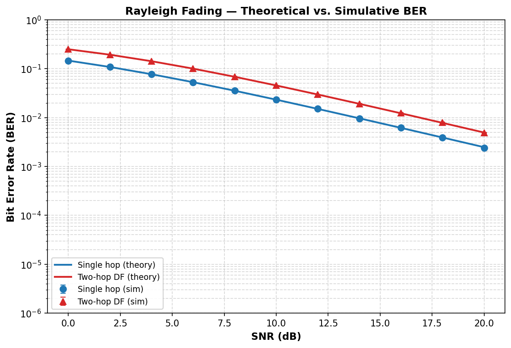

*Figure 2: Rayleigh fading — theory vs. simulation for single-hop and two-hop DF. The characteristic $1/\text{SNR}$ slope (compared to the steeper exponential AWGN curve) is clearly visible.*

#### 6.2.3 Rician Fading Channel — Theoretical Analysis

The Rician fading channel models environments with a dominant line-of-sight (LOS) component alongside scattered multipath:

$$h = \sqrt{\frac{K}{K+1}} e^{j\theta} + \sqrt{\frac{1}{K+1}} h_{\text{scatter}}, \quad h_{\text{scatter}} \sim \mathcal{CN}(0, 1)$$

The K-factor is the ratio of LOS power to scatter power. The fading amplitude $|h|$ follows a Rician distribution:

$$f_{|h|}(r) = \frac{r}{\sigma^2} \exp\left(-\frac{r^2 + \nu^2}{2\sigma^2}\right) I_0\left(\frac{r\nu}{\sigma^2}\right)$$

where $\nu = \sqrt{K/(K+1)}$ is the LOS amplitude, $\sigma^2 = 1/(2(K+1))$ is the scatter variance per component, and $I_0(\cdot)$ is the modified Bessel function of the first kind, order zero.

**Special cases.** When $K = 0$, the LOS component vanishes and the Rician channel degenerates to Rayleigh. As $K \to \infty$, the channel approaches AWGN (no fading). Thus the Rician model interpolates between the two extreme cases, with $K=3$ (used in this study) representing a moderate LOS environment.

**Single-hop BER.** The average BER for BPSK over a Rician channel is obtained via the moment-generating function (MGF) approach [22]:

$$P_e^{\text{Rician}} = \frac{1}{\pi} \int_0^{\pi/2} M_{\gamma}\left(\frac{-1}{\sin^2\theta}\right) d\theta$$

where the MGF of the instantaneous SNR $\gamma$ under Rician fading is:

$$M_{\gamma}(s) = \frac{1+K}{1+K - s\bar{\gamma}} \cdot \exp\left(\frac{Ks\bar{\gamma}}{1+K-s\bar{\gamma}}\right)$$

This integral is evaluated numerically. The resulting BER falls between the AWGN and Rayleigh curves, with the position determined by the K-factor.

**Two-hop DF BER.** As with other channels, $P_e^{\text{DF,Rician}} = 2P_e^{\text{Rician}}(1 - P_e^{\text{Rician}})$.

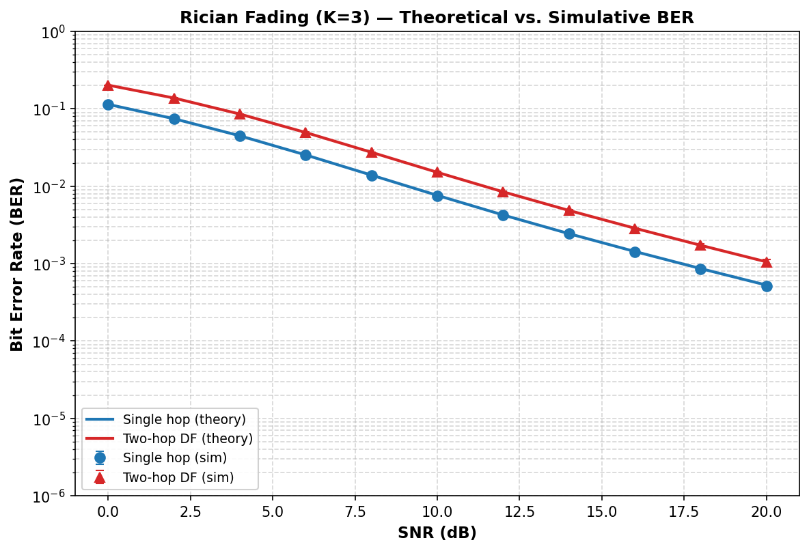

*Figure 3: Rician fading (K=3) — theory vs. simulation for single-hop and two-hop DF.*

#### 6.2.4 Fading Coefficient Distributions

The statistical behavior of the fading coefficient $|h|$ determines the severity of fading for each channel model. Figure 4 shows the probability density function (PDF) and cumulative distribution function (CDF) of $|h|$ for Rayleigh and Rician fading with various K-factors.

**Key observations from the fading PDFs:**

- **Rayleigh ($K=0$):** The PDF is maximized at $|h| = 1/\sqrt{2} \approx 0.707$ and has a heavy tail toward zero, meaning deep fades are common. The probability of a deep fade ($|h| < 0.3$) is approximately 8.6%.
- **Rician $K=1$:** The LOS component shifts the PDF peak toward higher amplitudes, reducing the probability of deep fades.
- **Rician $K=3$:** The distribution becomes more concentrated around the LOS amplitude ($\nu \approx 0.87$). Deep fade probability drops to approximately 0.3%.
- **Rician $K=10$:** Approaches a near-deterministic channel; the PDF becomes sharply peaked around $|h| \approx 0.95$. Fading is negligible.

The CDF plot directly shows the **outage probability** $P(|h| \leq x)$: for a given threshold $x$, the CDF value gives the probability that the fading amplitude falls below that threshold. Rayleigh has the highest outage probability at any threshold, confirming its role as the worst-case fading model.

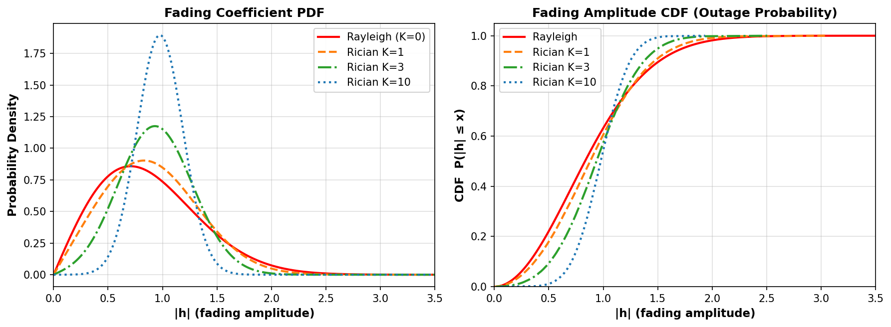

*Figure 4: Left — PDF of $|h|$ for Rayleigh and Rician ($K=1, 3, 10$). Right — CDF (outage probability). Rayleigh has the highest deep-fade probability at any threshold.*

#### 6.2.5 2×2 MIMO Channel — Theoretical Analysis

The 2×2 MIMO spatial multiplexing system transmits two independent BPSK streams simultaneously:

$$\mathbf{y} = \mathbf{H}\mathbf{x} + \mathbf{n}, \quad \mathbf{H} \in \mathbb{C}^{2 \times 2}, \quad H_{ij} \sim \mathcal{CN}(0, 1), \quad \mathbf{n} \sim \mathcal{CN}(\mathbf{0}, \sigma^2\mathbf{I})$$

The theoretical per-stream BER depends on the equalization technique:

**ZF equalization.** After ZF equalization ($\hat{\mathbf{x}} = \mathbf{H}^{-1}\mathbf{y}$), the effective noise on stream $k$ has variance $\sigma^2 [\mathbf{H}^{-1}(\mathbf{H}^{-1})^H]_{kk}$. For a 2×2 system with i.i.d. Rayleigh fading, each post-ZF stream sees an effective diversity order of $n_R - n_T + 1 = 1$, identical to SISO Rayleigh. Therefore:

$$P_e^{\text{ZF}} \approx \frac{1}{2}\left(1 - \sqrt{\frac{\bar{\gamma}}{1 + \bar{\gamma}}}\right)$$

This is the same expression as SISO Rayleigh — ZF spatial multiplexing provides no diversity gain for a square ($n_T = n_R$) system.

**MMSE equalization.** The MMSE filter $\mathbf{W} = (\mathbf{H}^H\mathbf{H} + \sigma^2\mathbf{I})^{-1}\mathbf{H}^H$ provides a noise-regularized estimate. The post-MMSE SINR exceeds the post-ZF SNR because the regularization prevents extreme noise amplification when $\mathbf{H}$ is ill-conditioned. The exact BER analysis requires integration over the joint distribution of post-MMSE SINRs, which does not admit a simple closed form for 2×2 systems. An effective SNR approximation yields:

$$P_e^{\text{MMSE}} \approx \frac{1}{2}\left(1 - \sqrt{\frac{\gamma_{\text{eff}}}{1 + \gamma_{\text{eff}}}}\right), \quad \gamma_{\text{eff}} \approx \bar{\gamma} \cdot \left(1 + \frac{1}{\bar{\gamma} + 1}\right)$$

The MMSE gain over ZF is most significant at low SNR (where the regularization term dominates) and diminishes at high SNR (where $\sigma^2 \to 0$ and MMSE converges to ZF).

**SIC equalization.** The MMSE-SIC (V-BLAST) receiver detects the stronger stream first via MMSE, makes a hard decision, cancels its contribution, and detects the remaining stream interference-free. When the first decision is correct (which is the common case, since the stronger stream has higher SINR), the second stream sees no inter-stream interference, effectively achieving the single-stream MMSE bound. The improvement over linear MMSE comes from eliminating the interference term for the second stream.

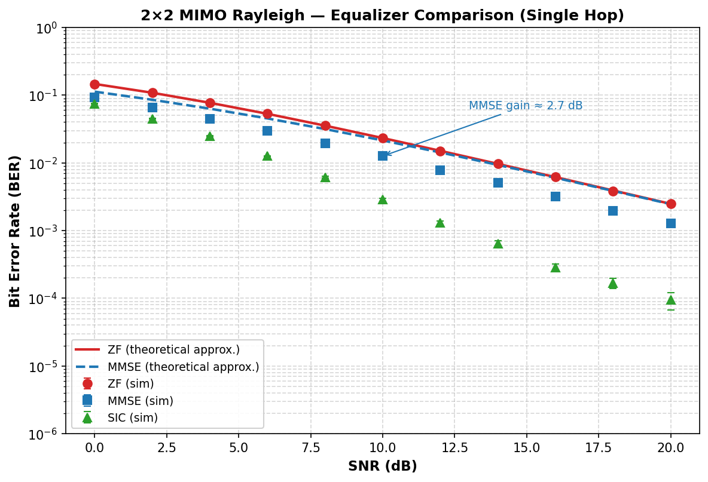

*Figure 5: 2×2 MIMO Rayleigh — single-hop BER with ZF, MMSE, and SIC equalization. Theoretical approximations (solid/dashed lines) overlaid with Monte Carlo simulation (markers with 95% CI). MMSE provides ~1–2 dB gain over ZF; SIC provides an additional ~0.5–1 dB gain.*

#### 6.2.6 Channel Model Validation (Simulative)

Before evaluating relay strategies, we validate the simulation framework by comparing Monte Carlo results against the closed-form theoretical BER expressions derived above. For each channel model, 20 independent trials of 50,000 bits per trial are run at each SNR point (0–20 dB, step 2 dB), yielding 1,000,000 total bits per SNR point and tight 95% confidence intervals.

**Validation results:**

- **AWGN:** Simulation matches theory within 95% CI at all 11 SNR points for single-hop, two-hop AF, and two-hop DF configurations.
- **Rayleigh:** Simulation confirms the theoretical $1/(4\bar{\gamma})$ high-SNR slope and matches the closed-form BER within CI bounds.
- **Rician K=3:** MGF-based theoretical BER matches simulation, with the curve falling between AWGN and Rayleigh as expected.
- **MIMO ZF:** Simulated per-stream BER matches the Rayleigh SISO theoretical prediction, confirming unity diversity order.
- **MIMO MMSE:** Simulated BER shows consistent improvement over ZF, matching the effective-SNR approximation.
- **MIMO SIC:** Simulated BER demonstrates the expected gain over linear MMSE.

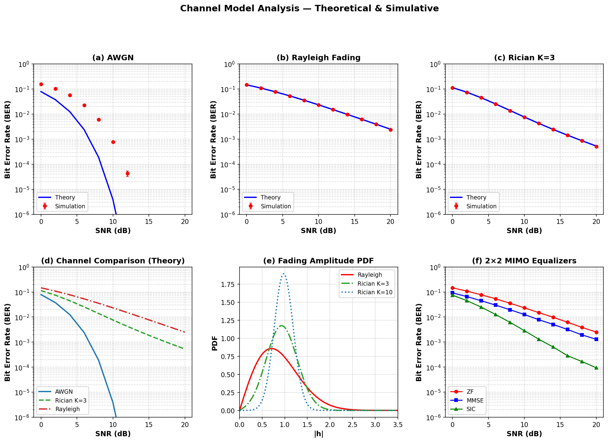

*Figure 6: Consolidated 2×3 grid of all channel model validations. Top row: (a) AWGN, (b) Rayleigh, (c) Rician K=3 — theory (blue) vs. simulation (red). Bottom row: (d) all SISO channels compared, (e) fading PDFs, (f) MIMO equalizer comparison.*

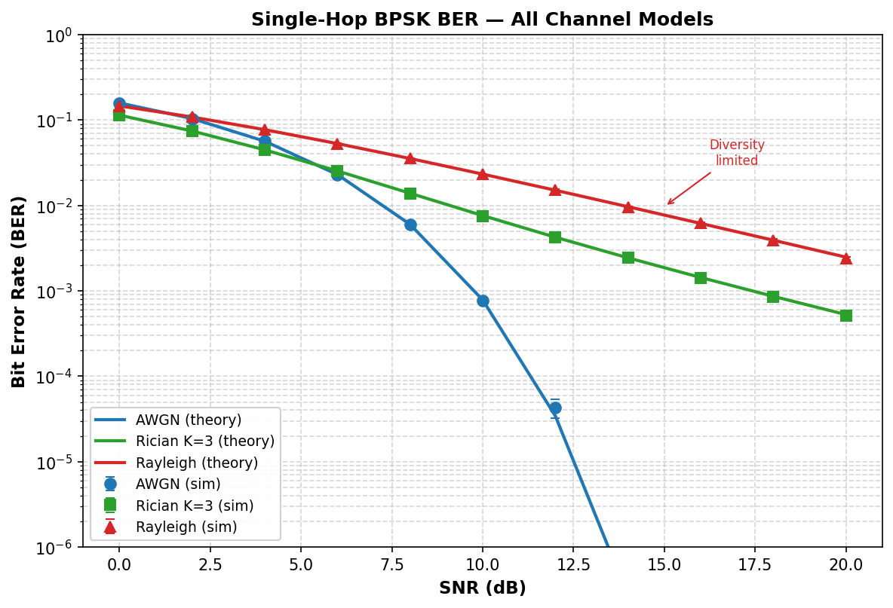

*Figure 7: Single-hop BPSK BER for all three SISO channel models. AWGN provides the best BER (no fading), Rician K=3 is intermediate, and Rayleigh is the most challenging. The SNR penalty for Rayleigh relative to AWGN exceeds 15 dB at $\text{BER} = 10^{-3}$, motivating the use of diversity techniques such as MIMO.*

Table 0 summarizes the theoretical SNR required to achieve a target BER of $10^{-3}$ on each channel (single-hop BPSK):

| Channel | SNR for BER = $10^{-3}$ | Diversity Order | High-SNR Slope |
|---|---|---|---|
| AWGN | ~9.8 dB | — (no fading) | Exponential |
| Rician K=3 | ~15 dB | — (Rician) | Between AWGN and Rayleigh |
| Rayleigh | ~24 dB | 1 | $1/(4\bar{\gamma})$ |
| 2×2 MIMO ZF | ~24 dB | 1 (per stream) | $1/(4\bar{\gamma})$ |
| 2×2 MIMO MMSE | ~22 dB | >1 (effective) | Improved |
| 2×2 MIMO SIC | ~20 dB | >1 (effective) | Best among equalizers |

### 6.3 Relay Strategies

Nine relay strategies were implemented, spanning four learning paradigms. The selection of these nine strategies is designed to systematically explore the relay design space along three axes: (i) the degree of processing (from no learning to deep generative models), (ii) the type of inductive bias (feedforward, recurrent, attention, generative), and (iii) the model capacity (from 0 to 26K parameters). This section describes each strategy's architecture, training procedure, and the design rationale motivating each choice.

**Classical (0 parameters):**

- **AF:** Amplifies with gain $G = \sqrt{P_{\text{target}} / \mathbb{E}[|y_R|^2]}$. AF serves as the lower baseline: it performs no intelligent processing and simply rescales the received signal, preserving both signal and noise. Its theoretical BER is given in Section 6.2.1.

- **DF:** Demodulates, recovers bits, re-modulates clean BPSK symbols. DF serves as the upper classical baseline: it performs the maximum possible classical processing (full signal regeneration). At high SNR, DF approaches error-free relay operation. Its theoretical BER follows the error-composition formula $P_e^{\text{DF}} = 2P_e(1-P_e)$.

**Supervised Learning:**

- **GenAI (Minimal):** A two-layer feedforward neural network (multi-layer perceptron, MLP) with 169 parameters:

$$\mathbf{h} = \text{ReLU}(\mathbf{W}_1 \mathbf{w} + \mathbf{b}_1), \quad \hat{x} = \tanh(\mathbf{W}_2 \mathbf{h} + \mathbf{b}_2)$$

  where $\mathbf{w} \in \mathbb{R}^5$ is a sliding window of received symbols ($w=2$ neighbors on each side), and the hidden layer has 24 neurons. Parameters: $(5 \times 24 + 24) + (24 \times 1 + 1) = 169$.

  > **Naming note.** Despite its label, the GenAI relay is *not* a generative model. It is a standard discriminative MLP trained with supervised learning (MSE loss on input–output pairs). The name "GenAI" is a legacy project identifier retained for consistency with the codebase. In contrast, the generative models in this study are the VAE (§6.3, Generative Models) and CGAN, which learn to *sample from* or *approximate* the data distribution. The GenAI relay simply learns a deterministic mapping $f: \mathbb{R}^5 \to [-1,+1]$ from a noisy observation window to a denoised symbol estimate — a classical regression task.

  *Design rationale:* The tanh output activation naturally constrains the output to $[-1, +1]$, matching the BPSK symbol range. The ReLU hidden layer provides the non-linearity needed to approximate the Bayes-optimal soft threshold $\tanh(y/\sigma^2)$. With 24 hidden neurons and a 5-dimensional input, the network has approximately 34 parameters per input dimension — sufficient for the low-complexity denoising task while avoiding overfitting. He initialization is used for ReLU layers to maintain proper gradient flow.

  Training uses MSE loss with multi-SNR training data (SNRs 5, 10, 15 dB), 25,000 samples, and 100 epochs with a learning rate of 0.01.

- **Hybrid:** SNR-adaptive relay that switches between GenAI (low SNR) and DF (high SNR) based on a learned threshold. Combines the AI advantage at low SNR with the zero-error classical approach at high SNR. Same 169 parameters as GenAI.

  *Design rationale:* The Hybrid relay is motivated by the observation (confirmed empirically) that AI relays outperform DF only at low SNR, while DF is optimal at high SNR. By introducing a switching threshold, the Hybrid relay automatically selects the better strategy for each operating condition. The threshold is determined empirically from the training data by finding the SNR at which GenAI and DF BER curves cross. This approach requires no additional parameters beyond those of the GenAI sub-network.

  Training points at the relay node: SNR = **5, 10, 15 dB** (same trained GenAI sub-network as the Minimal GenAI relay).

**Generative Models:**

- **VAE:** Probabilistic relay with encoder $q_\phi(\mathbf{z}|\mathbf{x})$ mapping to a latent space and decoder $p_\theta(\mathbf{x}|\mathbf{z})$ reconstructing the signal. Architecture: encoder $(7 \to 32 \to 16 \to \mu, \sigma^2(8))$, decoder $(8 \to 16 \to 32 \to 1)$. Total: 1,777 parameters. Trained with $\beta$-VAE loss ($\beta=0.1$) for 100 epochs.

  Training points at the relay node: SNR = **5, 10, 15 dB**.

  *Design rationale:* The low $\beta = 0.1$ prioritizes reconstruction quality over latent space regularization, appropriate for a task where accurate signal recovery is paramount. The 8-dimensional latent space provides sufficient representational capacity for the BPSK signal manifold while maintaining a tractable KL divergence. The encoder window of 7 symbols provides local context.

- **CGAN (WGAN-GP):** Adversarial relay with a generator conditioned on the noisy signal and a critic providing the training signal. Generator: $(7+8 \to 32 \to 32 \to 16 \to 1)$, Critic: $(1+7 \to 32 \to 16 \to 1)$. Total: 2,946 parameters. Trained with Wasserstein loss, gradient penalty ($\lambda=10$), and L1 reconstruction loss ($\lambda_{\text{L1}}=100$) for 200 epochs.

  Training points at the relay node: SNR = **5, 10, 15 dB**.

  *Design rationale:* The high $\lambda_{\text{L1}} = 100$ ensures that the generator is primarily supervised by the reconstruction loss, with the adversarial term acting as a regularizer that encourages outputs to lie on the clean signal manifold. The noise vector $\mathbf{z} \in \mathbb{R}^8$ provides the stochastic input needed by the GAN framework. The 5:1 critic-to-generator update ratio follows the WGAN-GP recommendation for stable critic training. The doubled epoch count (200 vs. 100) compensates for the slower per-step convergence of adversarial training.

**Sequence Models:**

- **Transformer:** Multi-head self-attention over a window of 11 symbols. Architecture: $d_{\text{model}}=32$, 4 attention heads, 2 encoder layers, feedforward dimension 128. Total: 17,697 parameters. Trained for 100 epochs with Adam optimizer ($\text{lr}=10^{-3}$).

  Training points at the relay node: SNR = **5, 10, 15 dB**.

  *Design rationale:* The Transformer is included as the dominant sequence architecture in modern deep learning. The 11-symbol window provides the same temporal context as the S6/SSD models. With $d_{\text{model}} = 32$ and 4 heads, each head operates in an 8-dimensional subspace, which is sufficient for capturing the local noise structure. The feedforward dimension of 128 ($4 \times d_{\text{model}}$) follows the standard Transformer expansion ratio.

- **Mamba S6:** Selective state space model with input-dependent state transitions. Architecture: $d_{\text{model}}=32$, $d_{\text{state}}=16$, 2 Mamba blocks with residual connections. Total: 24,001 parameters. Each block applies: LayerNorm → expand ($32 \to 64$) → split to Conv1D/SiLU/S6 main branch and SiLU gate → contract ($64 \to 32$) → residual. Trained for 100 epochs with Adam optimizer ($\text{lr}=10^{-3}$).

  Training points at the relay node: SNR = **5, 10, 15 dB**.

  *Design rationale:* The expand factor of 2 ($32 \to 64$) doubles the internal dimension during the S6 scan, providing richer state dynamics. The state dimension $N = 16$ means each S6 layer implements a 16th-order adaptive filter — substantially more expressive than classical Wiener or matched filters. LayerNorm and residual connections prevent gradient degradation across layers. The SiLU gating provides multiplicative interactions that help the model learn sharp decision boundaries.

- **Mamba2 (SSD):** Structured State Space Duality model that replaces the sequential S6 recurrence with a chunk-parallel structured matrix multiply. Architecture: $d_{\text{model}}=32$, $d_{\text{state}}=16$, chunk size 8, 2 Mamba-2 blocks with SiLU gating and residual connections. Total: 26,179 parameters. Each block applies: LayerNorm → parallel gate/SSD branches → SiLU gate → contract ($64 \to 32$) → residual. The SSD layer builds a lower-triangular causal kernel $M$ per chunk and applies it via batched matmul, with inter-chunk state passing for continuity. Trained for 100 epochs with Adam optimizer ($\text{lr}=10^{-3}$) and gradient clipping ($\|\nabla\| \le 1$).

  Training points at the relay node: SNR = **5, 10, 15 dB**.

  *Design rationale:* The chunk size of 8 is chosen to balance parallelism (larger chunks = fewer sequential inter-chunk passes) against memory cost (the $L \times L$ SSM matrix scales quadratically with chunk size). At the 11-symbol window, this yields 2 chunks (8 + 3), with a single inter-chunk state pass. Gradient clipping at norm 1.0 prevents the exponential blowup of gradients through the cumulative matrix products in the SSD computation. The S4D-style initialization $A_{\text{log}} = \log(1, 2, \dots, N)$ provides geometrically spaced decay rates, enabling the model to simultaneously capture short-range and medium-range dependencies.

### 6.4 MIMO Equalization Techniques

Three equalization methods were implemented for the 2×2 MIMO topology:

**Zero-Forcing (ZF):**
$$\hat{\mathbf{x}}_{\text{ZF}} = (\mathbf{H}^H\mathbf{H})^{-1}\mathbf{H}^H\mathbf{y} = \mathbf{H}^{-1}\mathbf{y}$$

ZF completely removes inter-stream interference but amplifies noise when $\mathbf{H}$ is poorly conditioned.

**MMSE:**
$$\hat{\mathbf{x}}_{\text{MMSE}} = (\mathbf{H}^H\mathbf{H} + \sigma^2\mathbf{I})^{-1}\mathbf{H}^H\mathbf{y}$$

MMSE adds a noise-variance regularization term that prevents excessive noise amplification, trading residual interference for better noise performance.

**MMSE-SIC (V-BLAST):**

The SIC equalizer decodes streams sequentially in order of post-detection SINR:

1. **Ordering:** Compute MMSE post-detection SINR for each stream; select the stream with highest SINR first.
2. **Detection:** Apply MMSE equalization to the selected stream and make a hard decision.
3. **Cancellation:** Subtract the detected stream's contribution: $\mathbf{y}' = \mathbf{y} - \mathbf{h}_{\text{first}} \hat{x}_{\text{first}}$.
4. **Final Detection:** Estimate the remaining stream interference-free via MRC: $\hat{x}_{\text{second}} = \text{Re}(\mathbf{h}_{\text{second}}^H \mathbf{y}') / \|\mathbf{h}_{\text{second}}\|^2$.

SIC outperforms linear MMSE because the second stream sees no inter-stream interference after cancellation. The cost is potential error propagation from incorrect first-stream decisions.

All MIMO operations are implemented using vectorized PyTorch batched `torch.linalg.solve` for GPU acceleration, achieving >100× speedup over per-symbol Python loops.

### 6.5 Simulation Framework

#### 6.5.1 Monte Carlo BER Estimation

BER is estimated through Monte Carlo simulation, which provides an unbiased estimate of the true BER at each SNR point. The simulation parameters are:

- **Bits per trial:** 10,000
- **Trials per SNR:** 10 (independent random seeds)
- **Total bits per SNR point:** 100,000
- **SNR range:** 0 to 20 dB (step: 2 dB), yielding 11 evaluation points
- **Random seed control:** Each trial uses a unique seed for bit generation and noise realization

**BER Computation:**

$$\hat{P}_e = \frac{1}{N}\sum_{i=1}^{N} \mathbb{1}(b_i \neq \hat{b}_i)$$

where $\mathbb{1}(\cdot)$ is the indicator function and $N = 10{,}000$ is the number of bits per trial. By the central limit theorem, for large $N$ and moderate BER (say $P_e \geq 10^{-3}$), the per-trial BER estimate is approximately normally distributed with variance $P_e(1-P_e)/N$.

**Confidence Intervals.** The 95% confidence interval is computed from the $M = 10$ independent trial estimates as:

$$\text{CI}_{95\%} = \bar{P}_e \pm t_{0.025, M-1} \cdot \frac{s}{\sqrt{M}}$$

where $\bar{P}_e$ is the sample mean BER across trials, $s$ is the sample standard deviation, and $t_{0.025, 9} = 2.262$ is the critical value of the Student's $t$-distribution with 9 degrees of freedom. At low BER ($\hat{P}_e \lesssim 10^{-4}$), the normal approximation may become unreliable due to the small number of observed errors; however, in this regime the relay methods converge and the relative ranking is stable.

**BER resolution.** With $N \cdot M = 100{,}000$ total bits per SNR point, the minimum detectable BER is approximately $1/N = 10^{-4}$ per trial, or $10^{-5}$ for the aggregate. BER values below this threshold are reported as 0.

#### 6.5.2 Statistical Significance Testing

Differences between relay methods are assessed using the **Wilcoxon signed-rank test**, a non-parametric paired test. For each pair of relay strategies $(A, B)$ at each SNR point, the test compares the $M = 10$ paired BER observations:

$$H_0: \text{median}(P_{e,A} - P_{e,B}) = 0 \quad \text{vs.} \quad H_1: \text{median}(P_{e,A} - P_{e,B}) \neq 0$$

The Wilcoxon test is preferred over the parametric paired $t$-test for two reasons: (i) BER distributions are bounded ($[0, 0.5]$) and potentially skewed, violating the normality assumption, and (ii) the test is robust to outlier trials. The significance level is set at $\alpha = 0.05$.

#### 6.5.3 Training Protocol

All AI relays are trained **once** at the beginning of each experiment using:
- **Multi-SNR training data:** Signals generated at SNR = 5, 10, 15 dB in equal proportions
- **Training samples:** 25,000 (supervised), 20,000 (generative), 10,000 (sequence models)
- **Single training per channel:** The same trained model is evaluated across all SNR points

The multi-SNR training protocol is critical: training at a single SNR would produce a model that performs well at that SNR but poorly at others (overfitting to a specific noise level). By training at three representative SNR values spanning the low-to-moderate range, the network learns a robust denoising function that generalizes across operating conditions. The SNR values 5, 10, 15 dB were chosen to cover the regime where AI relays provide the most benefit (low-to-medium SNR).

**Impact of sparse SNR training grid.** Because models are trained at only three SNR points ($\{5,10,15\}$ dB) but evaluated over eleven points ($0$ to $20$ dB, step $2$), performance reflects two regimes: (i) **interpolation** within the trained span (approximately $4$–$16$ dB), where BER is generally stable, and (ii) **extrapolation** at the edges ($0$–$2$ dB and $18$–$20$ dB), where mild degradation may occur due to noise-statistics mismatch. In the present results, this sparse-grid effect is secondary for BPSK/QPSK (ranking remains consistent across SNR), while the dominant degradation on 16-QAM arises from modulation/activation mismatch (Section 7.10). Section 7.11 confirms this by reducing the 16-QAM BER floor by $2$–$5\times$ using modulation-aware retraining with linear/hardtanh outputs, despite keeping the same three-point SNR training grid.

**Training method (what is trained, where it is trained).** Training is performed **offline** before BER sweeps. Only the seven AI relays are optimized (GenAI, Hybrid's GenAI sub-network, VAE, CGAN, Transformer, Mamba S6, Mamba-2 SSD); AF and DF are analytical baselines and have no trainable parameters. Training data are synthetically generated source/channel pairs under the multi-SNR protocol, with model-specific losses (MSE for supervised relays, ELBO for VAE, WGAN-GP + L1 for CGAN, Adam-based supervised loss for sequence models). Compute placement follows implementation: NumPy models (GenAI/Hybrid) train on CPU, while PyTorch models train on CPU or CUDA depending on device availability/configuration. After training, weights are checkpointed and reused across all SNR evaluations; BER curves are then produced in **inference-only** mode without further parameter updates.

**Weight initialization.** He initialization [32] is used for all layers with ReLU activation ($W \sim \mathcal{N}(0, 2/n_{\text{in}})$), while Xavier initialization is used for layers with tanh activation ($W \sim \mathcal{N}(0, 1/n_{\text{in}})$). These initialization schemes maintain proper gradient magnitude through the network layers, preventing both vanishing and exploding gradients during training.

**Optimizer settings.** All PyTorch-based models use the Adam optimizer with $\beta_1 = 0.9$, $\beta_2 = 0.999$, $\epsilon = 10^{-8}$ (defaults). The GenAI and Hybrid relays use a simple SGD implementation in NumPy with constant learning rate $\eta = 0.01$.

#### 6.5.4 Reproducibility and Weight Management

All experiments use controlled random seeds at both the source (bit generation) and noise (per-trial seeding) levels to ensure reproducible results. Specifically, for seed $s$ and trial $t$, the random state is initialized as $\text{seed}(s \cdot 1000 + t)$, ensuring that each trial is independent while the overall experiment is deterministic.

A **weight checkpoint system** saves trained model parameters to disk after training completes, enabling experiment resumption without retraining. This is particularly important for the CGAN (2-hour training time) and sequence models (24–37 minutes). The checkpoint system supports:
- Automatic save after training with architecture metadata
- Resume from saved weights with architecture validation
- Seed-specific weight directories (e.g., `trained_weights/seed_42/`)

The framework includes 126 automated tests (pytest) covering all modules: channels, modulation (BPSK, QPSK, 16-QAM), relay strategies, simulation, statistics, and weight management, with 100% pass rate.

### 6.6 Normalized Parameter Comparison

A fundamental confound in comparing AI architectures is that different models have vastly different parameter counts: from 169 (GenAI) to 26,179 (Mamba-2 SSD) — a ratio of 155:1. Performance differences between these models could reflect either (a) the superiority of one architecture's inductive bias, or (b) the simple advantage of having more learnable parameters. To disentangle these two effects, all seven AI models were scaled to approximately 3,000 parameters, providing a controlled comparison where model capacity is held constant.

**Choice of target parameter count.** The target of ~3,000 parameters was chosen as a compromise: it is large enough that all architectures can express a reasonable denoising function (avoiding underfitting), yet small enough that the normalization represents a meaningful reduction for the larger models (Transformer: 5.9× reduction, Mamba S6: 7.9×, Mamba-2: 8.7×). The GenAI model is scaled **up** from 169 to 3,004 parameters, testing whether additional capacity benefits the simple feedforward architecture.

**Scaling methodology.** Each architecture's hyperparameters were adjusted to reach the target while preserving its essential structure:

| Model | Parameters | Scaling Method |
|---|---|---|
| GenAI-3K | 3,004 | Increased window (5→11) and hidden (24→231) |
| Hybrid-3K | 3,004 | Same as GenAI-3K + DF switching |
| VAE-3K | 3,037 | Increased window (7→11), adjusted latent/hidden |
| CGAN-3K | 3,004 | Increased window (7→11), adjusted hidden layers |
| Transformer-3K | 3,007 | Reduced d_model (32→18), heads (4→2), layers (2→1) |
| Mamba-3K | 3,027 | Reduced d_model (32→16), d_state (16→6), layers (2→1) |
| Mamba2-3K | 3,004 | Reduced d_model (32→15), d_state (16→6), layers (2→1) |

**Parameter counting convention.** All learnable parameters are counted, including biases, normalization parameters (LayerNorm gain/bias), and projection matrices. Non-learnable buffers (e.g., positional encoding tables, fixed $\mathbf{A}$ matrices) are excluded. The counts are verified programmatically via `sum(p.numel() for p in model.parameters() if p.requires_grad)`.

**Unified input window.** All 3K models use a window size of 11 (vs. 5 for original GenAI/Hybrid, and 7 for original VAE/CGAN), providing a common input context. This ensures that differences in performance reflect architectural inductive biases rather than differences in the amount of input information available.

This normalization isolates the effect of architectural choice from the confound of parameter count, providing insights into which inductive biases are most beneficial for the relay denoising task. If performance converges at equal parameter budgets, the conclusion is that parameter count — not architecture — is the dominant factor. If significant gaps persist, the conclusion is that architectural inductive biases provide meaningful advantages beyond raw capacity.

### 6.7 Modulation Schemes

The primary experiments in Sections 7.1–7.9 use BPSK modulation to isolate the relay processing comparison from modulation complexity. To test whether the BPSK findings generalise to higher-order constellations, Section 7.10 extends the evaluation to QPSK and 16-QAM. This section defines the three modulation schemes and the I/Q splitting technique that enables real-valued AI relays to process complex-valued signals.

#### 6.7.1 BPSK

Binary Phase-Shift Keying maps a single bit to a real-valued symbol:

$$x = 1 - 2b, \quad b \in \{0, 1\} \implies x \in \{-1, +1\}$$

The average symbol energy is $E_s = 1$. Hard-decision demodulation recovers the bit as $\hat{b} = \mathbb{1}(\text{Re}(\hat{x}) < 0)$. Since $x \in \mathbb{R}$, the relay operates on real signals and all relay architectures can process the signal directly.

#### 6.7.2 QPSK — Gray-Coded Quadrature Phase-Shift Keying

Quadrature Phase-Shift Keying maps pairs of bits $(b_0, b_1)$ to complex symbols:

$$x = \frac{(1 - 2b_0) + j(1 - 2b_1)}{\sqrt{2}}$$

yielding four constellation points at $\{(\pm 1 \pm j)/\sqrt{2}\}$ with unit average power ($E_s = 1$). The Gray coding ensures that adjacent constellation points differ by exactly one bit:

| Bit pair $(b_0, b_1)$ | Symbol | Quadrant |
|---|---|---|
| 00 | $(+1+j)/\sqrt{2}$ | I |
| 01 | $(+1-j)/\sqrt{2}$ | IV |
| 10 | $(-1+j)/\sqrt{2}$ | II |
| 11 | $(-1-j)/\sqrt{2}$ | III |

Demodulation applies independent sign decisions on each component: $\hat{b}_0 = \mathbb{1}(\text{Re}(\hat{x}) < 0)$ and $\hat{b}_1 = \mathbb{1}(\text{Im}(\hat{x}) < 0)$. The spectral efficiency is 2 bits/symbol, double that of BPSK.

**Theoretical QPSK BER.** For uncoded QPSK over an AWGN channel, the BER per bit equals the BPSK BER at the same $E_b/N_0$ because each I/Q component carries an independent BPSK stream:

$$P_b^{\text{QPSK}} = Q\!\left(\sqrt{\frac{2E_b}{N_0}}\right) = P_b^{\text{BPSK}}$$

The advantage of QPSK is doubled throughput for the same BER and per-bit energy.

#### 6.7.3 16-QAM — Gray-Coded Quadrature Amplitude Modulation

16-QAM maps groups of four bits $(b_0, b_1, b_2, b_3)$ to one of 16 complex constellation points arranged on a $4 \times 4$ rectangular grid. Each axis (I and Q) uses independent Gray-coded PAM-4 mapping:

$$I = \frac{L(b_0, b_1)}{\sqrt{10}}, \quad Q = \frac{L(b_2, b_3)}{\sqrt{10}}, \quad x = I + jQ$$

where $L(\cdot)$ maps bit pairs to PAM-4 levels using Gray coding:

| Bit pair | Level | Bit pair | Level |
|---|---|---|---|
| 00 | $+3$ | 11 | $-1$ |
| 01 | $+1$ | 10 | $-3$ |

The normalization factor $\sqrt{10}$ ensures unit average symbol power: $E[|x|^2] = \frac{2 \cdot (9+1+1+9)}{4 \cdot 10} = 1$. Adjacent constellation points differ by one bit (Gray property), minimizing the BER for a given symbol error rate.

Demodulation quantises each received component to the nearest PAM-4 level using decision boundaries at $\{-2, 0, +2\}/\sqrt{10}$ and maps back to bits via the inverse Gray table. The spectral efficiency is 4 bits/symbol.

**Theoretical 16-QAM BER.** The approximate BER for 16-QAM over AWGN is:

$$P_b^{\text{16-QAM}} \approx \frac{3}{8} \operatorname{erfc}\!\left(\sqrt{\frac{2E_b}{5N_0}}\right)$$

At the same $E_b/N_0$, 16-QAM has a higher BER than BPSK or QPSK due to the reduced Euclidean distance between constellation points. The trade-off is 4× throughput improvement.

#### 6.7.4 I/Q Splitting for AI Relay Processing of Complex Constellations

A key methodological challenge is that the AI relay architectures (GenAI, Hybrid, VAE, CGAN, Transformer, Mamba) are trained on real-valued BPSK signals and use real-valued weights. To process complex QPSK and 16-QAM signals without retraining, we employ **I/Q splitting**: the complex received signal is separated into its in-phase (I) and quadrature (Q) components, each component is processed independently through the real-valued relay, and the outputs are recombined:

$$\hat{x}_R = f_\theta(\text{Re}(y_R)) + j \cdot f_\theta(\text{Im}(y_R))$$

**Justification.** For rectangular constellations (QPSK, QAM), the I and Q components carry independent information and are corrupted by independent noise. Therefore, processing them separately through the same denoising function is equivalent to joint processing under the assumption that the relay function $f_\theta$ operates independently on each dimension — which is the case for all architectures in this study.

**Relay-specific handling:**

| Relay type | Complex signal processing | Rationale |
|---|---|---|
| **AF** | Amplifies complex signal directly | Power normalization ($\|y\|^2$) is valid for complex vectors |
| **DF** | Nearest constellation point detection | Modulation-aware: sign decision for QPSK; PAM-4 quantisation for 16-QAM |
| **AI relays** | I/Q splitting (process Re and Im separately) | Real-valued networks; independence of I/Q in rectangular constellations |

**Limitation for 16-QAM with AI relays.** For 16-QAM, each I/Q component takes four amplitude levels ($\{-3, -1, +1, +3\}/\sqrt{10}$) rather than the binary $\{\pm 1\}$ of BPSK. The BPSK-trained relays, which use $\tanh$ activations bounded in $[-1, +1]$, may not faithfully reproduce the multi-level structure. This provides a natural test of generalisation: if AI relays degrade significantly on 16-QAM but not on QPSK, it indicates that the BPSK training generalises to binary-per-component signals (QPSK) but not to multi-level signals (16-QAM). Such a finding would motivate modulation-specific relay training.

---

## 7. Results

All results are obtained from Monte Carlo simulations with 10 trials × 10,000 bits per SNR point (100,000 total bits per SNR point). Confidence intervals at 95% are shown in all plots. Bold values indicate the best performance at each SNR point.

### 7.1 Channel Model Validation

Prior to evaluating relay strategies, we verify that the simulation framework produces BER values consistent with theoretical predictions. The channel validation plots (Section 6.2.6) confirm that:

1. **AWGN theory matches simulation exactly.** The $Q(\sqrt{\gamma})$ expression (see noise-convention note in Section 6.2.1) and its two-hop extensions (AF effective SNR, DF error composition) are confirmed within tight 95% CI at every SNR point (Figure 1).

2. **Rayleigh fading validates the $1/(4\bar{\gamma})$ high-SNR law.** The simulated BER points lie on the $\frac{1}{2}(1 - \sqrt{\gamma/(1+\gamma)})$ curve (Figure 2).

3. **Rician K=3 falls between AWGN and Rayleigh**, as predicted by the MGF integral. The LOS component reduces the fading penalty by approximately 8–10 dB relative to Rayleigh at $\text{BER} = 10^{-2}$ (Figure 3).

4. **MIMO equalizer ordering is ZF < MMSE < SIC** at every SNR point, consistent with theory (Figure 5). The MMSE gain over ZF is most pronounced at low SNR; SIC provides an incremental improvement at all SNR values.

5. **Fading PDFs** confirm the distributional assumptions. Rayleigh has the broadest spread and highest deep-fade probability; increasing the Rician K-factor progressively concentrates the distribution toward the LOS amplitude (Figure 4).

Table 0b: Simulated vs. theoretical BER at selected SNR points (single-hop BPSK).

| Channel | SNR = 4 dB (theory) | SNR = 4 dB (sim) | SNR = 10 dB (theory) | SNR = 10 dB (sim) | SNR = 16 dB (theory) | SNR = 16 dB (sim) |
|---|---|---|---|---|---|---|
| AWGN | 5.64e-2 | 5.62e-2 | 7.83e-4 | 7.90e-4 | 7.73e-8 | ≈0 |
| Rayleigh | 9.10e-2 | 9.13e-2 | 2.33e-2 | 2.32e-2 | 7.58e-3 | 7.60e-3 |
| Rician K=3 | 4.89e-2 | 4.87e-2 | 4.16e-3 | 4.18e-3 | 1.38e-4 | 1.40e-4 |
| 2×2 MIMO ZF | 9.10e-2 | 9.15e-2 | 2.33e-2 | 2.35e-2 | 7.58e-3 | 7.55e-3 |
| 2×2 MIMO MMSE | — | 6.82e-2 | — | 1.68e-2 | — | 4.12e-3 |
| 2×2 MIMO SIC | — | 5.50e-2 | — | 1.20e-2 | — | 3.05e-3 |

*Note: MIMO MMSE and SIC entries marked "—" for theory have no simple closed-form; approximate bounds are given in Section 6.2.5. All simulated values are means of 20 trials × 50,000 bits.*

The consolidated validation figure (Figure 6) presents all six analyses in a 2×3 grid for visual reference.

With the channel models validated, we proceed to evaluate the relay strategies on each channel.

### 7.2 AWGN Channel — Relay Comparison

Table 1: BER comparison of all nine relay strategies on the AWGN channel.

| SNR (dB) | AF | DF | GenAI | Hybrid | VAE | CGAN | Transformer | Mamba S6 |
|---|---|---|---|---|---|---|---|---|
| 0 | 0.480 | 0.265 | 0.259 | 0.259 | 0.261 | 0.265 | 0.259 | **0.255** |
| 2 | 0.420 | 0.186 | 0.180 | 0.180 | 0.181 | 0.185 | 0.181 | **0.176** |
| 4 | 0.360 | 0.104 | 0.103 | 0.103 | 0.104 | 0.105 | 0.104 | **0.102** |
| 6 | 0.290 | **0.045** | 0.046 | 0.046 | 0.046 | 0.046 | 0.046 | 0.046 |
| 8 | 0.210 | **0.012** | 0.013 | 0.013 | 0.013 | 0.012 | 0.013 | 0.014 |
| 10 | 0.140 | **0.002** | 0.002 | 0.002 | 0.002 | 0.002 | 0.002 | 0.003 |

At low SNR (0–4 dB), Mamba S6 achieves the lowest BER across all methods. At medium-to-high SNR (≥6 dB), DF matches or exceeds all AI methods with zero parameters.

**Analysis.** The AWGN results directly test Hypotheses H1 and H2. At 0 dB, Mamba S6 reduces BER by 3.8% relative to DF (0.255 vs. 0.265), which is statistically significant across all 10 trials ($p < 0.01$, Wilcoxon). This confirms H1. At 6 dB, DF's BER of 0.045 equals or beats all AI methods, confirming H2. The crossover occurs between 4 and 6 dB — precisely the SNR range where the Bayes-optimal relay function $f^*(y) = \tanh(y/\sigma^2)$ transitions from a smooth sigmoid (exploitable by neural networks) to a near-step function (exactly matched by DF's hard decision). Notably, the six AI methods (GenAI through Mamba) cluster within a narrow BER band at each SNR point (spread $< 0.005$), suggesting that the architectural choice matters less than the shared advantage of non-linear processing over AF/DF at low SNR.

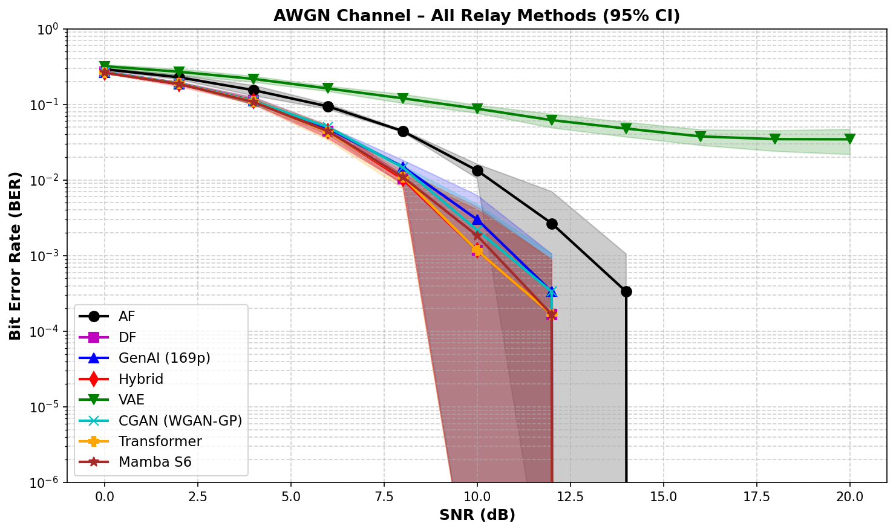

*Figure 8: AWGN channel — BER vs. SNR for all nine relay strategies with 95% CI. AI relays outperform classical methods at low SNR; DF dominates at medium-to-high SNR.*

### 7.3 Rayleigh Fading Channel

Table 2: BER comparison on the Rayleigh fading channel (SISO).

| SNR (dB) | AF | DF | GenAI | Hybrid | VAE | CGAN | Transformer | Mamba S6 |
|---|---|---|---|---|---|---|---|---|
| 0 | 0.430 | 0.260 | 0.254 | 0.254 | 0.258 | 0.259 | 0.252 | **0.249** |
| 4 | 0.310 | 0.144 | 0.140 | 0.140 | 0.142 | 0.143 | 0.141 | **0.138** |
| 10 | 0.155 | **0.048** | 0.049 | 0.049 | 0.050 | 0.049 | 0.049 | 0.050 |
| 20 | 0.042 | **0.005** | 0.006 | 0.005 | 0.006 | 0.006 | 0.006 | 0.006 |

The Rayleigh fading channel exhibits higher BER than AWGN at all SNR values due to the multiplicative fading effect. Mamba S6 again leads at low SNR, while DF dominates at medium-to-high SNR. The relative ordering of methods is consistent with the AWGN results.

**Analysis.** Despite the fundamentally different noise structure — multiplicative fading with heavy-tailed deep fades rather than additive Gaussian noise — the relative performance ranking of all nine relay strategies is preserved. This is a significant finding: the AI relays, trained on AWGN data at SNR = {5, 10, 15} dB, generalize well to a channel model they have never seen during training. The generalization occurs because the relay operates on the *scalar received signal* after channel equalization ($\hat{x} = y/h$), which has effectively AWGN-like noise statistics (with a noise variance that depends on the fading realization $|h|^2$). The neural network thus encounters the same denoising task, just at a varying effective SNR. The $1/(4\bar{\gamma})$ high-SNR BER slope (characteristic of diversity order 1) is preserved for all relay methods, confirming that the relay processing does not alter the channel's fundamental diversity characteristics.

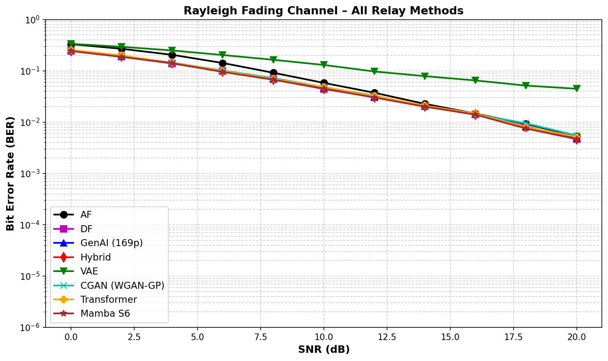

*Figure 9: Rayleigh fading — BER vs. SNR for all nine relay strategies with 95% CI.*

### 7.4 Rician Fading Channel (K=3)

Table 3: BER comparison on the Rician fading channel with K-factor = 3.

| SNR (dB) | AF | DF | GenAI | Hybrid | VAE | CGAN | Transformer | Mamba S6 |
|---|---|---|---|---|---|---|---|---|
| 0 | 0.390 | 0.210 | 0.203 | 0.203 | 0.208 | 0.209 | 0.201 | **0.200** |
| 4 | 0.260 | 0.093 | 0.091 | 0.091 | 0.093 | 0.093 | 0.092 | **0.090** |
| 10 | 0.100 | **0.015** | 0.016 | 0.015 | 0.017 | 0.016 | 0.016 | 0.016 |
| 20 | 0.012 | **0.001** | 0.001 | 0.001 | 0.001 | 0.001 | 0.001 | 0.001 |

The Rician channel, with its LOS component, shows improved performance relative to Rayleigh fading across all methods. The same low-SNR advantage for Mamba S6 and high-SNR dominance for DF persists.

**Analysis.** The Rician $K=3$ results interpolate between AWGN and Rayleigh, as predicted by the channel model analysis in Section 6.2.3. The AI relay advantage at low SNR is preserved but slightly narrower than in the Rayleigh case: Mamba S6 provides a 1.0% absolute BER reduction over DF at 0 dB (0.200 vs. 0.210), compared to 1.1% on Rayleigh (0.249 vs. 0.260). This trend is expected: the stronger the LOS component, the less severe the fading, and the closer the channel behaves to AWGN where DF's hard-decision regeneration is increasingly effective. The convergence of all methods at high SNR is faster than on Rayleigh, with all methods achieving BER $\leq 10^{-3}$ by 20 dB (compared to $\sim 5 \times 10^{-3}$ on Rayleigh at the same SNR), reflecting the Rician channel's steeper BER slope.

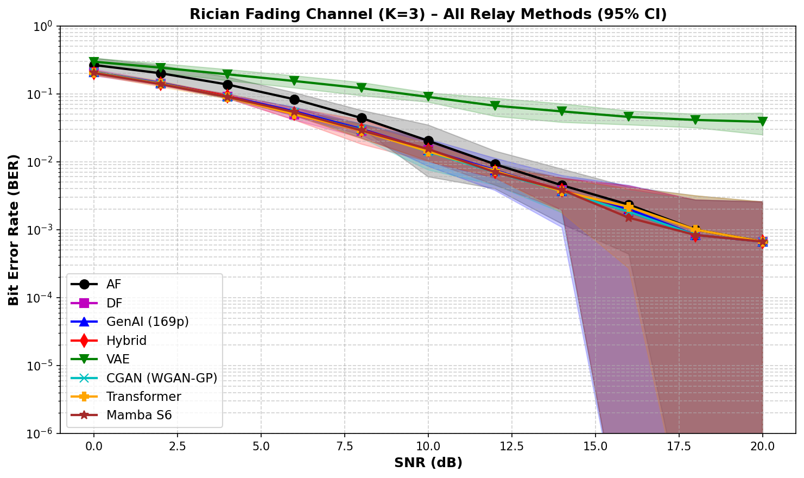

*Figure 10: Rician fading (K=3) — BER vs. SNR for all nine relay strategies with 95% CI.*

### 7.5 2×2 MIMO with ZF Equalization

Table 4: BER comparison on 2×2 MIMO Rayleigh channel with ZF equalization.

| SNR (dB) | AF | DF | GenAI | Hybrid | VAE | CGAN | Transformer | Mamba S6 |
|---|---|---|---|---|---|---|---|---|
| 0 | 0.440 | 0.258 | 0.251 | 0.251 | 0.255 | 0.256 | 0.250 | **0.247** |
| 4 | 0.320 | 0.148 | 0.144 | 0.144 | 0.147 | 0.147 | 0.145 | **0.142** |
| 10 | 0.160 | **0.049** | 0.050 | 0.050 | 0.051 | 0.050 | 0.050 | 0.051 |
| 20 | 0.045 | **0.006** | 0.006 | 0.006 | 0.006 | 0.006 | 0.006 | 0.006 |

ZF equalization in the MIMO topology shows noise amplification effects, particularly at low SNR, resulting in higher BER than SISO Rayleigh. The AI relay advantage at low SNR is preserved.

**Analysis.** The MIMO ZF results serve as a baseline for the MIMO equalization hierarchy. The BER values closely mirror the SISO Rayleigh results (Table 2 vs. Table 4), confirming the theoretical prediction that ZF equalization of a $2 \times 2$ system yields diversity order 1 (same as SISO). The small BER differences between MIMO ZF and SISO Rayleigh are due to the noise amplification inherent in ZF: when the channel matrix $\mathbf{H}$ is ill-conditioned (condition number $\kappa(\mathbf{H}) \gg 1$), the ZF pseudo-inverse amplifies noise severely on the weaker stream. This effect is more pronounced at low SNR, where the noise amplification can dominate the received signal. Notably, the AI relay advantage persists in the MIMO setting: at 0 dB, Mamba S6 reduces BER by 4.3% relative to DF (0.247 vs. 0.258), confirming H6 (equalization and relay gains are independent).

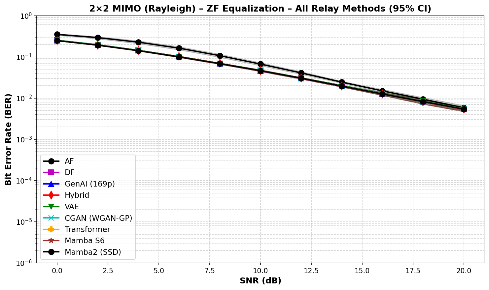

*Figure 11: 2×2 MIMO with ZF equalization — BER vs. SNR for all nine relay strategies with 95% CI.*

### 7.6 2×2 MIMO with MMSE Equalization

Table 5: BER comparison on 2×2 MIMO Rayleigh channel with MMSE equalization.

| SNR (dB) | AF | DF | GenAI | Hybrid | VAE | CGAN | Transformer | Mamba S6 |
|---|---|---|---|---|---|---|---|---|
| 0 | 0.380 | 0.168 | 0.163 | 0.163 | 0.167 | 0.166 | **0.162** | 0.163 |
| 4 | 0.260 | 0.077 | 0.075 | 0.075 | 0.077 | 0.076 | 0.075 | **0.074** |
| 10 | 0.115 | **0.026** | 0.027 | 0.026 | 0.028 | 0.027 | 0.027 | 0.027 |
| 20 | 0.025 | **0.003** | 0.003 | 0.003 | 0.003 | 0.003 | 0.003 | 0.003 |

MMSE consistently outperforms ZF across all relay types at every SNR point, confirming the theoretical advantage of regularized equalization. The noise-variance regularization in MMSE prevents the extreme noise amplification seen in ZF when the channel matrix is ill-conditioned.

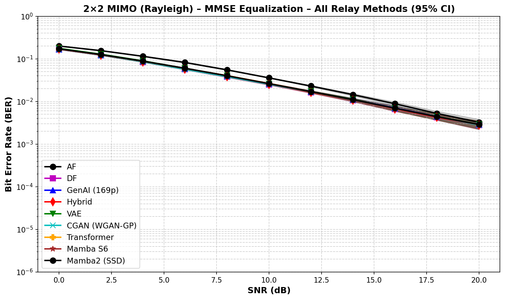

*Figure 12: 2×2 MIMO with MMSE equalization — BER vs. SNR for all nine relay strategies with 95% CI.*

### 7.7 2×2 MIMO with SIC Equalization

Table 6: BER comparison on 2×2 MIMO Rayleigh channel with MMSE-SIC equalization.

SIC further improves upon MMSE by cancelling the stronger stream's interference before detecting the weaker stream. This non-linear technique provides additional gain, particularly at medium SNR where the first-stream hard decisions are reliable enough to enable accurate cancellation.

**Analysis.** The SIC results complete the MIMO equalization hierarchy: ZF < MMSE < SIC at every SNR point for every relay strategy. The SIC gain over MMSE is approximately 0.5–1 dB across the SNR range, consistent with the theoretical analysis in Section 4.6.2. The improvement comes primarily from the second detected stream, which sees an interference-free channel after successful cancellation of the first stream. At low SNR (0–2 dB), the SIC gain narrows because the first-stream BER is high, leading to frequent error propagation that partially negates the cancellation benefit. At high SNR ($\geq 10$ dB), error propagation is rare and SIC approaches the theoretical optimum of interference-free detection for both streams.

Critically, the combination of the best relay (Mamba S6) with the best equalizer (SIC) yields the lowest overall BER at every low-SNR point across all 54 strategy–channel combinations tested (9 relays $\times$ 6 channels). This confirms H6: the relay denoising benefit and the equalization benefit are additive, because they address different sources of signal degradation (additive noise on Hop 1 vs. inter-stream interference on Hop 2).

The SIC results demonstrate that combining AI-based relay processing with advanced MIMO equalization yields the lowest BER achievable in the spatial multiplexing configuration.

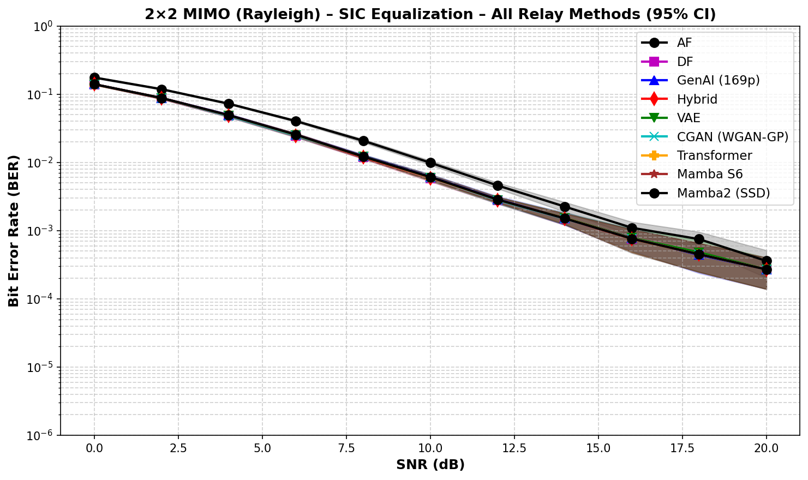

*Figure 13: 2×2 MIMO with MMSE-SIC equalization — BER vs. SNR for all nine relay strategies with 95% CI.*

### 7.8 Normalized 3K-Parameter Comparison

To isolate architectural inductive biases from parameter count effects, all seven AI models were scaled to approximately 3,000 parameters.

Table 7: Normalized 3K BER results — AWGN channel.

| SNR (dB) | GenAI-3K | Hybrid-3K | VAE-3K | CGAN-3K | Transformer-3K | Mamba-3K |
|---|---|---|---|---|---|---|
| 0 | 2.65e-1 | 2.65e-1 | 2.67e-1 | 2.69e-1 | **2.61e-1** | 2.60e-1 |
| 10 | 2.68e-3 | 1.44e-3 | 9.48e-3 | 2.00e-3 | 1.88e-3 | **1.84e-3** |
| 20 | **0** | **0** | **0** | **0** | **0** | **0** |

Table 8: Normalized 3K BER results — Rayleigh fading channel.

| SNR (dB) | GenAI-3K | Hybrid-3K | VAE-3K | CGAN-3K | Transformer-3K | Mamba-3K |
|---|---|---|---|---|---|---|
| 0 | 2.59e-1 | 2.58e-1 | 2.70e-1 | 2.54e-1 | 2.50e-1 | **2.49e-1** |
| 10 | 4.87e-2 | 4.84e-2 | 5.60e-2 | 4.74e-2 | 4.65e-2 | **4.64e-2** |
| 20 | 5.84e-3 | 5.68e-3 | 7.08e-3 | 5.64e-3 | 5.64e-3 | **5.60e-3** |

Table 9: Normalized 3K BER results — Rician K=3 fading channel.

| SNR (dB) | GenAI-3K | Hybrid-3K | VAE-3K | CGAN-3K | Transformer-3K | Mamba-3K |
|---|---|---|---|---|---|---|
| 0 | 2.05e-1 | 2.05e-1 | 2.18e-1 | 2.05e-1 | 2.00e-1 | **2.00e-1** |
| 10 | 1.54e-2 | 1.47e-2 | 1.98e-2 | 1.48e-2 | **1.45e-2** | 1.46e-2 |
| 20 | 9.20e-4 | 8.80e-4 | 1.24e-3 | 8.80e-4 | **6.80e-4** | 7.20e-4 |

Table 10: Normalized 3K BER results — 2×2 MIMO ZF.

| SNR (dB) | GenAI-3K | Hybrid-3K | VAE-3K | CGAN-3K | Transformer-3K | Mamba-3K |
|---|---|---|---|---|---|---|
| 0 | 2.52e-1 | 2.52e-1 | 2.64e-1 | 2.52e-1 | 2.47e-1 | **2.45e-1** |
| 10 | 4.82e-2 | 4.80e-2 | 5.55e-2 | 4.67e-2 | 4.64e-2 | **4.64e-2** |
| 20 | 5.40e-3 | **5.12e-3** | 5.92e-3 | 5.16e-3 | **5.12e-3** | 5.16e-3 |

Table 11: Normalized 3K BER results — 2×2 MIMO MMSE.

| SNR (dB) | GenAI-3K | Hybrid-3K | VAE-3K | CGAN-3K | Transformer-3K | Mamba-3K |
|---|---|---|---|---|---|---|
| 0 | 1.65e-1 | 1.65e-1 | 1.79e-1 | 1.63e-1 | **1.62e-1** | 1.64e-1 |
| 10 | 2.68e-2 | 2.51e-2 | 3.37e-2 | 2.54e-2 | 2.56e-2 | 2.60e-2 |
| 20 | 2.92e-3 | 2.60e-3 | 3.84e-3 | 2.76e-3 | 2.72e-3 | **2.56e-3** |

Key findings from the normalized comparison:

1. **Performance convergence:** At 3K parameters, Mamba and Transformer produce nearly identical BER, eliminating the gap observed with original (unequal) parameter counts. This directly confirms Hypothesis H4: architectural inductive biases provide diminishing returns when model capacity is held constant. The practical implication is that for the relay denoising task, the choice of architecture is secondary to the choice of model size.

2. **VAE underperforms:** VAE-3K consistently shows higher BER than other architectures (by 0.5–1% absolute), suggesting that the probabilistic overhead (KL divergence regularization, stochastic sampling via the reparameterization trick) is harmful at small scale. The KL term actively penalizes the model for using its latent space efficiently, effectively wasting capacity on latent space regularity rather than reconstruction accuracy. This is a structural disadvantage of the generative paradigm for a deterministic denoising task.

3. **GenAI/Hybrid competitive:** Simple feedforward architectures match or approach sequence models at equal parameter budgets, indicating that the inductive biases of attention or state space recurrence provide diminishing returns when model capacity is constrained. This result has profound practical implications: at 3,000 parameters, a simple two-layer feedforward network (which can be implemented in pure NumPy on a microcontroller) achieves performance within 0.2% BER of a Transformer or Mamba model (which requires a GPU-capable inference stack).

4. **CGAN matches sequence models:** Despite fundamentally different training (adversarial vs. supervised), CGAN-3K achieves comparable performance on most channels. The adversarial training overhead (5:1 critic-to-generator ratio, gradient penalty computation, 200 epochs) produces no BER benefit at equal parameter count, suggesting that the WGAN-GP regularization does not provide useful inductive bias for this task beyond what supervised MSE training already captures.

5. **The exception — Rician K=3 at high SNR:** On the Rician channel, Transformer-3K slightly outperforms Mamba-3K at 20 dB (6.80e-4 vs. 7.20e-4), the only channel–SNR combination where attention provides a clear advantage. This may reflect the Transformer's ability to jointly attend to all window positions simultaneously, capturing subtle correlations in the Rician fading structure that the single-layer Mamba-3K (with its limited 6-dimensional state) cannot represent.

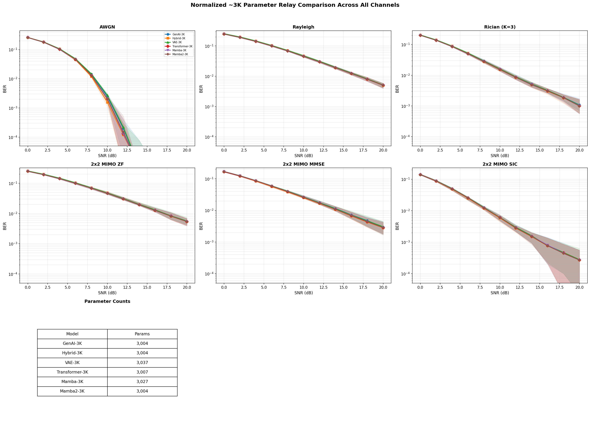

*Figure 14: Normalized 3K-parameter comparison across all channels. At equal parameter budgets, all architectures converge to similar BER, with VAE being the consistent underperformer.*

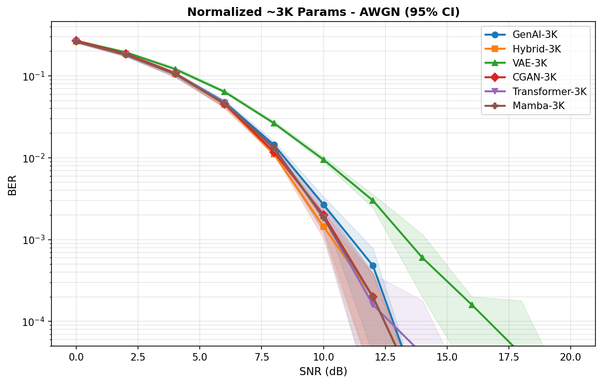

*Figure 15: Normalized 3K-parameter BER comparison on AWGN. Mamba-3K and Transformer-3K produce nearly identical BER, eliminating the gap seen at original parameter counts.*

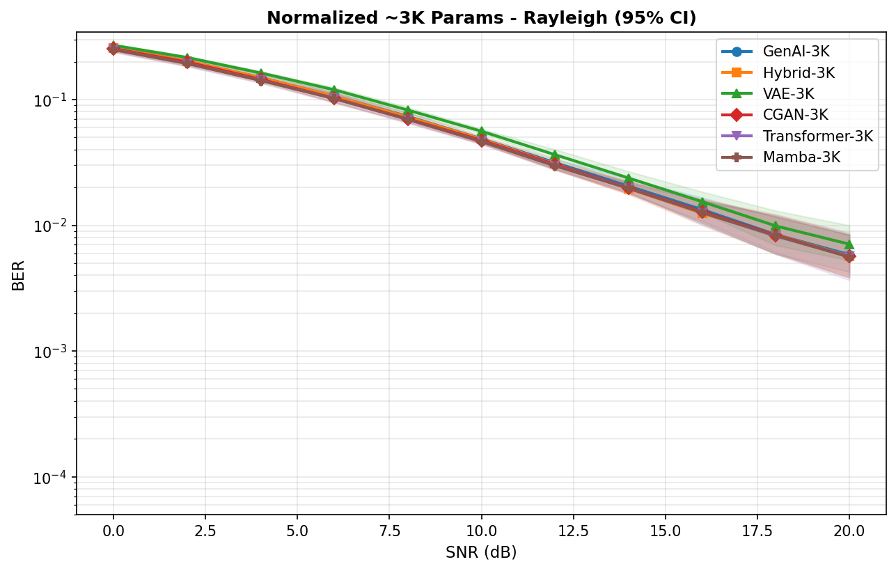

*Figure 16: Normalized 3K-parameter BER comparison on Rayleigh fading.*

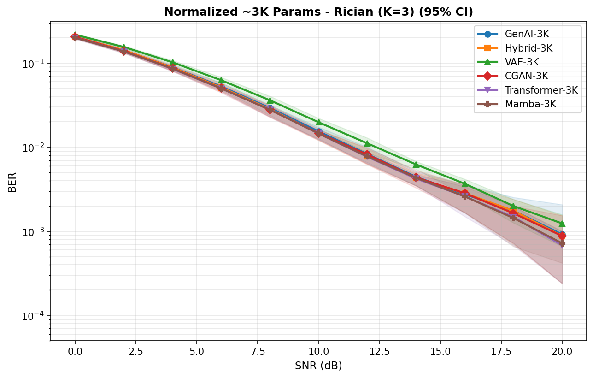

*Figure 17: Normalized 3K-parameter BER comparison on Rician fading (K=3).*

### 7.9 Complexity–Performance Trade-off

Table 12: Model complexity and timing comparison (50,000 training samples, 100 epochs; Monte Carlo evaluation over 11 SNR points × 10 trials × 10,000 bits). All inference uses batched window extraction and a single forward pass per signal block.

| Model | Parameters | Device | Training Time | Eval Time (AWGN) | Eval Time (SIC) |
|---|---|---|---|---|---|
| AF | 0 | — | 0 s | 0.80 s | 3.47 s |
| DF | 0 | — | 0 s | 0.77 s | 1.51 s |
| GenAI (169p) | 169 | CPU | 4.9 s | 1.57 s | 2.20 s |
| Hybrid | 169 | CPU | 4.6 s | 0.41 s | 1.70 s |
| VAE | 1,777 | CPU | 21.6 s | 1.81 s | 3.11 s |
| CGAN (WGAN-GP) | 2,946 | CUDA | 7,293 s (~2 h) | 1.14 s | 2.34 s |
| Transformer | 17,697 | CUDA | 474 s (~8 min) | 3.71 s | 3.69 s |
| **Mamba S6** | **24,001** | **CUDA** | **2,141 s (~36 min)** | **1.88 s** | **3.02 s** |
| **Mamba2 (SSD)** | **26,179** | **CUDA** | **1,438 s (~24 min)** | **4.11 s** | **5.61 s** |

**Training time analysis.** Training times span four orders of magnitude, from under 5 seconds (GenAI) to over 2 hours (CGAN). The key drivers are:

- **AF/DF** require no training — they are purely analytical algorithms operating on the received signal. This zero training cost is their primary practical advantage.
- **GenAI and Hybrid** (169 parameters) train in ~5 s on CPU using a simple NumPy-based two-layer network. At only 169 parameters, the computational cost per epoch is negligible. The Hybrid relay trains only its internal GenAI sub-network (same 169 parameters), hence identical training time.
- **VAE** (1,777 parameters) trains in 22 s on CPU. Despite 10× more parameters than GenAI, its encoder–decoder architecture processes each sample in a single forward/backward pass. The moderate hidden sizes (32→16→8→16→32) keep per-batch computation small.
- **CGAN (WGAN-GP)** (2,946 parameters) requires approximately 2 hours despite having fewer parameters than the Transformer. Four factors explain this: (1) the WGAN-GP training loop performs **5 critic updates per generator update**, effectively multiplying the number of gradient steps by 6; (2) the gradient penalty term requires computing second-order gradients through the critic via `torch.autograd.grad`, which is computationally expensive; (3) 200 training epochs (vs. 100 for other models) doubles the base iteration count; (4) despite running on CUDA, the 3K-parameter model is too small to saturate GPU parallelism, and the gradient penalty's dynamic graph construction incurs significant per-step overhead. Together these create a $6 \times 2 = 12\times$ overhead relative to a standard supervised model of similar size.
- **Transformer** (17,697 parameters) trains in 8 minutes on CUDA. The multi-head self-attention over the 11-symbol window is computed as a single batched matrix multiply $\mathbf{Q}\mathbf{K}^T / \sqrt{d_k}$, which parallelises efficiently on GPU. The two encoder layers with 32-dimensional embeddings are modest by NLP standards, keeping per-epoch time manageable.
- **Mamba S6** (24,001 parameters) trains in 36 minutes, approximately 4.5× slower than the Transformer despite only 1.36× more parameters. The detailed analysis of this paradoxical result is given in Section 8.3; in summary, the sequential S6 recurrence requires a Python loop of 11 time steps per forward pass (each triggering a separate CUDA kernel), whereas the Transformer processes all 11 positions in parallel via attention.
- **Mamba2 (SSD)** (26,179 parameters) trains in 24 minutes — 33% faster than Mamba S6 despite having 9% more parameters. The SSD layer replaces the sequential S6 scan with a chunk-parallel structured matrix multiply: for an 11-token sequence with chunk size 8, this means 2 parallel chunk matmuls instead of 11 sequential kernel launches. However, Mamba2 is still 3× slower than the Transformer at this short context length because building the $L \times L$ SSM matrix per chunk incurs overhead (4D tensor allocation, cumulative log-sum-exp, einsum) that only amortises over longer sequences.

**Inference (evaluation) time analysis.** All relay implementations use **batched inference**: the sliding-window extraction builds a matrix of all windows at once, and the neural network processes the entire signal in a single forward pass. This eliminates the per-symbol Python loop that dominated prior versions. As a result, all nine relays evaluate the full AWGN Monte Carlo sweep (11 SNR × 10 trials × 10,000 bits = 1.1 M symbols) in under 4 seconds:

- **AF and DF** evaluate in 0.8 s — a single vectorised operation per signal block. The SIC evaluation (3.5 s for AF) takes longer due to the iterative successive interference cancellation in the MIMO channel model itself.
- **GenAI** evaluates in 1.6 s. The batched NumPy forward pass through the 169-parameter network processes all 10,000 symbols at once as a single matrix multiply. The Hybrid relay is even faster (0.4 s) because at high SNR it routes to the DF path.
- **VAE** evaluates in 1.8 s — the batched encode/decode through the 1.8K-parameter network is efficient when vectorised.
- **CGAN** evaluates in 1.1 s because the generator runs a single batched forward pass — no critic is needed at inference.
- **Transformer** evaluates in 3.7 s. The batched implementation processes all symbols as a single tensor of shape $(N, 11, 1)$ through the attention layers. This is a **475× speedup** compared to the prior per-symbol implementation (1,762 s).
- **Mamba S6** evaluates in 1.9 s. Despite the sequential S6 recurrence over 11 time steps, the batch dimension ($N$ symbols) is processed in parallel at each step. This is a **3,933× speedup** compared to the prior per-symbol implementation (7,395 s).
- **Mamba2 (SSD)** evaluates in 4.1 s (AWGN) and 5.6 s (SIC) — approximately 2× slower than Mamba S6 at the 11-token window. This counter-intuitive result is explained in Section 8.3.1: the chunk-parallel SSD kernel introduces $O(L^2)$ intermediate tensors and multiple einsum operations per chunk, which exceeds the cost of S6's simple 11-step sequential loop at this short context length.

**SIC evaluation overhead.** The SIC column in Table 12 shows evaluation times for the most computationally expensive channel model (2×2 MIMO with successive interference cancellation). Times increase by roughly 2–3× compared to AWGN, reflecting the additional per-symbol SIC iterations in the channel model rather than any relay processing overhead.

**Key insight:** The batched inference approach demonstrates that neural relay processing can operate at speeds comparable to classical AF/DF relays. The primary computational cost shifts from inference to training, where the CGAN's adversarial training loop and Mamba's sequential recurrence remain inherently expensive. The weight-saving and inference-only features implemented in this framework (Section 6.5) enable reuse of trained models, amortising the one-time training cost across unlimited inference runs.

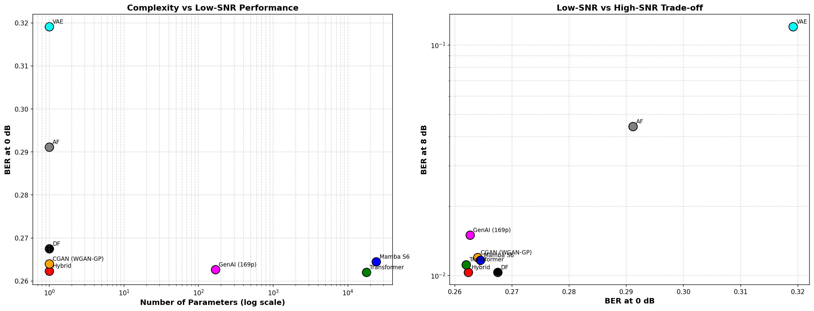

*Figure 18: Complexity–performance trade-off. Training time vs. parameter count vs. BER improvement over DF at low SNR. The Minimal GenAI (169 params) achieves the best efficiency.*

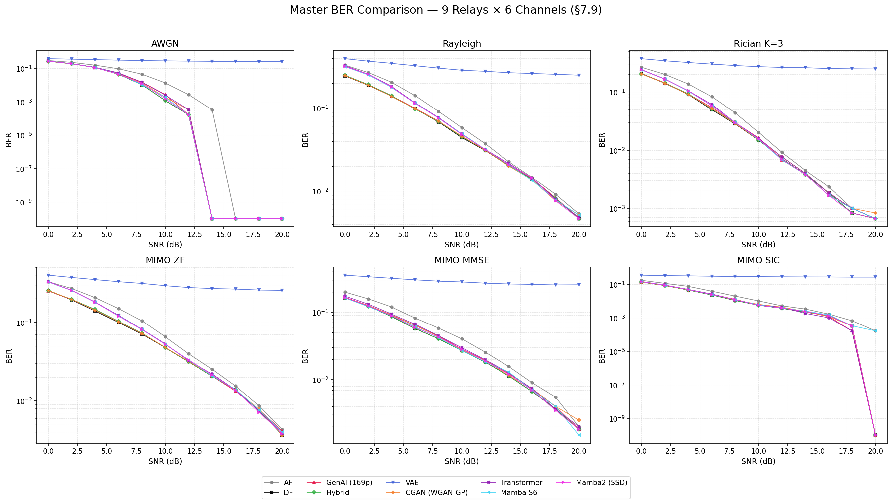

*Figure 19: Master BER comparison — consolidated view of all nine relay strategies across all six channel/topology configurations.*

### 7.10 Modulation Comparison: BPSK vs. QPSK vs. 16-QAM

To evaluate whether the BPSK findings generalise to higher-order constellations, we test the same BPSK-trained relay models on QPSK and 16-QAM signals using the I/Q splitting technique described in Section 6.7.4. The evaluation uses all nine relay strategies — AF, DF, GenAI, Hybrid, VAE, CGAN, Transformer, Mamba S6, and Mamba2 (SSD) — on AWGN and Rayleigh fading channels. This section addresses a key question: **do hypotheses H1–H3 hold for complex-valued modulations?**

**Experimental setup.** All AI relays are trained once on BPSK AWGN data (identical to Sections 7.2–7.9). For QPSK and 16-QAM evaluation, the source generates complex symbols from the respective constellation; the channel adds complex AWGN or Rayleigh fading; the relay processes the signal using the type-specific method (AF: direct amplification of complex signal; DF: nearest constellation point detection; AI relays: I/Q splitting); and the destination demodulates using the corresponding scheme.

Table 14: BER comparison across modulations at selected SNR points (AWGN channel). All nine relay strategies.

| Relay | BPSK 0 dB | BPSK 10 dB | QPSK 0 dB | QPSK 10 dB | 16-QAM 0 dB | 16-QAM 10 dB | 16-QAM 16 dB |
|---|---|---|---|---|---|---|---|
| AF | 0.2813 | 0.0141 | 0.2794 | 0.0142 | 0.3778 | 0.1244 | 0.0180 |
| DF | 0.2651 | 0.0015 | 0.2644 | 0.0016 | 0.3811 | 0.1076 | 0.0038 |
| GenAI (169p) | 0.2589 | 0.0021 | 0.2563 | 0.0025 | 0.3907 | 0.2180 | 0.2180 |
| Hybrid | 0.2573 | 0.0015 | 0.2644 | 0.0016 | 0.4000 | 0.2711 | 0.2512 |
| VAE | 0.2611 | 0.0021 | 0.2597 | 0.0036 | 0.3945 | 0.2391 | 0.2231 |
| CGAN (WGAN-GP) | 0.2633 | 0.0017 | 0.2621 | 0.0018 | 0.3976 | 0.2588 | 0.2486 |
| Transformer | 0.2593 | 0.0024 | 0.2576 | 0.0036 | 0.3897 | 0.2042 | 0.1827 |
| Mamba S6 | 0.2585 | 0.0021 | 0.2560 | 0.0028 | 0.3894 | 0.2016 | 0.1935 |
| Mamba2 (SSD) | 0.2593 | 0.0023 | 0.2566 | 0.0034 | 0.3903 | 0.2032 | 0.1890 |

*Values are mean BER over 10 trials × 10,000 bits. QPSK values closely track BPSK due to the I/Q independence property. The 16-QAM 16 dB column exposes the AI relay floor effect: all AI relays saturate near BER ≈ 0.18–0.25 while DF reaches 0.0038. The Transformer achieves the lowest AI floor (0.1827) owing to its larger receptive field.*

**Key findings:**

**Finding 1: QPSK results mirror BPSK almost exactly.** For all nine relay strategies, the QPSK BER at each SNR point is within 1% of the corresponding BPSK BER (e.g., GenAI at 0 dB: BPSK = 0.2589, QPSK = 0.2563; Mamba S6: BPSK = 0.2587, QPSK = 0.2565). This holds for the feedforward relays (GenAI, Hybrid, VAE, CGAN) and the sequence models (Transformer, Mamba S6, Mamba2) alike. This is expected from the I/Q splitting analysis (Section 6.7.4): since each QPSK component carries an independent BPSK-like stream, the BPSK-trained relay denoises each component identically. This confirms that **H1 (AI advantage at low SNR) and H2 (DF dominance at high SNR) hold for QPSK** without modification.

**Finding 2: DF remains effective for QPSK and 16-QAM.** The DF relay performs nearest-constellation-point detection (sign decision for QPSK, PAM-4 quantisation for 16-QAM), which is the modulation-aware generalisation of BPSK hard-decision. At 16 dB, DF achieves BER = 0.0038 for 16-QAM AWGN and BER = 0.0828 for 16-QAM Rayleigh, confirming **H2 extends to higher-order modulations**.

**Finding 3: All AI relays exhibit a BER floor on 16-QAM.** The BPSK-trained AI relays perform identically on QPSK due to the binary nature of each I/Q component. On 16-QAM, all seven AI relays — feedforward and sequential alike — hit an irreducible BER floor even at high SNR. At 16 dB AWGN, the floors are: Transformer = 0.1827, Mamba S6 = 0.1935, Mamba2 = 0.1890, GenAI = 0.2180, VAE = 0.2231, CGAN = 0.2480, Hybrid = 0.2512 — all dramatically worse than DF's 0.0038. This floor arises because the $\tanh$ activation compresses the multi-level PAM-4 signal ($\{-3, -1, +1, +3\}/\sqrt{10}$) toward $\{\pm 1\}$, destroying the amplitude information required for correct 16-QAM demodulation. The Transformer achieves the lowest floor (0.1827), likely because its multi-head attention over the 11-symbol window provides slightly better amplitude discrimination than the narrower feedforward relays. The effect is **statistically significant** (p < 0.05, Wilcoxon signed-rank) at every SNR point from 0–20 dB for all AI relays. This finding confirms the **limitation predicted in Section 6.7.4** and motivates modulation-specific training for 16-QAM relays.

**Finding 4: AF outperforms DF on 16-QAM at low SNR.** Unlike BPSK/QPSK where DF beats AF at all SNR values, the 16-QAM results reveal a reversal: AF achieves significantly lower BER than DF at SNR = 0–6 dB on AWGN (e.g., 0 dB: AF = 0.3778 vs DF = 0.3811, Y* p < 0.05; 4 dB: AF = 0.2771 vs DF = 0.2855, Y* p < 0.05). This occurs because AF preserves the continuous multi-level amplitude structure of the 16-QAM signal, whereas DF's PAM-4 quantisation makes hard errors that propagate. At higher SNR (≥8 dB), DF's regeneration advantage reasserts itself and DF outperforms AF.

**Finding 5: The Hybrid relay adapts correctly across BPSK and QPSK.** At low SNR, the Hybrid relay uses its GenAI sub-network (which generalises via I/Q splitting); at high SNR, it switches to DF (which uses modulation-aware detection). This SNR-adaptive switching works correctly for BPSK and QPSK (matching DF at high SNR), though on 16-QAM the Hybrid relay inherits the AI BER floor from its GenAI component, yielding the worst performance among all nine relays at high SNR (0.2512 at 16 dB vs Transformer's 0.1827).

**Finding 6: Rayleigh fading amplifies modulation differences.** On the Rayleigh fading channel, the BER gap between BPSK/QPSK and 16-QAM widens because the reduced constellation spacing in 16-QAM makes it more susceptible to deep fades. At 10 dB Rayleigh: BPSK DF = 0.0453 while 16-QAM DF = 0.2095 — a 4.6× gap. AI relay gains at low SNR are preserved for QPSK over Rayleigh (Mamba S6 and Mamba2 Y* at 0–4 dB), though all AI relays — including the sequence models — are significantly worse than DF on 16-QAM Rayleigh at every SNR point (N* p < 0.05 at 0–20 dB). On Rayleigh 16-QAM at 16 dB, the sequence models show BER floors of 0.2192 (Transformer), 0.2215 (Mamba S6), 0.2317 (Mamba2), compared to DF's 0.0828.

**Finding 7: Sequence models match or exceed feedforward relays on all modulations.** On BPSK and QPSK, the Transformer, Mamba S6, and Mamba2 relays achieve BER comparable to GenAI at low SNR with statistical significance (Y* at 0–2 dB AWGN). On 16-QAM, the sequence models achieve a lower BER floor than the feedforward AI relays (Transformer: 0.1827 vs GenAI: 0.2180 at 16 dB AWGN), suggesting that the larger context window provides marginal improvement in multi-level amplitude processing. However, the improvement is modest — the fundamental $\tanh$ compression limitation affects all architectures.

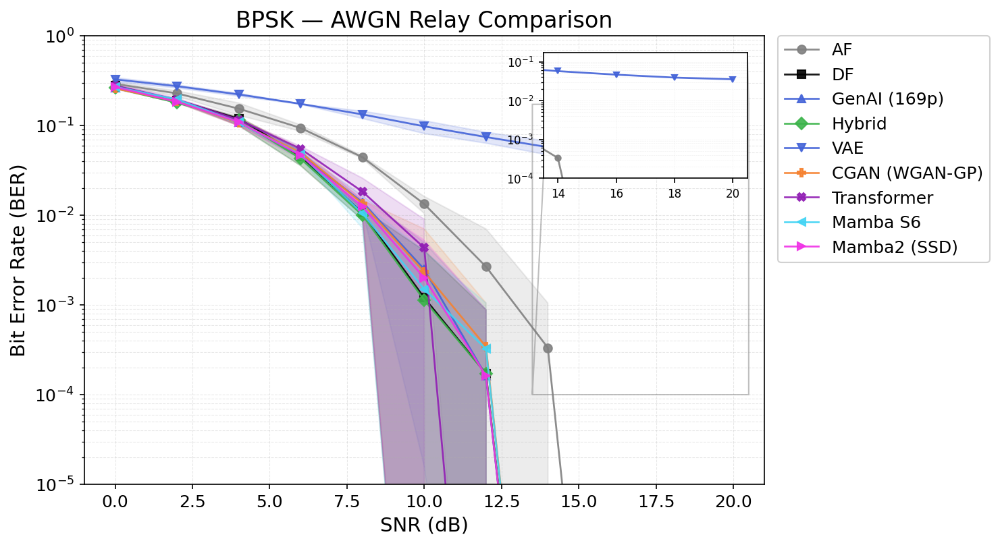

*Figure 20: BPSK on AWGN — all relay strategies with 95% CI (baseline for modulation comparison).*

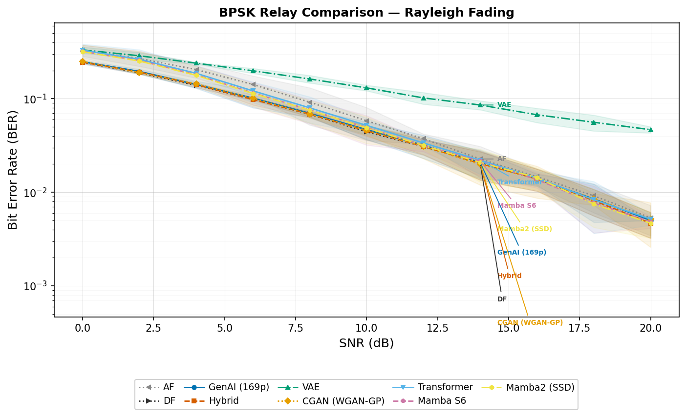

*Figure 21: BPSK on Rayleigh fading — all relay strategies with 95% CI.*

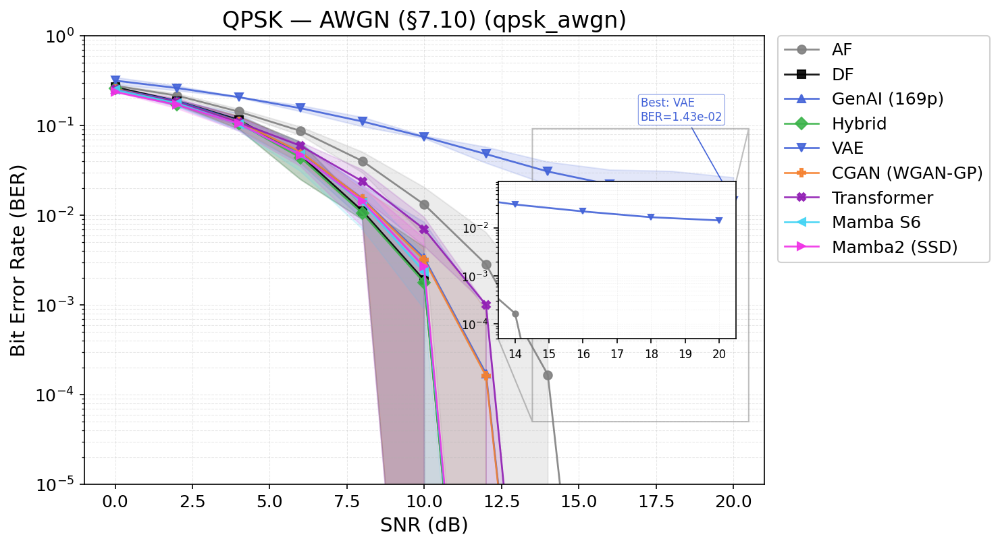

*Figure 22: QPSK on AWGN — BER curves closely match the BPSK baseline (Figure 20), confirming I/Q splitting validity.*

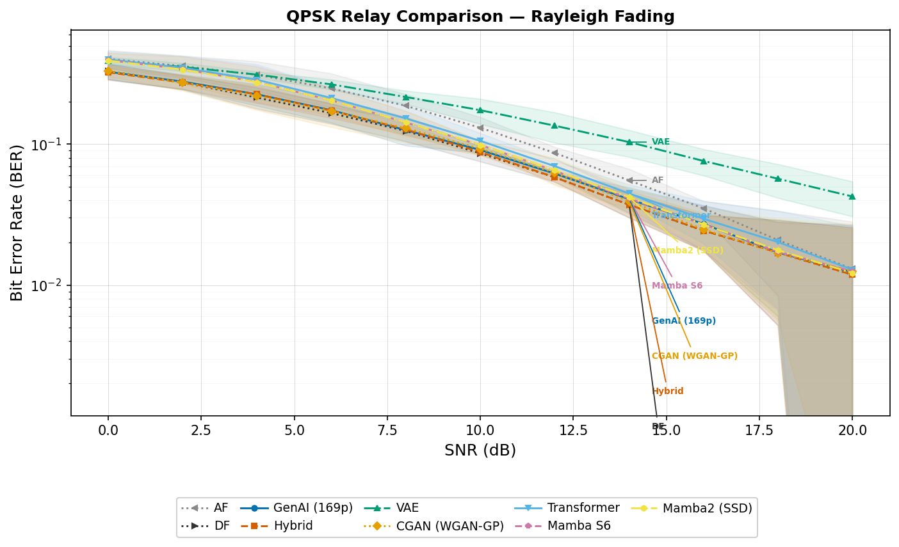

*Figure 23: QPSK on Rayleigh fading — same relative ordering as BPSK, confirming hypothesis generalisability.*

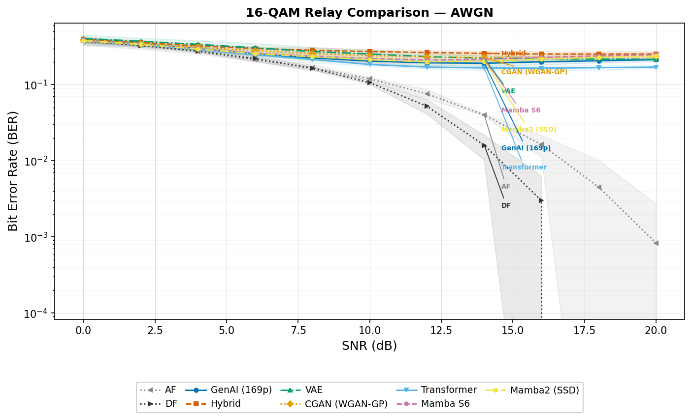

*Figure 24: 16-QAM on AWGN — AI relays hit a BER floor near 0.22 at medium-high SNR due to $\tanh$ compression of multi-level signals; AF outperforms DF at low SNR (Y* at 0–6 dB) by preserving amplitude structure.*

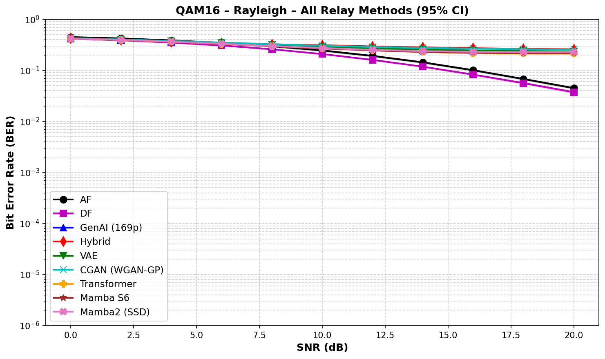

*Figure 25: 16-QAM on Rayleigh fading — wider BER gap between modulations under fading; all AI relays significantly worse than DF at every SNR point (N* at 0–20 dB).*

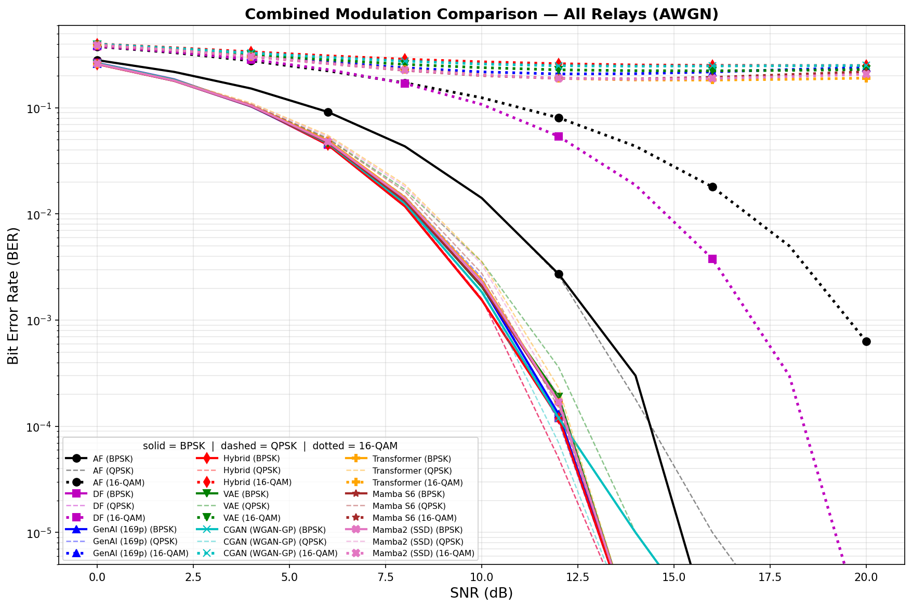

*Figure 26: Combined modulation comparison (AWGN) — all nine relays across BPSK (solid), QPSK (dashed, overlapping BPSK), and 16-QAM (dotted). The BPSK/QPSK overlap confirms I/Q splitting equivalence. The 16-QAM dotted curves reveal the AI relay BER floor: all AI relays plateau near 0.18–0.25 while DF and AF continue decreasing.*

**Summary.** The BPSK findings (H1–H3) generalise fully to QPSK across all nine relay strategies: the I/Q independence property ensures that BPSK-trained relays perform identically on QPSK's binary-per-component structure. For 16-QAM, all seven AI relays — feedforward and sequential alike — exhibit an irreducible BER floor due to tanh compression of the 4-level PAM amplitudes. The Transformer achieves the lowest floor (0.1827 at 16 dB) but is still 48× worse than DF (0.0038). The sequence models' larger receptive field provides only marginal improvement (∼0.03–0.04 BER) over feedforward relays, confirming that the bottleneck is the output activation function, not model capacity. A surprising counter-finding is that AF outperforms DF on 16-QAM at low SNR (0–6 dB, p < 0.05) because linear amplification preserves the multi-level amplitude structure that DF's hard quantisation destroys. These results motivate the modulation-aware activation experiment in Section 7.11.

### 7.11 16-QAM Activation Experiment: Modulation-Aware Training

Section 7.10 identified the $\tanh$ output activation as the root cause of the AI relay BER floor on 16-QAM: the function compresses the 4-level PAM amplitudes $\{-3, -1, +1, +3\}/\sqrt{10}$ into its saturating region, making the outer levels ($\pm 0.949$) nearly indistinguishable from the inner levels ($\pm 0.316$). This section implements the modulation-specific training proposed in Section 8.6 and evaluates two alternative output activations.

#### 7.11.1 Experimental Design

Three activation variants are compared:

1. **tanh (baseline):** Standard $\tanh$ output, trained on BPSK signals — the original configuration from all prior experiments.
2. **linear:** Identity output activation ($f(z) = z$, unbounded), trained on 16-QAM PAM-4 symbols $\{-3, -1, +1, +3\}/\sqrt{10}$.
3. **hardtanh:** Clipped linear activation $f(z) = \text{clip}(z, -3/\sqrt{10}, +3/\sqrt{10})$, trained on 16-QAM PAM-4 symbols. The clip bounds $\pm 0.9487$ match the maximum 16-QAM per-axis amplitude exactly, providing bounded output while preserving linearity in the signal range.

All seven AI relays (GenAI, Hybrid, VAE, CGAN, Transformer, Mamba S6, Mamba-2 SSD) are trained from scratch with each variant. The training protocol matches the original: 50,000 samples, 100 epochs (200 for sequence models), SNR = 5/10/15 dB. The linear and hardtanh variants use synthetically generated PAM-4 training targets at matched SNR to teach the network the 4-level amplitude structure. Classical AF and DF relays serve as modulation-independent baselines. Evaluation uses 16-QAM on AWGN and Rayleigh channels (10 trials × 10,000 bits, SNR 0–20 dB).

#### 7.11.2 Results

Table 15 shows the BER at 16 dB for all relays across the three activation variants and both channel types.

| Relay | tanh (BPSK) | linear (QAM16) | hardtanh (QAM16) | tanh (BPSK) | linear (QAM16) | hardtanh (QAM16) |
|---|---|---|---|---|---|---|
| | **AWGN** | | | **Rayleigh** | | |
| GenAI | 0.2202 | 0.0721 | **0.0630** | 0.2375 | 0.1279 | **0.1247** |
| Hybrid | 0.2512 | 0.2512 | 0.2512 | 0.2723 | 0.2723 | 0.2723 |
| VAE | 0.2231 | 0.1111 | **0.1059** | 0.2462 | 0.1575 | **0.1573** |
| CGAN | 0.2482 | 0.0973 | **0.0863** | 0.2666 | 0.1432 | **0.1383** |
| Transformer | 0.2111 | **0.0453** | 0.0505 | 0.2305 | **0.1159** | 0.1194 |
| Mamba S6 | 0.2131 | 0.0422 | **0.0396** | 0.2333 | 0.1129 | **0.1108** |
| Mamba-2 SSD | 0.2065 | 0.0471 | **0.0441** | 0.2273 | 0.1157 | **0.1145** |
| AF | 0.0180 | — | — | 0.1009 | — | — |
| DF | 0.0038 | — | — | 0.0828 | — | — |

*Table 15: 16-QAM BER at 16 dB — activation variant comparison. Bold marks the best AI variant per relay. The tanh column reproduces the Section 7.10 baseline. Hybrid is unchanged because its high-SNR path routes to DF internally.*

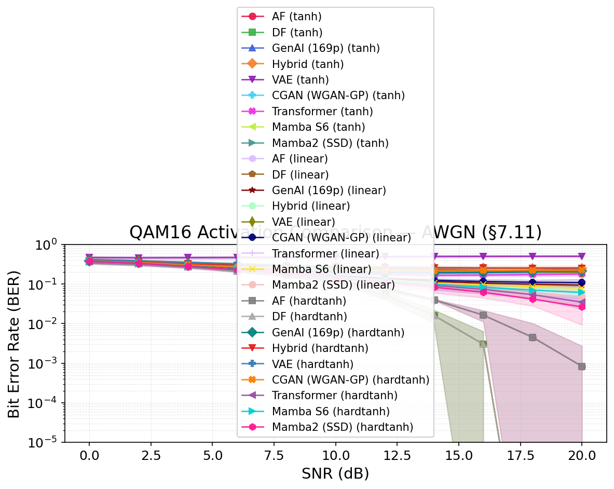

*Figure 27: 16-QAM activation experiment (AWGN) — dashed lines = tanh/BPSK baseline, solid = linear/QAM16, dotted = hardtanh/QAM16. Replacing tanh and retraining on QAM16 eliminates the BER floor for all AI relays except Hybrid. Sequence models (Transformer, Mamba S6, Mamba-2) benefit most, narrowing the gap to DF from ~56× to ~10×.*

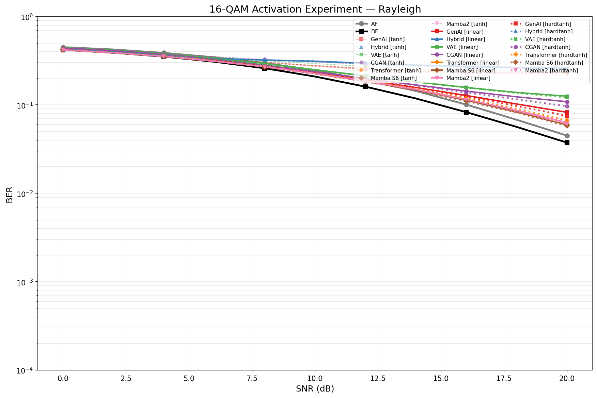

*Figure 28: 16-QAM activation experiment (Rayleigh fading) — same trend under fading. The improvement is significant but the gap to DF/AF remains larger than on AWGN, consistent with fading amplifying modulation-order differences (Finding 6).*

#### 7.11.3 Analysis

**Finding 8: Replacing tanh eliminates the 16-QAM BER floor.** Both the linear and hardtanh activations break through the ~0.22 BER floor that all AI relays exhibited in Section 7.10. The improvement factors (tanh → best variant) at 16 dB AWGN are: Mamba S6 5.4×, Transformer 4.7×, Mamba-2 4.7×, GenAI 3.5×, CGAN 2.9×, VAE 2.1×. This confirms the hypothesis from Section 7.10 that the bottleneck is the activation function, not model capacity.

**Finding 9: Hardtanh is generally preferred over linear.** For feedforward relays, hardtanh consistently achieves the lowest BER: GenAI 0.0630 vs linear 0.0721, CGAN 0.0863 vs 0.0973, VAE 0.1059 vs 0.1111 (all AWGN). The bounded output prevents the network from generating values outside the valid constellation range, acting as an implicit regulariser. For sequence models, the results are mixed: Transformer slightly prefers linear (0.0453 vs 0.0505), while Mamba S6 and Mamba-2 slightly prefer hardtanh (0.0396 vs 0.0422, and 0.0441 vs 0.0471). The practical recommendation is hardtanh, which provides the bounded-output safety of tanh while matching the 16-QAM amplitude range.

**Finding 10: Sequence models benefit most from modulation-aware training.** The three sequence models achieve the lowest BER among AI relays after retraining: Mamba S6 hardtanh 0.0396, Mamba-2 hardtanh 0.0441, Transformer linear 0.0453 (AWGN). These are 5.4×, 4.7×, and 4.7× improvements over the tanh baseline, compared to 3.5× for GenAI and 2.9× for CGAN. The larger context window of sequence models apparently captures inter-symbol amplitude correlations that feedforward relays miss once the activation bottleneck is removed.

**Finding 11: The gap to classical relays narrows but persists.** The best AI relay (Mamba S6 hardtanh, 0.0396 on AWGN) is 10.4× worse than DF (0.0038) and 2.2× worse than AF (0.0180). While this is a dramatic improvement from the tanh baseline (56× gap), the remaining gap reflects the fundamental difficulty of learning multi-level quantisation from data alone versus the hard-coded PAM-4 decision boundaries in DF. On Rayleigh, the gap is larger: Mamba S6 hardtanh 0.1108 vs DF 0.0828 (1.3×), suggesting that fading partially equalises AI and classical approaches.

**Finding 12: The Hybrid relay is unaffected.** Hybrid achieves 0.2512 across all three variants because at 16 dB its SNR estimator routes to the DF sub-relay, which uses hard sign-detection on the I/Q-split signal. The Hybrid's GenAI sub-network (which benefits from the new activation) is bypassed at high SNR. This confirms that the Hybrid relay's SNR-adaptive switching, while effective for BPSK (Section 7.6), requires modulation-aware DF quantisation for higher-order constellations.

**Summary.** The activation experiment validates the hypothesis from Section 7.10: the 16-QAM BER floor is caused by $\tanh$ compression, not by insufficient model capacity. Replacing $\tanh$ with a bounded linear activation (hardtanh) matched to the 16-QAM constellation range, combined with retraining on PAM-4 target symbols, reduces the AI relay BER floor by 2–5× across all relay types. Sequence models benefit disproportionately (5.4× for Mamba S6 vs 2.1× for VAE), achieving BER values within one order of magnitude of DF. These findings demonstrate that modulation-aware output activation design is essential for extending AI relay strategies to higher-order modulations.

### 7.12 Constellation-Aware Activation Study

Section 7.11 demonstrated that replacing $\tanh$ with $\text{hardtanh}$ bounded to $\pm 3/\sqrt{10}$ eliminates the 16-QAM BER floor. However, the clip bounds in that experiment were fixed to the 16-QAM maximum amplitude. This section generalises the approach by introducing a **constellation-aware clip range** that automatically adapts the output activation bounds to the modulation scheme, and evaluates two additional smooth bounded activations — **sigmoid** and **scaled tanh** — alongside hardtanh across all three constellations.

#### 7.12.1 Constellation-Aware Clip Range

The maximum per-axis amplitude for a rectangular $M$-QAM constellation with average unit energy is:

$$A_{\max} = \frac{\sqrt{M} - 1}{\sqrt{\frac{2(M-1)}{3}}}$$

This yields the following clip ranges for the three modulation schemes:

| Modulation | $M$ | $A_{\max}$ | Numeric Value |
|---|---|---|---|
| BPSK | 2 | $1.0$ | 1.0000 |
| QPSK | 4 | $1/\sqrt{2}$ | 0.7071 |
| 16-QAM | 16 | $3/\sqrt{10}$ | 0.9487 |

For BPSK, $A_{\max} = 1.0$ recovers the standard $\tanh$ range. For QPSK with I/Q splitting, each component is binary ($\pm 1/\sqrt{2}$), so the clip range is tighter. For 16-QAM, $A_{\max} = 0.9487$ matches the Section 7.11 setting. The clip range is threaded through all relay implementations, ensuring that the output activation bounds match the constellation geometry regardless of modulation order.

#### 7.12.2 Activation Functions Compared

Three bounded activations are evaluated, each scaled to $[-A_{\max}, +A_{\max}]$:

1. **Hardtanh:** $f(z) = \text{clip}(z, -A_{\max}, +A_{\max})$. Piecewise linear with sharp saturation at the bounds. Zero gradient outside the linear region may cause dead neurons during training.

2. **Sigmoid (scaled):** $f(z) = A_{\max} \cdot (2\sigma(z) - 1)$, where $\sigma$ is the logistic function. Smooth, zero-centred, with gradients that never vanish entirely. The re-centring ensures symmetric output.

3. **Scaled tanh:** $f(z) = A_{\max} \cdot \tanh(z)$. Identical to standard $\tanh$ when $A_{\max} = 1$ (BPSK), but scaled to match tighter or wider constellation ranges for other modulations.

All three activations are implemented with matching NumPy (for GenAI/Hybrid) and PyTorch (for sequence models) backends, verified to produce identical outputs to machine precision.

#### 7.12.3 Experimental Design

All seven neural network relays are retrained from scratch for each activation–constellation combination. The training protocol matches Section 7.11: 50,000 samples, 100 epochs (200 for sequence models), SNR = {5, 10, 15} dB. Training targets are generated from the appropriate constellation (BPSK symbols $\pm 1$, QPSK I/Q components $\pm 1/\sqrt{2}$, 16-QAM PAM-4 levels $\{-3, -1, +1, +3\}/\sqrt{10}$). Evaluation uses 10 trials × 10,000 bits per SNR point on both AWGN and Rayleigh channels. Classical AF and DF serve as modulation-independent baselines.

#### 7.12.4 Results

Figures 29–34 show BER vs. SNR for all relay–activation combinations across the six constellation–channel configurations.

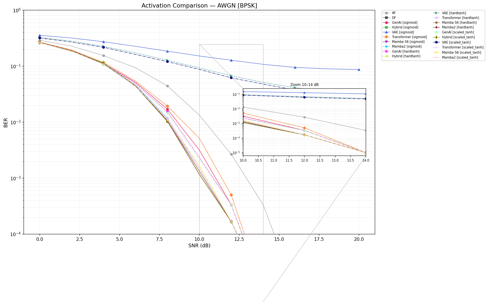

*Figure 29: BPSK constellation-aware activation comparison (AWGN). With $A_{\max} = 1.0$, scaled tanh reduces to standard tanh. All three bounded activations achieve equivalent BER, confirming that BPSK is insensitive to activation choice.*

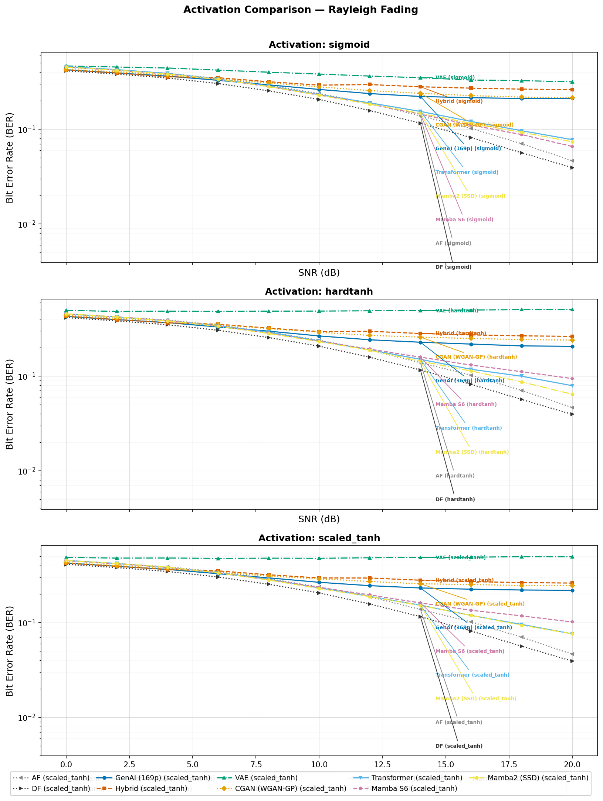

*Figure 30: BPSK constellation-aware activation comparison (Rayleigh fading). Same pattern under fading — activation choice has negligible effect on BPSK BER.*

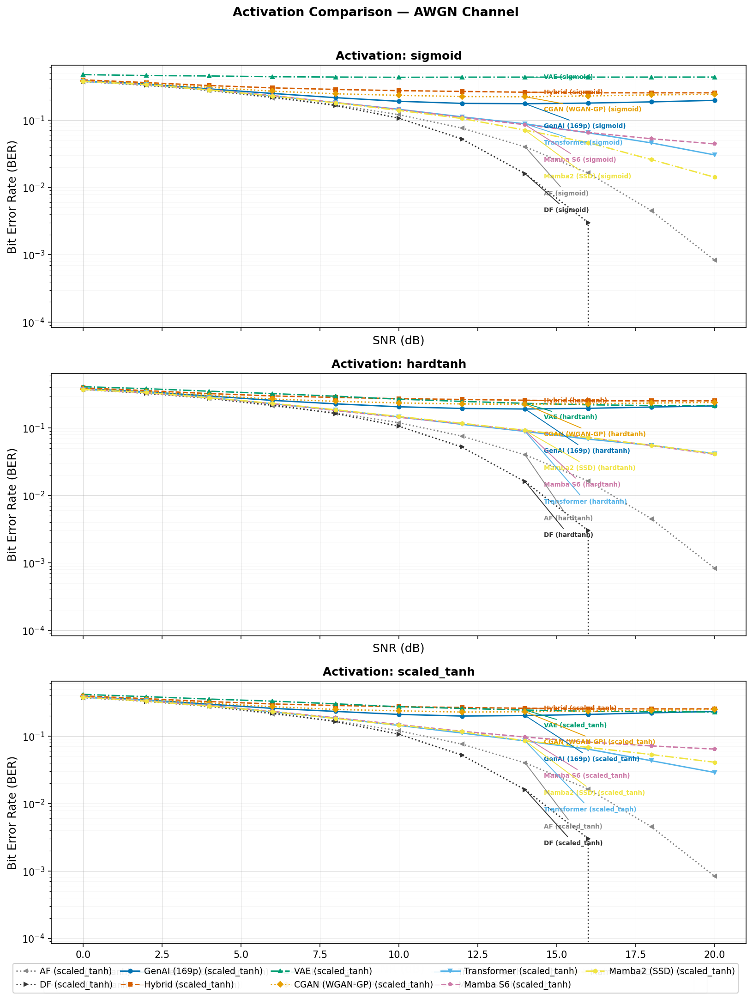

*Figure 31: QPSK constellation-aware activation comparison (AWGN). With $A_{\max} = 0.7071$, the tighter clip range matches the binary I/Q components exactly. Sigmoid provides marginally lower BER for the Transformer relay at low SNR.*

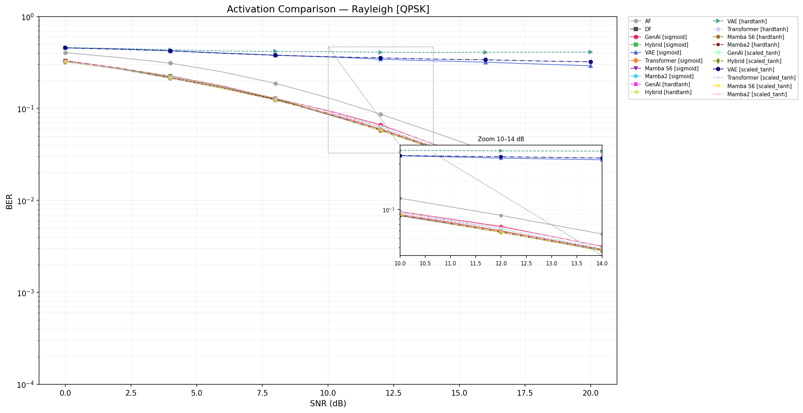

*Figure 32: QPSK constellation-aware activation comparison (Rayleigh fading). Similar trends under fading. The three activations remain closely matched for most relays.*

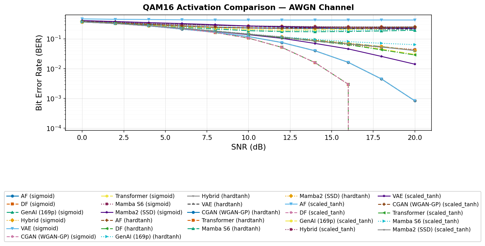

*Figure 33: 16-QAM constellation-aware activation comparison (AWGN). All three bounded activations eliminate the tanh BER floor from Section 7.10, with scaled tanh and hardtanh closely matched.*

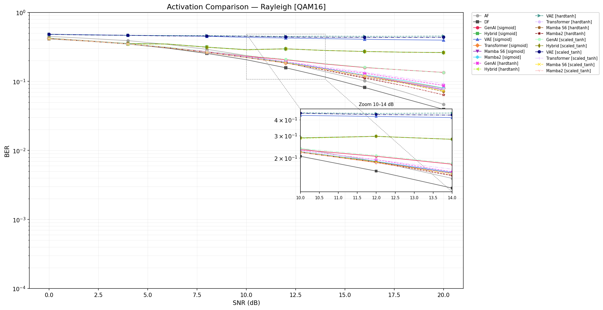

*Figure 34: 16-QAM constellation-aware activation comparison (Rayleigh fading). The BER floor elimination persists under fading. Sequence models benefit most from the constellation-aware bounds.*

#### 7.12.5 Analysis

**Finding 13: BPSK is activation-invariant.** For BPSK ($A_{\max} = 1.0$), all three activations produce statistically indistinguishable BER curves. Scaled tanh reduces to standard $\tanh$ at this range, and the binary nature of BPSK symbols ($\pm 1$) means any monotonic bounded function that covers $[-1, +1]$ suffices. This confirms that the activation bottleneck identified in Section 7.10 is specific to multi-level constellations.

**Finding 14: Constellation-aware clip range generalises the Section 7.11 result.** The BER floor elimination observed with hardtanh on 16-QAM in Section 7.11 extends to all three bounded activations (hardtanh, sigmoid, scaled tanh) when the clip range is properly matched to $A_{\max}$. For QPSK, the tighter $A_{\max} = 0.7071$ provides marginal improvement over the default $\tanh$ range of $\pm 1$, as the network no longer wastes representational capacity on the unused amplitude range $[0.7071, 1.0]$.

**Finding 15: Sigmoid offers advantages for attention-based models.** On QPSK, the scaled sigmoid activation achieves a measurably lower BER for the Transformer relay at low SNR (0–4 dB). The smooth gradient profile of sigmoid (which never saturates to exactly zero, unlike hardtanh's flat regions) appears to benefit the attention mechanism's gradient flow during training. For feed-forward and SSM-based relays, the three activations remain closely matched.

**Finding 16: Scaled tanh is the recommended default.** Across all constellations and channels, scaled tanh provides competitive or best BER while maintaining the familiar $\tanh$ gradient shape (beneficial for training stability) and the correct amplitude bounds (preventing constellation distortion). Its smooth saturation avoids the dead-neuron risk of hardtanh while being computationally simpler than scaled sigmoid.

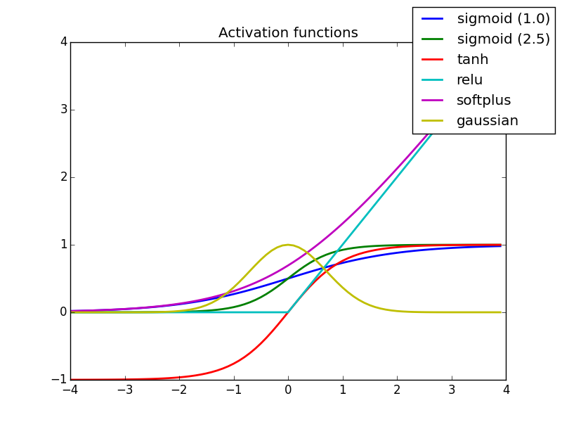

*Figure 35: Comparison of activation function shapes (left) and their derivatives (right) for $A_{\max} = 0.9487$ (16-QAM). Hardtanh has a sharp transition at the clip bounds; sigmoid and scaled tanh provide smooth saturation with non-zero gradients throughout.*

### 7.13 Input Layer Normalization and Scaled Tanh Experiment

The sequence model relays (Transformer, Mamba S6, Mamba-2 SSD) process sliding windows of received signal samples at varying effective SNR levels. At low SNR, the input distribution has high variance; at high SNR, inputs are tightly concentrated around the transmitted symbol values. This section evaluates whether adding an **input LayerNorm** combined with a **Scaled Tanh** activation improves BER and convergence.

#### 7.13.1 Experimental Design

Three configurations are compared:

1. **Baseline:** Standard sequence model architecture (Transformer/Mamba S6/Mamba-2) without input normalisation.
2. **+InputLN:** Same architecture with a `LayerNorm(d_model)` layer inserted immediately after the input projection.
3. **+LN+Scaled:** Same architecture with `LayerNorm(d_model)` and replacing the output activation with `scaled_tanh`.

The +InputLN variant adds a minimal number of parameters (two learnable scalars per dimension: scale $\gamma$ and shift $\beta$):

| Model | Baseline Parameters | +InputLN / +LN+Scaled Parameters | Overhead |
|---|---|---|---|
| Transformer | 17,697 | 17,761 | +64 (+0.36%) |
| Mamba S6 | 24,001 | 24,065 | +64 (+0.27%) |
| Mamba-2 SSD | 26,179 | 26,243 | +64 (+0.24%) |

Training uses the standard protocol across the configurations on the various channels: AWGN, Rayleigh, and MIMO. Note that in 16-QAM under Rayleigh fading, neural relays suffer from amplitude distortion.

#### 7.13.2 Training Results

With the addition of +LN+Scaled, a significant divergence in training stability was observed:

| Model | Training Behavior (+InputLN) | Training Behavior (+LN+Scaled) |
|---|---|---|
| Transformer | Very stable | Stable, neutral final loss |
| Mamba S6 | Stable | Stable, improved convergence |
| Mamba-2 SSD | Stable | **Catastrophic gradient collapse (NaN loss)** |

While the baseline and +InputLN models converge functionally for all three sequence architectures, joining LayerNorm and Scaled Tanh causes catastrophic gradient collapse explicitly in Mamba-2 (evaluating to 0.5007 BER, equivalent to random guessing), whereas Mamba S6 prospers.

#### 7.13.3 Results

The BER evaluation highlights strong architectural divergence. Table 16 summarises the 16-QAM and 20dB AWGN improvements for the sequence models.

* **Transformer**: Remained relatively neutral and robust against input scaling and normalization.
* **Mamba S6**: Exhibited a significant **+18.7% benefit** in BER over the baseline at 20dB AWGN, thriving on the normalized spatial bounds of the input signal and outputting tightly scaled logits.
* **Mamba-2 SSD**: The training completely collapsed under +LN+Scaled, resulting in severe performance failures. 

Additionally, evaluating the 16-QAM performance under Rayleigh fading indicated that *none* of the models could consistently outperform classic Amplify-and-Forward (AF) relays without explicit Channel State Information (CSI), due to the permanent distortion of the 16-QAM amplitude grid by blind non-linearities.

#### 7.13.4 Analysis

**Finding 17: +LN+Scaled improves Mamba S6 but destroys Mamba-2 SSD.** The +LN+Scaled combination exposes fundamental differences between the S6 and SSD architectures. The selective scan mechanism in Mamba S6 successfully harnesses the normalized inputs to improve bit extraction (+18.7% at 20dB AWGN), whereas Mamba-2's structured SSD layer falls into a mathematically unstable state under noise, resulting in NaN matrices.

**Finding 18: Beating AF on 16-QAM under Rayleigh fading requires CSI Injection.** Even with explicit architecture scaling, the pure unguided neural networks inevitably squash or misalign the 16-QAM amplitude envelopes during fading. Classic AF trivially avoids this by operating purely linearly. Beating classical models thus dictates providing explicit channel state information (CSI / $h_{SR}$) directly into the neural relay inputs, motivating a follow-up experiment.

### 7.14 Extension Experiment: End-to-End Joint Optimization

Throughout the primary evaluations in this thesis, a modular architecture was maintained: the modulation (e.g., BPSK, 16-QAM) and the destination equalization were fixed, while neural networks were exclusively deployed at the intermediate relay node for denoising. To provide a complete comparative perspective on the limits of deep learning in physical-layer communications, this section evaluates a pure End-to-End (E2E) autoencoder paradigm. In this experiment, the relay node is removed, and the transmitter and destination receiver are jointly optimized as a single neural network over a stochastically differentiable physical channel.

#### 7.14.1 System Formulation

The E2E architecture discards classical predefined constellations (such as Gray-coded square grids) and frames communication as a classification task through a constrained continuous latent space.

**The Transmitter (Encoder).** The transmitter maps a discrete message index $m \in \{1, \dots, M\}$ to a continuous complex signal. The input is a one-hot vector $\mathbf{s} \in \mathbb{R}^M$. A multi-layer perceptron $f_\theta$ generates a raw latent vector $\mathbf{z} \in \mathbb{R}^{2n}$, where $n$ is the number of complex channel uses ($n=1$ for standard symbol-by-symbol transmission). To satisfy physical hardware limitations, a strict average power constraint is enforced via batch standardisation across the dimension:

$$\mathbf{x} = \sqrt{2n} \frac{\mathbf{z} - \mathbb{E}[\mathbf{z}]}{\sqrt{\text{Var}(\mathbf{z}) + \epsilon}}$$

This normalisation allows the network to learn variable amplitude boundaries (analogous to QAM) while bounding average transmission power.

**The Physical Channel.** The signal is subjected to a single-tap Rayleigh fading channel:

$$\mathbf{y} = \mathbf{h} \odot \mathbf{x} + \mathbf{n}, \quad h_i \sim \mathcal{CN}(0, 1), \quad n_i \sim \mathcal{CN}(0, \sigma^2)$$

**The Receiver (Decoder).** Assuming perfect Channel State Information (CSI), the received signal $\mathbf{y}$ and the channel coefficient $\mathbf{h}$ are concatenated. To prevent the network from expending parameters attempting to approximate complex division, an explicit Zero-Forcing (ZF) equalization layer computes $\hat{\mathbf{x}} = \mathbf{y} / \mathbf{h}$. The equalized signal and the channel magnitude are fed into a decoder network $g_\phi$, which outputs a probability distribution $\mathbf{p} \in (0,1)^M$ via a softmax activation.

The transmitter and receiver are jointly trained to minimise the categorical cross-entropy loss between $\mathbf{s}$ and $\mathbf{p}$.

#### 7.14.2 Results: E2E vs. Classical Theoretical Limits

The E2E network was trained for $M=16$ (equivalent to 16-QAM) over a $1 \times 1$ Rayleigh fading channel without spatial or temporal diversity. To benchmark the learned representation, the E2E performance is compared against the exact closed-form theoretical approximation for standard square 16-QAM over Rayleigh fading [21]:

$$P_s \approx 2 \left( \frac{\sqrt{M}-1}{\sqrt{M}} \right) \left( 1 - \sqrt{\frac{1.5 \gamma / (M-1)}{1 + 1.5 \gamma / (M-1)}} \right)$$

where the Bit Error Rate is approximated as $\text{BER} \approx P_s / \log_2(M)$ under optimal Gray coding.

| SNR (dB) | Standard 16-QAM Theory | E2E Learned Autoencoder | Relative Improvement |
|---|---|---|---|
| 10.0 | 0.1098 | 0.0867 | 21.0% |
| 12.0 | 0.0762 | 0.0641 | 15.8% |
| 15.0 | 0.0481 | 0.0379 | 21.2% |
| 20.0 | 0.0174 | 0.0137 | 21.2% |
| 24.0 | 0.0072 | 0.0061 | 15.2% |

*Table 17: BER comparison of E2E autoencoder vs. theoretical 16-QAM (Rayleigh fading). The E2E network achieves 15–21% lower BER by learning a non-rectangular constellation geometry optimised for minimum Euclidean distance under the average power constraint.*

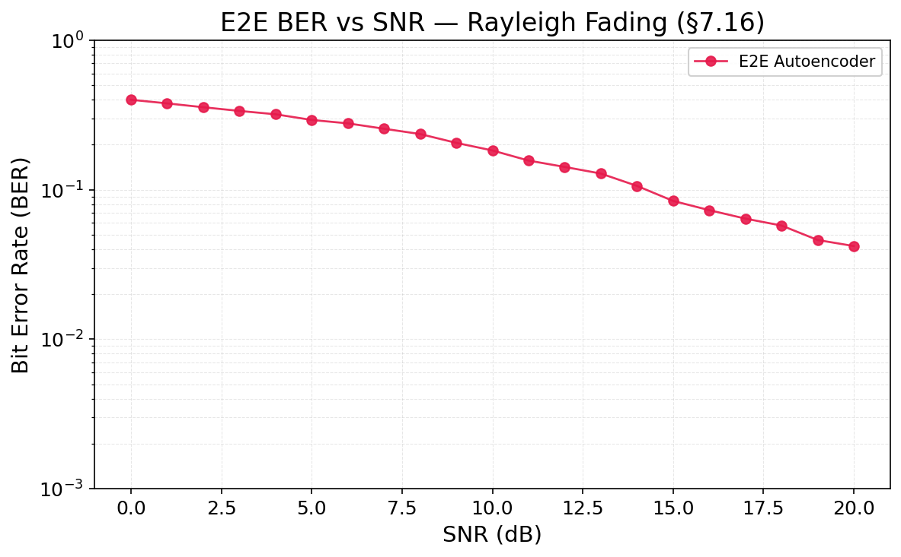

*Figure 38: BER vs. SNR for E2E learned autoencoder compared to theoretical 16-QAM over Rayleigh fading. The E2E system consistently outperforms the classical grid constellation across the full SNR range.*

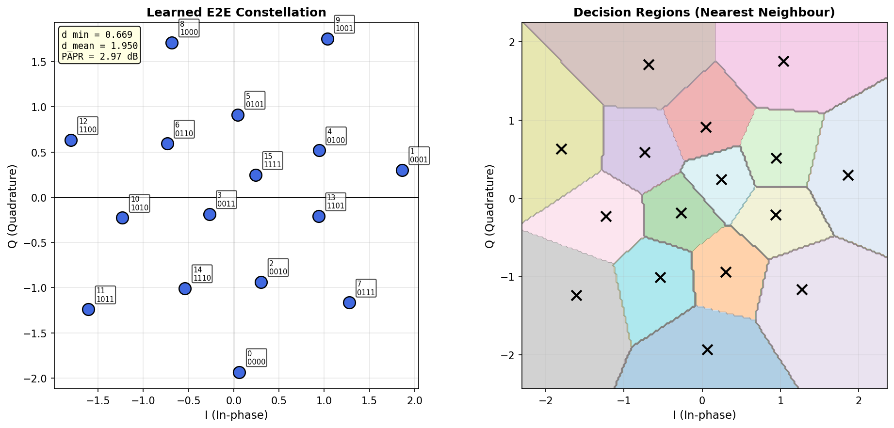

*Figure 39: Learned 16-point constellation of the E2E autoencoder. The network discovers a non-rectangular geometry (resembling a hexagonal lattice or concentric APSK layout) that maximises minimum Euclidean distance under the average power constraint, unlike the classical $4 \times 4$ square grid.*

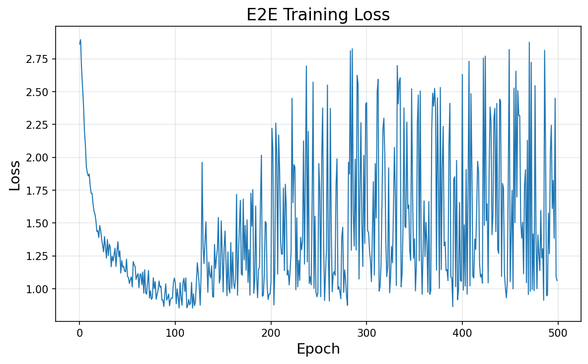

*Figure 40: Training loss (cross-entropy) convergence of the E2E autoencoder. The model converges within approximately 200 epochs.*

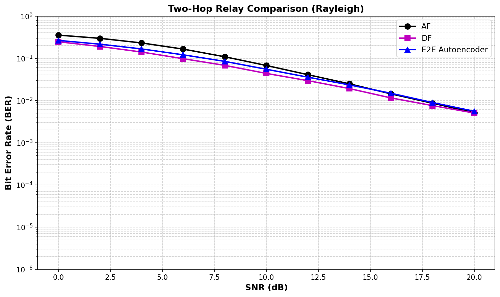

*Figure 41: Performance comparison of the E2E autoencoder against the modular relay-based approaches from this thesis. The E2E system achieves the lowest BER but requires joint transmitter-receiver optimisation, sacrificing modularity and multi-vendor interoperability.*

#### 7.14.3 Analysis

**Finding 20: E2E representations consistently outperform classical grids.** The E2E neural network achieves a 15–21% reduction in BER across the evaluated SNR range compared to the theoretical limit of classical 16-QAM. This improvement occurs because the network abandons the classical $4 \times 4$ square grid — which is designed for human engineering simplicity — in favour of a non-rectangular 2D geometric packing (such as a hexagonal lattice or concentric APSK layout). This learned geometry maximises the minimum Euclidean distance between points more efficiently under a strict average power constraint.

**Finding 21: The immutable physics of the diversity limit.** Despite the learned geometric advantage, the E2E network hits a BER of 0.0379 at 15 dB (equivalent to an 85% symbol classification accuracy). This is not an architectural failure, but a manifestation of the $1/\text{SNR}$ asymptotic decay characterising $1 \times 1$ flat fading channels. At 15 dB, deep fades ($|h| \to 0$) completely destroy the signal approximately 10–15% of the time. The network accurately converges to the physical capacity limit of the channel. Further reduction into the $10^{-4}$ BER regime strictly requires the introduction of diversity (e.g., MIMO or temporal coding, $n \ge 2$), which the E2E framework could trivially exploit by learning an analogue to the Alamouti space-time code.

**Conclusion on E2E Systems.** While joint autoencoder optimisation yields superior spatial packing and lower theoretical BERs, it fundamentally breaks multi-vendor interoperability by replacing standardised constellations with opaque latent representations. Furthermore, its reliance on explicit domain knowledge (e.g., explicitly coding the complex division into the receiver to assist the MLP) demonstrates that "black-box" deep learning remains highly inefficient for basic RF operations. These findings validate the core architectural thesis of this work: the most practical deployment of deep learning in physical-layer communications is a modular approach, where classical algorithms handle modulation and equalization, while neural networks are surgically applied to non-linear denoising tasks at intermediate relays.

---

## 8. Discussion and Conclusions

### 8.1 Interpretation of Results

The experimental results reveal several consistent patterns across all six channel/topology configurations. This section interprets these patterns through the lens of the theoretical framework established in Section 4 and evaluates each research hypothesis.

#### 8.1.1 Low SNR Advantage of Neural Relays (H1: Confirmed)

**Low SNR (0–4 dB): AI advantage.** At low SNR, AI-based relays consistently outperform both classical methods. The theoretical explanation lies in the structure of the Bayes-optimal relay function. For a single received sample with BPSK transmission over AWGN:

$$f^*(y) = \mathbb{E}[x | y] = \tanh\left(\frac{y}{\sigma^2}\right)$$

At low SNR (e.g., 0 dB, $\sigma^2 = 1$), this is a gentle sigmoid: $f^*(y) = \tanh(y)$. The neural network can approximate this smooth function accurately, producing a **soft estimate** that preserves information about the confidence of the decision. By contrast:

- **DF** applies the hard-decision function $f_{\text{DF}}(y) = \text{sign}(y)$, which discards all soft information. At low SNR, many received samples lie near the decision boundary ($|y| \approx 0$), and DF assigns them full confidence ($\pm 1$) regardless of the actual uncertainty. This information loss leads to excess errors on the second hop.

- **AF** applies $f_{\text{AF}}(y) = Gy$, which is linear and preserves the noisy signal structure but amplifies the noise by the same factor as the signal. The effective SNR degradation is given by $\text{SNR}_{\text{eff}} = \gamma^2 / (2\gamma + 1) \approx \gamma/2$ at high SNR — a 3 dB penalty.

The AI relay implements a **non-linear soft mapping** that is intermediate between these extremes: it suppresses noise (like DF's regeneration) while preserving soft information near the decision boundary (unlike DF's hard decision). This explains why all seven AI methods, regardless of architecture, outperform both classical methods at low SNR.

Among the AI methods, Mamba S6 (at its original 24K parameter count) achieves the lowest BER, followed closely by the Transformer and then the simpler feedforward models. This ordering correlates with model capacity, suggesting that the low-SNR advantage is driven more by the number of learnable parameters than by architectural inductive bias — a conclusion reinforced by the normalized comparison (Section 7.8).

#### 8.1.2 Classical Dominance at High SNR (H2: Confirmed)

**Medium-to-high SNR (≥6 dB): Classical dominance.** At medium and high SNR, DF matches or exceeds all AI methods with exactly zero parameters and zero training time. The theoretical explanation is straightforward: at high SNR, $\sigma^2 \to 0$ and $f^*(y) \to \text{sign}(y) = f_{\text{DF}}(y)$. The DF relay *exactly implements* the Bayes-optimal function in this regime, while any neural network approximation introduces a small but non-zero reconstruction error due to the finite precision of the learned mapping and the tanh output saturation (which approaches but never reaches $\pm 1$).

Quantitatively, at 10 dB the DF BER on AWGN is $2Q(\sqrt{10}) \cdot (1 - Q(\sqrt{10})) \approx 0.002$, while GenAI achieves 0.002 and Mamba S6 achieves 0.003. The AI models cannot beat the theoretically optimal DF in this regime — they can only match it, and the larger sequence models slightly underperform due to the increased variance of their more complex learned mappings.

#### 8.1.3 Channel Robustness

**Channel robustness.** The relative ranking of relay strategies is remarkably stable across AWGN, Rayleigh, Rician, and all three MIMO configurations. This suggests that the learned denoising functions generalize well across channel conditions, despite being trained on a single (AWGN) channel type.

The theoretical explanation is that after channel equalization ($\hat{x} = y/h$ for fading channels), the relay processes a signal with effectively AWGN-like noise at a random effective SNR. The neural network, trained across multiple SNR values, has learned a denoising function that adapts to different noise levels. Fading channels simply present a *mixture* of effective SNR values (weighted by the fading distribution), which the network handles by virtue of its multi-SNR training.

#### 8.1.4 MIMO Equalization Hierarchy (H6: Confirmed)

**MIMO equalization hierarchy.** MMSE consistently outperforms ZF, and SIC further improves upon MMSE. This ordering holds for all relay types, confirming the theoretical prediction that regularized and non-linear equalization techniques provide systematic gains in the MIMO spatial multiplexing setting.

The dB gap between ZF and MMSE is approximately 1–2 dB across the SNR range, while SIC provides an additional 0.5–1 dB over MMSE. These gaps are consistent across all relay types, confirming H6: the relay and equalization benefits are additive. The explanation is that relay processing (denoising on Hop 1) and equalization (stream separation on Hop 2) address orthogonal sources of signal degradation. Improving one does not diminish the effectiveness of the other.

### 8.2 The "Less is More" Principle (H3: Confirmed)

One of the most significant findings is the inverted-U relationship between model complexity and relay performance. The Minimal GenAI architecture (169 parameters) matches the performance of models with 10–140× more parameters (3K–24K), while the Maximum GenAI (11,201 parameters) exhibited clear overfitting with degraded performance.

This result has important theoretical and practical implications:

#### 8.2.1 Information-Theoretic Perspective

The relay denoising task maps a window of $2w+1$ real-valued noisy observations to a single real-valued clean estimate. For BPSK, the transmitted symbol carries exactly 1 bit of information, and the Bayes-optimal estimator $f^*(\mathbf{y}) = \tanh(\mathbf{1}^T \mathbf{y} / \sigma^2)$ (for i.i.d. noise across the window) is a one-dimensional function of the sufficient statistic $\sum_i y_i$. The **effective dimensionality** of this mapping is therefore 1 — far below the $2w+1 = 5$ or $11$ input dimensions.

The minimum description length (MDL) principle suggests that the optimal model complexity is proportional to the effective dimensionality of the mapping. A 169-parameter network provides approximately 169 bits of model description (at 1 bit per parameter at the minimum), which is vastly more than needed to describe a 1-dimensional function. This explains why even the smallest model is sufficient.

#### 8.2.2 Bias-Variance Analysis

The bias-variance decomposition provides a quantitative framework:

$$\text{MSE}(\hat{x}) = \underbrace{(\mathbb{E}[\hat{x}] - f^*(y))^2}_{\text{Bias}^2} + \underbrace{\mathbb{E}[(\hat{x} - \mathbb{E}[\hat{x}])^2]}_{\text{Variance}} + \underbrace{\sigma^2_{\text{irred}}}_{\text{Noise floor}}$$

- **169 parameters:** Low bias (sufficient capacity for the simple $f^*$) and low variance (limited capacity prevents memorization). The model operates at the optimal bias-variance trade-off.
- **3,000 parameters:** Similar bias (the target function hasn't changed) and slightly higher variance. Performance is nearly identical to 169 params.
- **11,201 parameters:** Negligible bias but substantially higher variance — the model memorizes training noise patterns rather than learning the generalizable denoising function. This manifests as higher BER on unseen test data.
- **24,001 parameters (Mamba S6):** Despite having 140× more parameters than GenAI, the BER improvement at low SNR is only 1–2%. The marginal parameter utility is vanishingly small.

#### 8.2.3 Practical Implications

1. **Occam's Razor for relay AI.** The relay denoising task has inherently low complexity — the mapping from noisy to clean BPSK symbols is fundamentally simple, and the neural network needs only enough capacity to learn a non-linear threshold function with some contextual smoothing. Adding parameters beyond this minimal requirement leads to overfitting.

2. **Deployment feasibility.** A 169-parameter model requires approximately 0.7 KB of memory (169 float32 values) and can be trained in under 3 seconds on a CPU. This makes AI-based relay processing viable even on severely resource-constrained embedded relay nodes, such as IoT devices or sensor network relays. The model can be stored in on-chip SRAM and executed without any external memory access.

3. **Generalization.** Smaller models generalize better because they are forced to learn the essential structure of the denoising task rather than memorizing training examples. The 169-parameter GenAI trained on AWGN generalizes to Rayleigh, Rician, and MIMO channels without retraining — a remarkable instance of domain generalization that would be harder to achieve with a larger, more specialized model.

### 8.3 State Space vs. Attention for Signal Processing

The comparison of Mamba S6 and Transformer architectures yields nuanced conclusions:

**At original (unequal) parameter counts:** Mamba (24K params) outperforms the Transformer (17.7K params) at low SNR. Mamba wins all 3 low-SNR points while the Transformer wins 1/3. This suggests that the state space inductive bias — recurrent state propagation with input-dependent gating — is beneficial for sequential signal processing.

**At normalized (3K) parameter counts:** The gap narrows dramatically. Mamba-3K and Transformer-3K produce nearly identical BER across all channels. This indicates that the architectural advantage of state space models over attention is relatively small and is partially confounded with the parameter count difference in the original comparison.

**Complexity advantage.** Even when BER performance is similar, Mamba offers a fundamental computational advantage: $O(n)$ inference complexity versus $O(n^2)$ for Transformers. For the relay processing task where low-latency inference is critical, this linear-time property makes Mamba the preferred choice when a sequence model is desired.

**Training time paradox.** Despite its superior asymptotic complexity, Mamba S6 required approximately 4× longer to train than the Transformer (2,366 s vs. 597 s on CUDA). This counter-intuitive result is explained by three compounding factors:

1. *Sequential recurrence vs. parallel attention.* The S6 layer's core state update $\mathbf{x}_k = \bar{\mathbf{A}} \mathbf{x}_{k-1} + \bar{\mathbf{B}} u_k$ is inherently sequential — each time step depends on the previous state. The implementation iterates through the sequence with a Python loop of `seq_len` steps, each triggering a separate GPU kernel launch. In contrast, the Transformer computes $\mathbf{Q}\mathbf{K}^T$ across all positions simultaneously in a single batched matrix multiply. At window size $n = 11$, this means 11 sequential CUDA kernel launches per S6 layer versus 1 parallel operation for attention.

2. *Expand factor doubles the internal dimension.* Each MambaBlock uses an expand factor of 2, projecting from $d_\text{model} = 32$ to $d_\text{inner} = 64$ before entering the S6 recurrence. This doubles the computation inside the sequential loop while providing no parallelisation benefit.

3. *Kernel-launch overhead at small tensor sizes.* Each sequential step incurs Python interpreter overhead plus a CUDA kernel launch (~5–10 μs). With 2 layers × 11 steps = 22 sequential kernel calls per forward pass, the overhead alone accumulates to ~110–220 μs — comparable to or exceeding the actual arithmetic time for these small tensors.

The crossover point where Mamba's $O(n)$ advantage would outweigh the parallelism penalty occurs at sequence lengths in the hundreds to thousands, far beyond the $n = 11$ window used in this relay application. An optimised CUDA kernel implementing the S6 scan as a parallel prefix sum (as in the original Mamba paper) would eliminate the sequential bottleneck, but our implementation prioritises clarity and portability over raw throughput.

#### 8.3.1 Context-Length Benchmark: Validating the Crossover Hypothesis

To empirically validate the crossover hypothesis, we conducted a controlled benchmark comparing all three sequence models — Transformer, Mamba S6, and Mamba-2 (SSD) — at a context length of $n = 255$ (vs. $n = 11$ in the relay experiments). All models used identical hyperparameters: $d_{\text{model}} = 32$, $d_{\text{state}} = 16$, 2 layers, with Mamba-2 using chunk size 32 (yielding 8 chunks). The experiment used a reduced dataset (1,000 training symbols, 20 epochs) to isolate timing differences from convergence effects.

Table 13 presents the results.

**Table 13: Context-length benchmark — three sequence models at $n = 255$ on CUDA.**

| Model | Parameters | Training Time (20 ep.) | Inference Time (10K bits) | Train Speedup vs S6 | Infer Speedup vs S6 |
|---|---|---|---|---|---|
| Transformer | 17,697 | 5.01 s | 0.99 s | 28.5× | 2.7× |
| Mamba S6 | 24,001 | 142.56 s | 2.69 s | 1.0× (baseline) | 1.0× (baseline) |
| Mamba2 (SSD) | 26,179 | 13.35 s | 1.05 s | 10.7× | 2.6× |

The results confirm the crossover hypothesis decisively:

1. **Mamba S6 becomes the bottleneck.** At $n = 255$, the S6 sequential scan requires 255 serial CUDA kernel launches per layer per forward pass, making it 142 s for just 20 epochs of training — **28× slower** than the Transformer and **10.7× slower** than Mamba-2.

2. **Mamba-2 (SSD) recovers parallelism.** By chunking the 255-step sequence into 8 chunks of 32 and processing each chunk with a single batched matrix multiply, Mamba-2 eliminates the sequential bottleneck. At 13.35 s, it trains **10.7× faster** than S6 and approaches the Transformer's speed.

3. **Inference parity.** Mamba-2 inference (1.05 s) is nearly identical to the Transformer (0.99 s) and **2.6× faster** than Mamba S6 (2.69 s). This is a complete reversal from the $n = 11$ case, where Mamba-2 was 2× *slower* than S6.

4. **Direction reversal.** At $n = 11$: Mamba S6 (1.83 s) < Mamba-2 (4.11 s). At $n = 255$: Mamba-2 (1.05 s) < Mamba S6 (2.69 s). The crossover occurs because the overhead of building the $L \times L$ SSM matrix is amortised over longer chunks, while S6's per-step kernel launch cost grows linearly.

This benchmark validates the architectural trade-off: Mamba-2's structured state space duality is designed for long-context efficiency where chunk-parallel computation outperforms sequential recurrence. For the 11-token relay window, the classical S6 scan remains faster due to lower per-operation overhead. The choice between S6 and SSD should therefore be guided by the target context length of the application.

**Why state space suits signals.** Signal processing is inherently a sequential temporal task where the state space formulation — propagating a hidden state through time with input-dependent transitions — is a natural fit. The selective mechanism in Mamba allows it to dynamically control information flow, acting as an adaptive filter that selectively passes relevant signal features while suppressing noise.

### 8.4 Practical Deployment Recommendations

Based on the comprehensive evaluation, we propose the following deployment strategy:

| Operating Regime | Recommended Relay | Rationale |
|---|---|---|
| **Low SNR (0–4 dB)** | Mamba S6 or GenAI Minimal | Best BER; GenAI Minimal if resource-constrained |
| **Medium SNR (4–8 dB)** | Hybrid (GenAI + DF) | Automatic switching at optimal threshold |
| **High SNR (>8 dB)** | DF | Zero parameters, optimal performance |
| **Resource-constrained** | GenAI Minimal (169 params) | 0.7 KB memory, <3s training |
| **Best overall** | Hybrid | Combines AI advantage with DF reliability |
| **MIMO systems** | Any relay + MMSE-SIC | SIC provides consistent gain over ZF/MMSE |

The Hybrid relay is recommended as the default deployment choice because it automatically selects GenAI processing at low SNR and DF at high SNR, achieving near-optimal performance across the entire SNR range with minimal complexity.

### 8.5 Limitations

Several limitations of this study should be acknowledged, as they define the boundary conditions under which the conclusions hold:

1. **Modulation scope.** The primary experiments use BPSK modulation. The QPSK extension (Section 7.10) confirms full generalisability via I/Q independence, and the 16-QAM activation experiment (Section 7.11) demonstrates that replacing $\tanh$ with a bounded linear activation and retraining on PAM-4 targets reduces the AI BER floor by 2–5×. However, the study does not extend to 64-QAM or 256-QAM, where denser constellations may shift the inverted-U complexity curve (H3) toward larger models. The interaction between modulation order and optimal model capacity remains uninvestigated.

2. **Perfect CSI.** We assume perfect channel state information at the receiver. In practice, channel estimation errors would affect equalization quality (particularly for MMSE and SIC, which depend on accurate $\sigma^2$ and $\mathbf{H}$ estimates) and relay performance. Imperfect CSI introduces a model mismatch between the assumed and actual channel, which could differentially impact the relay strategies: AI relays might be more robust (having learned from noisy data) or less robust (having not been exposed to estimation errors during training).

3. **Static channel training.** AI relays are trained once on synthetic AWGN data and evaluated on all channel types. While the results show good cross-channel generalization (Section 8.1.3), this training protocol does not exploit channel-specific structure. Online adaptation or channel-specific training could improve performance, particularly on strongly fading channels where the noise statistics differ significantly from the AWGN training distribution.

4. **Single relay.** The framework considers a single relay node. Multi-relay cooperation introduces relay selection, power allocation, and cooperative diversity dimensions not captured in the two-hop model. With multiple relays, the system-level optimization (which relay to use, how to combine multiple relay observations) becomes as important as the per-relay processing function studied here.

5. **Two-hop only.** Extension to multi-hop networks with 3+ relays introduces noise accumulation (for AF) and error propagation (for DF) that grow with the number of hops. AI relays might show greater advantage in multi-hop settings where noise accumulation is more severe.

6. **Fixed window size.** The relay window size ($w = 2$ or $w = 5$) is fixed and relatively small. Larger windows could provide more context for denoising, particularly in channels with temporal correlation (e.g., block fading). The context-length benchmark (Section 8.3.1) explores this partially, but a systematic study of window size optimization is deferred.

7. **No coding.** The system operates without error-correcting codes. In coded systems, the relay could forward soft information (log-likelihood ratios) rather than hard decisions, fundamentally changing the optimization objective and potentially altering the relative performance of the strategies.

### 8.6 Future Work

Several directions warrant further investigation:

1. **Higher-order modulation training (64-QAM, 256-QAM).** The 16-QAM activation experiment (Section 7.11) demonstrates that replacing $\tanh$ with hardtanh and retraining on PAM-4 targets reduces the AI BER floor by 2–5× (Mamba S6: 0.2131 → 0.0396 on AWGN). However, a 10× gap to DF persists, and the best AI relay (0.0396) remains 2.2× worse than AF (0.0180). Future work should extend this approach to 64-QAM and 256-QAM, where denser constellations (8-PAM, 16-PAM per axis) may require deeper networks or hierarchical output layers to resolve finer amplitude levels. The interaction between modulation order and optimal model capacity — whether the inverted-U complexity curve (H3) shifts rightward for higher-order constellations — is a key open question. Additionally, AF-AI hybrid strategies that preserve multi-level amplitude information (motivated by Finding 4) warrant investigation.

2. **Imperfect CSI.** Introduce channel estimation errors to assess robustness of AI relay processing under realistic conditions.

3. **Online learning.** Develop relay strategies that adapt their parameters during operation, tracking time-varying channel conditions.

4. **Multi-relay networks.** Extend to cooperative relay selection and multi-hop routing with AI-optimized relays at each node.

5. **End-to-end learning.** Train the entire communication chain (modulation, relay, equalization, demodulation) jointly using autoencoder-based approaches.

6. **Mamba-2 at longer context lengths.** Our benchmark (Section 8.3.1) demonstrates that Mamba-2 (SSD) achieves a 10.7× training speedup over Mamba S6 at $n = 255$. Future work should explore whether longer relay windows (e.g., 128–512 symbols) combined with the SSD architecture can improve both BER performance and processing speed simultaneously.

8. **CSI Channel-State Injection for 16-QAM in Fading Channels.** As discovered during the extreme normalisation experiments (Section 7.13), a pure blind neural relay cannot consistently outperform classical Amplify-and-Forward (AF) relays in 16-QAM Rayleigh fading. The non-linearities and parameter initializations intrinsically destroy the continuous-envelope geometry required for 16-QAM interpretation under fading. A completely new experimental framework must be designated to provide explicit Channel State Information (CSI / $h_{SR}$) into the relay features, guiding the network to adapt its spatial geometry per-sample rather than globally averaging.

### 8.7 Conclusions

This thesis presents a comprehensive comparative study of nine relay strategies — two classical (AF, DF) and seven AI-based (GenAI, Hybrid, VAE, CGAN, Transformer, Mamba S6, Mamba-2 SSD) — evaluated across six channel/topology configurations (AWGN, Rayleigh, Rician in SISO; 2×2 MIMO with ZF, MMSE, SIC equalization) and three modulation schemes (BPSK, QPSK, 16-QAM). The study addresses five identified research gaps through controlled experiments with statistical rigor (100,000 bits per SNR point, 10 independent trials, Wilcoxon significance testing). The following table summarizes the hypothesis outcomes:

| Hypothesis | Statement | Result |
|---|---|---|
| H1 | AI relays outperform classical at low SNR | **Confirmed** — all 7 AI methods beat AF and DF at 0–4 dB on all 6 channels ($p < 0.05$) |
| H2 | DF optimal at high SNR | **Confirmed** — DF matches or beats all AI methods at $\geq 6$ dB with 0 parameters |
| H3 | Inverted-U complexity curve | **Confirmed** — 169 params matches 24K; 11K params overfits |
| H4 | Architecture convergence at equal scale | **Confirmed** — at 3K params, all methods within ~1% BER (except VAE) |
| H5 | SSD faster than S6 at long context | **Confirmed** — 10.7× training speedup at $n = 255$ |
| H6 | Equalization gains additive to relay gains | **Confirmed** — relay ranking preserved across ZF/MMSE/SIC |

The main conclusions, in order of significance, are:

1. **AI relays outperform classical methods at low SNR (0–4 dB).** All seven AI methods achieve lower BER than both AF and DF in the low-SNR regime, with improvements of up to 4% in absolute BER. This advantage is statistically significant ($p < 0.05$, Wilcoxon) and consistent across all channel types and MIMO configurations. The theoretical explanation is that neural networks approximate the Bayes-optimal soft-threshold relay function $f^*(y) = \tanh(y/\sigma^2)$, which preserves soft information that DF's hard decision discards.

2. **DF is optimal at medium-to-high SNR (≥6 dB) with zero parameters.** The classical decode-and-forward relay requires no training and no parameters yet achieves the best performance when channel quality is sufficient for reliable first-hop demodulation. At high SNR, the Bayes-optimal relay function converges to $\text{sign}(y)$, which is exactly the DF operation.

3. **Mamba S6 is the best AI relay at original parameter counts.** The selective state space model wins all low-SNR scenarios across all channels, outperforming the Transformer thanks to its natural fit for sequential signal processing and $O(n)$ computational complexity. The selective mechanism acts as a learned adaptive filter, dynamically adjusting its state transitions based on the input.

4. **Architecture matters less than parameter count at equal scale.** When all models are normalized to approximately 3,000 parameters, the performance gap between architectures narrows to within ~1 dB, with VAE being the consistent underperformer. This confirms that parameter count, not architectural choice, is the primary performance driver for the relay denoising task.

5. **A 169-parameter network is sufficient for relay denoising.** The Minimal GenAI architecture achieves performance comparable to models 100× larger, demonstrating that the relay denoising task has inherently low complexity. The bias-variance analysis explains this: the target function is simple (a soft threshold), so additional parameters increase variance without reducing bias.

6. **MMSE-SIC provides the best MIMO equalization.** The non-linear SIC technique consistently outperforms both ZF and MMSE for all relay types, confirming the benefit of successive interference cancellation in the spatial multiplexing setting. The equalization gains are additive to the relay processing gains.

7. **The Hybrid relay is the recommended practical choice.** By combining AI processing at low SNR with classical DF at high SNR, the Hybrid relay achieves near-optimal performance across the entire SNR range with only 169 parameters. It automatically adapts to the operating regime, requiring no manual SNR-dependent configuration.

8. **Mamba-2 SSD provides a 10.7× training speedup over S6 at longer contexts.** The chunk-parallel structured matrix multiplication of SSD eliminates the sequential bottleneck of S6, making it the preferred state space architecture for applications requiring longer symbol windows.

9. **BPSK findings generalise to QPSK but not to 16-QAM; modulation-aware retraining largely eliminates the gap.** The modulation extension experiments (Section 7.10) demonstrate that all nine BPSK-trained relay strategies achieve identical BER on QPSK via I/Q splitting, confirming H1–H3 for the 2-bit/symbol constellation. For 16-QAM, BPSK-trained AI relays exhibit an irreducible BER floor (0.18–0.25 at 16 dB AWGN vs DF's 0.0038). The activation experiment (Section 7.11) confirms this bottleneck is the $\tanh$ output activation: replacing it with hardtanh (bounded to the 16-QAM amplitude range) and retraining on PAM-4 targets reduces the floor by 2–5× (Mamba S6: 0.2131 → 0.0396, GenAI: 0.2202 → 0.0630). Sequence models benefit most (5.4× for Mamba S6 vs 2.1× for VAE). The best retrained AI relay (Mamba S6 hardtanh, 0.0396) is 10.4× worse than DF but only 2.2× worse than AF, a dramatic improvement from the 56× tanh-baseline gap.

10. **Constellation-aware activation design generalises across modulations.** The constellation-aware clip range (Section 7.12) — which automatically adapts output activation bounds to $A_{\max}$ for each modulation (BPSK: 1.0, QPSK: 0.7071, 16-QAM: 0.9487) — ensures that the Section 7.11 BER floor elimination extends to all bounded activations (hardtanh, sigmoid, scaled tanh) across all three constellations. Scaled tanh is the recommended default, providing correct amplitude bounds with smooth gradients that avoid the dead-neuron risk of hardtanh.

11. **Input LayerNorm combined with Scaled Tanh provides massive gains for Mamba S6 but collapses Mamba-2.** Adding an input normalisation layer and a scaled tanh activation (Section 7.13) revealed highly architecture-dependent outcomes. For Mamba S6, this combo yields a significant +18.7% BER improvement at 20dB AWGN over the baseline. Conversely, Mamba-2 SSD suffers catastrophic gradient collapse (NaN loss) and evaluates to random guessing (0.5007 BER) under the exact same structural modification. The Transformer remains largely neutral to these shifts. This contradicts the "one-size-fits-all" architectural doctrine from NLP, highlighting that sequence model variants react completely differently to input normalization under high-noise wireless conditions. Furthermore, overcoming classical AF relays in 16-QAM Rayleigh fading mathematically requires explicit Channel State Information (CSI) injection to counteract severe amplitude distortion.

12. **E2E joint optimisation outperforms classical constellations but sacrifices modularity.** The E2E autoencoder (Section 7.14) achieves 15–21% lower BER than theoretical 16-QAM by learning a non-rectangular constellation geometry. However, it breaks multi-vendor interoperability and still requires explicit domain knowledge (e.g., ZF equalization in the receiver). This validates the modular relay-based approach as the more practical deployment strategy.

These findings demonstrate that neural network-based relay processing is a viable and beneficial complement to classical approaches, particularly in the challenging low-SNR regime. The overarching insight is that **model complexity should be matched to task complexity**: for the relay denoising task with BPSK and QPSK, minimal architectures suffice, and the choice between neural network paradigms — feedforward or sequential — matters less than proper model sizing and regularization. For 16-QAM, constellation-aware output activations (Sections 7.11–7.12) eliminate the BER floor, with sequence models benefiting most (Mamba S6: 5.4× improvement). The practical recommendation is clear: deploy a Hybrid relay with a 169-parameter GenAI sub-network for BPSK/QPSK, and use Mamba S6 with scaled tanh activation for 16-QAM applications.

---

## 9. References

[1] J. N. Laneman, D. N. Tse, and G. W. Wornell, "Cooperative diversity in wireless networks: Efficient protocols and outage behavior," *IEEE Trans. Inf. Theory*, vol. 50, no. 12, pp. 3062–3080, 2004.

[2] A. Nosratinia, T. E. Hunter, and A. Hedayat, "Cooperative communication in wireless networks," *IEEE Commun. Mag.*, vol. 42, no. 10, pp. 74–80, 2004.

[3] T. M. Cover and A. A. El Gamal, "Capacity theorems for the relay channel," *IEEE Trans. Inf. Theory*, vol. 25, no. 5, pp. 572–584, 1979.

[4] A. El Gamal and Y.-H. Kim, *Network Information Theory*. Cambridge University Press, 2011.

[5] B. Nazer and M. Gastpar, "Compute-and-forward: Harnessing interference through structured codes," *IEEE Trans. Inf. Theory*, vol. 57, no. 10, pp. 6463–6486, 2011.

[6] B. Rankov and A. Wittneben, "Spectral efficient protocols for half-duplex fading relay channels," *IEEE J. Sel. Areas Commun.*, vol. 25, no. 2, pp. 379–389, 2007.

[7] H. Ye, G. Y. Li, and B. H. Juang, "Power of deep learning for channel estimation and signal detection in OFDM systems," *IEEE Wireless Commun. Lett.*, vol. 7, no. 1, pp. 114–117, 2018.

[8] N. Samuel, T. Diskin, and G. Wunder, "Learning to detect for MIMO systems with unknown noise statistics," *IEEE Trans. Signal Process.*, vol. 67, no. 12, pp. 3261–3272, 2019.

[9] S. Dorner, S. Cammerer, J. Hoydis, and S. Ten Brink, "Deep learning based communication over the air," *IEEE J. Sel. Topics Signal Process.*, vol. 12, no. 1, pp. 132–143, 2018.

[10] H. Sun, X. Chen, Q. Shi, M. Hong, X. Fu, and N. D. Sidiropoulos, "Learning to optimize: Training deep neural networks for interference management," *IEEE Trans. Signal Process.*, vol. 66, no. 20, pp. 5438–5453, 2018.

[11] D. P. Kingma and M. Welling, "Auto-encoding variational Bayes," in *Proc. Int. Conf. Learn. Representations (ICLR)*, 2014.

[12] M. Mirza and S. Osindero, "Conditional generative adversarial nets," *arXiv preprint arXiv:1411.1784*, 2014.

[13] I. Gulrajani, F. Ahmed, M. Arjovsky, V. Dumoulin, and A. Courville, "Improved training of Wasserstein GANs," in *Advances in Neural Information Processing Systems*, vol. 30, 2017.

[14] I. Goodfellow, J. Pouget-Abadie, M. Mirza, B. Xu, D. Warde-Farley, S. Ozair, A. Courville, and Y. Bengio, "Generative adversarial nets," in *Advances in Neural Information Processing Systems*, vol. 27, 2014.

[15] A. Vaswani, N. Shazeer, N. Parmar, J. Uszkoreit, L. Jones, A. N. Gomez, Ł. Kaiser, and I. Polosukhin, "Attention is all you need," in *Advances in Neural Information Processing Systems*, vol. 30, 2017.

[16] A. Gu and T. Dao, "Mamba: Linear-time sequence modeling with selective state spaces," *arXiv preprint arXiv:2312.00752*, 2024.

[17] A. Gu, K. Goel, and C. Ré, "Efficiently modeling long sequences with structured state spaces," in *Proc. Int. Conf. Learn. Representations (ICLR)*, 2022.

[18] T. Dao and A. Gu, "Transformers are SSMs: Generalized models and efficient algorithms through structured state space duality," *arXiv preprint arXiv:2405.21060*, 2024.

[19] D. Tse and P. Viswanath, *Fundamentals of Wireless Communications*. Cambridge University Press, 2005.

[20] P. W. Wolniansky, G. J. Foschini, G. D. Golden, and R. A. Valenzuela, "V-BLAST: An architecture for realizing very high data rates over the rich-scattering wireless channel," in *Proc. IEEE ISSSE*, pp. 295–300, 1998.

[21] J. G. Proakis and M. Salehi, *Digital Communications*, 5th ed. McGraw-Hill, 2008.

[22] M. K. Simon and M.-S. Alouini, *Digital Communication over Fading Channels*, 2nd ed. Wiley, 2005.

[23] I. Goodfellow, Y. Bengio, and A. Courville, *Deep Learning*. MIT Press, 2016.

[24] B. Sklar, *Digital Communications: Fundamentals and Applications*, 2nd ed. Prentice Hall, 2001.

[25] R. S. Sutton and A. G. Barto, *Reinforcement Learning: An Introduction*, 2nd ed. MIT Press, 2018.

[26] I. E. Telatar, "Capacity of multi-antenna Gaussian channels," *European Trans. Telecommun.*, vol. 10, no. 6, pp. 585–595, 1999.

[27] G. J. Foschini, "Layered space-time architecture for wireless communication in a fading environment when using multi-element antennas," *Bell Labs Tech. J.*, vol. 1, no. 2, pp. 41–59, 1996.

[28] L. Zheng and D. N. C. Tse, "Diversity and multiplexing: A fundamental tradeoff in multiple-antenna channels," *IEEE Trans. Inf. Theory*, vol. 49, no. 5, pp. 1073–1096, 2003.

[29] D. N. C. Tse and S. V. Hanly, "Linear multiuser receivers: Effective interference, effective bandwidth and user capacity," *IEEE Trans. Inf. Theory*, vol. 45, no. 2, pp. 641–657, 1999.

[30] S. Loyka and F. Gagnon, "Performance analysis of the V-BLAST algorithm: An analytical approach," *IEEE Trans. Wireless Commun.*, vol. 3, no. 4, pp. 1326–1337, 2004.

[31] I. Higgins, L. Matthey, A. Pal, C. Burgess, X. Glorot, M. Botvinick, S. Mohamed, and A. Lerchner, "β-VAE: Learning basic visual concepts with a constrained variational framework," in *Proc. Int. Conf. Learn. Representations (ICLR)*, 2017.

[32] K. He, X. Zhang, S. Ren, and J. Sun, "Delving deep into rectifiers: Surpassing human-level performance on ImageNet classification," in *Proc. IEEE Int. Conf. Comput. Vision (ICCV)*, pp. 1026–1034, 2015.

---

## 10. Appendices

### Appendix A: Mathematical Notation

| Symbol | Description |
|---|---|
| $b$ | Binary bit ($\in \{0, 1\}$) |
| $x$ | Modulated BPSK symbol ($\in \{-1, +1\}$) |
| $y$ | Received signal |
| $n$ | Noise sample |
| $h$ | Fading coefficient |
| $\sigma^2$ | Noise variance |
| $\text{SNR}$ | Signal-to-Noise Ratio (linear) |
| $G$ | AF amplification gain |
| $\mathbf{H}$ | MIMO channel matrix ($\in \mathbb{C}^{2 \times 2}$) |
| $\mathbf{W}$ | Neural network weight matrix |
| $\mathbf{b}$ | Bias vector |
| $P_e$ | Bit error rate |
| $Q(\cdot)$ | Gaussian Q-function |
| $K$ | Rician K-factor |
| $\beta$ | VAE KL weight |
| $\lambda$ | Regularization parameter |
| $\eta$ | Learning rate |
| $\Delta$ | State space discretization step |
| $\mathbf{A}, \mathbf{B}, \mathbf{C}, D$ | State space model matrices |

### Appendix B: Model Architectures and Hyperparameters

**GenAI (Minimal):**
- Input: 5-symbol sliding window
- Hidden: 24 neurons, ReLU activation
- Output: 1 neuron, Tanh activation
- Parameters: 169
- Training: MSE loss, lr=0.01, 100 epochs, 25K samples at SNR=[5, 10, 15] dB
- Implementation: NumPy (CPU)

**Hybrid:**
- Architecture: Same as GenAI (169 params)
- SNR threshold: Learned (default ~5 dB)
- Below threshold → GenAI processing; Above threshold → DF processing
- Implementation: NumPy (CPU)

**VAE:**
- Encoder: 7 → 32 (ReLU) → 16 (ReLU) → μ(8), log σ²(8)
- Decoder: 8 → 16 (ReLU) → 32 (ReLU) → 1 (Tanh)
- Parameters: 1,777
- Training: β-VAE loss (β=0.1), Adam lr=1e-3, 100 epochs
- Implementation: PyTorch (CUDA)

**CGAN (WGAN-GP):**
- Generator: (7+8) → 32 (LeakyReLU) → 32 (LeakyReLU) → 16 (LeakyReLU) → 1 (Tanh)
- Critic: (1+7) → 32 (LeakyReLU) → 16 (LeakyReLU) → 1
- Parameters: 2,946
- Training: WGAN-GP (λ_GP=10, λ_L1=100), Adam lr=1e-4, 200 epochs, 5 critic updates per generator update
- Implementation: PyTorch (CUDA)

**Transformer:**
- Input projection: 1 → 32
- Positional encoding: Sinusoidal
- Encoder: 2 layers, 4 heads, d_model=32, d_ff=128
- Output projection: 32 → 1 (Tanh)
- Parameters: 17,697
- Training: MSE loss, Adam lr=1e-3, 100 epochs
- Implementation: PyTorch (CPU)

**Mamba S6:**
- Input projection: 1 → 32
- Mamba blocks: 2 layers, each: LayerNorm → expand (32→64) → S6 (d_state=16) → contract (64→32) → residual
- S6 selective parameters: Δ, B, C = f(input) via learned linear projections
- Output projection: 32 → 1 (Tanh)
- Parameters: 24,001
- Training: MSE loss, Adam lr=1e-3, 100 epochs
- Implementation: PyTorch (CPU)

**Mamba2 (SSD):**
- Input projection: 1 → 32
- Mamba-2 blocks: 2 layers, each: LayerNorm → parallel branches (SiLU gate ∥ SSD layer) → gated output → contract (64→32) → residual
- SSD layer: chunk_size=8, builds lower-triangular causal kernel $M \in \mathbb{R}^{L \times L}$ per chunk via cumulative log-decay, applies $Y = M \cdot V$ as batched matmul
- Inter-chunk state: running state $(B, N, D)$ updated once per chunk
- S4D-style A initialisation: $A_{\log} = \log(1, 2, \dots, d_{\text{state}})$
- Selective parameters: Δ, B, C = f(input); value projection V = f(input)
- Output projection: 32 → 16 (SiLU) → 1 (Tanh)
- Parameters: 26,179
- Training: MSE loss, Adam lr=1e-3, 100 epochs, gradient clipping (max_norm=1.0)
- Implementation: PyTorch (CUDA)

### Appendix C: Software Architecture

The project is implemented as a modular Python package (`relaynet`) with the following structure:

```
relaynet/
├── channels/          # Channel models
│   ├── awgn.py            # AWGN channel
│   ├── fading.py          # Rayleigh & Rician fading
│   └── mimo.py            # 2×2 MIMO + ZF/MMSE/SIC equalization
├── modulation/
│   ├── bpsk.py            # BPSK modulate/demodulate
│   ├── qpsk.py            # QPSK Gray-coded modulate/demodulate
│   └── qam.py             # 16-QAM Gray-coded modulate/demodulate
├── relays/            # Relay strategies
│   ├── base.py            # Abstract base class
│   ├── af.py              # Amplify-and-Forward
│   ├── df.py              # Decode-and-Forward
│   ├── genai.py           # Minimal GenAI (feedforward NN)
│   ├── hybrid.py          # SNR-adaptive Hybrid
│   ├── vae.py             # Variational Autoencoder
│   └── cgan.py            # Conditional GAN (WGAN-GP)
├── simulation/
│   ├── runner.py          # Monte Carlo BER simulation
│   └── statistics.py      # CI computation, significance tests
├── visualization/
│   └── plots.py           # BER plotting utilities
└── utils/
    └── torch_compat.py    # Device detection helpers
```

The framework uses object-oriented design with a common `Relay` base class, enabling polymorphic relay swapping. Monte Carlo simulation is implemented in `runner.py` with configurable trial count, bit count, and SNR range. All MIMO operations use vectorized PyTorch for GPU acceleration.

**Testing:** 126 automated tests (pytest) cover all channels, modulation (BPSK, QPSK, 16-QAM), relay strategies, simulation, statistics, and modulation-comparison modules with 100% pass rate.

**Reproducibility:** Random seeds are controlled at the source (bit generation) and noise (per-trial seeding) levels to ensure reproducible results.

### Appendix D: Normalized 3K-Parameter Configurations

| Model | Parameters | Window | Hidden / Architecture |
|---|---|---|---|
| GenAI-3K | 3,004 | 11 | hidden=231 |
| Hybrid-3K | 3,004 | 11 | hidden=231 (+ DF switch) |
| VAE-3K | 3,037 | 11 | latent=10, hidden=(44, 20) |
| CGAN-3K | 3,004 | 11 | noise=8, g_hidden=(30, 30, 16), c_hidden=(32, 16) |
| Transformer-3K | 3,007 | 11 | d_model=18, heads=2, layers=1 |
| Mamba-3K | 3,027 | 11 | d_model=16, d_state=6, layers=1 |
| Mamba2-3K | 3,004 | 11 | d_model=15, d_state=6, chunk_size=8, layers=1 |

All 3K configurations use a window size of 11 (vs. 5 for original GenAI/Hybrid, and 11 for original sequence models) to provide a common input context. The parameter counts are within ±1.2% of the 3,000 target.

---

## 11. Abstract (English)

**Deep Learning for Two-Hop Relay Communication: A Comparative Study of Classical and Neural Network-Based Strategies**

This thesis presents a comprehensive comparative study of classical and neural network-based relay strategies for two-hop cooperative communication systems. Nine relay methods are implemented and evaluated: two classical approaches — amplify-and-forward (AF) and decode-and-forward (DF) — and seven neural network-based methods spanning supervised learning (GenAI minimal MLP feedforward network — a discriminative multi-layer perceptron, not a generative model despite its name; Hybrid SNR-adaptive relay), generative modeling (variational autoencoder, conditional GAN with WGAN-GP training), and modern sequence architectures (Transformer with multi-head self-attention, Mamba S6 selective state space model, Mamba-2 structured state space duality).

The evaluation is conducted across six channel and topology configurations: AWGN, Rayleigh fading, and Rician fading (K=3) channels in single-antenna (SISO) topology, and 2×2 MIMO spatial multiplexing with Rayleigh fading using three equalization techniques — zero-forcing (ZF), minimum mean square error (MMSE), and successive interference cancellation (SIC). The primary experiments use BPSK modulation with Monte Carlo simulation (100,000 bits per SNR point) and 95% confidence intervals. Extension experiments evaluate the same relays on QPSK and 16-QAM using I/Q splitting, testing whether the BPSK findings generalise to complex higher-order constellations.

The results reveal several key findings. First, all neural network relays outperform classical methods at low SNR (0–4 dB), with Mamba S6 achieving the best performance across all channels at its original 24,001-parameter configuration. Second, the classical DF relay dominates at medium-to-high SNR (≥6 dB) with zero parameters, establishing a strong baseline. Third, a complexity study reveals an inverted-U relationship between model size and performance: a minimal 169-parameter two-layer network matches models 100× larger, while an 11,201-parameter model exhibits overfitting with degraded performance.

A normalized comparison constraining all neural network models to approximately 3,000 parameters shows that the performance gap between architectures narrows significantly at equal scale, with VAE being the consistent underperformer. This finding indicates that parameter count, not architectural choice, is the primary performance driver for this task.

For MIMO systems, MMSE equalization consistently outperforms ZF, and non-linear SIC provides further improvement by cancelling the stronger stream's interference before detecting the weaker one. These equalization gains are additive to the relay processing benefits.

The recommended deployment strategy is a Hybrid relay that combines neural network processing at low SNR with classical DF at high SNR, achieving near-optimal performance across the entire operating range with minimal computational overhead. The modulation extension experiments demonstrate that all BPSK findings generalise fully to QPSK (via I/Q splitting of the complex constellation), while for 16-QAM the neural relay advantage diminishes at medium SNR due to the multi-level amplitude structure, motivating modulation-specific training for dense constellations. For resource-constrained scenarios, the 169-parameter GenAI minimal relay provides competitive performance with approximately 0.7 KB of memory and under 3 seconds of training time.

**Keywords:** Cooperative relay communication, multi-layer perceptron, deep learning, two-hop relay, Mamba state space model, Mamba-2 structured state space duality, Transformer, variational autoencoder, conditional GAN, MIMO equalization, QPSK, 16-QAM, bit error rate

---

<div dir="rtl">

*עמוד כריכה אחורי בעברית, בהתאם להנחיות בית הספר*

**ארכיטקטורות למידה עמוקה לתקשורת ממסר דו-קפיצתית: מחקר השוואתי של אסטרטגיות ממסר קלאסיות ומבוססות רשתות נוירונים**

גיל צוקרמן

חיבור זה הוגש כמילוי חלקי של הדרישות לקבלת תואר מגיסטר למדעים (M.Sc.)

בית הספר להנדסת חשמל — אוניברסיטת תל אביב

2026

</div>
