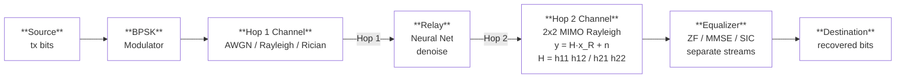

# Deep Learning for Two-Hop Relay Communication: A Comparative Study of Classical and Neural Network-Based Strategies

---

**Gil Zukerman**

A thesis submitted in partial fulfillment of the requirements for the degree of Master of Science

2026

---

## Table of Contents {.unnumbered}

**Front Matter**

| | |
|---|---|
| I | List of Abbreviations |
| II | Abstract (Hebrew) |
| III | Keywords |

**Body**

1. [Introduction and Literature Review](#introduction-and-literature-review)
   - 1.1 Cooperative Relay Communication
   - 1.2 Classical Relay Strategies
   - 1.3 Machine Learning in Wireless Communication
   - 1.4 Generative Models for Signal Processing
   - 1.5 Sequence Models: Transformers and State Space Models
   - 1.6 MIMO Systems and Equalization
   - 1.7 Research Gap and Motivation
   - 1.8 Theoretical Foundations: Channel Models
   - 1.9 Theoretical Foundations: MIMO Equalization
2. [Research Objectives](#research-objectives)
   - 2.1 Main Objective
   - 2.2 Research Hypotheses
   - 2.3 Specific Objectives
   - 2.4 Scope and Delimitations
3. [Methods](#methods)
   - 3.1 System Model
     - 3.1.1 MIMO Topology with Neural Network Relay and Equalization
   - 3.2 Channel Models
     - 3.2.1 AWGN Channel
     - 3.2.2 Rayleigh Fading Channel
     - 3.2.3 Rician Fading Channel
     - 3.2.4 Fading Coefficient Distributions
     - 3.2.5 2x2 MIMO Channel
     - 3.2.6 Channel Model Validation
   - 3.3 Relay Strategies
   - 3.4 MIMO Equalization Techniques
   - 3.5 Simulation Framework
   - 3.6 Normalized Parameter Comparison
   - 3.7 Modulation Schemes
4. [Results](#results)
   - 4.1 Channel Model Validation
   - 4.2 AWGN Channel
   - 4.3 Rayleigh Fading Channel
   - 4.4 Rician Fading Channel (K=3)
   - 4.5 2x2 MIMO with ZF Equalization
   - 4.6 2x2 MIMO with MMSE Equalization
   - 4.7 2x2 MIMO with SIC Equalization
   - 4.8 Normalized 3K-Parameter Comparison
   - 4.9 Complexity-Performance Trade-off
   - 4.10 Modulation Comparison
   - 4.11 16-QAM Activation Experiment
   - 4.12 Constellation-Aware Activation Study
   - 4.13 Input Layer Normalization and Scaled Tanh
   - 4.14 Structural CSI Injection
   - 4.15 Comprehensive Multi-Architecture CSI Experiment
   - 4.16 End-to-End Joint Optimization
   - 4.17 16-Class 2D Classification for QAM16
5. [Discussion and Conclusions](#discussion-and-conclusions)
   - 5.1 Interpretation of Results
   - 5.2 The Less is More Principle
   - 5.3 State Space vs. Attention for Signal Processing
   - 5.4 Practical Deployment Recommendations
   - 5.5 Limitations
   - 5.6 Future Work
   - 5.7 Conclusions
6. [References](#references)
7. [Appendices](#appendices)
   - Appendix A: Mathematical Notation
   - Appendix B: Model Architectures and Hyperparameters
   - Appendix C: Software Architecture
   - Appendix D: Normalized 3K-Parameter Configurations

**Back Matter**

| | |
|---|---|
| VIII | Abstract (English) |

## List of Figures {.unnumbered}

| No. | Caption | Page |
|---|---|---|
| 1 | AWGN channel — theoretical BER vs. Monte Carlo simulation for single-hop, two-hop AF, and two-hop DF | §6.2.1 |
| 2 | Rayleigh fading — theory vs. simulation for single-hop and two-hop DF | §6.2.2 |
| 3 | Rician fading (K=3) — theory vs. simulation for single-hop and two-hop DF | §6.2.3 |
| 4 | PDF and CDF of fading coefficient $|h|$ for Rayleigh and Rician ($K=1, 3, 10$) | §6.2.4 |
| 5 | 2×2 MIMO Rayleigh — single-hop BER with ZF, MMSE, and SIC equalization | §6.2.5 |
| 6 | Consolidated 2×3 grid of all channel model validations | §6.2.6 |
| 7 | Single-hop BPSK BER for all three SISO channel models | §6.2.6 |
| 8 | Constellation diagrams — BPSK, QPSK, 16-QAM, 16-PSK | §6.7 |
| 9 | AWGN channel — BER vs. SNR for all nine relay strategies with 95% CI | §7.2 |
| 10 | Rayleigh fading — BER vs. SNR for all nine relay strategies with 95% CI | §7.3 |
| 11 | Rician fading (K=3) — BER vs. SNR for all nine relay strategies with 95% CI | §7.4 |
| 12 | 2×2 MIMO with ZF equalization — BER vs. SNR for all nine relay strategies with 95% CI | §7.5 |
| 13 | 2×2 MIMO with MMSE equalization — BER vs. SNR for all nine relay strategies with 95% CI | §7.6 |
| 14 | 2×2 MIMO with MMSE-SIC equalization — BER vs. SNR for all nine relay strategies with 95% CI | §7.7 |
| 15 | Normalized 3K-parameter comparison across all channels | §7.8 |
| 16 | Normalized 3K-parameter BER comparison on AWGN | §7.8 |
| 17 | Normalized 3K-parameter BER comparison on Rayleigh fading | §7.8 |
| 18 | Normalized 3K-parameter BER comparison on Rician fading (K=3) | §7.8 |
| 19 | Complexity–performance trade-off: training time vs. parameter count vs. BER improvement | §7.9 |
| 20 | Master BER comparison — all nine relay strategies across all six channel configurations | §7.9 |
| 21 | BPSK relay comparison on AWGN channel (baseline) | §7.10 |
| 22 | BPSK relay comparison on Rayleigh fading channel (baseline) | §7.10 |
| 23 | QPSK relay comparison on AWGN channel | §7.10 |
| 24 | QPSK relay comparison on Rayleigh fading channel | §7.10 |
| 25 | 16-QAM relay comparison on AWGN channel | §7.10 |
| 26 | 16-QAM relay comparison on Rayleigh fading channel | §7.10 |
| 27 | 16-QAM activation experiment on AWGN — tanh vs. linear vs. hardtanh | §7.11 |
| 28 | 16-QAM activation experiment on AWGN | §7.11 |
| 29 | 16-QAM activation experiment on Rayleigh fading | §7.11 |
| 30 | BPSK constellation-aware activation comparison (AWGN) | §7.12 |
| 31 | BPSK constellation-aware activation comparison (Rayleigh) | §7.12 |
| 32 | QPSK constellation-aware activation comparison (AWGN) | §7.12 |
| 33 | QPSK constellation-aware activation comparison (Rayleigh) | §7.12 |
| 34 | 16-QAM constellation-aware activation comparison (AWGN) | §7.12 |
| 35 | 16-QAM constellation-aware activation comparison (Rayleigh) | §7.12 |
| 36 | Activation function shapes and derivatives | §7.12 |
| 37 | LayerNorm comparison on AWGN channel | §7.13 |
| 38 | LayerNorm comparison on Rayleigh fading channel | §7.13 |
| 39 | 16-QAM Rayleigh — all 48 neural relay variants and classical baselines with 95% CI | §7.15 |
| 40 | Top-3 neural relays vs. classical — 16-QAM Rayleigh | §7.15 |
| 41 | 16-PSK Rayleigh — all 48 neural relay variants and classical baselines with 95% CI | §7.15 |
| 42 | Top-3 neural relays vs. classical — 16-PSK Rayleigh | §7.15 |
| 43 | Training history — Mamba-2 (+LN scaled_tanh), #1 QAM16 variant | §7.15 |
| 44 | Training history — Mamba S6 (+CSI tanh), #1 PSK16 variant | §7.15 |
| 45 | Training history — Transformer (+CSI sigmoid), #2 PSK16 variant | §7.15 |
| 46 | E2E BER comparison vs. theoretical 16-QAM | §7.16 |
| 47 | E2E learned 16-point constellation | §7.16 |
| 48 | E2E training loss convergence | §7.16 |
| 49 | E2E vs. modular relay-based approaches | §7.16 |
| 50 | 16-QAM BER curves — all 14 relay variants (4-class and 16-class) plus baselines | §7.17 |
| 51 | Grouped bar chart — 4-class vs. 16-class BER at 20 dB | §7.17 |
| 52 | BER heatmap — all relay variants across SNR range | §7.17 |
| 53 | Top-3 16-class variants vs. classical AF and DF baselines | §7.17 |

## List of Tables {.unnumbered}

| No. | Caption | Page |
|---|---|---|
| 1 | BER comparison of all nine relay strategies on the AWGN channel | §7.2 |
| 2 | BER comparison on the Rayleigh fading channel (SISO) | §7.3 |
| 3 | BER comparison on the Rician fading channel with K-factor = 3 | §7.4 |
| 4 | BER comparison on 2×2 MIMO Rayleigh channel with ZF equalization | §7.5 |
| 5 | BER comparison on 2×2 MIMO Rayleigh channel with MMSE equalization | §7.6 |
| 6 | BER comparison on 2×2 MIMO Rayleigh channel with MMSE-SIC equalization | §7.7 |
| 7 | Normalized 3K BER results — AWGN channel | §7.8 |
| 8 | Normalized 3K BER results — Rayleigh fading channel | §7.8 |
| 9 | Normalized 3K BER results — Rician K=3 fading channel | §7.8 |
| 10 | Normalized 3K BER results — 2×2 MIMO ZF | §7.8 |
| 11 | Normalized 3K BER results — 2×2 MIMO MMSE | §7.8 |
| 12 | Normalized 3K BER results — 2×2 MIMO SIC | §7.8 |
| 13 | Model complexity and timing comparison | §7.9 |
| 14 | Context-length benchmark — three sequence models at $n = 255$ on CUDA | §8.3.1 |
| 15 | BER comparison across modulations — BPSK vs. QPSK vs. 16-QAM at SNR = 0, 4, 10 dB | §7.10 |
| 16 | 16-QAM BER at 16 dB — activation variant comparison (tanh vs. linear vs. hardtanh) | §7.11 |
| 17 | +InputLN parameter overhead and BER ranges for sequence models | §7.13 |
| 18 | BER comparing blind spatial tracking vs. CSI injection for 16-QAM (Rayleigh) | §7.14 |
| 19 | Top-3 neural relays and classical baselines — 16-QAM (Rayleigh, 100 MC) | §7.15 |
| 20 | Top-3 neural relays and classical baselines — 16-PSK (Rayleigh, 100 MC) | §7.15 |
| 21 | Cross-constellation comparison of top-performing neural relay strategies | §7.15 |
| 22 | Goals vs. outcomes for the comprehensive multi-architecture CSI experiment | §7.15 |
| 23 | BER comparison of E2E autoencoder vs. theoretical 16-QAM (Rayleigh fading) | §7.16 |
| 24 | 16-QAM BER at 20 dB — 4-class per-axis vs. 16-class 2D classification | §7.17 |

---

## List of Abbreviations {.unnumbered}

| Abbreviation | Full Term |
|---|---|
| AF | Amplify-and-Forward |
| AWGN | Additive White Gaussian Noise |
| BER | Bit Error Rate |
| BPSK | Binary Phase-Shift Keying |
| CGAN | Conditional Generative Adversarial Network |
| CI | Confidence Interval |
| CN | Circularly-Symmetric Complex Normal |
| CSI | Channel State Information |
| DF | Decode-and-Forward |
| GAN | Generative Adversarial Network |
| GPU | Graphics Processing Unit |
| I/Q | In-Phase / Quadrature |
| KL | Kullback–Leibler |
| LOS | Line-of-Sight |
| MLP | Multi-Layer Perceptron |
| MIMO | Multiple-Input Multiple-Output |
| MMSE | Minimum Mean Square Error |
| MRC | Maximal Ratio Combining |
| MSE | Mean Squared Error |
| NLOS | Non-Line-of-Sight |
| NN | Neural Network |
| ReLU | Rectified Linear Unit |
| QAM | Quadrature Amplitude Modulation |
| QPSK | Quadrature Phase-Shift Keying |
| RL | Reinforcement Learning |
| SIC | Successive Interference Cancellation |
| SINR | Signal-to-Interference-plus-Noise Ratio |
| SISO | Single-Input Single-Output |
| SNR | Signal-to-Noise Ratio |
| SSD | Structured State Space Duality |
| SSM | State Space Model |
| V-BLAST | Vertical Bell Laboratories Layered Space-Time |
| VAE | Variational Autoencoder |
| WGAN-GP | Wasserstein GAN with Gradient Penalty |
| ZF | Zero-Forcing |

---

## Abstract (Hebrew) {.unnumbered}

**ארכיטקטורות למידה עמוקה לתקשורת ממסר דו-קפיצתית: מחקר השוואתי של אסטרטגיות ממסר קלאסיות ומבוססות רשתות נוירונים**

חיבור זה מציג מחקר השוואתי של אסטרטגיות ממסר (relay) קלאסיות ומבוססות רשתות נוירונים עבור מערכות תקשורת שיתופית דו-קפיצתית. תשע שיטות ממסר נבדקות: שתי גישות קלאסיות — הגברה-והעברה (AF) ופענוח-והעברה (DF) — ושבע שיטות מבוססות למידה עמוקה: למידה מפוקחת (MLP מינימלי, ממסר Hybrid המתאים את עצמו לרמת ה-SNR), מודלים גנרטיביים (VAE, CGAN עם אימון WGAN-GP), וארכיטקטורות רצפים (Transformer עם קשב-עצמי רב-ראשי, Mamba S6 עם מרחב-מצבים סלקטיבי, Mamba-2 SSD עם כפל מטריצות semi-separable מקבילי).

ההערכה מבוצעת על פני שישה תצורות ערוץ: AWGN, דעיכת Rayleigh, ודעיכת Rician ($K=3$) בטופולוגיית SISO, וכן MIMO $2\times2$ עם שלוש שיטות איזון — ZF, MMSE, ו-SIC. הניסויים משתמשים באפנון BPSK עם סימולציית מונטה קרלו (100,000 ביטים לכל נקודת SNR) ורווחי סמך של 95%. ניסויי הרחבה מכסים QPSK, 16-QAM ו-16-PSK.

הממצאים המרכזיים: ראשית, ממסרים מבוססי רשתות נוירונים מראים יתרון סלקטיבי בתחום SNR נמוך ($0$–$4$ dB), בעיקר בערוצי AWGN ו-Rician ובחלק מתצורות ה-MIMO, אך יתרון זה אינו אוניברסלי. שנית, ממסר DF הקלאסי שולט בתחום SNR בינוני-גבוה ($\ge6$ dB) עם אפס פרמטרים. שלישית, מחקר מורכבות מגלה יחס U-הפוך: רשת מינימלית בת 169 פרמטרים משתווה למודלים גדולים פי 100, בעוד שמודל בן 11,201 פרמטרים מציג התאמת-יתר. השוואה מנורמלת ל-3,000 פרמטרים מראה שהפער בין הארכיטקטורות מצטמצם בקנה מידה שווה, כאשר VAE הוא בעל הביצועים הנמוכים ביותר — ממצא המעיד שמספר הפרמטרים, ולא הארכיטקטורה, הוא הגורם המשפיע העיקרי. Mamba-2 SSD מתאמן מהר ב-35% מ-Mamba S6 תוך השגת BER זהה. במערכות MIMO, MMSE עולה על ZF ו-SIC מספק שיפור נוסף.

אסטרטגיית הפריסה המומלצת היא ממסר Hybrid המשלב עיבוד AI ב-SNR נמוך עם DF ב-SNR גבוה (169 פרמטרים, כ-0.7 KB, פחות מ-3 שניות אימון). עבור אפנונים מסדר גבוה, ניסוח הממסר כ**מסווג דו-ממדי משותף** על פני כל 16 נקודות הקונסטלציה מבטל את רצפת ה-BER המבנית: שלושת הוריאנטים המובילים (VAE, Transformer, MLP) משיגים BER קרוב לאפס ב-20 dB, ומשתווים לראשונה לביצועי DF. מחקר הזרקת CSI על פני 48 וריאנטים מגלה תלות-אפנון: CSI מזיק ל-16-QAM אך מועיל ל-16-PSK. הממצא המרכזי הוא שמורכבות המודל צריכה להיות מותאמת למורכבות המשימה — ארכיטקטורות מינימליות מספיקות לממסר BPSK/QPSK, ובחירת הפרדיגמה חשובה פחות מגודל מודל נכון ורגולריזציה מתאימה.

---

## Keywords {.unnumbered}

Cooperative relay communication, multi-layer perceptron, deep learning, two-hop relay, Mamba state space model, Transformer, variational autoencoder, conditional GAN, MIMO equalization, QPSK, 16-QAM, bit error rate

---

## Introduction and Literature Review

### Cooperative Relay Communication

Cooperative relay communication is a fundamental technique in modern wireless networks that extends coverage, improves reliability, and increases throughput by employing intermediate nodes between a source and destination. The theoretical study of relay channels dates to van der Meulen's formulation in 1971 and the seminal capacity bounds of Cover and El Gamal [3], who established inner and outer bounds for the general relay channel that remain the tightest known results for many configurations. In a two-hop relay network, a source transmits a signal to a relay, which processes it and retransmits it to the destination. This architecture is central to standards such as LTE-Advanced and 5G NR, where relay nodes bridge coverage gaps and enhance cell-edge performance [1], [2].

#### Information-Theoretic Foundations

The three-terminal relay channel consists of a source $S$, a relay $R$, and a destination $D$. The capacity of this channel depends critically on the relay processing strategy $f(\cdot)$ and the channel statistics. Cover and El Gamal [3] established two fundamental capacity bounds:

**Cut-set upper bound.** The capacity of any relay channel is bounded by:

$$C \leq \max_{p(x, x_R)} \min\left\{I(X, X_R; Y_D), \; I(X; Y_R, Y_D | X_R)\right\}$$

where the first term represents the maximum rate at which the destination can receive information from both the source and relay jointly (the broadcast cut), and the second term represents the maximum rate at which the source can communicate to both the relay and destination (the multiple-access cut). The capacity is limited by the weaker of these two cuts, establishing a fundamental bottleneck principle for relay communication.

**DF achievability bound.** Under decode-and-forward, the relay fully decodes the source message and cooperates with the source to transmit a common message to the destination:

$$C_{\text{DF}} = \max_{p(x, x_R)} \min\left\{I(X; Y_R | X_R), \; I(X, X_R; Y_D)\right\}$$

This rate is achievable using block Markov encoding and backward decoding. The first term is the relay's decoding constraint (it must fully decode the source), and the second is the destination's decoding rate. DF achieves the cut-set bound when the source-relay link is stronger than the relay-destination link, making it capacity-optimal for near-source relays.

For the degraded relay channel — where the relay's observation is a degraded version of the destination's, or vice versa — Cover and El Gamal showed that the DF bound coincides with the cut-set bound, establishing the exact capacity. In the Gaussian case with equal per-hop SNR $\gamma$, the two-hop DF capacity is:

$$C_{\text{DF}}^{\text{Gaussian}} = \frac{1}{2}\log_2\left(1 + \gamma\right)$$

which equals the single-hop capacity — i.e., the relay incurs no rate penalty when the source-relay link is sufficiently strong.

#### Two-Hop Relay Model

In the half-duplex two-hop model studied in this thesis, the relay cannot transmit and receive simultaneously, and there is no direct source-destination link. The communication proceeds in two time slots:

**Slot 1 (Source → Relay):**
$$y_R = x + n_1, \quad n_1 \sim \mathcal{N}(0, \sigma^2)$$

**Slot 2 (Relay → Destination):**
$$y_D = x_R + n_2, \quad n_2 \sim \mathcal{N}(0, \sigma^2)$$

where $x \in \{-1, +1\}$ is the transmitted BPSK symbol, $y_R$ is the signal received at the relay, $x_R = f(y_R)$ is the relay's output after processing, and $y_D$ is the signal received at the destination. The noise terms are independent and identically distributed with variance $\sigma^2 = P_s / \text{SNR}$. The half-duplex constraint introduces a spectral efficiency penalty of factor 2 (since two time slots are needed per symbol), but this is a common assumption in practical relay standards and simplifies the analysis while remaining representative of many practical relay-processing scenarios.

The choice of relay processing function $f(\cdot)$ fundamentally determines system performance and is the central object of study in this thesis. Classical approaches include amplify-and-forward (AF), which simply scales the received signal, and decode-and-forward (DF), which regenerates the signal through demodulation and re-modulation. Each has well-understood performance characteristics: AF is simple but propagates noise, while DF eliminates first-hop noise but introduces error propagation when decoding fails [3].

#### Cooperative Diversity and Practical Relevance

Laneman, Tse, and Wornell [1] showed that cooperative relaying achieves spatial diversity without requiring multiple antennas at any single node. Specifically, a system with $L$ cooperating single-antenna relays can achieve a diversity order of $L + 1$, meaning the outage probability decays as $\text{SNR}^{-(L+1)}$. For a single relay ($L=1$), this yields second-order diversity — a significant improvement over the first-order diversity of point-to-point communication over fading channels.

In practical deployments, relay nodes serve several roles: (i) **range extension** for cell-edge users where the direct link is too weak, (ii) **coverage filling** in shadowed areas behind buildings or terrain, (iii) **capacity enhancement** through spatial reuse, and (iv) **energy efficiency** by reducing transmission power requirements through shorter per-hop distances. The 3GPP LTE-Advanced standard (Release 10+) defines Type I (non-transparent) and Type II (transparent) relay nodes, while 5G NR introduces integrated access and backhaul (IAB) nodes that extend this concept to millimeter-wave and sub-THz bands. The AI-based relay processing studied in this thesis is applicable to any of these deployment scenarios, as the neural network operates at the baseband processing level independently of the RF front-end and protocol layer.

The fundamental question that motivates this thesis is: can a learned relay function $f_\theta(\cdot)$ outperform the classical relay functions (AF scaling, DF regeneration) by exploiting patterns in the received signal that analytical methods do not capture? This question is particularly relevant at low SNR, where both AF (noise amplification) and DF (decoding errors) have well-known limitations, and where the non-linear decision boundary learned by a neural network may provide a substantive advantage.

### Classical Relay Strategies

**Amplify-and-Forward (AF).** The AF relay amplifies the received signal by a gain factor $G$ that normalizes the output power:

$$G = \sqrt{\frac{P_{\text{target}}}{\mathbb{E}[|y_R|^2]}}$$

The end-to-end SNR for AF relay is:

$$\text{SNR}_{\text{eff}}^{\text{AF}} = \frac{\text{SNR}_1 \cdot \text{SNR}_2}{\text{SNR}_1 + \text{SNR}_2 + 1}$$

This expression reveals a fundamental limitation: even when one hop has high SNR, the effective SNR is bottlenecked by the weaker hop. Moreover, the relay amplifies both signal and noise from the first hop, leading to noise accumulation at the destination.

**Decode-and-Forward (DF).** The DF relay demodulates the received signal, recovers the transmitted bits, and re-modulates clean symbols:

$$\hat{b}_R = \text{demod}(y_R), \quad x_R = \text{mod}(\hat{b}_R)$$

The end-to-end BER for DF is:

$$P_e^{\text{DF}} = P_{e,1} + (1 - P_{e,1}) \cdot P_{e,2}$$

where $P_{e,1}$ and $P_{e,2}$ are the BER of the first and second hops, respectively. For BPSK modulation over AWGN (real-valued noise with variance $1/\text{SNR}$), each hop's BER is $P_e = Q\left(\sqrt{\text{SNR}}\right)$. DF provides clean regeneration at high SNR but suffers from error propagation when the first-hop BER is non-negligible.

**Other Classical Relay Techniques.** Beyond AF and DF, several additional cooperative relay strategies have been proposed in the literature. **Compress-and-Forward (CF)** has the relay quantize and compress the received signal using Wyner-Ziv source coding, then forward the compressed representation to the destination, which exploits its own direct-link observation as side information to decode [3], [4]. **Compute-and-Forward (CoF)** leverages lattice codes to allow relays to decode *linear combinations* of transmitted messages rather than individual codewords; the destination then solves a system of linear equations to recover the original messages [5]. **Estimate-and-Forward (EF)** computes an MMSE estimate of the transmitted signal at the relay and forwards the soft estimate, avoiding the hard-decision errors of DF while providing a more structured output than AF. **Selective and incremental relaying** are hybrid protocols: in selective relaying the relay forwards only when it can decode correctly, while in incremental relaying the relay transmits only when the destination signals (via a feedback link) that the direct transmission has failed [1]. **Two-way relaying with network coding** allows both endpoints to transmit simultaneously to the relay, which combines the received signals (e.g., via XOR or lattice coding) and broadcasts the result back, effectively doubling spectral efficiency [6]. **Filter-and-Forward (FF)** applies a linear filter (e.g., matched filter or Wiener filter) at the relay before forwarding, providing a structured intermediate between AF's simple scaling and DF's full regeneration.

AF and DF represent the two canonical extremes of the relay processing spectrum: AF performs minimal processing (linear scaling) while DF performs maximal classical processing (full regeneration). The other techniques — CF, EF, CoF — occupy intermediate points along this spectrum. In this thesis, the AI-based relay strategies are designed to *learn* the optimal relay processing function from data, potentially discovering strategies that subsume or outperform these fixed classical schemes. The focus on AF and DF as classical baselines is therefore deliberate: they bracket the classical design space and provide clear lower and upper bounds against which the learned strategies can be evaluated. These additional relay strategies are reviewed for completeness; they are not simulated in this thesis because the studied system assumes a two-hop link without a direct source–destination path.

### Machine Learning in Wireless Communication

The application of machine learning to physical-layer wireless communication has gained significant momentum in recent years, driven by the ability of neural networks to learn complex non-linear mappings directly from data. Deep learning has been applied to channel estimation [7], signal detection [8], autoencoder-based end-to-end communication [9], and resource allocation [10]. These approaches learn complex mappings from data, potentially outperforming hand-crafted algorithms in scenarios where analytical solutions are intractable or suboptimal.

#### Theoretical Basis: Universal Approximation and Denoising

The theoretical justification for applying neural networks to relay signal processing rests on two pillars. First, the **universal approximation theorem** [23] guarantees that a feedforward network with a single hidden layer and a non-linear activation function can approximate any continuous function on a compact domain to arbitrary accuracy, given sufficient width. For relay denoising, the target function maps noisy observations to clean transmitted symbols:

$$f^*: \mathbb{R}^{2w+1} \to [-1, 1], \quad f^*(y_{i-w}, \dots, y_{i+w}) = \mathbb{E}[x_i \mid y_{i-w}, \dots, y_{i+w}]$$

This conditional expectation $f^*$ is the Bayes-optimal denoiser — it minimizes the mean squared error (MSE) over all possible estimators. For BPSK symbols corrupted by AWGN, $f^*$ reduces to the posterior mean:

$$f^*(y) = \tanh\left(\frac{y}{\sigma^2}\right)$$

which is a smooth sigmoid-like function that approaches the hard-decision signum function as $\sigma^2 \to 0$ (high SNR). A neural network with a single hidden layer and tanh output can represent this function exactly, explaining why even a 169-parameter network suffices for this task.

Second, the **bias-variance decomposition** provides a framework for understanding model complexity:

$$\mathbb{E}[(\hat{x} - x)^2] = \text{Bias}^2(\hat{x}) + \text{Var}(\hat{x}) + \sigma^2_{\text{irreducible}}$$

The irreducible noise $\sigma^2_{\text{irreducible}}$ represents the minimum achievable MSE, determined by the channel noise. Increasing model complexity (more parameters) reduces bias but increases variance. For the relay denoising task, the target function $f^*$ is simple (essentially a soft threshold), so the bias term is already small for modest networks. Adding parameters beyond this point primarily increases variance (overfitting), explaining the inverted-U relationship between model size and BER observed in this thesis.

#### Prior Work in Deep Learning for Physical-Layer Processing

Ye et al. [7] demonstrated that deep neural networks can jointly perform channel estimation and signal detection in OFDM systems, achieving near-optimal performance with lower complexity than separate estimation and detection stages. Their key insight was that the DNN implicitly learns the channel's statistical structure, eliminating the need for explicit pilot-based estimation.

Samuel et al. [8] proposed DetNet, an unfolded projected gradient descent network for MIMO detection. By unrolling iterative optimization into a fixed number of neural network layers, DetNet achieves near-maximum-likelihood detection performance with $O(N_t^2)$ complexity instead of the exponential complexity of exhaustive ML search. This demonstrates the power of incorporating domain knowledge (the iterative structure of the detection problem) into the network architecture.

Dorner et al. [9] proposed treating the entire communication system — modulator, channel, and demodulator — as an autoencoder, trained end-to-end to minimize bit error rate. This approach jointly optimizes all components, potentially discovering novel modulation and coding schemes that outperform separately designed modules. The autoencoder paradigm is conceptually related to the relay processing task: both involve learning an encoder-decoder pair that maps through a noisy channel.

Sun et al. [10] applied deep learning to the NP-hard problem of resource allocation in interference networks, demonstrating that a DNN can learn near-optimal power control policies orders of magnitude faster than conventional iterative algorithms.

#### Neural Network Relay Processing

For relay processing specifically, a supervised learning approach trains a neural network $f_\theta$ to minimize:

$$\mathcal{L}(\theta) = \frac{1}{N} \sum_{i=1}^{N} (\hat{x}_i - x_i)^2, \quad \hat{x}_i = f_\theta(y_{i-w:i+w})$$

where $\hat{x}_i = f_\theta(y_{i-w:i+w})$ is the network output based on a sliding window of $2w+1$ received symbols, and $x_i$ is the clean transmitted symbol. This window-based approach provides temporal context that enables the network to exploit statistical dependencies in the noise-corrupted signal.

The sliding window formulation is motivated by the observation that adjacent received symbols share common noise statistics and channel conditions. While AWGN noise is i.i.d. across symbols (making the window unnecessary for a single-symbol estimator), the window provides the network with a local context that helps it learn a more robust decision boundary — effectively performing a form of implicit averaging that reduces variance. For fading channels, where adjacent symbols may experience correlated fading, the window becomes even more valuable.

**Multi-SNR training** is a key design choice: by training on data generated at multiple SNR levels (5, 10, 15 dB in this thesis), the network learns a denoising function that generalizes across operating conditions rather than specializing to a single noise level. This is analogous to training a robust estimator that operates well across a range of noise variances, a concept related to minimax estimation in statistical decision theory.

A critical question in applying neural networks to relay processing is the relationship between model complexity and performance. Prior work has generally assumed that larger models yield better performance, but this assumption has not been rigorously tested in the relay communication context. The bias-variance framework predicts that for a low-complexity target function like relay denoising, performance should plateau or degrade beyond a modest model size — a prediction that this thesis confirms empirically. Understanding this relationship is essential for practical deployment, where relay nodes may have limited computational resources.

### Generative Models for Signal Processing

Generative models offer an alternative paradigm for relay signal processing. Rather than directly learning a denoising function (discriminative approach), generative models learn the distribution of clean signals $p(\mathbf{x})$ and use this knowledge to reconstruct the transmitted signal from noisy observations via Bayes' rule: $p(\mathbf{x} | \mathbf{y}) \propto p(\mathbf{y} | \mathbf{x}) p(\mathbf{x})$. The generative approach is theoretically appealing because it separates the modeling of the signal prior from the noise model, potentially enabling better generalization to unseen noise conditions.

#### Variational Autoencoders

**Variational Autoencoders (VAEs)** [11] learn a latent representation by maximizing the evidence lower bound (ELBO). The generative model posits that data $\mathbf{x}$ is generated from a latent variable $\mathbf{z} \sim p(\mathbf{z}) = \mathcal{N}(\mathbf{0}, \mathbf{I})$ through a decoder $p_\theta(\mathbf{x} | \mathbf{z})$. Since the true posterior $p(\mathbf{z} | \mathbf{x})$ is intractable, an encoder network $q_\phi(\mathbf{z} | \mathbf{x})$ approximates it. The ELBO objective is derived from the log-evidence decomposition:

$$\log p_\theta(\mathbf{x}) = \underbrace{\mathbb{E}_{q_\phi}\left[\log \frac{p_\theta(\mathbf{x}, \mathbf{z})}{q_\phi(\mathbf{z} | \mathbf{x})}\right]}_{\text{ELBO}(\theta, \phi; \mathbf{x})} + \underbrace{D_{KL}(q_\phi(\mathbf{z} | \mathbf{x}) \| p_\theta(\mathbf{z} | \mathbf{x}))}_{\geq 0}$$

Since the KL divergence is non-negative, the ELBO is a lower bound on the log-evidence. Maximizing the ELBO simultaneously trains the encoder to approximate the true posterior and the decoder to reconstruct the data. The ELBO decomposes into a reconstruction term and a regularization term:

$$\mathcal{L}_{\text{VAE}} = \underbrace{\mathbb{E}_{q_\phi(\mathbf{z}|\mathbf{x})}[\log p_\theta(\mathbf{x}|\mathbf{z})]}_{\text{Reconstruction quality}} - \underbrace{\beta \cdot D_{KL}(q_\phi(\mathbf{z}|\mathbf{x}) \| p(\mathbf{z}))}_{\text{Latent space regularity}}$$

The reconstruction term encourages the decoder to accurately reproduce the input from the latent code, while the KL term regularizes the latent space to be close to the standard Gaussian prior $p(\mathbf{z})$. The $\beta$ parameter ($\beta$-VAE) [31] controls the trade-off between reconstruction quality and latent space smoothness: $\beta < 1$ prioritizes reconstruction (beneficial for the relay task where accurate signal recovery is paramount), while $\beta > 1$ encourages disentangled latent representations.

The **reparameterization trick** enables gradient-based optimization through the stochastic sampling layer: instead of sampling $\mathbf{z} \sim q_\phi(\mathbf{z} | \mathbf{x}) = \mathcal{N}(\boldsymbol{\mu}, \text{diag}(\boldsymbol{\sigma}^2))$, the sample is expressed as $\mathbf{z} = \boldsymbol{\mu} + \boldsymbol{\sigma} \odot \boldsymbol{\epsilon}$ where $\boldsymbol{\epsilon} \sim \mathcal{N}(\mathbf{0}, \mathbf{I})$. This moves the stochasticity outside the computational graph, allowing backpropagation through the encoder.

For relay signal processing, the VAE learns a compressed latent representation of the clean signal manifold. During inference, the noisy received signal is encoded into the latent space, and the decoder maps it back to a denoised estimate. The regularized latent space provides implicit denoising: noisy inputs that map to regions far from the learned signal manifold are pulled back toward high-probability regions during decoding. However, the stochastic sampling introduces additional variance into the estimate, which can be harmful for the deterministic BPSK denoising task — a trade-off that manifests as the consistent VAE underperformance observed in this thesis.

#### Conditional Generative Adversarial Networks

**Conditional GANs (CGANs)** [12] learn signal denoising through adversarial training, building on the foundational GAN framework [14]. The original GAN formulates generative modeling as a two-player minimax game between a generator $G$ and a discriminator $D$:

$$\min_G \max_D \; \mathbb{E}_{\mathbf{x} \sim p_{\text{data}}}[\log D(\mathbf{x})] + \mathbb{E}_{\mathbf{z} \sim p_z}[\log(1 - D(G(\mathbf{z})))]$$

At the Nash equilibrium, $G$ generates samples indistinguishable from real data and $D$ outputs 1/2 everywhere. The conditional variant conditions both $G$ and $D$ on auxiliary information (the noisy signal $\mathbf{y}$), enabling the generator to learn a noise-conditioned mapping.

A fundamental challenge with the original GAN objective is **training instability**: the Jensen-Shannon divergence that the discriminator implicitly estimates can produce vanishing gradients when the generator distribution and data distribution have disjoint supports (which is common early in training). The **Wasserstein GAN (WGAN)** addresses this by replacing the JS divergence with the Earth Mover (Wasserstein-1) distance:

$$W(p_{\text{data}}, p_G) = \inf_{\gamma \in \Pi(p_{\text{data}}, p_G)} \mathbb{E}_{(\mathbf{x}, \mathbf{y}) \sim \gamma}[\|\mathbf{x} - \mathbf{y}\|]$$

The Wasserstein distance provides meaningful gradients even when distributions do not overlap, enabling stable training. By the Kantorovich-Rubinstein duality, the Wasserstein distance can be computed via a supremum over 1-Lipschitz functions, which the critic network approximates. The **gradient penalty (GP)** formulation [13] enforces the Lipschitz constraint softly by penalizing the gradient norm of the critic at interpolated points:

$$\text{GP} = \mathbb{E}_{\hat{\mathbf{x}} \sim p_{\hat{\mathbf{x}}}}\left[\left(\|\nabla_{\hat{\mathbf{x}}} D(\hat{\mathbf{x}})\|_2 - 1\right)^2\right]$$

where $\hat{\mathbf{x}} = \epsilon \mathbf{x}_{\text{real}} + (1-\epsilon) \mathbf{x}_{\text{fake}}$ with $\epsilon \sim \text{Uniform}(0, 1)$. The full WGAN-GP training objectives used in this thesis are:

$$\mathcal{L}_G = -\mathbb{E}[D(G(\mathbf{y}, \mathbf{z}), \mathbf{y})] + \lambda_{\text{L1}} \|\hat{\mathbf{x}} - \mathbf{x}\|_1$$

$$\mathcal{L}_D = \mathbb{E}[D(G(\mathbf{y}, \mathbf{z}), \mathbf{y})] - \mathbb{E}[D(\mathbf{x}, \mathbf{y})] + \lambda_{\text{GP}} \cdot \text{GP}$$

The L1 reconstruction loss in the generator objective serves a dual purpose: it provides a strong pixel-level reconstruction signal (complementing the adversarial signal which provides a distributional match), and it prevents **mode collapse** (the generator converging to a single output regardless of input). For relay denoising, the L1 term dominates at $\lambda_{\text{L1}} = 100$, making the CGAN behave primarily as a supervised denoiser with an adversarial regularizer that encourages outputs to lie on the manifold of clean signals.

#### Generative vs. Discriminative Paradigms for Relay Processing

The application of generative models to relay processing has not been extensively studied. The key question is whether the generative inductive bias — learning the data distribution rather than just the input-output mapping — provides any advantage for the relay denoising task. For BPSK, the clean signal distribution is trivially simple (a discrete distribution on $\{-1, +1\}$), suggesting that the generative overhead may not be justified. This thesis provides the first systematic comparison of VAE and CGAN-based relay processing against classical and supervised learning methods, and the results confirm that the generative paradigm provides no significant advantage (and, in the case of VAE, a consistent disadvantage) for this particular task.

### Sequence Models: Transformers and State Space Models

Recent advances in sequence modeling have produced two competing paradigms with distinct computational properties and inductive biases. Both have achieved state-of-the-art results in natural language processing, but their relative merits for physical-layer signal processing — where sequences are real-valued temporal signals rather than discrete tokens — have not been previously investigated.

#### Transformers and the Attention Mechanism

**Transformers** [15] use multi-head self-attention to capture global dependencies in sequences. The core attention mechanism computes a weighted combination of value vectors, where the weights are derived from the compatibility of query and key vectors:

$$\text{Attention}(\mathbf{Q}, \mathbf{K}, \mathbf{V}) = \text{softmax}\left(\frac{\mathbf{Q}\mathbf{K}^T}{\sqrt{d_k}}\right)\mathbf{V}$$

where $\mathbf{Q}, \mathbf{K} \in \mathbb{R}^{n \times d_k}$ and $\mathbf{V} \in \mathbb{R}^{n \times d_v}$ are obtained from the input via learned linear projections $W^Q, W^K, W^V$. The scaling factor $1/\sqrt{d_k}$ prevents the dot products from growing too large in magnitude, which would push the softmax into saturation regions with vanishing gradients.

**Multi-head attention** extends this by running $h$ parallel attention heads, each with independent projections, and concatenating their outputs:

$$\text{MultiHead}(\mathbf{X}) = \text{Concat}(\text{head}_1, \dots, \text{head}_h) W^O, \quad \text{head}_i = \text{Attention}(\mathbf{X} W_i^Q, \mathbf{X} W_i^K, \mathbf{X} W_i^V)$$

Each head can attend to different aspects of the input: for signal processing, one head might focus on the immediate neighbors (local denoising) while another captures longer-range patterns. The total parameter count for multi-head attention is $3 d_{\text{model}}^2 + d_{\text{model}}^2 = 4 d_{\text{model}}^2$ (for $Q, K, V$ projections plus the output projection).

The attention matrix $\mathbf{A} = \text{softmax}(\mathbf{Q}\mathbf{K}^T / \sqrt{d_k}) \in \mathbb{R}^{n \times n}$ computes pairwise interactions between all $n$ positions, yielding $O(n^2)$ time and memory complexity. For the 11-symbol relay window used in this thesis, this is negligible ($11^2 = 121$ entries). However, the quadratic cost becomes prohibitive for longer sequences (e.g., $n = 1000$ symbols), motivating linear-time alternatives.

**Positional encoding** is necessary because the attention mechanism is permutation-equivariant (it treats input positions symmetrically). This thesis uses sinusoidal positional encoding:

$$PE_{(pos, 2k)} = \sin(pos / 10000^{2k/d}), \quad PE_{(pos, 2k+1)} = \cos(pos / 10000^{2k/d})$$

which injects position information into the embeddings, enabling the model to distinguish between symbols at different positions in the window.

#### Structured State Space Models

Structured state space models (SSMs) [17] are a class of sequence models derived from continuous-time linear dynamical systems. The continuous-time SSM maps an input signal $u(t) \in \mathbb{R}$ to an output $y(t) \in \mathbb{R}$ through a latent state $\mathbf{x}(t) \in \mathbb{R}^N$:

$$\dot{\mathbf{x}}(t) = \mathbf{A}\mathbf{x}(t) + \mathbf{B}u(t), \quad y(t) = \mathbf{C}\mathbf{x}(t) + Du(t)$$

where $\mathbf{A} \in \mathbb{R}^{N \times N}$ governs the state dynamics, $\mathbf{B} \in \mathbb{R}^{N \times 1}$ controls input injection, $\mathbf{C} \in \mathbb{R}^{1 \times N}$ is the output projection, and $D \in \mathbb{R}$ is the feedthrough. The connection to classical signal processing is immediate: this is a linear time-invariant (LTI) filter, and the state space dimension $N$ determines the order of the filter (number of poles/zeros in the transfer function).

To process discrete-time sequences, the continuous SSM is **discretized** using a step size $\Delta > 0$. Applying the zero-order hold (ZOH) discretization:

$$\bar{\mathbf{A}} = \exp(\Delta \mathbf{A}), \quad \bar{\mathbf{B}} = (\Delta \mathbf{A})^{-1}(\exp(\Delta \mathbf{A}) - \mathbf{I}) \cdot \Delta \mathbf{B} \approx \Delta \mathbf{B}$$

yields the discrete recurrence:

$$\mathbf{x}_k = \bar{\mathbf{A}} \mathbf{x}_{k-1} + \bar{\mathbf{B}} u_k, \quad y_k = \mathbf{C} \mathbf{x}_k + D u_k$$

The **HiPPO (High-order Polynomial Projection Operators)** framework provides a principled initialization for $\mathbf{A}$: the HiPPO-LegS matrix is designed so that the state $\mathbf{x}_k$ stores a compressed representation of the input history as coefficients of a Legendre polynomial expansion. This initialization enables long-range memory without the vanishing gradient problems of standard RNNs.

The S4 model [17] introduced the key insight that structured (diagonal or low-rank) parameterizations of $\mathbf{A}$ enable efficient computation. With a diagonal $\mathbf{A} = \text{diag}(a_1, \dots, a_N)$, the recurrence decouples into $N$ independent scalar recurrences, each computable in $O(n)$ time. The total cost is $O(nN)$ for a length-$n$ sequence with state dimension $N$ — linear in sequence length.

#### Mamba: Selective State Spaces

**Mamba** [16] extends the SSM framework by making the parameters **input-dependent** (selective), transforming the LTI system into a linear time-varying (LTV) system:

$$\Delta_k = \text{softplus}(W_\Delta u_k + b_\Delta), \quad \mathbf{B}_k = W_B u_k, \quad \mathbf{C}_k = W_C u_k$$

where $W_\Delta, W_B, W_C$ are learned projection matrices. The selectivity mechanism allows the model to dynamically control which inputs are stored in the state and which are forgotten:

- A **large $\Delta_k$** (triggered by a relevant input) makes $\bar{\mathbf{A}}_k = \exp(\Delta_k \mathbf{A}) \approx \mathbf{0}$, which resets the state and allows the new input to dominate via $\bar{\mathbf{B}}_k \approx \Delta_k \mathbf{B}_k$.
- A **small $\Delta_k$** (triggered by irrelevant or noisy input) makes $\bar{\mathbf{A}}_k \approx \mathbf{I}$, preserving the current state and ignoring the input.

For relay signal processing, this selective mechanism is particularly well-suited: the model can learn to attend to the actual signal component of each received sample while suppressing the noise component, effectively implementing an **adaptive filter** whose coefficients are conditioned on the input. This is a more general form of the Wiener filter, which is the optimal LTI denoiser but cannot adapt its coefficients on a per-sample basis.

The Mamba architecture wraps the selective S6 layer in a gated architecture: the input is projected to $2 \times d_{\text{inner}}$ channels (expand factor 2), and split into two branches. The main branch passes through a causal 1D convolution (Conv1D) to mix local temporal context, followed by a SiLU activation and the S6 selective scan. The second branch acts as a SiLU gate. The two branches are then multiplicatively merged and contracted back to $d_{\text{model}}$. This gating mechanism provides a multiplicative interaction that helps the model learn sharp non-linear decision boundaries.

#### Mamba-2: Structured State Space Duality

**Mamba-2 (SSD)** [18] reformulates the selective state space model through an algebraic duality between linear recurrences and structured matrix multiplications. The key theoretical insight is that the SSM output can be expressed as:

$$y_i = \sum_{j \leq i} \mathbf{C}_i^\top \left(\prod_{k=j+1}^{i} \bar{\mathbf{A}}_k\right) \mathbf{B}_j u_j$$

Defining the **SSM matrix** $M \in \mathbb{R}^{n \times n}$ with entries:

$$M_{ij} = \begin{cases} \mathbf{C}_i^\top \bar{\mathbf{A}}_{j+1:i} \mathbf{B}_j & i \geq j \\ 0 & i < j \end{cases}$$

the output is $\mathbf{y} = M \cdot (\mathbf{B} \odot \mathbf{u})$. The matrix $M$ is lower-triangular (causal) and **semi-separable** (each entry factors as an outer product of left and right vectors with a diagonal product in between). This algebraic structure enables efficient chunk-parallel computation:

1. **Divide** the sequence into chunks of length $L$.
2. **Within each chunk**, build the $L \times L$ local SSM matrix and compute the output via a single batched matrix multiply.
3. **Between chunks**, propagate the state once per chunk (rather than once per time step).

The per-chunk cost is $O(L^2 N)$ for matrix construction and $O(L^2 d)$ for the matrix-vector product, where $N$ is the state dimension and $d$ is the model dimension. With $n/L$ chunks, the total cost is $O(n \cdot L \cdot N + n \cdot L \cdot d)$, which for small $L$ (e.g., $L = 8$ or $L = 32$) is effectively $O(n)$ with a favorable constant. The critical advantage over S6 is that the intra-chunk computation is **fully parallel** — a batched matmul rather than a sequential scan — making it much faster on GPUs where parallelism is cheap and sequential operations incur kernel-launch overhead.

The "duality" in the name refers to the equivalence between the recurrent view (state propagation) and the matrix view (structured matmul): the same computation can be expressed either way, and the implementation can choose whichever is more efficient for the hardware and sequence length. This thesis demonstrates this duality empirically: at $n = 11$, the recurrent S6 view is faster; at $n = 255$, the matrix SSD view dominates.

#### State Space Models for Signal Processing

The application of state space models to physical-layer signal processing is largely unexplored. Classical signal processing relies extensively on LTI state space models (Kalman filters, Wiener filters), and the SSM framework provides a natural neural extension of these classical tools. The connection is direct: a trained SSM with fixed (input-independent) parameters implements a learnable linear filter, while the selective Mamba variant implements a learnable *adaptive* filter. For the relay denoising task, this means Mamba can potentially learn the optimal filter structure from data, without requiring manual specification of filter order, cutoff frequencies, or adaptation algorithms.

This thesis presents the first comparison of Mamba S6, Mamba-2 (SSD), and Transformers for relay communication, demonstrating that state space models are well suited to this domain and that the SSD formulation of Mamba-2 yields significant speed advantages at longer context lengths.

### MIMO Systems and Equalization

Multiple-input multiple-output (MIMO) systems employ multiple antennas at both transmitter and receiver to exploit spatial multiplexing and diversity gains [19]. The theoretical foundation was established by Telatar [26] and Foschini [27], who independently showed that the ergodic capacity of an $N_t \times N_r$ MIMO channel with independent Rayleigh fading scales as:

$$C = \mathbb{E}\left[\log_2 \det\left(\mathbf{I}_{N_r} + \frac{\text{SNR}}{N_t}\mathbf{H}\mathbf{H}^H\right)\right]$$

For the $2 \times 2$ system used in this thesis, this yields approximately $C \approx 2\log_2(1 + \text{SNR}/2)$ at high SNR — a doubling of the SISO capacity, achieved by transmitting independent data streams on each antenna.

#### System Model

In a $2 \times 2$ MIMO system, the received signal is:

$$\mathbf{y} = \mathbf{H}\mathbf{x} + \mathbf{n}$$

where $\mathbf{H} \in \mathbb{C}^{2 \times 2}$ is the channel matrix with $H_{ij} \sim \mathcal{CN}(0, 1)$ (independent Rayleigh fading per link), $\mathbf{x} \in \mathbb{C}^{2}$ is the transmitted symbol vector with $\mathbb{E}[\mathbf{x}\mathbf{x}^H] = (P/N_t)\mathbf{I}$, and $\mathbf{n} \sim \mathcal{CN}(\mathbf{0}, \sigma^2\mathbf{I})$ is noise. The per-antenna SNR is $\text{SNR} = P/(N_t \sigma^2)$.

The fundamental trade-off in MIMO systems is between spatial multiplexing gain (transmitting multiple independent streams) and diversity gain (transmitting redundant copies to combat fading). Zheng and Tse [28] formalized this as the diversity-multiplexing tradeoff (DMT): for an $N_t \times N_r$ system at multiplexing gain $r$, the maximum achievable diversity order is $d(r) = (N_t - r)(N_r - r)$. In the $2 \times 2$ case at full spatial multiplexing ($r = 2$), $d = 0$ — meaning no diversity protection and the system is interference-limited. This makes the choice of equalization method critical.

#### Equalization Methods

Equalization at the receiver aims to recover $\mathbf{x}$ from $\mathbf{y}$ in the presence of inter-stream interference. Three methods of increasing sophistication are employed in this thesis:

**Zero-Forcing (ZF).** The ZF equalizer applies the pseudo-inverse of the channel:

$$\hat{\mathbf{x}}_{\text{ZF}} = (\mathbf{H}^H\mathbf{H})^{-1}\mathbf{H}^H\mathbf{y} = \mathbf{x} + (\mathbf{H}^H\mathbf{H})^{-1}\mathbf{H}^H\mathbf{n}$$

This completely eliminates inter-stream interference but amplifies noise. The post-equalization SNR for stream $k$ is:

$$\text{SNR}_k^{\text{ZF}} = \frac{\text{SNR}}{[(\mathbf{H}^H\mathbf{H})^{-1}]_{kk}}$$

When $\mathbf{H}$ is ill-conditioned (i.e., its singular values are disparate), the diagonal elements of $(\mathbf{H}^H\mathbf{H})^{-1}$ become large, severely degrading performance. ZF achieves a diversity order of $d = N_r - N_t + 1 = 1$ for the $2 \times 2$ case [19], meaning it provides minimal diversity protection and its BER decays as $1/\text{SNR}$.

**Minimum Mean Square Error (MMSE).** The MMSE equalizer minimizes $\mathbb{E}[\|\hat{\mathbf{x}} - \mathbf{x}\|^2]$, yielding the Wiener filter:

$$\hat{\mathbf{x}}_{\text{MMSE}} = (\mathbf{H}^H\mathbf{H} + \sigma^2\mathbf{I})^{-1}\mathbf{H}^H\mathbf{y}$$

The regularization term $\sigma^2\mathbf{I}$ prevents noise amplification by biasing the estimate toward zero when the channel is weak. The post-equalization SINR for stream $k$ is:

$$\text{SINR}_k^{\text{MMSE}} = \frac{1}{[(\mathbf{H}^H\mathbf{H} + \sigma^2\mathbf{I})^{-1}]_{kk}} - 1$$

At low SNR, MMSE significantly outperforms ZF because it avoids noise amplification; at high SNR ($\sigma^2 \to 0$), the MMSE filter converges to the ZF solution. Crucially, MMSE achieves the same diversity order as ZF ($d = 1$) but with a superior coding gain, meaning it provides a constant SNR advantage across the entire operating range [29].

**Successive Interference Cancellation (SIC).** SIC is a non-linear detection technique that exploits the layered structure of spatial multiplexing. The MMSE-ordered V-BLAST algorithm [20], [27] proceeds as follows:

1. **Order** streams by post-MMSE SINR: detect the strongest stream first.
2. **Detect** stream $k$ using the MMSE filter on the residual observation.
3. **Cancel** the contribution of stream $k$: $\mathbf{y} \leftarrow \mathbf{y} - \mathbf{h}_k \hat{x}_k$.
4. **Repeat** for the remaining stream(s) with a reduced-dimension channel.

The key advantage is that after perfect cancellation, the second stream sees an interference-free channel with MMSE filtering, yielding higher post-detection SINR. For a $2 \times 2$ system, the first detected stream achieves diversity order $d_1 = N_r - N_t + 1 = 1$, while the second stream (after cancellation) achieves $d_2 = N_r = 2$ [28]. This gives an average diversity order strictly better than linear equalizers.

However, SIC is vulnerable to **error propagation**: if the first stream is decoded incorrectly, the residual interference from the incorrect cancellation degrades the second stream. This effect is most pronounced at low SNR, where the first-stream BER is high. MMSE-ordered detection mitigates this by choosing the most reliable stream first, but cannot eliminate it entirely [30].

#### MIMO with Relay Processing

In the two-hop relay architecture studied in this thesis, MIMO equalization operates at the destination *after* Hop 2, while the neural network relay operates at the intermediate node *after* Hop 1. These are independent signal-processing stages that solve different problems: the relay denoises the scalar (SISO) or per-antenna signal, while the equalizer separates spatially multiplexed streams. The combined system applies relay processing first (per-antenna denoising), then MIMO equalization at the destination.

Combining AI-based relay processing with MIMO equalization has not been studied in the literature. A key question is whether AI relays that excel in the SISO setting maintain their advantage when cascaded with linear or non-linear MIMO equalizers. This thesis evaluates all nine relay strategies across all three equalization methods, providing the first systematic study of this interaction.

### Research Gap and Motivation

Despite growing interest in AI for wireless communication, a systematic comparison of relay processing paradigms — spanning classical signal processing, supervised learning, generative modeling, and modern sequence architectures — is absent from the literature. The following specific gaps motivate this thesis:

**Gap 1: No cross-paradigm relay comparison.** Existing work on AI-based relay processing focuses on individual architectures in isolation. Ye et al. [7] demonstrated DNNs for OFDM detection, Dorner et al. [9] explored autoencoders for end-to-end communication, and Samuel et al. [8] applied unfolded networks to MIMO detection. However, no study systematically compares supervised feedforward networks, variational autoencoders, adversarial networks, attention-based Transformers, and state space models (Mamba) for the same relay denoising task under controlled conditions. Without such a comparison, practitioners cannot make informed architecture selections.

**Gap 2: Model complexity–performance relationship is unknown.** It is commonly assumed that larger neural networks yield better performance. However, the relay denoising task — recovering a BPSK symbol from a noisy observation — is a low-dimensional mapping problem. The theoretical minimum description length for this mapping is small (a soft threshold function), suggesting that large models may overfit. No prior work has rigorously characterized the complexity–performance trade-off for relay processing, nor has a normalized (equal-parameter) comparison been conducted to isolate architectural effects from capacity effects.

**Gap 3: Limited channel diversity in evaluations.** Most AI-for-wireless studies evaluate on a single channel model (typically AWGN or Rayleigh). The performance of AI relays under Rician fading, MIMO spatial multiplexing, and different equalization strategies has not been studied. Whether AI relays trained on one channel generalize to others — and whether their advantage over classical methods persists across diverse propagation conditions — are open questions.

**Gap 4: State space models for physical-layer signal processing.** The Mamba architecture [16] and its Mamba-2 SSD variant [18] have demonstrated strong performance in NLP and genomics, but their application to physical-layer wireless communication is entirely unexplored. The theoretical connection between SSMs and classical adaptive filters makes this a natural research direction, but empirical validation is needed.

**Gap 5: AI relay–MIMO equalization interaction.** While MIMO equalization (ZF, MMSE, SIC) and AI-based processing have been studied independently, their **joint** effect in a relay pipeline — where the relay denoises the signal before equalization separates the spatial streams — has not been investigated. Whether the gains from better relay processing and better equalization are additive, synergistic, or partially redundant is unknown.

The following table summarizes the positioning of this work relative to the literature:

| Aspect | Prior Work | This Thesis |
|---|---|---|
| Relay strategies compared | 1–2 (typically AF vs. DF, or one AI method) | 9 (2 classical + 7 AI) |
| AI paradigms | Single (e.g., supervised only) | 4 (supervised, generative, adversarial, sequential) |
| Channel models | 1–2 (AWGN, sometimes Rayleigh) | 6 (AWGN + Rayleigh + Rician SISO; MIMO ZF/MMSE/SIC) |
| Complexity analysis | None | Normalized 3K comparison + inverted-U study |
| State space models | None for relay/physical-layer | Mamba S6, Mamba-2 SSD, with crossover benchmark |
| Statistical rigor | Often missing | Wilcoxon test, 95% CI, 10 trials per point |

This thesis addresses all five gaps through a unified framework that implements and compares nine relay strategies across six channel/topology configurations, with both original and normalized parameter counts, full statistical analysis, and a dedicated complexity study.

---

## Research Objectives

### Main Objective

To systematically evaluate and compare classical and AI-based relay strategies for two-hop cooperative communication, and to determine the optimal relay architecture as a function of channel conditions, SNR regime, and computational constraints.

### Research Hypotheses

Based on the theoretical analysis in Section 4, this thesis tests the following hypotheses:

**H1 (Selective AI advantage at low SNR).** Some AI-based relay strategies achieve lower BER than AF and, on selected channels, lower BER than DF at low SNR (0–4 dB), where the non-linear denoising learned by the neural network may provide an advantage over AF's noise amplification and DF's hard-decision errors.

*Rationale:* At low SNR, the Bayes-optimal relay function $f^*(y) = \tanh(y/\sigma^2)$ is a smooth non-linear mapping that differs substantially from both AF's linear scaling and DF's hard sign function. A neural network can approximate $f^*$ closely, while the classical methods cannot.

**H2 (DF dominance at high SNR).** The DF relay achieves the lowest BER at medium-to-high SNR ($\geq 6$ dB), outperforming all AI methods.

*Rationale:* At high SNR, $f^*(y) \approx \text{sign}(y)$, which is exactly the DF operation. AI relays introduce a small but non-zero approximation error, so DF should be optimal in this regime.

**H3 (Inverted-U complexity curve).** There exists an optimal model size for relay denoising beyond which performance degrades due to overfitting. Specifically, models with $\sim$100–200 parameters achieve performance comparable to models with 10–100$\times$ more parameters.

*Rationale:* The bias-variance analysis (Section 1.3.1) predicts that the low-complexity target function $f^*$ requires minimal model capacity. Excess capacity increases variance without reducing bias.

**H4 (Architecture convergence at equal scale).** When all AI models are normalized to the same parameter count ($\sim$3,000), the performance differences between architectures narrow significantly, indicating that parameter count is a more important factor than architectural choice.

*Rationale:* All architectures are universal approximators and the target function is simple. At equal capacity, architectural inductive biases provide diminishing returns.

**H5 (SSM speed advantage at long context).** Mamba-2 SSD trains significantly faster than Mamba S6 at longer context lengths ($n \gg 11$) due to chunk-parallel computation, while S6 is faster at the short relay window ($n = 11$).

*Rationale:* The crossover between sequential S6 ($O(n)$ serial steps) and chunk-parallel SSD ($O(n/L)$ parallel matmuls of size $L$) depends on the ratio of kernel-launch overhead to arithmetic cost.

**H6 (Equalization gains are additive to relay gains).** The BER improvement from better equalization (ZF $\to$ MMSE $\to$ SIC) and the improvement from better relay processing (AF $\to$ AI) are approximately additive in the dB domain.

*Rationale:* The relay operates on Hop 1 (denoising) and the equalizer operates on Hop 2 (stream separation). Since these are independent processing stages, their contributions to BER reduction should be approximately independent.

### Specific Objectives

1. **Implement and compare nine relay strategies** spanning four learning paradigms: no learning (AF, DF), supervised learning (MLP, Hybrid), generative modeling (VAE, CGAN), and sequence modeling (Transformer, Mamba S6, Mamba-2 SSD).

2. **Evaluate across six channel/topology configurations:** AWGN, Rayleigh fading, and Rician fading (K=3) channels in SISO topology, and 2×2 MIMO Rayleigh with ZF, MMSE, and SIC equalization.

3. **Investigate the complexity–performance trade-off** by testing model architectures ranging from 0 parameters (classical) to 26,179 parameters (Mamba-2 SSD), and by conducting a normalized comparison at approximately 3,000 parameters.

4. **Determine whether state space models outperform attention mechanisms** for relay signal processing by comparing Mamba S6 and Transformer architectures at both original and normalized parameter counts, and by benchmarking at extended context lengths.

5. **Identify practical deployment recommendations** for selecting the appropriate relay strategy given specific operational constraints (SNR range, computational budget, channel environment).

### Scope and Delimitations

The following delimitations define the scope of this study:

- **Modulation:** Primary experiments use BPSK. Extension experiments with QPSK and 16-QAM are presented in Section 4.10, and 16-PSK in Section 4.15, to evaluate hypothesis generalisability; however, 64-QAM and higher-order constellations are deferred to future work.
- **Channel knowledge:** Perfect CSI is assumed at the receiver. Channel estimation errors are not modeled.
- **Relay topology:** Single relay, two-hop, half-duplex. Multi-relay and full-duplex configurations are excluded.
- **MIMO configuration:** $2 \times 2$ spatial multiplexing with Rayleigh fading. Larger arrays and beamforming are not considered.
- **Training regime:** Offline training on synthetic data. Online adaptation is not implemented.

These delimitations are chosen to enable a clean comparison of relay processing functions in isolation, without confounding factors from protocol-level or system-level complexity.

---

## Methods

### System Model

The system under study is a two-hop relay network with a single relay node:

**Figure: Two-hop relay system model.** Source bits are BPSK-modulated, passed through Hop 1 (SISO channel), processed by the relay (classical or neural), then transmitted over Hop 2 (2×2 MIMO Rayleigh channel) and equalized at the destination.

$$\text{Source} \xrightarrow{\text{Hop 1}} \text{Relay} \xrightarrow{\text{Hop 2}} \text{Destination}$$

**Modulation.** The primary experiments use Binary Phase-Shift Keying (BPSK), where bits $b \in \{0, 1\}$ are mapped to real symbols $x = 1 - 2b \in \{-1, +1\}$. To test whether the findings generalise to complex constellations, the evaluation is extended to Quadrature Phase-Shift Keying (QPSK), 16-point Quadrature Amplitude Modulation (16-QAM), and 16-point Phase-Shift Keying (16-PSK). Full definitions, bit-mappings, and constellation diagrams for all four schemes are unified and detailed in Section 3.7.

**Hop Model.** Each hop applies a channel function followed by optional equalization:

$$y = h(x, \text{SNR}) + n$$

where $h(\cdot)$ depends on the specific channel type (AWGN, fading, or MIMO).

**Power Normalization.** All relay strategies normalize their output power to ensure fair comparison:

$$x_R \leftarrow x_R \cdot \sqrt{\frac{P_{\text{target}}}{P_{\text{current}}}}$$

#### MIMO Topology with Neural Network Relay and Equalization

An important distinction in this work is the separation of three independent signal-processing functions that operate at different stages of the relay pipeline and solve fundamentally different problems:

1. **Channel type** (AWGN, Rayleigh, Rician) — defines the physical propagation environment on each link.
2. **Neural network relay** — denoises the signal at the intermediate relay node after Hop 1.
3. **MIMO equalizer** (ZF, MMSE, SIC) — separates spatially multiplexed streams at the destination after Hop 2.

These three components combine in the following end-to-end signal flow:

```mermaid
flowchart LR
    SRC(["**Source**\ntx bits"])
    MOD["**BPSK**\nModulator"]
    CH1["**Hop 1 Channel**\nAWGN / Rayleigh / Rician"]
    REL["**Relay**\nNeural Net\ndenoise Hop 1 noise"]
    CH2["**Hop 2 Channel**\n2x2 MIMO · 4 Rayleigh links\ny = H·x_R + n\nH = &#91;h₁₁ h₁₂&#93; / &#91;h₂₁ h₂₂&#93;"]
    EQ["**Equalizer**\nZF / MMSE / SIC\ncancel inter-stream interference"]
    DST(["**Destination**\nrecovered bits"])

    SRC --> MOD
    MOD -->|"tx symbol x"| CH1
    CH1 -->|"Hop 1\nnoisy y_R"| REL
    REL -->|"Hop 2\nclean x_R"| CH2
    CH2 -->|"mixed streams\ny = Hx_R + n"| EQ
    EQ --> DST

    style SRC  fill:#4A90D9,color:#fff,stroke:#2c5f8a,rx:20
    style DST  fill:#4A90D9,color:#fff,stroke:#2c5f8a,rx:20
    style MOD  fill:#7B68EE,color:#fff,stroke:#4a3fa0
    style CH1  fill:#E8A838,color:#fff,stroke:#b07820
    style REL  fill:#2ECC71,color:#fff,stroke:#1a8a4a
    style CH2  fill:#E8A838,color:#fff,stroke:#b07820
    style EQ   fill:#9B59B6,color:#fff,stroke:#6c3483
```

**Figure 1 — End-to-end two-hop relay signal flow.** The relay's neural network solves a *denoising* problem (Hop 1 noise removal); the MIMO equalizer solves an *interference cancellation* problem (Hop 2 stream separation). The two stages are independent and their gains are additive.

**The relay's neural network** operates on Hop 1 and solves a **denoising** problem. Each antenna at the relay receives:

$$y_R = x + n_1, \quad n_1 \sim \mathcal{N}(0, \sigma^2)$$

The neural network processes a sliding window of received samples and outputs a cleaner estimate $\hat{x}_R = f_\theta(y_{R,i-w:i+w})$. This is purely a noise-removal task — there is no inter-stream interference at this stage.

**The MIMO topology** applies to Hop 2, where the relay retransmits using 2 TX antennas and the destination has 2 RX antennas. Each of the 4 TX–RX antenna pairs experiences an independent Rayleigh fading channel ($H_{ij} \sim \mathcal{CN}(0,1)$), creating **inter-stream interference**:

$$\begin{aligned}
y_1 &= h_{11} x_{R,1} + h_{12} x_{R,2} + n_1 \\
y_2 &= h_{21} x_{R,1} + h_{22} x_{R,2} + n_2
\end{aligned}$$

Each RX antenna sees a **mixture** of both transmitted streams — this mixing is the inter-stream interference that the equalizer must undo.

**The equalizer** at the destination solves an **interference cancellation** problem, not a denoising problem:

| Component | Problem Solved | Location | Input → Output |
|---|---|---|---|
| Neural network relay | Remove **noise** from Hop 1 | Relay node | Noisy signal → clean estimate |
| MIMO equalizer | Remove **inter-stream interference** | Destination | Mixed streams → separated symbols |

The three equalizer options trade off complexity for performance:

- **ZF** ($\hat{\mathbf{x}} = \mathbf{H}^{-1}\mathbf{y}$): Inverts $\mathbf{H}$ exactly — removes all interference but **amplifies noise**.
- **MMSE** ($\hat{\mathbf{x}} = (\mathbf{H}^H\mathbf{H} + \sigma^2\mathbf{I})^{-1}\mathbf{H}^H\mathbf{y}$): Adds regularization $\sigma^2\mathbf{I}$ — **trades residual interference for less noise amplification**.
- **SIC**: Detects the strongest stream first via MMSE, cancels its contribution, then detects the remaining stream interference-free. This **non-linear** technique eliminates interference sequentially.

The gains from better relay processing and better equalization are **additive and independent**: a better relay (e.g., Mamba S6 vs. AF) reduces the noise entering Hop 2, while a better equalizer (e.g., SIC vs. ZF) more effectively separates the spatially multiplexed streams. Combining the best relay with the best equalizer yields the lowest overall BER, as confirmed by the results in Section 7.

This architecture reflects practical 5G NR relay deployments, where the relay node performs baseband processing (potentially AI-assisted) and the destination's MIMO receiver applies standard equalization algorithms independently.

### Channel Models

This section presents the theoretical BER analysis for each channel model used in this study, derives the closed-form expressions, and validates them against Monte Carlo simulation. The theoretical–simulative comparison serves two purposes: (i) it verifies the correctness of the simulation framework, and (ii) it establishes the baseline performance that AI relays must beat.

#### AWGN Channel — Theoretical Analysis

The AWGN channel adds zero-mean Gaussian noise to the transmitted signal:

$$y = x + n, \quad n \sim \mathcal{N}(0, \sigma^2), \quad \sigma^2 = \frac{P_s}{\text{SNR}_{\text{linear}}}$$

where $P_s = \mathbb{E}[|x|^2] = 1$ for unit-power BPSK symbols. The noise variance is inversely proportional to the linear SNR.

**Single-hop BER.** For BPSK $\pm 1$ symbols and real-valued AWGN with variance $\sigma^2 = 1/\text{SNR}$, an error occurs when the noise pushes the received sample past the decision boundary at the origin. The theoretical BER is:

$$P_e^{\text{AWGN}} = Q\!\left(\frac{1}{\sigma}\right) = Q\left(\sqrt{\text{SNR}}\right) = \frac{1}{2}\,\text{erfc}\!\left(\sqrt{\frac{\text{SNR}}{2}}\right)$$

where $Q(x) = \frac{1}{2}\text{erfc}(x/\sqrt{2})$ is the Gaussian Q-function and $\text{SNR} = P_s / \sigma^2$ is the ratio of signal power to noise variance.

> **Noise-convention note.** The standard textbook result $P_e = Q(\sqrt{2 E_b/N_0})$ assumes that the one-sided noise PSD is $N_0$, giving a baseband noise variance of $N_0/2$ per real dimension. In our AWGN implementation the noise is purely real with variance $\sigma^2 = P_s/\text{SNR}$, so $N_0 = 2\sigma^2 = 2P_s/\text{SNR}$ and $E_b/N_0 = \text{SNR}/2$. Substituting yields $Q(\sqrt{2 \cdot \text{SNR}/2}) = Q(\sqrt{\text{SNR}})$, which is the expression used throughout this work.
>
> By contrast, the fading channels add **complex** Gaussian noise with total power $1/\text{SNR}$ (i.e. $\sigma_I^2 = \sigma_Q^2 = 1/(2\,\text{SNR})$) and extract the real part after ZF equalization, halving the effective noise variance per decision dimension. This naturally introduces a factor of 2 inside the Q-function argument for all fading-channel BER expressions (Sections 6.2.2–6.2.5), making them consistent with the standard textbook forms.

**Two-hop DF BER.** For a decode-and-forward relay with equal-SNR hops, an error occurs at the destination if exactly one hop introduces an error:

$$P_e^{\text{DF}} = P_{e,1} + P_{e,2} - 2P_{e,1}P_{e,2}$$

With equal hops ($P_{e,1} = P_{e,2} = P_e^{\text{AWGN}}$), this becomes $P_e^{\text{DF}} = 2P_e(1 - P_e)$. At high SNR, $P_e \ll 1$ and $P_e^{\text{DF}} \approx 2P_e$, i.e., the two-hop penalty is approximately a factor of 2 in BER.

**Two-hop AF BER.** For amplify-and-forward with equal-SNR hops, the effective end-to-end SNR is:

$$\text{SNR}_{\text{eff}}^{\text{AF}} = \frac{\text{SNR}_1 \cdot \text{SNR}_2}{\text{SNR}_1 + \text{SNR}_2 + 1} = \frac{\gamma^2}{2\gamma + 1}$$

where $\gamma = \text{SNR}$ is the per-hop SNR. The resulting BER is $P_e^{\text{AF}} = Q\left(\sqrt{\text{SNR}_{\text{eff}}}\right)$ (same real-noise convention as the single-hop case). At high SNR, $\text{SNR}_{\text{eff}} \approx \gamma/2$, confirming the well-known 3 dB penalty of AF relaying.

*Figure 1: AWGN channel — theoretical BER (solid lines) vs. Monte Carlo simulation (markers with 95% CI) for single-hop, two-hop AF, and two-hop DF.*

#### Rayleigh Fading Channel — Theoretical Analysis

The Rayleigh fading channel models non-line-of-sight (NLOS) propagation where the signal undergoes multiplicative fading:

$$y = hx + n, \quad h \sim \mathcal{CN}(0, 1), \quad n \sim \mathcal{CN}(0, \sigma^2)$$

The fading coefficient $h$ is a circularly-symmetric complex Gaussian random variable, so its magnitude $|h|$ follows a Rayleigh distribution:

$$f_{|h|}(r) = 2r \cdot e^{-r^2}, \quad r \geq 0$$

with $\mathbb{E}[|h|^2] = 1$ (unit average power). The instantaneous SNR after equalization ($\hat{x} = y/h$) becomes $\gamma_h = |h|^2 \cdot \text{SNR}$, which is exponentially distributed.

**Single-hop BER.** Averaging the conditional BER $P_e(\gamma_h) = Q(\sqrt{2\gamma_h})$ over the exponential distribution of $\gamma_h$ yields the closed-form [21, Eq. 14-4-15]:

$$P_e^{\text{Rayleigh}} = \frac{1}{2}\left(1 - \sqrt{\frac{\bar{\gamma}}{1 + \bar{\gamma}}}\right)$$

where $\bar{\gamma} = \text{SNR}$ is the average SNR. At high SNR ($\bar{\gamma} \gg 1$):

$$P_e^{\text{Rayleigh}} \approx \frac{1}{4\bar{\gamma}}$$

This $1/\text{SNR}$ decay is fundamentally slower than the exponential decay of AWGN ($Q(\sqrt{\gamma}) \sim e^{-\gamma/2}$), explaining why Rayleigh fading is significantly more challenging. The channel is **diversity-limited**: deep fades (where $|h| \approx 0$) cause errors regardless of the average SNR. This is a primary motivation for MIMO systems, which exploit spatial diversity to combat fading.

**Two-hop DF BER.** The two-hop DF relay over Rayleigh fading follows the same composition rule as AWGN:

$$P_e^{\text{DF,Rayleigh}} = 2P_e^{\text{Rayleigh}}(1 - P_e^{\text{Rayleigh}})$$

*Figure 2: Rayleigh fading — theory vs. simulation for single-hop and two-hop DF. The characteristic $1/\text{SNR}$ slope (compared to the steeper exponential AWGN curve) is clearly visible.*

#### Rician Fading Channel — Theoretical Analysis

The Rician fading channel models environments with a dominant line-of-sight (LOS) component alongside scattered multipath:

$$h = \sqrt{\frac{K}{K+1}} e^{j\theta} + \sqrt{\frac{1}{K+1}} h_{\text{scatter}}, \quad h_{\text{scatter}} \sim \mathcal{CN}(0, 1)$$

The K-factor is the ratio of LOS power to scatter power. The fading amplitude $|h|$ follows a Rician distribution:

$$f_{|h|}(r) = \frac{r}{\sigma^2} \exp\left(-\frac{r^2 + \nu^2}{2\sigma^2}\right) I_0\left(\frac{r\nu}{\sigma^2}\right)$$

where $\nu = \sqrt{K/(K+1)}$ is the LOS amplitude, $\sigma^2 = 1/(2(K+1))$ is the scatter variance per component, and $I_0(\cdot)$ is the modified Bessel function of the first kind, order zero.

**Special cases.** When $K = 0$, the LOS component vanishes and the Rician channel degenerates to Rayleigh. As $K \to \infty$, the channel approaches AWGN (no fading). Thus the Rician model interpolates between the two extreme cases, with $K=3$ (used in this study) representing a moderate LOS environment.

**Single-hop BER.** The average BER for BPSK over a Rician channel is obtained via the moment-generating function (MGF) approach [22]:

$$P_e^{\text{Rician}} = \frac{1}{\pi} \int_0^{\pi/2} M_{\gamma}\left(\frac{-1}{\sin^2\theta}\right) d\theta$$

where the MGF of the instantaneous SNR $\gamma$ under Rician fading is:

$$M_{\gamma}(s) = \frac{1+K}{1+K - s\bar{\gamma}} \cdot \exp\left(\frac{Ks\bar{\gamma}}{1+K-s\bar{\gamma}}\right)$$

This integral is evaluated numerically. The resulting BER falls between the AWGN and Rayleigh curves, with the position determined by the K-factor.

**Two-hop DF BER.** As with other channels, $P_e^{\text{DF,Rician}} = 2P_e^{\text{Rician}}(1 - P_e^{\text{Rician}})$.

*Figure 3: Rician fading (K=3) — theory vs. simulation for single-hop and two-hop DF.*

#### Fading Coefficient Distributions

The statistical behavior of the fading coefficient $|h|$ determines the severity of fading for each channel model. Figure 4 shows the probability density function (PDF) and cumulative distribution function (CDF) of $|h|$ for Rayleigh and Rician fading with various K-factors.

**Key observations from the fading PDFs:**

- **Rayleigh ($K=0$):** The PDF is maximized at $|h| = 1/\sqrt{2} \approx 0.707$ and has a heavy tail toward zero, meaning deep fades are common. The probability of a deep fade ($|h| < 0.3$) is approximately 8.6%.
- **Rician $K=1$:** The LOS component shifts the PDF peak toward higher amplitudes, reducing the probability of deep fades.
- **Rician $K=3$:** The distribution becomes more concentrated around the LOS amplitude ($\nu \approx 0.87$). Deep fade probability drops to approximately 0.3%.
- **Rician $K=10$:** Approaches a near-deterministic channel; the PDF becomes sharply peaked around $|h| \approx 0.95$. Fading is negligible.

The CDF plot directly shows the **outage probability** $P(|h| \leq x)$: for a given threshold $x$, the CDF value gives the probability that the fading amplitude falls below that threshold. Rayleigh has the highest outage probability at any threshold, confirming its role as the worst-case fading model.

*Figure 4: Left — PDF of $|h|$ for Rayleigh and Rician ($K=1, 3, 10$). Right — CDF (outage probability). Rayleigh has the highest deep-fade probability at any threshold.*

#### 2×2 MIMO Channel — Theoretical Analysis

The 2×2 MIMO spatial multiplexing system transmits two independent BPSK streams simultaneously:

$$\mathbf{y} = \mathbf{H}\mathbf{x} + \mathbf{n}, \quad \mathbf{H} \in \mathbb{C}^{2 \times 2}, \quad H_{ij} \sim \mathcal{CN}(0, 1), \quad \mathbf{n} \sim \mathcal{CN}(\mathbf{0}, \sigma^2\mathbf{I})$$

The theoretical per-stream BER depends on the equalization technique:

**ZF equalization.** After ZF equalization ($\hat{\mathbf{x}} = \mathbf{H}^{-1}\mathbf{y}$), the effective noise on stream $k$ has variance $\sigma^2 [\mathbf{H}^{-1}(\mathbf{H}^{-1})^H]_{kk}$. For a 2×2 system with i.i.d. Rayleigh fading, each post-ZF stream sees an effective diversity order of $n_R - n_T + 1 = 1$, identical to SISO Rayleigh. Therefore:

$$P_e^{\text{ZF}} \approx \frac{1}{2}\left(1 - \sqrt{\frac{\bar{\gamma}}{1 + \bar{\gamma}}}\right)$$

This is the same expression as SISO Rayleigh — ZF spatial multiplexing provides no diversity gain for a square ($n_T = n_R$) system.

**MMSE equalization.** The MMSE filter $\mathbf{W} = (\mathbf{H}^H\mathbf{H} + \sigma^2\mathbf{I})^{-1}\mathbf{H}^H$ provides a noise-regularized estimate. The post-MMSE SINR exceeds the post-ZF SNR because the regularization prevents extreme noise amplification when $\mathbf{H}$ is ill-conditioned. The exact BER analysis requires integration over the joint distribution of post-MMSE SINRs, which does not admit a simple closed form for 2×2 systems. An effective SNR approximation yields:

$$P_e^{\text{MMSE}} \approx \frac{1}{2}\left(1 - \sqrt{\frac{\gamma_{\text{eff}}}{1 + \gamma_{\text{eff}}}}\right), \quad \gamma_{\text{eff}} \approx \bar{\gamma} \cdot \left(1 + \frac{1}{\bar{\gamma} + 1}\right)$$

The MMSE gain over ZF is most significant at low SNR (where the regularization term dominates) and diminishes at high SNR (where $\sigma^2 \to 0$ and MMSE converges to ZF).

**SIC equalization.** The MMSE-SIC (V-BLAST) receiver detects the stronger stream first via MMSE, makes a hard decision, cancels its contribution, and detects the remaining stream interference-free. When the first decision is correct (which is the common case, since the stronger stream has higher SINR), the second stream sees no inter-stream interference, effectively achieving the single-stream MMSE bound. The improvement over linear MMSE comes from eliminating the interference term for the second stream.

*Figure 5: 2×2 MIMO Rayleigh — single-hop BER with ZF, MMSE, and SIC equalization. Theoretical approximations (solid/dashed lines) overlaid with Monte Carlo simulation (markers with 95% CI). MMSE provides ~1–2 dB gain over ZF; SIC provides an additional ~0.5–1 dB gain.*

#### Channel Model Validation (Simulative)

Before evaluating relay strategies, we validate the simulation framework by comparing Monte Carlo results against the closed-form theoretical BER expressions derived above. For each channel model, 20 independent trials of 50,000 bits per trial are run at each SNR point (0–20 dB, step 2 dB), yielding 1,000,000 total bits per SNR point and tight 95% confidence intervals.

**Validation results:**

- **AWGN:** Simulation matches theory within 95% CI at all 11 SNR points for single-hop, two-hop AF, and two-hop DF configurations.
- **Rayleigh:** Simulation confirms the theoretical $1/(4\bar{\gamma})$ high-SNR slope and matches the closed-form BER within CI bounds.
- **Rician K=3:** MGF-based theoretical BER matches simulation, with the curve falling between AWGN and Rayleigh as expected.
- **MIMO ZF:** Simulated per-stream BER matches the Rayleigh SISO theoretical prediction, confirming unity diversity order.
- **MIMO MMSE:** Simulated BER shows consistent improvement over ZF, matching the effective-SNR approximation.
- **MIMO SIC:** Simulated BER demonstrates the expected gain over linear MMSE.

*Figure 6: Consolidated 2×3 grid of all channel model validations. Top row: (a) AWGN, (b) Rayleigh, (c) Rician K=3 — theory (blue) vs. simulation (red). Bottom row: (d) all SISO channels compared, (e) fading PDFs, (f) MIMO equalizer comparison.*

*Figure 7: Single-hop BPSK BER for all three SISO channel models. AWGN provides the best BER (no fading), Rician K=3 is intermediate, and Rayleigh is the most challenging. The SNR penalty for Rayleigh relative to AWGN exceeds 15 dB at $\text{BER} = 10^{-3}$, motivating the use of diversity techniques such as MIMO.*

Table A summarizes the theoretical SNR required to achieve a target BER of $10^{-3}$ on each channel (single-hop BPSK):

| Channel | SNR for BER = $10^{-3}$ | Diversity Order | High-SNR Slope |
|---|---|---|---|
| AWGN | ~9.8 dB | — (no fading) | Exponential |
| Rician K=3 | ~15 dB | — (Rician) | Between AWGN and Rayleigh |
| Rayleigh | ~24 dB | 1 | $1/(4\bar{\gamma})$ |
| 2×2 MIMO ZF | ~24 dB | 1 (per stream) | $1/(4\bar{\gamma})$ |
| 2×2 MIMO MMSE | ~22 dB | >1 (effective) | Improved |
| 2×2 MIMO SIC | ~20 dB | >1 (effective) | Best among equalizers |

### Relay Strategies

Nine relay strategies were implemented, spanning four learning paradigms. The selection of these nine strategies is designed to systematically explore the relay design space along three axes: (i) the degree of processing (from no learning to deep generative models), (ii) the type of inductive bias (feedforward, recurrent, attention, generative), and (iii) the model capacity (from 0 to 26K parameters). This section describes each strategy's architecture, training procedure, and the design rationale motivating each choice.

**Classical (0 parameters):**

- **AF:** Amplifies with gain $G = \sqrt{P_{\text{target}} / \mathbb{E}[|y_R|^2]}$. AF serves as the lower baseline: it performs no intelligent processing and simply rescales the received signal, preserving both signal and noise. Its theoretical BER is given in Section 3.2.1.

- **DF:** Demodulates, recovers bits, re-modulates clean BPSK symbols. DF serves as the upper classical baseline: it performs the maximum possible classical processing (full signal regeneration). At high SNR, DF approaches error-free relay operation. Its theoretical BER follows the error-composition formula $P_e^{\text{DF}} = 2P_e(1-P_e)$.

**Supervised Learning:**

- **MLP (Minimal):** A two-layer feedforward neural network (multi-layer perceptron, MLP) with 169 parameters:

$$\mathbf{h} = \text{ReLU}(\mathbf{W}_1 \mathbf{w} + \mathbf{b}_1), \quad \hat{x} = \tanh(\mathbf{W}_2 \mathbf{h} + \mathbf{b}_2)$$

  where $\mathbf{w} \in \mathbb{R}^5$ is a sliding window of received symbols ($w=2$ neighbors on each side), and the hidden layer has 24 neurons. Parameters: $(5 \times 24 + 24) + (24 \times 1 + 1) = 169$.

  > **Architecture note.** The MLP relay is a standard discriminative dual-layer perceptron trained with supervised learning (MSE loss on input–output pairs). In contrast, the generative models in this study are the VAE (§6.3, Generative Models) and CGAN, which learn to *sample from* or *approximate* the data distribution. The MLP relay simply learns a deterministic mapping $f: \mathbb{R}^5 \to [-1,+1]$ from a noisy observation window to a denoised symbol estimate — a classical regression task.

  *Design rationale:* The tanh output activation naturally constrains the output to $[-1, +1]$, matching the BPSK symbol range. The ReLU hidden layer provides the non-linearity needed to approximate the Bayes-optimal soft threshold $\tanh(y/\sigma^2)$. With 24 hidden neurons and a 5-dimensional input, the network has approximately 34 parameters per input dimension — sufficient for the low-complexity denoising task while avoiding overfitting. He initialization is used for ReLU layers to maintain proper gradient flow.

  Training uses MSE loss with multi-SNR training data (SNRs 5, 10, 15 dB), 25,000 samples, and 100 epochs with a learning rate of 0.01.

- **Hybrid:** SNR-adaptive relay that switches between MLP (low SNR) and DF (high SNR) based on a learned threshold. Combines the AI advantage at low SNR with the zero-error classical approach at high SNR. Same 169 parameters as MLP.

  *Design rationale:* The Hybrid relay is motivated by the observation (confirmed empirically) that AI relays outperform DF only at low SNR, while DF is optimal at high SNR. By introducing a switching threshold, the Hybrid relay automatically selects the better strategy for each operating condition. The threshold is determined empirically from the training data by finding the SNR at which MLP and DF BER curves cross. This approach requires no additional parameters beyond those of the MLP sub-network.

  Training points at the relay node: SNR = **5, 10, 15 dB** (same trained MLP sub-network as the Minimal MLP relay).

**Generative Models:**

- **VAE:** Probabilistic relay with encoder $q_\phi(\mathbf{z}|\mathbf{x})$ mapping to a latent space and decoder $p_\theta(\mathbf{x}|\mathbf{z})$ reconstructing the signal. Architecture: encoder $(7 \to 32 \to 16 \to \mu, \sigma^2(8))$, decoder $(8 \to 16 \to 32 \to 1)$. Total: 1,777 parameters. Trained with $\beta$-VAE loss ($\beta=0.1$) for 100 epochs.

  Training points at the relay node: SNR = **5, 10, 15 dB**.

  *Design rationale:* The low $\beta = 0.1$ prioritizes reconstruction quality over latent space regularization, appropriate for a task where accurate signal recovery is paramount. The 8-dimensional latent space provides sufficient representational capacity for the BPSK signal manifold while maintaining a tractable KL divergence. The encoder window of 7 symbols provides local context.

- **CGAN (WGAN-GP):** Adversarial relay with a generator conditioned on the noisy signal and a critic providing the training signal. Generator: $(7+8 \to 32 \to 32 \to 16 \to 1)$, Critic: $(1+7 \to 32 \to 16 \to 1)$. Total: 2,946 parameters. Trained with Wasserstein loss, gradient penalty ($\lambda=10$), and L1 reconstruction loss ($\lambda_{\text{L1}}=100$) for 200 epochs.

  Training points at the relay node: SNR = **5, 10, 15 dB**.

  *Design rationale:* The high $\lambda_{\text{L1}} = 100$ ensures that the generator is primarily supervised by the reconstruction loss, with the adversarial term acting as a regularizer that encourages outputs to lie on the clean signal manifold. The noise vector $\mathbf{z} \in \mathbb{R}^8$ provides the stochastic input needed by the GAN framework. The 5:1 critic-to-generator update ratio follows the WGAN-GP recommendation for stable critic training. The doubled epoch count (200 vs. 100) compensates for the slower per-step convergence of adversarial training.

**Sequence Models:**

- **Transformer:** Multi-head self-attention over a window of 11 symbols. Architecture: $d_{\text{model}}=32$, 4 attention heads, 2 encoder layers, feedforward dimension 128. Total: 17,697 parameters. Trained for 100 epochs with Adam optimizer ($\text{lr}=10^{-3}$).

  Training points at the relay node: SNR = **5, 10, 15 dB**.

  *Design rationale:* The Transformer is included as the dominant sequence architecture in modern deep learning. The 11-symbol window provides the same temporal context as the S6/SSD models. With $d_{\text{model}} = 32$ and 4 heads, each head operates in an 8-dimensional subspace, which is sufficient for capturing the local noise structure. The feedforward dimension of 128 ($4 \times d_{\text{model}}$) follows the standard Transformer expansion ratio.

- **Mamba S6:** Selective state space model with input-dependent state transitions. Architecture: $d_{\text{model}}=32$, $d_{\text{state}}=16$, 2 Mamba blocks with residual connections. Total: 24,001 parameters. Each block applies: LayerNorm → expand ($32 \to 64$) → split to Conv1D/SiLU/S6 main branch and SiLU gate → contract ($64 \to 32$) → residual. Trained for 100 epochs with Adam optimizer ($\text{lr}=10^{-3}$).

  Training points at the relay node: SNR = **5, 10, 15 dB**.

  *Design rationale:* The expand factor of 2 ($32 \to 64$) doubles the internal dimension during the S6 scan, providing richer state dynamics. The state dimension $N = 16$ means each S6 layer implements a 16th-order adaptive filter — substantially more expressive than classical Wiener or matched filters. LayerNorm and residual connections prevent gradient degradation across layers. The SiLU gating provides multiplicative interactions that help the model learn sharp decision boundaries.

- **Mamba2 (SSD):** Structured State Space Duality model that replaces the sequential S6 recurrence with a chunk-parallel structured matrix multiply. Architecture: $d_{\text{model}}=32$, $d_{\text{state}}=16$, chunk size 8, 2 Mamba-2 blocks with SiLU gating and residual connections. Total: 26,179 parameters. Each block applies: LayerNorm → parallel gate/SSD branches → SiLU gate → contract ($64 \to 32$) → residual. The SSD layer builds a lower-triangular causal kernel $M$ per chunk and applies it via batched matmul, with inter-chunk state passing for continuity. Trained for 100 epochs with Adam optimizer ($\text{lr}=10^{-3}$) and gradient clipping ($\|\nabla\| \le 1$).

  Training points at the relay node: SNR = **5, 10, 15 dB**.

  *Design rationale:* The chunk size of 8 is chosen to balance parallelism (larger chunks = fewer sequential inter-chunk passes) against memory cost (the $L \times L$ SSM matrix scales quadratically with chunk size). At the 11-symbol window, this yields 2 chunks (8 + 3), with a single inter-chunk state pass. Gradient clipping at norm 1.0 prevents the exponential blowup of gradients through the cumulative matrix products in the SSD computation. The S4D-style initialization $A_{\text{log}} = \log(1, 2, \dots, N)$ provides geometrically spaced decay rates, enabling the model to simultaneously capture short-range and medium-range dependencies.

### MIMO Equalization Techniques

Three equalization methods were implemented for the 2×2 MIMO topology:

**Zero-Forcing (ZF):**
$$\hat{\mathbf{x}}_{\text{ZF}} = (\mathbf{H}^H\mathbf{H})^{-1}\mathbf{H}^H\mathbf{y} = \mathbf{H}^{-1}\mathbf{y}$$

ZF completely removes inter-stream interference but amplifies noise when $\mathbf{H}$ is poorly conditioned.

**MMSE:**
$$\hat{\mathbf{x}}_{\text{MMSE}} = (\mathbf{H}^H\mathbf{H} + \sigma^2\mathbf{I})^{-1}\mathbf{H}^H\mathbf{y}$$

MMSE adds a noise-variance regularization term that prevents excessive noise amplification, trading residual interference for better noise performance.

**MMSE-SIC (V-BLAST):**

The SIC equalizer decodes streams sequentially in order of post-detection SINR:

1. **Ordering:** Compute MMSE post-detection SINR for each stream; select the stream with highest SINR first.
2. **Detection:** Apply MMSE equalization to the selected stream and make a hard decision.
3. **Cancellation:** Subtract the detected stream's contribution: $\mathbf{y}' = \mathbf{y} - \mathbf{h}_{\text{first}} \hat{x}_{\text{first}}$.
4. **Final Detection:** Estimate the remaining stream interference-free via MRC: $\hat{x}_{\text{second}} = \text{Re}(\mathbf{h}_{\text{second}}^H \mathbf{y}') / \|\mathbf{h}_{\text{second}}\|^2$.

SIC outperforms linear MMSE because the second stream sees no inter-stream interference after cancellation. The cost is potential error propagation from incorrect first-stream decisions.

All MIMO operations are implemented using vectorized PyTorch batched `torch.linalg.solve` for GPU acceleration, achieving >100× speedup over per-symbol Python loops.

### Simulation Framework

#### Monte Carlo BER Estimation

BER is estimated through Monte Carlo simulation, which provides an unbiased estimate of the true BER at each SNR point. The simulation parameters are:

- **Bits per trial:** 10,000
- **Trials per SNR:** 10 (independent random seeds)
- **Total bits per SNR point:** 100,000
- **SNR range:** 0 to 20 dB (step: 2 dB), yielding 11 evaluation points
- **Random seed control:** Each trial uses a unique seed for bit generation and noise realization

**BER Computation:**

$$\hat{P}_e = \frac{1}{N}\sum_{i=1}^{N} \mathbb{1}(b_i \neq \hat{b}_i)$$

where $\mathbb{1}(\cdot)$ is the indicator function and $N = 10{,}000$ is the number of bits per trial. By the central limit theorem, for large $N$ and moderate BER (say $P_e \geq 10^{-3}$), the per-trial BER estimate is approximately normally distributed with variance $P_e(1-P_e)/N$.

**Confidence Intervals.** The 95% confidence interval is computed from the $M = 10$ independent trial estimates as:

$$\text{CI}_{95\%} = \bar{P}_e \pm t_{0.025, M-1} \cdot \frac{s}{\sqrt{M}}$$

where $\bar{P}_e$ is the sample mean BER across trials, $s$ is the sample standard deviation, and $t_{0.025, 9} = 2.262$ is the critical value of the Student's $t$-distribution with 9 degrees of freedom. At low BER ($\hat{P}_e \lesssim 10^{-4}$), the normal approximation may become unreliable due to the small number of observed errors; however, in this regime the relay methods converge and the relative ranking is stable.

**BER resolution.** With $N \cdot M = 100{,}000$ total bits per SNR point, the minimum detectable BER is approximately $1/N = 10^{-4}$ per trial, or $10^{-5}$ for the aggregate. BER values below this threshold are reported as 0.

#### Statistical Significance Testing

Differences between relay methods are assessed using the **Wilcoxon signed-rank test**, a non-parametric paired test. For each pair of relay strategies $(A, B)$ at each SNR point, the test compares the $M = 10$ paired BER observations:

$$H_0: \text{median}(P_{e,A} - P_{e,B}) = 0 \quad \text{vs.} \quad H_1: \text{median}(P_{e,A} - P_{e,B}) \neq 0$$

The Wilcoxon test is preferred over the parametric paired $t$-test for two reasons: (i) BER distributions are bounded ($[0, 0.5]$) and potentially skewed, violating the normality assumption, and (ii) the test is robust to outlier trials. The significance level is set at $\alpha = 0.05$.

#### Training Protocol

All AI relays are trained **once** at the beginning of each experiment using:
- **Multi-SNR training data:** Signals generated at SNR = 5, 10, 15 dB in equal proportions

- *
