# Deep Learning for Two-Hop Relay Communication: A Comparative Study of Classical and Neural Network-Based Strategies

---

**Gil Zukerman**

A thesis submitted in partial fulfillment of the requirements for the degree of Master of Science

2026

---

## Table of Contents {.unnumbered}

**Front Matter**

| | |
|---|---|
| I | List of Abbreviations |
| II | [Abstract (Hebrew)](#abstract-hebrew) |
| III | Keywords |

**Body**

1. [Introduction and Literature Review](#introduction-and-literature-review)
   - 1.1 Cooperative Relay Communication
   - 1.2 Classical Relay Strategies
   - 1.3 Machine Learning in Wireless Communication
   - 1.4 Generative Models for Signal Processing
   - 1.5 Sequence Models: Transformers and State Space Models
   - 1.6 MIMO Systems and Equalization
   - 1.7 Research Gap and Motivation
   - 1.8 Theoretical Foundations: Channel Models
   - 1.9 Theoretical Foundations: MIMO Equalization
2. [Research Objectives](#research-objectives)
   - 2.1 Main Objective
   - 2.2 Research Hypotheses
   - 2.3 Specific Objectives
   - 2.4 Scope and Delimitations
3. [Methods](#methods)
   - 3.1 System Model
   - 3.2 Relay Strategies
   - 3.3 Simulation Framework
   - 3.4 Normalized Parameter Comparison
   - 3.5 Modulation Schemes
4. [Experiments](#experiments)
   - 4.1 Channel Model Validation
   - 4.2 SISO BPSK Performance (Baseline Relay Comparison)
   - 4.3 MIMO 2x2 BPSK Performance
   - 4.4 Parameter Normalization & Complexity Trade-off
   - 4.5 Higher-Order Modulation Scalability (Constellation-Aware Training)
   - 4.6 Input Normalization and CSI Injection
   - 4.7 16-Class 2D Classification for QAM16
   - 4.8 End-to-End Joint Optimization
5. [Discussion and Conclusions](#discussion-and-conclusions)
   - 5.1 Interpretation of Results
   - 5.2 The Less is More Principle
   - 5.3 State Space vs. Attention for Signal Processing
   - 5.4 Practical Deployment Recommendations
   - 5.5 Limitations
   - 5.6 Future Work
   - 5.7 Conclusions
6. [References](#references)
7. [Appendices](#appendices)

**Back Matter**

| | |
|---|---|
| VIII | Abstract (English) |


## List of Figures {.unnumbered}

| Figure | Short Description | Section |
|--------|-------------------|---------|
| 1 | AWGN channel — theoretical BER (solid lines) vs. | §4.1 Channel Validation |
| 2 | Rayleigh fading — theory vs. | §4.1 Channel Validation |
| 3 | Rician fading (K=3) — theory vs. | §4.1 Channel Validation |
| 4 | Left — PDF of . | §4.1 Channel Validation |
| 5 | 2×2 MIMO Rayleigh — single-hop BER with ZF, MMSE, and SIC equalization. | §4.1 Channel Validation |
| 6 | Consolidated 2×3 grid of all channel model validations. | §4.1 Channel Validation |
| 7 | Single-hop BPSK BER for all three SISO channel models. | §4.1 Channel Validation |
| 8 | Constellation diagrams. | §3 Methods |
| 9 | AWGN channel — BER vs. | §4.2 SISO BPSK |
| 10 | Rayleigh fading — BER vs. | §4.2 SISO BPSK |
| 11 | Rician fading (K=3) — BER vs. | §4.2 SISO BPSK |
| 12 | 2×2 MIMO with ZF equalization — BER vs. | §4.3 MIMO 2×2 |
| 13 | 2×2 MIMO with MMSE equalization — BER vs. | §4.3 MIMO 2×2 |
| 14 | 2×2 MIMO with MMSE-SIC equalization — BER vs. | §4.3 MIMO 2×2 |
| 15 | Normalized 3K-parameter comparison across all channels. | §4.4 Normalization |
| 16 | Normalized 3K-parameter BER comparison on AWGN. | §4.4 Normalization |
| 17 | Normalized 3K-parameter BER comparison on Rayleigh fading. | §4.4 Normalization |
| 18 | Normalized 3K-parameter BER comparison on Rician fading (K=3). | §4.4 Normalization |
| 19 | Complexity–performance trade-off. | §4.4 Normalization |
| 20 | Master BER comparison — consolidated view of all nine relay strategies across all six channel/topology configurations. | §4.4 Normalization |
| 21 | BPSK on AWGN — all relay strategies with 95% CI (baseline for modulation comparison). | §4.5 Higher-Order Mod. |
| 22 | BPSK on Rayleigh fading — all relay strategies with 95% CI. | §4.5 Higher-Order Mod. |
| 23 | QPSK on AWGN — BER curves closely match the BPSK baseline (Figure 21), confirming I/Q splitting validity. | §4.5 Higher-Order Mod. |
| 24 | QPSK on Rayleigh fading — same relative ordering as BPSK, confirming hypothesis generalisability. | §4.5 Higher-Order Mod. |
| 25 | 16-QAM on AWGN — AI relays hit a BER floor near 0. | §4.5 Higher-Order Mod. |
| 26 | 16-QAM on Rayleigh fading — wider BER gap between modulations under fading; all AI relays ... | §4.5 Higher-Order Mod. |
| 27 | Combined modulation comparison (AWGN) — all nine relays across BPSK (solid), QPSK (dashed... | §4.5 Higher-Order Mod. |
| 28 | 16-QAM activation experiment (AWGN) — dashed lines = tanh/BPSK baseline, solid = linear/QAM16, dotted = hardtanh/QAM16. | §4.5 Higher-Order Mod. |
| 29 | 16-QAM activation experiment (Rayleigh fading) — same trend under fading. | §4.5 Higher-Order Mod. |
| 30 | BPSK constellation-aware activation comparison (AWGN). | §4.5 Higher-Order Mod. |
| 31 | BPSK constellation-aware activation comparison (Rayleigh fading). | §4.5 Higher-Order Mod. |
| 32 | QPSK constellation-aware activation comparison (AWGN). | §4.5 Higher-Order Mod. |
| 33 | QPSK constellation-aware activation comparison (Rayleigh fading). | §4.5 Higher-Order Mod. |
| 34 | 16-QAM constellation-aware activation comparison (AWGN). | §4.5 Higher-Order Mod. |
| 35 | 16-QAM constellation-aware activation comparison (Rayleigh fading). | §4.5 Higher-Order Mod. |
| 36 | Comparison of activation function shapes (left) and their derivatives (right) for . | §4.5 Higher-Order Mod. |
| 39 | 16-QAM Rayleigh fading — BER vs. | §4.6 CSI Injection |
| 40 | Top-3 neural relay architectures compared against AF and DF for 16-QAM in Rayleigh fading. | §4.6 CSI Injection |
| 41 | 16-PSK Rayleigh fading — BER vs. | §4.6 CSI Injection |
| 42 | Top-3 neural relay architectures compared against AF and DF for 16-PSK in Rayleigh fading. | §4.6 CSI Injection |
| 43 | Training loss (MSE) and accuracy for Mamba-2 (+LN scaled\_tanh). | §4.6 CSI Injection |
| 44 | Training loss and accuracy for Mamba S6 (+CSI tanh). | §4.6 CSI Injection |
| 45 | Training loss and accuracy for Transformer (+CSI sigmoid). | §4.6 CSI Injection |
| 46 | BER vs. | §4.8 E2E |
| 47 | Learned 16-point constellation of the E2E autoencoder. | §4.8 E2E |
| 48 | Training loss (cross-entropy) convergence of the E2E autoencoder. | §4.8 E2E |
| 49 | Performance comparison of the E2E autoencoder against the modular relay-based approaches from this thesis. | §4.8 E2E |
| 50 | 16-QAM BER vs. | §4.7 16-Class |
| 51 | Grouped bar comparison of 4-class vs. | §4.7 16-Class |
| 52 | Heatmap of BER across all relay variants and SNR points. | §4.7 16-Class |
| 53 | Top-3 16-class relay variants compared against AF and DF. | §4.7 16-Class |

## List of Tables {.unnumbered}

| Table | Description | Section |
|-------|-------------|---------|
| 1 | BER comparison of all nine relay strategies on the AWGN channel. | §4.2 |
| 2 | BER comparison on the Rayleigh fading channel (SISO). | §4.2 |
| 3 | BER comparison on the Rician fading channel with K-factor = 3. | §4.2 |
| 4 | BER comparison on 2×2 MIMO Rayleigh channel with ZF equalization. | §4.3 |
| 5 | BER comparison on 2×2 MIMO Rayleigh channel with MMSE equalization. | §4.3 |
| 6 | BER comparison on 2×2 MIMO Rayleigh channel with MMSE-SIC equalization. | §4.3 |
| 7 | Normalized 3K BER results — AWGN channel. | §4.4 |
| 8 | Normalized 3K BER results — Rayleigh fading channel. | §4.4 |
| 9 | Normalized 3K BER results — Rician K=3 fading channel. | §4.4 |
| 10 | Normalized 3K BER results — 2×2 MIMO ZF. | §4.4 |
| 11 | Normalized 3K BER results — 2×2 MIMO MMSE. | §4.4 |
| 12 | Normalized 3K BER results — 2×2 MIMO SIC. | §4.4 |
| 13 | Model complexity and timing comparison (experiment-specific training settings; Monte ... | §4.4 |
| 14 | BER comparison across modulations at selected SNR points (AWGN channel). All nine rel... | §4.5 |
| 15 | BER at 16 dB for all relay variants across activation functions and modulations (AWGN... | §4.5 |
| 16 | 16-QAM BER improvements at 20 dB for sequence models with and without CSI injection a... | §4.6 |
| 17 | Research positioning: comparison of this thesis against prior work in deep-learning-b... | §1.7 |
| 18 | Sample BER values comparing blind spatial tracking vs. explicit Channel State injecti... | §4.6 |
| 19 | BER at selected SNR points for the top-3 neural relays and classical baselines (16-QA... | §4.6 |
| 20 | BER at selected SNR points for the top-3 neural relays and classical baselines (16-PS... | §4.6 |
| 21 | Cross-constellation comparison of top-performing neural relay strategies. | §4.6 |
| 22 | Goals vs. outcomes for the comprehensive multi-architecture CSI experiment. | §4.6 |
| 24 | BER at 20 dB for all relay variants: 4-class (I/Q split) vs. 16-class (joint 2D) clas... | §4.7 |
| 25 | Context-length benchmark — three sequence models at $n = 255$ on CUDA. | App. B |
| 26 | Theoretical SNR required to achieve BER = $10^{-3}$ and diversity order for each chan... | §1.8 |
| 27 | MIMO system components, the problem each solves, and their input/output mapping. | §3.1 |
| 28 | Normalized 3K-parameter model configurations: parameter count and scaling method for ... | §3.4 |
| 29 | QPSK Gray-coded symbol mapping: bit pairs to complex symbols. | §3.5 |
| 30 | 16-QAM PAM-4 Gray-coded level mapping for in-phase and quadrature components. | §3.5 |
| 31 | Relay-specific complex signal handling strategies and rationale. | §3.2 |
| 32 | Practical deployment recommendations: recommended relay strategy by operating regime. | §5.4 |
| 33 | Research hypotheses, their statements, and experimental outcomes. | §5.1 |

## Introduction and Literature Review

### Cooperative Relay Communication

Cooperative relay communication is a fundamental technique in modern wireless networks that extends coverage, improves reliability, and increases throughput by employing intermediate nodes between a source and destination. The theoretical study of relay channels dates to van der Meulen's formulation in 1971 and the seminal capacity bounds of Cover and El Gamal [3], who established inner and outer bounds for the general relay channel that remain the tightest known results for many configurations. In a two-hop relay network, a source transmits a signal to a relay, which processes it and retransmits it to the destination. This architecture is central to standards such as LTE-Advanced and 5G NR, where relay nodes bridge coverage gaps and enhance cell-edge performance [1], [2].

#### Information-Theoretic Foundations

The three-terminal relay channel consists of a source $S$, a relay $R$, and a destination $D$. The capacity of this channel depends critically on the relay processing strategy $f(\cdot)$ and the channel statistics. Cover and El Gamal [3] established two fundamental capacity bounds:

**Cut-set upper bound.** The capacity of any relay channel is bounded by: ([@eq:relay-capacity-bound])

$$C \leq \max_{p(x, x_R)} \min\left\{I(X, X_R; Y_D), \; I(X; Y_R, Y_D | X_R)\right\}
$$ {#eq:relay-capacity-bound}
\footnotesize{\textit{Source: \1}}\normalsize

where the first term represents the maximum rate at which the destination can receive information from both the source and relay jointly (the broadcast cut), and the second term represents the maximum rate at which the source can communicate to both the relay and destination (the multiple-access cut). The capacity is limited by the weaker of these two cuts, establishing a fundamental bottleneck principle for relay communication.

**DF achievability bound.** Under decode-and-forward, the relay fully decodes the source message and cooperates with the source to transmit a common message to the destination:

$$C_{\text{DF}} = \max_{p(x, x_R)} \min\left\{I(X; Y_R | X_R), \; I(X, X_R; Y_D)\right\}
$$ {#eq:df-capacity}
\footnotesize{\textit{Source: \1}}\normalsize

This rate is achievable using block Markov encoding and backward decoding. The first term is the relay's decoding constraint (it must fully decode the source), and the second is the destination's decoding rate. DF achieves the cut-set bound when the source-relay link is stronger than the relay-destination link, making it capacity-optimal for near-source relays.

For the degraded relay channel — where the relay's observation is a degraded version of the destination's, or vice versa — Cover and El Gamal showed that the DF bound coincides with the cut-set bound, establishing the exact capacity. In the Gaussian case with equal per-hop SNR $\gamma$, the two-hop DF capacity is: ([@eq:df-capacity])

$$C_{\text{DF}}^{\text{Gaussian}} = \frac{1}{2}\log_2\left(1 + \gamma\right)
$$ {#eq:df-gaussian-capacity}
\footnotesize{\textit{Source: \1}}\normalsize

which equals the single-hop capacity — i.e., the relay incurs no rate penalty when the source-relay link is sufficiently strong.

#### Two-Hop Relay Model

In the half-duplex two-hop model studied in this thesis, the relay cannot transmit and receive simultaneously, and there is no direct source-destination link. The communication proceeds in two time slots:

**Slot 1 (Source → Relay):**
$$y_R = x + n_1, \quad n_1 \sim \mathcal{N}(0, \sigma^2)
$$ {#eq:awgn-hop1}
\footnotesize{\textit{Source: \1}}\normalsize

**Slot 2 (Relay → Destination):**
$$y_D = x_R + n_2, \quad n_2 \sim \mathcal{N}(0, \sigma^2)
$$ {#eq:awgn-hop2}
\footnotesize{\textit{Source: \1}}\normalsize

where $x \in \{-1, +1\}$ is the transmitted BPSK symbol, $y_R$ is the signal received at the relay, $x_R = f(y_R)$ is the relay's output after processing, and $y_D$ is the signal received at the destination. The noise terms are independent and identically distributed with variance $\sigma^2 = P_s / \text{SNR}$. The half-duplex constraint introduces a spectral efficiency penalty of factor 2 (since two time slots are needed per symbol), but this is a common assumption in practical relay standards and simplifies the analysis while remaining representative of many practical relay-processing scenarios.

The choice of relay processing function $f(\cdot)$ fundamentally determines system performance and is the central object of study in this thesis. Classical approaches include amplify-and-forward (AF), which simply scales the received signal, and decode-and-forward (DF), which regenerates the signal through demodulation and re-modulation. Each has well-understood performance characteristics: AF is simple but propagates noise, while DF eliminates first-hop noise but introduces error propagation when decoding fails [3].

#### Cooperative Diversity and Practical Relevance

Laneman, Tse, and Wornell [1] showed that cooperative relaying achieves spatial diversity without requiring multiple antennas at any single node. Specifically, a system with $L$ cooperating single-antenna relays can achieve a diversity order of $L + 1$, meaning the outage probability decays as $\text{SNR}^{-(L+1)}$. For a single relay ($L=1$), this yields second-order diversity — a significant improvement over the first-order diversity of point-to-point communication over fading channels.

In practical deployments, relay nodes serve several roles: (i) **range extension** for cell-edge users where the direct link is too weak, (ii) **coverage filling** in shadowed areas behind buildings or terrain, (iii) **capacity enhancement** through spatial reuse, and (iv) **energy efficiency** by reducing transmission power requirements through shorter per-hop distances. The 3GPP LTE-Advanced standard (Release 10+) defines Type I (non-transparent) and Type II (transparent) relay nodes, while 5G NR introduces integrated access and backhaul (IAB) nodes that extend this concept to millimeter-wave and sub-THz bands. The AI-based relay processing studied in this thesis is applicable to any of these deployment scenarios, as the neural network operates at the baseband processing level independently of the RF front-end and protocol layer.

The fundamental question that motivates this thesis is: can a learned relay function $f_\theta(\cdot)$ outperform the classical relay functions (AF scaling, DF regeneration) by exploiting patterns in the received signal that analytical methods do not capture? This question is particularly relevant at low SNR, where both AF (noise amplification) and DF (decoding errors) have well-known limitations, and where the non-linear decision boundary learned by a neural network may provide a substantive advantage.

### Classical Relay Strategies

**Amplify-and-Forward (AF).** The AF relay amplifies the received signal by a gain factor $G$ that normalizes the output power: ([@eq:af-gain])

$$G = \sqrt{\frac{P_{\text{target}}}{\mathbb{E}[|y_R|^2]}}
$$ {#eq:af-gain}
\footnotesize{\textit{Source: \1}}\normalsize

The end-to-end SNR for AF relay is: ([@eq:af-snr])

$$\text{SNR}_{\text{eff}}^{\text{AF}} = \frac{\text{SNR}_1 \cdot \text{SNR}_2}{\text{SNR}_1 + \text{SNR}_2 + 1}
$$ {#eq:af-snr}
\footnotesize{\textit{Source: \1}}\normalsize

This expression reveals a fundamental limitation: even when one hop has high SNR, the effective SNR is bottlenecked by the weaker hop. Moreover, the relay amplifies both signal and noise from the first hop, leading to noise accumulation at the destination.

**Decode-and-Forward (DF).** The DF relay demodulates the received signal, recovers the transmitted bits, and re-modulates clean symbols:

$$\hat{b}_R = \text{demod}(y_R), \quad x_R = \text{mod}(\hat{b}_R)
$$ {#eq:df-demod-remod}
\footnotesize{\textit{Source: \1}}\normalsize

The end-to-end BER for DF is: ([@eq:df-ber-hops])

$$P_e^{\text{DF}} = P_{e,1} + (1 - P_{e,1}) \cdot P_{e,2}
$$ {#eq:df-ber-hops}
\footnotesize{\textit{Source: \1}}\normalsize

where $P_{e,1}$ and $P_{e,2}$ are the BER of the first and second hops, respectively. For BPSK modulation over AWGN (real-valued noise with variance $1/\text{SNR}$), each hop's BER is $P_e = Q\left(\sqrt{\text{SNR}}\right)$. DF provides clean regeneration at high SNR but suffers from error propagation when the first-hop BER is non-negligible.

**Other Classical Relay Techniques.** Beyond AF and DF, several additional cooperative relay strategies have been proposed in the literature. **Compress-and-Forward (CF)** has the relay quantize and compress the received signal using Wyner-Ziv source coding, then forward the compressed representation to the destination, which exploits its own direct-link observation as side information to decode [3], [4]. **Compute-and-Forward (CoF)** leverages lattice codes to allow relays to decode *linear combinations* of transmitted messages rather than individual codewords; the destination then solves a system of linear equations to recover the original messages [5]. **Estimate-and-Forward (EF)** computes an MMSE estimate of the transmitted signal at the relay and forwards the soft estimate, avoiding the hard-decision errors of DF while providing a more structured output than AF. **Selective and incremental relaying** are hybrid protocols: in selective relaying the relay forwards only when it can decode correctly, while in incremental relaying the relay transmits only when the destination signals (via a feedback link) that the direct transmission has failed [1]. **Two-way relaying with network coding** allows both endpoints to transmit simultaneously to the relay, which combines the received signals (e.g., via XOR or lattice coding) and broadcasts the result back, effectively doubling spectral efficiency [6]. **Filter-and-Forward (FF)** applies a linear filter (e.g., matched filter or Wiener filter) at the relay before forwarding, providing a structured intermediate between AF's simple scaling and DF's full regeneration.

AF and DF represent the two canonical extremes of the relay processing spectrum: ([@eq:mmse-equalizer]) AF performs minimal processing (linear scaling) while DF performs maximal classical processing (full regeneration). The other techniques — CF, EF, CoF — occupy intermediate points along this spectrum. In this thesis, the AI-based relay strategies are designed to *learn* the optimal relay processing function from data, potentially discovering strategies that subsume or outperform these fixed classical schemes. The focus on AF and DF as classical baselines is therefore deliberate: they bracket the classical design space and provide clear lower and upper bounds against which the learned strategies can be evaluated. These additional relay strategies are reviewed for completeness; they are not simulated in this thesis because the studied system assumes a two-hop link without a direct source–destination path.

### Machine Learning in Wireless Communication

The application of machine learning to physical-layer wireless communication has gained significant momentum in recent years, driven by the ability of neural networks to learn complex non-linear mappings directly from data. Deep learning has been applied to channel estimation [7], signal detection [8], autoencoder-based end-to-end communication [9], and resource allocation [10]. These approaches learn complex mappings from data, potentially outperforming hand-crafted algorithms in scenarios where analytical solutions are intractable or suboptimal.

#### Theoretical Basis: Universal Approximation and Denoising

The theoretical justification for applying neural networks to relay signal processing rests on two pillars. First, the **universal approximation theorem** [23] guarantees that a feedforward network with a single hidden layer and a non-linear activation function can approximate any continuous function on a compact domain to arbitrary accuracy, given sufficient width. For relay denoising, the target function maps noisy observations to clean transmitted symbols:

$$f^*: \mathbb{R}^{2w+1} \to [-1, 1], \quad f^*(y_{i-w}, \dots, y_{i+w}) = \mathbb{E}[x_i \mid y_{i-w}, \dots, y_{i+w}]
$$ {#eq:optimal-denoiser}
\footnotesize{\textit{Source: \1}}\normalsize

This conditional expectation $f^*$ is the Bayes-optimal denoiser — it minimizes the mean squared error (MSE) over all possible estimators. For BPSK symbols corrupted by AWGN, $f^*$ reduces to the posterior mean:

$$f^*(y) = \tanh\left(\frac{y}{\sigma^2}\right)
$$ {#eq:optimal-denoiser-awgn}
\footnotesize{\textit{Source: \1}}\normalsize

which is a smooth sigmoid-like function that approaches the hard-decision signum function as $\sigma^2 \to 0$ (high SNR). A neural network with a single hidden layer and tanh output can represent this function exactly, explaining why even a 169-parameter network suffices for this task.

Second, the **bias-variance decomposition** provides a framework for understanding model complexity:

$$\mathbb{E}[(\hat{x} - x)^2] = \text{Bias}^2(\hat{x}) + \text{Var}(\hat{x}) + \sigma^2_{\text{irreducible}}
$$ {#eq:bias-variance-decomp}
\footnotesize{\textit{Source: \1}}\normalsize

The irreducible noise $\sigma^2_{\text{irreducible}}$ represents the minimum achievable MSE, determined by the channel noise. Increasing model complexity (more parameters) reduces bias but increases variance. For the relay denoising task, the target function $f^*$ is simple (essentially a soft threshold), so the bias term is already small for modest networks. Adding parameters beyond this point primarily increases variance (overfitting), explaining the inverted-U relationship between model size and BER observed in this thesis.

#### Prior Work in Deep Learning for Physical-Layer Processing

Ye et al. [7] demonstrated that deep neural networks can jointly perform channel estimation and signal detection in OFDM systems, achieving near-optimal performance with lower complexity than separate estimation and detection stages. Their key insight was that the DNN implicitly learns the channel's statistical structure, eliminating the need for explicit pilot-based estimation.

Samuel et al. [8] proposed DetNet, an unfolded projected gradient descent network for MIMO detection. By unrolling iterative optimization into a fixed number of neural network layers, DetNet achieves near-maximum-likelihood detection performance with $O(N_t^2)$ complexity instead of the exponential complexity of exhaustive ML search. This demonstrates the power of incorporating domain knowledge (the iterative structure of the detection problem) into the network architecture.

Dorner et al. [9] proposed treating the entire communication system — modulator, channel, and demodulator — as an autoencoder, trained end-to-end to minimize bit error rate. This approach jointly optimizes all components, potentially discovering novel modulation and coding schemes that outperform separately designed modules. The autoencoder paradigm is conceptually related to the relay processing task: ([@eq:mamba-selective]) both involve learning an encoder-decoder pair that maps through a noisy channel.

Sun et al. [10] applied deep learning to the NP-hard problem of resource allocation in interference networks, demonstrating that a DNN can learn near-optimal power control policies orders of magnitude faster than conventional iterative algorithms.

#### Neural Network Relay Processing

For relay processing specifically, a supervised learning approach trains a neural network $f_\theta$ to minimize: ([@eq:optimal-denoiser])

$$\mathcal{L}(\theta) = \frac{1}{N} \sum_{i=1}^{N} (\hat{x}_i - x_i)^2, \quad \hat{x}_i = f_\theta(y_{i-w:i+w})
$$ {#eq:mse-loss}
\footnotesize{\textit{Source: \1}}\normalsize

where $\hat{x}_i = f_\theta(y_{i-w:i+w})$ is the network output based on a sliding window of $2w+1$ received symbols, and $x_i$ is the clean transmitted symbol. This window-based approach provides temporal context that enables the network to exploit statistical dependencies in the noise-corrupted signal.

The sliding window formulation is motivated by the observation that adjacent received symbols share common noise statistics and channel conditions. While AWGN noise is i.i.d. across symbols (making the window unnecessary for a single-symbol estimator), the window provides the network with a local context that helps it learn a more robust decision boundary — effectively performing a form of implicit averaging that reduces variance. For fading channels, where adjacent symbols may experience correlated fading, the window becomes even more valuable.

**Multi-SNR training** is a key design choice: by training on data generated at multiple SNR levels (5, 10, 15 dB in this thesis), the network learns a denoising function that generalizes across operating conditions rather than specializing to a single noise level. This is analogous to training a robust estimator that operates well across a range of noise variances, a concept related to minimax estimation in statistical decision theory.

A critical question in applying neural networks to relay processing is the relationship between model complexity and performance. Prior work has generally assumed that larger models yield better performance, but this assumption has not been rigorously tested in the relay communication context. The bias-variance framework predicts that for a low-complexity target function like relay denoising, performance should plateau or degrade beyond a modest model size — a prediction that this thesis confirms empirically. Understanding this relationship is essential for practical deployment, where relay nodes may have limited computational resources.

### Generative Models for Signal Processing

Generative models offer an alternative paradigm for relay signal processing. Rather than directly learning a denoising function (discriminative approach), generative models learn the distribution of clean signals $p(\mathbf{x})$ and use this knowledge to reconstruct the transmitted signal from noisy observations via Bayes' rule: $p(\mathbf{x} | \mathbf{y}) \propto p(\mathbf{y} | \mathbf{x}) p(\mathbf{x})$. The generative approach is theoretically appealing because it separates the modeling of the signal prior from the noise model, potentially enabling better generalization to unseen noise conditions.

#### Variational Autoencoders

**Variational Autoencoders (VAEs)** [11] learn a latent representation by maximizing the evidence lower bound (ELBO). The generative model posits that data $\mathbf{x}$ is generated from a latent variable $\mathbf{z} \sim p(\mathbf{z}) = \mathcal{N}(\mathbf{0}, \mathbf{I})$ through a decoder $p_\theta(\mathbf{x} | \mathbf{z})$. Since the true posterior $p(\mathbf{z} | \mathbf{x})$ is intractable, an encoder network $q_\phi(\mathbf{z} | \mathbf{x})$ approximates it. The ELBO objective is derived from the log-evidence decomposition: ([@eq:vae-elbo])

$$\log p_\theta(\mathbf{x}) = \underbrace{\mathbb{E}_{q_\phi}\left[\log \frac{p_\theta(\mathbf{x}, \mathbf{z})}{q_\phi(\mathbf{z} | \mathbf{x})}\right]}_{\text{ELBO}(\theta, \phi; \mathbf{x})} + \underbrace{D_{KL}(q_\phi(\mathbf{z} | \mathbf{x}) \| p_\theta(\mathbf{z} | \mathbf{x}))}_{\geq 0}
$$ {#eq:vae-elbo}
\footnotesize{\textit{Source: \1}}\normalsize

Since the KL divergence is non-negative, the ELBO is a lower bound on the log-evidence. Maximizing the ELBO simultaneously trains the encoder to approximate the true posterior and the decoder to reconstruct the data. The ELBO decomposes into a reconstruction term and a regularization term:

$$\mathcal{L}_{\text{VAE}} = \underbrace{\mathbb{E}_{q_\phi(\mathbf{z}|\mathbf{x})}[\log p_\theta(\mathbf{x}|\mathbf{z})]}_{\text{Reconstruction quality}} - \underbrace{\beta \cdot D_{KL}(q_\phi(\mathbf{z}|\mathbf{x}) \| p(\mathbf{z}))}_{\text{Latent space regularity}}
$$ {#eq:vae-loss}
\footnotesize{\textit{Source: \1}}\normalsize

The reconstruction term encourages the decoder to accurately reproduce the input from the latent code, while the KL term regularizes the latent space to be close to the standard Gaussian prior $p(\mathbf{z})$. The $\beta$ parameter ($\beta$-VAE) [31] controls the trade-off between reconstruction quality and latent space smoothness: ([@eq:mse-loss]) $\beta < 1$ prioritizes reconstruction (beneficial for the relay task where accurate signal recovery is paramount), while $\beta > 1$ encourages disentangled latent representations.

The **reparameterization trick** enables gradient-based optimization through the stochastic sampling layer: instead of sampling $\mathbf{z} \sim q_\phi(\mathbf{z} | \mathbf{x}) = \mathcal{N}(\boldsymbol{\mu}, \text{diag}(\boldsymbol{\sigma}^2))$, the sample is expressed as $\mathbf{z} = \boldsymbol{\mu} + \boldsymbol{\sigma} \odot \boldsymbol{\epsilon}$ where $\boldsymbol{\epsilon} \sim \mathcal{N}(\mathbf{0}, \mathbf{I})$. This moves the stochasticity outside the computational graph, allowing backpropagation through the encoder.

For relay signal processing, the VAE learns a compressed latent representation of the clean signal manifold. During inference, the noisy received signal is encoded into the latent space, and the decoder maps it back to a denoised estimate. The regularized latent space provides implicit denoising: noisy inputs that map to regions far from the learned signal manifold are pulled back toward high-probability regions during decoding. However, the stochastic sampling introduces additional variance into the estimate, which can be harmful for the deterministic BPSK denoising task — a trade-off that manifests as the consistent VAE underperformance observed in this thesis.

#### Conditional Generative Adversarial Networks

**Conditional GANs (CGANs)** [12] learn signal denoising through adversarial training, building on the foundational GAN framework [14]. The original GAN formulates generative modeling as a two-player minimax game between a generator $G$ and a discriminator $D$: ([@eq:gan-minimax])

$$\min_G \max_D \; \mathbb{E}_{\mathbf{x} \sim p_{\text{data}}}[\log D(\mathbf{x})] + \mathbb{E}_{\mathbf{z} \sim p_z}[\log(1 - D(G(\mathbf{z})))]
$$ {#eq:gan-minimax}
\footnotesize{\textit{Source: \1}}\normalsize

At the Nash equilibrium, $G$ generates samples indistinguishable from real data and $D$ outputs 1/2 everywhere. The conditional variant conditions both $G$ and $D$ on auxiliary information (the noisy signal $\mathbf{y}$), enabling the generator to learn a noise-conditioned mapping.

A fundamental challenge with the original GAN objective is **training instability**: the Jensen-Shannon divergence that the discriminator implicitly estimates can produce vanishing gradients when the generator distribution and data distribution have disjoint supports (which is common early in training). The **Wasserstein GAN (WGAN)** addresses this by replacing the JS divergence with the Earth Mover (Wasserstein-1) distance: ([@eq:wasserstein-distance])

$$W(p_{\text{data}}, p_G) = \inf_{\gamma \in \Pi(p_{\text{data}}, p_G)} \mathbb{E}_{(\mathbf{x}, \mathbf{y}) \sim \gamma}[\|\mathbf{x} - \mathbf{y}\|]
$$ {#eq:wasserstein-distance}
\footnotesize{\textit{Source: \1}}\normalsize

The Wasserstein distance provides meaningful gradients even when distributions do not overlap, enabling stable training. By the Kantorovich-Rubinstein duality, the Wasserstein distance can be computed via a supremum over 1-Lipschitz functions, which the critic network approximates. The **gradient penalty (GP)** formulation [13] enforces the Lipschitz constraint softly by penalizing the gradient norm of the critic at interpolated points: ([@eq:gradient-penalty])

$$\text{GP} = \mathbb{E}_{\hat{\mathbf{x}} \sim p_{\hat{\mathbf{x}}}}\left[\left(\|\nabla_{\hat{\mathbf{x}}} D(\hat{\mathbf{x}})\|_2 - 1\right)^2\right]
$$ {#eq:gradient-penalty}
\footnotesize{\textit{Source: \1}}\normalsize

where $\hat{\mathbf{x}} = \epsilon \mathbf{x}_{\text{real}} + (1-\epsilon) \mathbf{x}_{\text{fake}}$ with $\epsilon \sim \text{Uniform}(0, 1)$. The full WGAN-GP training objectives used in this thesis are:

$$\mathcal{L}_G = -\mathbb{E}[D(G(\mathbf{y}, \mathbf{z}), \mathbf{y})] + \lambda_{\text{L1}} \|\hat{\mathbf{x}} - \mathbf{x}\|_1
$$ {#eq:wgan-gen-loss}
\footnotesize{\textit{Source: \1}}\normalsize

$$\mathcal{L}_D = \mathbb{E}[D(G(\mathbf{y}, \mathbf{z}), \mathbf{y})] - \mathbb{E}[D(\mathbf{x}, \mathbf{y})] + \lambda_{\text{GP}} \cdot \text{GP}
$$ {#eq:wgan-disc-loss}
\footnotesize{\textit{Source: \1}}\normalsize

The L1 reconstruction loss in the generator objective serves a dual purpose: it provides a strong pixel-level reconstruction signal (complementing the adversarial signal which provides a distributional match), and it prevents **mode collapse** (the generator converging to a single output regardless of input). For relay denoising, the L1 term dominates at $\lambda_{\text{L1}} = 100$, making the CGAN behave primarily as a supervised denoiser with an adversarial regularizer that encourages outputs to lie on the manifold of clean signals.

#### Generative vs. Discriminative Paradigms for Relay Processing

The application of generative models to relay processing has not been extensively studied. The key question is whether the generative inductive bias — learning the data distribution rather than just the input-output mapping — provides any advantage for the relay denoising task. For BPSK, the clean signal distribution is trivially simple (a discrete distribution on $\{-1, +1\}$), suggesting that the generative overhead may not be justified. This thesis provides the first systematic comparison of VAE and CGAN-based relay processing against classical and supervised learning methods, and the results confirm that the generative paradigm provides no significant advantage (and, in the case of VAE, a consistent disadvantage) for this particular task.

### Sequence Models: Transformers and State Space Models

Recent advances in sequence modeling have produced two competing paradigms with distinct computational properties and inductive biases. Both have achieved state-of-the-art results in natural language processing, but their relative merits for physical-layer signal processing — where sequences are real-valued temporal signals rather than discrete tokens — have not been previously investigated.

#### Transformers and the Attention Mechanism

**Transformers** [15] use multi-head self-attention to capture global dependencies in sequences. The core attention mechanism computes a weighted combination of value vectors, where the weights are derived from the compatibility of query and key vectors:

$$\text{Attention}(\mathbf{Q}, \mathbf{K}, \mathbf{V}) = \text{softmax}\left(\frac{\mathbf{Q}\mathbf{K}^T}{\sqrt{d_k}}\right)\mathbf{V}
$$ {#eq:attention}
\footnotesize{\textit{Source: \1}}\normalsize

where $\mathbf{Q}, \mathbf{K} \in \mathbb{R}^{n \times d_k}$ and $\mathbf{V} \in \mathbb{R}^{n \times d_v}$ are obtained from the input via learned linear projections $W^Q, W^K, W^V$. The scaling factor $1/\sqrt{d_k}$ prevents the dot products from growing too large in magnitude, which would push the softmax into saturation regions with vanishing gradients.

**Multi-head attention** extends this by running $h$ parallel attention heads, each with independent projections, and concatenating their outputs: ([@eq:multihead-attention])

$$\text{MultiHead}(\mathbf{X}) = \text{Concat}(\text{head}_1, \dots, \text{head}_h) W^O, \quad \text{head}_i = \text{Attention}(\mathbf{X} W_i^Q, \mathbf{X} W_i^K, \mathbf{X} W_i^V)
$$ {#eq:multihead-attention}
\footnotesize{\textit{Source: \1}}\normalsize

Each head can attend to different aspects of the input: for signal processing, one head might focus on the immediate neighbors (local denoising) while another captures longer-range patterns. The total parameter count for multi-head attention is $3 d_{\text{model}}^2 + d_{\text{model}}^2 = 4 d_{\text{model}}^2$ (for $Q, K, V$ projections plus the output projection).

The attention matrix $\mathbf{A} = \text{softmax}(\mathbf{Q}\mathbf{K}^T / \sqrt{d_k}) \in \mathbb{R}^{n \times n}$ computes pairwise interactions between all $n$ positions, yielding $O(n^2)$ time and memory complexity. For the 11-symbol relay window used in this thesis, this is negligible ($11^2 = 121$ entries). However, the quadratic cost becomes prohibitive for longer sequences (e.g., $n = 1000$ symbols), motivating linear-time alternatives.

**Positional encoding** is necessary because the attention mechanism is permutation-equivariant (it treats input positions symmetrically). This thesis uses sinusoidal positional encoding: ([@eq:positional-encoding])

$$PE_{(pos, 2k)} = \sin(pos / 10000^{2k/d}), \quad PE_{(pos, 2k+1)} = \cos(pos / 10000^{2k/d})
$$ {#eq:positional-encoding}
\footnotesize{\textit{Source: \1}}\normalsize

which injects position information into the embeddings, enabling the model to distinguish between symbols at different positions in the window.

#### Structured State Space Models

Structured state space models (SSMs) [17] are a class of sequence models derived from continuous-time linear dynamical systems. The continuous-time SSM maps an input signal $u(t) \in \mathbb{R}$ to an output $y(t) \in \mathbb{R}$ through a latent state $\mathbf{x}(t) \in \mathbb{R}^N$:

$$\dot{\mathbf{x}}(t) = \mathbf{A}\mathbf{x}(t) + \mathbf{B}u(t), \quad y(t) = \mathbf{C}\mathbf{x}(t) + Du(t)
$$ {#eq:ssm-continuous}
\footnotesize{\textit{Source: \1}}\normalsize

where $\mathbf{A} \in \mathbb{R}^{N \times N}$ governs the state dynamics, $\mathbf{B} \in \mathbb{R}^{N \times 1}$ controls input injection, $\mathbf{C} \in \mathbb{R}^{1 \times N}$ is the output projection, and $D \in \mathbb{R}$ is the feedthrough. The connection to classical signal processing is immediate: this is a linear time-invariant (LTI) filter, and the state space dimension $N$ determines the order of the filter (number of poles/zeros in the transfer function).

To process discrete-time sequences, the continuous SSM is **discretized** using a step size $\Delta > 0$. Applying the zero-order hold (ZOH) discretization: ([@eq:af-gain])

$$\bar{\mathbf{A}} = \exp(\Delta \mathbf{A}), \quad \bar{\mathbf{B}} = (\Delta \mathbf{A})^{-1}(\exp(\Delta \mathbf{A}) - \mathbf{I}) \cdot \Delta \mathbf{B} \approx \Delta \mathbf{B}
$$ {#eq:ssm-zoh}
\footnotesize{\textit{Source: \1}}\normalsize

yields the discrete recurrence: ([@eq:ssm-discrete])

$$\mathbf{x}_k = \bar{\mathbf{A}} \mathbf{x}_{k-1} + \bar{\mathbf{B}} u_k, \quad y_k = \mathbf{C} \mathbf{x}_k + D u_k
$$ {#eq:ssm-discrete}
\footnotesize{\textit{Source: \1}}\normalsize

The **HiPPO (High-order Polynomial Projection Operators)** framework provides a principled initialization for $\mathbf{A}$: the HiPPO-LegS matrix is designed so that the state $\mathbf{x}_k$ stores a compressed representation of the input history as coefficients of a Legendre polynomial expansion. This initialization enables long-range memory without the vanishing gradient problems of standard RNNs.

The S4 model [17] introduced the key insight that structured (diagonal or low-rank) parameterizations of $\mathbf{A}$ enable efficient computation. With a diagonal $\mathbf{A} = \text{diag}(a_1, \dots, a_N)$, the recurrence decouples into $N$ independent scalar recurrences, each computable in $O(n)$ time. The total cost is $O(nN)$ for a length-$n$ sequence with state dimension $N$ — linear in sequence length.

#### Mamba: Selective State Spaces

**Mamba** [16] extends the SSM framework by making the parameters **input-dependent** (selective), transforming the LTI system into a linear time-varying (LTV) system:

$$\Delta_k = \text{softplus}(W_\Delta u_k + b_\Delta), \quad \mathbf{B}_k = W_B u_k, \quad \mathbf{C}_k = W_C u_k
$$ {#eq:mamba-selective}
\footnotesize{\textit{Source: \1}}\normalsize

where $W_\Delta, W_B, W_C$ are learned projection matrices. The selectivity mechanism allows the model to dynamically control which inputs are stored in the state and which are forgotten:

- A **large $\Delta_k$** (triggered by a relevant input) makes $\bar{\mathbf{A}}_k = \exp(\Delta_k \mathbf{A}) \approx \mathbf{0}$, which resets the state and allows the new input to dominate via $\bar{\mathbf{B}}_k \approx \Delta_k \mathbf{B}_k$.
- A **small $\Delta_k$** (triggered by irrelevant or noisy input) makes $\bar{\mathbf{A}}_k \approx \mathbf{I}$, preserving the current state and ignoring the input.

For relay signal processing, this selective mechanism is particularly well-suited: the model can learn to attend to the actual signal component of each received sample while suppressing the noise component, effectively implementing an **adaptive filter** whose coefficients are conditioned on the input. This is a more general form of the Wiener filter, which is the optimal LTI denoiser but cannot adapt its coefficients on a per-sample basis.

The Mamba architecture wraps the selective S6 layer in a gated architecture: the input is projected to $2 \times d_{\text{inner}}$ channels (expand factor 2), and split into two branches. The main branch passes through a causal 1D convolution (Conv1D) to mix local temporal context, followed by a SiLU activation and the S6 selective scan. The second branch acts as a SiLU gate. The two branches are then multiplicatively merged and contracted back to $d_{\text{model}}$. This gating mechanism provides a multiplicative interaction that helps the model learn sharp non-linear decision boundaries.

#### Mamba-2: Structured State Space Duality

**Mamba-2 (SSD)** [18] reformulates the selective state space model through an algebraic duality between linear recurrences and structured matrix multiplications. The key theoretical insight is that the SSM output can be expressed as:

$$y_i = \sum_{j \leq i} \mathbf{C}_i^\top \left(\prod_{k=j+1}^{i} \bar{\mathbf{A}}_k\right) \mathbf{B}_j u_j
$$ {#eq:mamba-ssd-output}
\footnotesize{\textit{Source: \1}}\normalsize

Defining the **SSM matrix** $M \in \mathbb{R}^{n \times n}$ with entries:

$$M_{ij} = \begin{cases} \mathbf{C}_i^\top \bar{\mathbf{A}}_{j+1:i} \mathbf{B}_j & i \geq j \\ 0 & i < j \end{cases}
$$ {#eq:mamba-ssd-matrix}
\footnotesize{\textit{Source: \1}}\normalsize

the output is $\mathbf{y} = M \cdot (\mathbf{B} \odot \mathbf{u})$. The matrix $M$ is lower-triangular (causal) and **semi-separable** (each entry factors as an outer product of left and right vectors with a diagonal product in between). This algebraic structure enables efficient chunk-parallel computation:

1. **Divide** the sequence into chunks of length $L$.
2. **Within each chunk**, build the $L \times L$ local SSM matrix and compute the output via a single batched matrix multiply.
3. **Between chunks**, propagate the state once per chunk (rather than once per time step).

The per-chunk cost is $O(L^2 N)$ for matrix construction and $O(L^2 d)$ for the matrix-vector product, where $N$ is the state dimension and $d$ is the model dimension. With $n/L$ chunks, the total cost is $O(n \cdot L \cdot N + n \cdot L \cdot d)$, which for small $L$ (e.g., $L = 8$ or $L = 32$) is effectively $O(n)$ with a favorable constant. The critical advantage over S6 is that the intra-chunk computation is **fully parallel** — a batched matmul rather than a sequential scan — making it much faster on GPUs where parallelism is cheap and sequential operations incur kernel-launch overhead.

The "duality" in the name refers to the equivalence between the recurrent view (state propagation) and the matrix view (structured matmul): the same computation can be expressed either way, and the implementation can choose whichever is more efficient for the hardware and sequence length. This thesis demonstrates this duality empirically: at $n = 11$, the recurrent S6 view is faster; at $n = 255$, the matrix SSD view dominates.

#### State Space Models for Signal Processing

The application of state space models to physical-layer signal processing is largely unexplored. Classical signal processing relies extensively on LTI state space models (Kalman filters, Wiener filters), and the SSM framework provides a natural neural extension of these classical tools. The connection is direct: a trained SSM with fixed (input-independent) parameters implements a learnable linear filter, while the selective Mamba variant implements a learnable *adaptive* filter. For the relay denoising task, this means Mamba can potentially learn the optimal filter structure from data, without requiring manual specification of filter order, cutoff frequencies, or adaptation algorithms.

This thesis presents the first comparison of Mamba S6, Mamba-2 (SSD), and Transformers for relay communication, demonstrating that state space models are well suited to this domain and that the SSD formulation of Mamba-2 yields significant speed advantages at longer context lengths.

### MIMO Systems and Equalization

Multiple-input multiple-output (MIMO) systems employ multiple antennas at both transmitter and receiver to exploit spatial multiplexing and diversity gains [19]. The theoretical foundation was established by Telatar [26] and Foschini [27], who independently showed that the ergodic capacity of an $N_t \times N_r$ MIMO channel with independent Rayleigh fading scales as: ([@eq:af-gain])

$$C = \mathbb{E}\left[\log_2 \det\left(\mathbf{I}_{N_r} + \frac{\text{SNR}}{N_t}\mathbf{H}\mathbf{H}^H\right)\right]
$$ {#eq:mimo-capacity}
\footnotesize{\textit{Source: \1}}\normalsize

For the $2 \times 2$ system used in this thesis, this yields approximately $C \approx 2\log_2(1 + \text{SNR}/2)$ at high SNR — a doubling of the SISO capacity, achieved by transmitting independent data streams on each antenna.

#### System Model

In a $2 \times 2$ MIMO system, the received signal is:

$$\mathbf{y} = \mathbf{H}\mathbf{x} + \mathbf{n}
$$ {#eq:mimo-received}
\footnotesize{\textit{Source: \1}}\normalsize

where $\mathbf{H} \in \mathbb{C}^{2 \times 2}$ is the channel matrix with $H_{ij} \sim \mathcal{CN}(0, 1)$ (independent Rayleigh fading per link), $\mathbf{x} \in \mathbb{C}^{2}$ is the transmitted symbol vector with $\mathbb{E}[\mathbf{x}\mathbf{x}^H] = (P/N_t)\mathbf{I}$, and $\mathbf{n} \sim \mathcal{CN}(\mathbf{0}, \sigma^2\mathbf{I})$ is noise. The per-antenna SNR is $\text{SNR} = P/(N_t \sigma^2)$.

The fundamental trade-off in MIMO systems is between spatial multiplexing gain (transmitting multiple independent streams) and diversity gain (transmitting redundant copies to combat fading). Zheng and Tse [28] formalized this as the diversity-multiplexing tradeoff (DMT): for an $N_t \times N_r$ system at multiplexing gain $r$, the maximum achievable diversity order is $d(r) = (N_t - r)(N_r - r)$. In the $2 \times 2$ case at full spatial multiplexing ($r = 2$), $d = 0$ — meaning no diversity protection and the system is interference-limited. This makes the choice of equalization method critical.

#### Equalization Methods

Equalization at the receiver aims to recover $\mathbf{x}$ from $\mathbf{y}$ in the presence of inter-stream interference. Three methods of increasing sophistication are employed in this thesis:

**Zero-Forcing (ZF).** The ZF equalizer applies the pseudo-inverse of the channel: ([@eq:zf-equalizer])

$$\hat{\mathbf{x}}_{\text{ZF}} = (\mathbf{H}^H\mathbf{H})^{-1}\mathbf{H}^H\mathbf{y} = \mathbf{x} + (\mathbf{H}^H\mathbf{H})^{-1}\mathbf{H}^H\mathbf{n}
$$ {#eq:zf-equalizer}
\footnotesize{\textit{Source: \1}}\normalsize

This completely eliminates inter-stream interference but amplifies noise. The post-equalization SNR for stream $k$ is: ([@eq:zf-snr])

$$\text{SNR}_k^{\text{ZF}} = \frac{\text{SNR}}{[(\mathbf{H}^H\mathbf{H})^{-1}]_{kk}}
$$ {#eq:zf-snr}
\footnotesize{\textit{Source: \1}}\normalsize

When $\mathbf{H}$ is ill-conditioned (i.e., its singular values are disparate), the diagonal elements of $(\mathbf{H}^H\mathbf{H})^{-1}$ become large, severely degrading performance. ZF achieves a diversity order of $d = N_r - N_t + 1 = 1$ for the $2 \times 2$ case [19], meaning it provides minimal diversity protection and its BER decays as $1/\text{SNR}$.

**Minimum Mean Square Error (MMSE).** The MMSE equalizer minimizes $\mathbb{E}[\|\hat{\mathbf{x}} - \mathbf{x}\|^2]$, yielding the Wiener filter:

$$\hat{\mathbf{x}}_{\text{MMSE}} = (\mathbf{H}^H\mathbf{H} + \sigma^2\mathbf{I})^{-1}\mathbf{H}^H\mathbf{y}
$$ {#eq:mmse-equalizer}
\footnotesize{\textit{Source: \1}}\normalsize

The regularization term $\sigma^2\mathbf{I}$ prevents noise amplification by biasing the estimate toward zero when the channel is weak. The post-equalization SINR for stream $k$ is: ([@eq:af-gain])

$$\text{SINR}_k^{\text{MMSE}} = \frac{1}{[(\mathbf{H}^H\mathbf{H} + \sigma^2\mathbf{I})^{-1}]_{kk}} - 1
$$ {#eq:mmse-sinr}
\footnotesize{\textit{Source: \1}}\normalsize

At low SNR, MMSE significantly outperforms ZF because it avoids noise amplification; at high SNR ($\sigma^2 \to 0$), the MMSE filter converges to the ZF solution. Crucially, MMSE achieves the same diversity order as ZF ($d = 1$) but with a superior coding gain, meaning it provides a constant SNR advantage across the entire operating range [29].

**Successive Interference Cancellation (SIC).** SIC is a non-linear detection technique that exploits the layered structure of spatial multiplexing. The MMSE-ordered V-BLAST algorithm [20], [27] proceeds as follows:

1. **Order** streams by post-MMSE SINR: detect the strongest stream first.
2. **Detect** stream $k$ using the MMSE filter on the residual observation.
3. **Cancel** the contribution of stream $k$: $\mathbf{y} \leftarrow \mathbf{y} - \mathbf{h}_k \hat{x}_k$.
4. **Repeat** for the remaining stream(s) with a reduced-dimension channel.

The key advantage is that after perfect cancellation, the second stream sees an interference-free channel with MMSE filtering, yielding higher post-detection SINR. For a $2 \times 2$ system, the first detected stream achieves diversity order $d_1 = N_r - N_t + 1 = 1$, while the second stream (after cancellation) achieves $d_2 = N_r = 2$ [28]. This gives an average diversity order strictly better than linear equalizers.

However, SIC is vulnerable to **error propagation**: if the first stream is decoded incorrectly, the residual interference from the incorrect cancellation degrades the second stream. This effect is most pronounced at low SNR, where the first-stream BER is high. MMSE-ordered detection mitigates this by choosing the most reliable stream first, but cannot eliminate it entirely [30].

#### MIMO with Relay Processing

In the two-hop relay architecture studied in this thesis, MIMO equalization operates at the destination *after* Hop 2, while the neural network relay operates at the intermediate node *after* Hop 1. These are independent signal-processing stages that solve different problems: the relay denoises the scalar (SISO) or per-antenna signal, while the equalizer separates spatially multiplexed streams. The combined system applies relay processing first (per-antenna denoising), then MIMO equalization at the destination.

Combining AI-based relay processing with MIMO equalization has not been studied in the literature. A key question is whether AI relays that excel in the SISO setting maintain their advantage when cascaded with linear or non-linear MIMO equalizers. This thesis evaluates all nine relay strategies across all three equalization methods, providing the first systematic study of this interaction.

### Research Gap and Motivation

Despite growing interest in AI for wireless communication, a systematic comparison of relay processing paradigms — spanning classical signal processing, supervised learning, generative modeling, and modern sequence architectures — is absent from the literature. The following specific gaps motivate this thesis:

**Gap 1: No cross-paradigm relay comparison.** Existing work on AI-based relay processing focuses on individual architectures in isolation. Ye et al. [7] demonstrated DNNs for OFDM detection, Dorner et al. [9] explored autoencoders for end-to-end communication, and Samuel et al. [8] applied unfolded networks to MIMO detection. However, no study systematically compares supervised feedforward networks, variational autoencoders, adversarial networks, attention-based Transformers, and state space models (Mamba) for the same relay denoising task under controlled conditions. Without such a comparison, practitioners cannot make informed architecture selections.

**Gap 2: Model complexity–performance relationship is unknown.** It is commonly assumed that larger neural networks yield better performance. However, the relay denoising task — recovering a BPSK symbol from a noisy observation — is a low-dimensional mapping problem. The theoretical minimum description length for this mapping is small (a soft threshold function), suggesting that large models may overfit. No prior work has rigorously characterized the complexity–performance trade-off for relay processing, nor has a normalized (equal-parameter) comparison been conducted to isolate architectural effects from capacity effects.

**Gap 3: Limited channel diversity in evaluations.** Most AI-for-wireless studies evaluate on a single channel model (typically AWGN or Rayleigh). The performance of AI relays under Rician fading, MIMO spatial multiplexing, and different equalization strategies has not been studied. Whether AI relays trained on one channel generalize to others — and whether their advantage over classical methods persists across diverse propagation conditions — are open questions.

**Gap 4: State space models for physical-layer signal processing.** The Mamba architecture [16] and its Mamba-2 SSD variant [18] have demonstrated strong performance in NLP and genomics, but their application to physical-layer wireless communication is entirely unexplored. The theoretical connection between SSMs and classical adaptive filters makes this a natural research direction, but empirical validation is needed.

**Gap 5: AI relay–MIMO equalization interaction.** While MIMO equalization (ZF, MMSE, SIC) and AI-based processing have been studied independently, their **joint** effect in a relay pipeline — where the relay denoises the signal before equalization separates the spatial streams — has not been investigated. Whether the gains from better relay processing and better equalization are additive, synergistic, or partially redundant is unknown.

The following table summarizes the positioning of this work relative to the literature:

| Aspect | Prior Work | This Thesis |
|---|---|---|
| Relay strategies compared | 1–2 (typically AF vs. DF, or one AI method) | 9 (2 classical + 7 AI) |
| AI paradigms | Single (e.g., supervised only) | 4 (supervised, generative, adversarial, sequential) |
| Channel models | 1–2 (AWGN, sometimes Rayleigh) | 6 (AWGN + Rayleigh + Rician SISO; MIMO ZF/MMSE/SIC) |
| Complexity analysis | None | Normalized 3K comparison + inverted-U study |
| State space models | None for relay/physical-layer | Mamba S6, Mamba-2 SSD, with crossover benchmark |
| Statistical rigor | Often missing | Wilcoxon test, 95% CI, 10 trials per point |

Table: Research positioning: comparison of this thesis against prior work in deep-learning-based relay communication. {#tbl:table17}

This thesis addresses all five gaps through a unified framework that implements and compares nine relay strategies across six channel/topology configurations, with both original and normalized parameter counts, full statistical analysis, and a dedicated complexity study.

---

### Theoretical Foundations: Channel Models

This section presents the theoretical BER analysis for each channel model used in this study, derives the closed-form expressions, and validates them against Monte Carlo simulation. The theoretical–simulative comparison serves two purposes: (i) it verifies the correctness of the simulation framework, and (ii) it establishes the baseline performance that AI relays must beat.

#### AWGN Channel — Theoretical Analysis

The AWGN channel adds zero-mean Gaussian noise to the transmitted signal: ([@eq:awgn-channel])

$$y = x + n, \quad n \sim \mathcal{N}(0, \sigma^2), \quad \sigma^2 = \frac{P_s}{\text{SNR}_{\text{linear}}}
$$ {#eq:awgn-channel}
\footnotesize{\textit{Source: \1}}\normalsize

where $P_s = \mathbb{E}[|x|^2] = 1$ for unit-power BPSK symbols. The noise variance is inversely proportional to the linear SNR.

**Single-hop BER.** For BPSK $\pm 1$ symbols and real-valued AWGN with variance $\sigma^2 = 1/\text{SNR}$, an error occurs when the noise pushes the received sample past the decision boundary at the origin. The theoretical BER is: ([@eq:awgn-ber])

$$P_e^{\text{AWGN}} = Q\!\left(\frac{1}{\sigma}\right) = Q\left(\sqrt{\text{SNR}}\right) = \frac{1}{2}\,\text{erfc}\!\left(\sqrt{\frac{\text{SNR}}{2}}\right)
$$ {#eq:awgn-ber}
\footnotesize{\textit{Source: \1}}\normalsize

where $Q(x) = \frac{1}{2}\text{erfc}(x/\sqrt{2})$ is the Gaussian Q-function and $\text{SNR} = P_s / \sigma^2$ is the ratio of signal power to noise variance.

> **Noise-convention note.** The standard textbook result $P_e = Q(\sqrt{2 E_b/N_0})$ assumes that the one-sided noise PSD is $N_0$, giving a baseband noise variance of $N_0/2$ per real dimension. In our AWGN implementation the noise is purely real with variance $\sigma^2 = P_s/\text{SNR}$, so $N_0 = 2\sigma^2 = 2P_s/\text{SNR}$ and $E_b/N_0 = \text{SNR}/2$. Substituting yields $Q(\sqrt{2 \cdot \text{SNR}/2}) = Q(\sqrt{\text{SNR}})$, which is the expression used throughout this work.
>
> By contrast, the fading channels add **complex** Gaussian noise with total power $1/\text{SNR}$ (i.e. $\sigma_I^2 = \sigma_Q^2 = 1/(2\,\text{SNR})$) and extract the real part after ZF equalization, halving the effective noise variance per decision dimension. This naturally introduces a factor of 2 inside the Q-function argument for all fading-channel BER expressions (Sections 6.2.2–6.2.5), making them consistent with the standard textbook forms.

**Two-hop DF BER.** For a decode-and-forward relay with equal-SNR hops, an error occurs at the destination if exactly one hop introduces an error:

$$P_e^{\text{DF}} = P_{e,1} + P_{e,2} - 2P_{e,1}P_{e,2}
$$ {#eq:df-ber-awgn}
\footnotesize{\textit{Source: \1}}\normalsize

With equal hops ($P_{e,1} = P_{e,2} = P_e^{\text{AWGN}}$), this becomes $P_e^{\text{DF}} = 2P_e(1 - P_e)$. At high SNR, $P_e \ll 1$ and $P_e^{\text{DF}} \approx 2P_e$, i.e., the two-hop penalty is approximately a factor of 2 in BER.

**Two-hop AF BER.** For amplify-and-forward with equal-SNR hops, the effective end-to-end SNR is:

$$\text{SNR}_{\text{eff}}^{\text{AF}} = \frac{\text{SNR}_1 \cdot \text{SNR}_2}{\text{SNR}_1 + \text{SNR}_2 + 1} = \frac{\gamma^2}{2\gamma + 1}
$$ {#eq:af-snr-eff}
\footnotesize{\textit{Source: \1}}\normalsize

where $\gamma = \text{SNR}$ is the per-hop SNR. The resulting BER is $P_e^{\text{AF}} = Q\left(\sqrt{\text{SNR}_{\text{eff}}}\right)$ (same real-noise convention as the single-hop case). At high SNR, $\text{SNR}_{\text{eff}} \approx \gamma/2$, confirming the well-known 3 dB penalty of AF relaying.

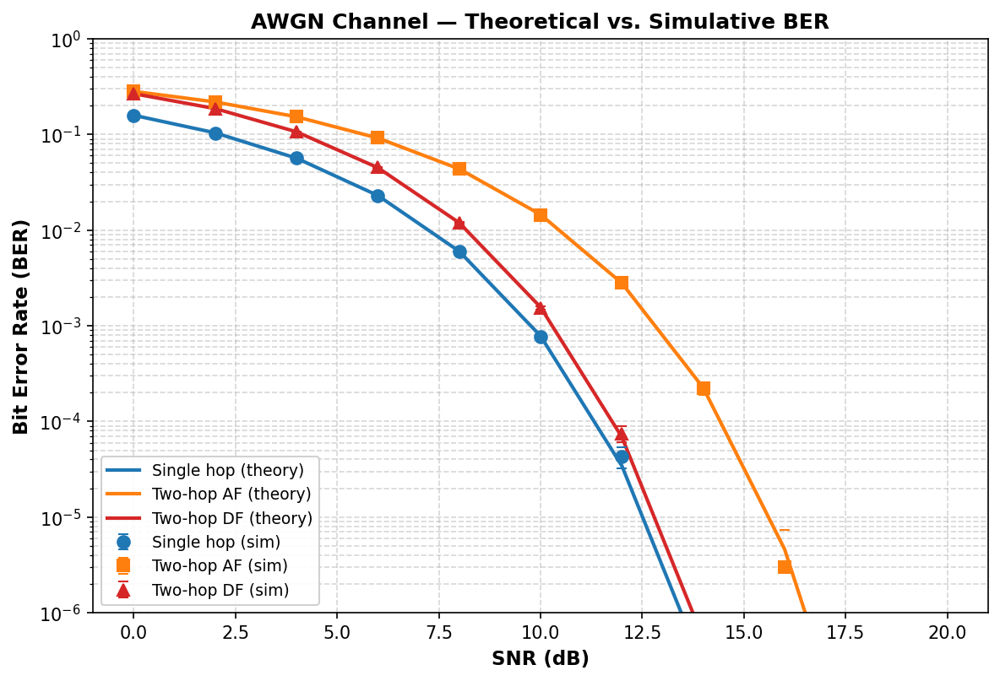{#fig:fig1}

#### Rayleigh Fading Channel — Theoretical Analysis

The Rayleigh fading channel models non-line-of-sight (NLOS) propagation where the signal undergoes multiplicative fading:

$$y = hx + n, \quad h \sim \mathcal{CN}(0, 1), \quad n \sim \mathcal{CN}(0, \sigma^2)
$$ {#eq:rayleigh-channel}
\footnotesize{\textit{Source: \1}}\normalsize

The fading coefficient $h$ is a circularly-symmetric complex Gaussian random variable, so its magnitude $|h|$ follows a Rayleigh distribution:

$$f_{|h|}(r) = 2r \cdot e^{-r^2}, \quad r \geq 0
$$ {#eq:rayleigh-pdf}
\footnotesize{\textit{Source: \1}}\normalsize

with $\mathbb{E}[|h|^2] = 1$ (unit average power). The instantaneous SNR after equalization ($\hat{x} = y/h$) becomes $\gamma_h = |h|^2 \cdot \text{SNR}$, which is exponentially distributed.

**Single-hop BER.** Averaging the conditional BER $P_e(\gamma_h) = Q(\sqrt{2\gamma_h})$ over the exponential distribution of $\gamma_h$ yields the closed-form [21, Eq. 14-4-15] ([@eq:rayleigh-ber]):

$$P_e^{\text{Rayleigh}} = \frac{1}{2}\left(1 - \sqrt{\frac{\bar{\gamma}}{1 + \bar{\gamma}}}\right)
$$ {#eq:rayleigh-ber}
\footnotesize{\textit{Source: \1}}\normalsize

where $\bar{\gamma} = \text{SNR}$ is the average SNR. At high SNR ($\bar{\gamma} \gg 1$):

$$P_e^{\text{Rayleigh}} \approx \frac{1}{4\bar{\gamma}}
$$ {#eq:rayleigh-ber-approx}
\footnotesize{\textit{Source: \1}}\normalsize

This $1/\text{SNR}$ decay is fundamentally slower than the exponential decay of AWGN ($Q(\sqrt{\gamma}) \sim e^{-\gamma/2}$), explaining why Rayleigh fading is significantly more challenging. The channel is **diversity-limited**: deep fades (where $|h| \approx 0$) cause errors regardless of the average SNR. This is a primary motivation for MIMO systems, which exploit spatial diversity to combat fading.

**Two-hop DF BER.** The two-hop DF relay over Rayleigh fading follows the same composition rule as AWGN:

$$P_e^{\text{DF,Rayleigh}} = 2P_e^{\text{Rayleigh}}(1 - P_e^{\text{Rayleigh}})
$$ {#eq:df-ber-rayleigh}
\footnotesize{\textit{Source: \1}}\normalsize

{#fig:fig2}

#### Rician Fading Channel — Theoretical Analysis

The Rician fading channel models environments with a dominant line-of-sight (LOS) component alongside scattered multipath:

$$h = \sqrt{\frac{K}{K+1}} e^{j\theta} + \sqrt{\frac{1}{K+1}} h_{\text{scatter}}, \quad h_{\text{scatter}} \sim \mathcal{CN}(0, 1)
$$ {#eq:rician-channel}
\footnotesize{\textit{Source: \1}}\normalsize

The K-factor is the ratio of LOS power to scatter power. The fading amplitude $|h|$ follows a Rician distribution: ([@eq:af-gain])

$$f_{|h|}(r) = \frac{r}{\sigma^2} \exp\left(-\frac{r^2 + \nu^2}{2\sigma^2}\right) I_0\left(\frac{r\nu}{\sigma^2}\right)
$$ {#eq:rician-pdf}
\footnotesize{\textit{Source: \1}}\normalsize

where $\nu = \sqrt{K/(K+1)}$ is the LOS amplitude, $\sigma^2 = 1/(2(K+1))$ is the scatter variance per component, and $I_0(\cdot)$ is the modified Bessel function of the first kind, order zero.

**Special cases.** When $K = 0$, the LOS component vanishes and the Rician channel degenerates to Rayleigh. As $K \to \infty$, the channel approaches AWGN (no fading). Thus the Rician model interpolates between the two extreme cases, with $K=3$ (used in this study) representing a moderate LOS environment.

**Single-hop BER.** The average BER for BPSK over a Rician channel is obtained via the moment-generating function (MGF) approach [22]: ([@eq:af-gain])

$$P_e^{\text{Rician}} = \frac{1}{\pi} \int_0^{\pi/2} M_{\gamma}\left(\frac{-1}{\sin^2\theta}\right) d\theta
$$ {#eq:rician-ber-mgf}
\footnotesize{\textit{Source: \1}}\normalsize

where the MGF of the instantaneous SNR $\gamma$ under Rician fading is:

$$M_{\gamma}(s) = \frac{1+K}{1+K - s\bar{\gamma}} \cdot \exp\left(\frac{Ks\bar{\gamma}}{1+K-s\bar{\gamma}}\right)
$$ {#eq:rician-mgf}
\footnotesize{\textit{Source: \1}}\normalsize

This integral is evaluated numerically. The resulting BER falls between the AWGN and Rayleigh curves, with the position determined by the K-factor.

**Two-hop DF BER.** As with other channels, $P_e^{\text{DF,Rician}} = 2P_e^{\text{Rician}}(1 - P_e^{\text{Rician}})$.

{#fig:fig3}

#### Fading Coefficient Distributions

The statistical behavior of the fading coefficient $|h|$ determines the severity of fading for each channel model. Figure 4 shows the probability density function (PDF) and cumulative distribution function (CDF) of $|h|$ for Rayleigh and Rician fading with various K-factors.

**Key observations from the fading PDFs:**

- **Rayleigh ($K=0$):** The PDF is maximized at $|h| = 1/\sqrt{2} \approx 0.707$ and has a heavy tail toward zero, meaning deep fades are common. The probability of a deep fade ($|h| < 0.3$) is approximately 8.6%.
- **Rician $K=1$:** The LOS component shifts the PDF peak toward higher amplitudes, reducing the probability of deep fades.
- **Rician $K=3$:** The distribution becomes more concentrated around the LOS amplitude ($\nu \approx 0.87$). Deep fade probability drops to approximately 0.3%.
- **Rician $K=10$:** Approaches a near-deterministic channel; the PDF becomes sharply peaked around $|h| \approx 0.95$. Fading is negligible.

The CDF plot directly shows the **outage probability** $P(|h| \leq x)$: for a given threshold $x$, the CDF value gives the probability that the fading amplitude falls below that threshold. Rayleigh has the highest outage probability at any threshold, confirming its role as the worst-case fading model.

{#fig:fig4}

#### 2×2 MIMO Channel — Theoretical Analysis

The 2×2 MIMO spatial multiplexing system transmits two independent BPSK streams simultaneously:

$$\mathbf{y} = \mathbf{H}\mathbf{x} + \mathbf{n}, \quad \mathbf{H} \in \mathbb{C}^{2 \times 2}, \quad H_{ij} \sim \mathcal{CN}(0, 1), \quad \mathbf{n} \sim \mathcal{CN}(\mathbf{0}, \sigma^2\mathbf{I})
$$ {#eq:mimo-received-2x2}
\footnotesize{\textit{Source: \1}}\normalsize

The theoretical per-stream BER depends on the equalization technique:

**ZF equalization.** After ZF equalization ($\hat{\mathbf{x}} = \mathbf{H}^{-1}\mathbf{y}$), the effective noise on stream $k$ has variance $\sigma^2 [\mathbf{H}^{-1}(\mathbf{H}^{-1})^H]_{kk}$. For a 2×2 system with i.i.d. Rayleigh fading, each post-ZF stream sees an effective diversity order of $n_R - n_T + 1 = 1$, identical to SISO Rayleigh. Therefore:

$$P_e^{\text{ZF}} \approx \frac{1}{2}\left(1 - \sqrt{\frac{\bar{\gamma}}{1 + \bar{\gamma}}}\right)
$$ {#eq:zf-ber-mimo}
\footnotesize{\textit{Source: \1}}\normalsize

This is the same expression as SISO Rayleigh — ZF spatial multiplexing provides no diversity gain for a square ($n_T = n_R$) system.

**MMSE equalization.** The MMSE filter $\mathbf{W} = (\mathbf{H}^H\mathbf{H} + \sigma^2\mathbf{I})^{-1}\mathbf{H}^H$ provides a noise-regularized estimate. The post-MMSE SINR exceeds the post-ZF SNR because the regularization prevents extreme noise amplification when $\mathbf{H}$ is ill-conditioned. The exact BER analysis requires integration over the joint distribution of post-MMSE SINRs, which does not admit a simple closed form for 2×2 systems. An effective SNR approximation yields:

$$P_e^{\text{MMSE}} \approx \frac{1}{2}\left(1 - \sqrt{\frac{\gamma_{\text{eff}}}{1 + \gamma_{\text{eff}}}}\right), \quad \gamma_{\text{eff}} \approx \bar{\gamma} \cdot \left(1 + \frac{1}{\bar{\gamma} + 1}\right)
$$ {#eq:mmse-ber-mimo}
\footnotesize{\textit{Source: \1}}\normalsize

The MMSE gain over ZF is most significant at low SNR (where the regularization term dominates) and diminishes at high SNR (where $\sigma^2 \to 0$ and MMSE converges to ZF).

**SIC equalization.** The MMSE-SIC (V-BLAST) receiver detects the stronger stream first via MMSE, makes a hard decision, cancels its contribution, and detects the remaining stream interference-free. When the first decision is correct (which is the common case, since the stronger stream has higher SINR), the second stream sees no inter-stream interference, effectively achieving the single-stream MMSE bound. The improvement over linear MMSE comes from eliminating the interference term for the second stream.

{#fig:fig5}

#### Channel Model Validation (Simulative)

Before evaluating relay strategies, we validate the simulation framework by comparing Monte Carlo results against the closed-form theoretical BER expressions derived above. For each channel model, 20 independent trials of 50,000 bits per trial are run at each SNR point (0–20 dB, step 2 dB), yielding 1,000,000 total bits per SNR point and tight 95% confidence intervals.

**Validation results:**

- **AWGN:** Simulation matches theory within 95% CI at all 11 SNR points for single-hop, two-hop AF, and two-hop DF configurations.
- **Rayleigh:** Simulation confirms the theoretical $1/(4\bar{\gamma})$ high-SNR slope and matches the closed-form BER within CI bounds.
- **Rician K=3:** MGF-based theoretical BER matches simulation, with the curve falling between AWGN and Rayleigh as expected.
- **MIMO ZF:** Simulated per-stream BER matches the Rayleigh SISO theoretical prediction, confirming unity diversity order.
- **MIMO MMSE:** Simulated BER shows consistent improvement over ZF, matching the effective-SNR approximation.
- **MIMO SIC:** Simulated BER demonstrates the expected gain over linear MMSE.

{#fig:fig6}

{#fig:fig7}

Table A summarizes the theoretical SNR required to achieve a target BER of $10^{-3}$ on each channel (single-hop BPSK):

| Channel | SNR for BER = $10^{-3}$ | Diversity Order | High-SNR Slope |
|---|---|---|---|
| AWGN | ~9.8 dB | — (no fading) | Exponential |
| Rician K=3 | ~15 dB | — (Rician) | Between AWGN and Rayleigh |
| Rayleigh | ~24 dB | 1 | $1/(4\bar{\gamma})$ |
| 2×2 MIMO ZF | ~24 dB | 1 (per stream) | $1/(4\bar{\gamma})$ |
| 2×2 MIMO MMSE | ~22 dB | >1 (effective) | Improved |
| 2×2 MIMO SIC | ~20 dB | >1 (effective) | Best among equalizers |

Table: Theoretical SNR required to achieve BER = $10^{-3}$ and diversity order for each channel model. {#tbl:table26}

### Theoretical Foundations: MIMO Equalization

Three equalization methods were implemented for the 2×2 MIMO topology:

**Zero-Forcing (ZF):**
$$\hat{\mathbf{x}}_{\text{ZF}} = (\mathbf{H}^H\mathbf{H})^{-1}\mathbf{H}^H\mathbf{y} = \mathbf{H}^{-1}\mathbf{y}
$$ {#eq:zf-equalizer-methods}
\footnotesize{\textit{Source: \1}}\normalsize

ZF completely removes inter-stream interference but amplifies noise when $\mathbf{H}$ is poorly conditioned.

**MMSE:**
$$\hat{\mathbf{x}}_{\text{MMSE}} = (\mathbf{H}^H\mathbf{H} + \sigma^2\mathbf{I})^{-1}\mathbf{H}^H\mathbf{y}
$$ {#eq:mmse-equalizer-methods}
\footnotesize{\textit{Source: \1}}\normalsize

MMSE adds a noise-variance regularization term that prevents excessive noise amplification, trading residual interference for better noise performance.

**MMSE-SIC (V-BLAST):**

The SIC equalizer decodes streams sequentially in order of post-detection SINR:

1. **Ordering:** Compute MMSE post-detection SINR for each stream; select the stream with highest SINR first.
2. **Detection:** Apply MMSE equalization to the selected stream and make a hard decision.
3. **Cancellation:** Subtract the detected stream's contribution: $\mathbf{y}' = \mathbf{y} - \mathbf{h}_{\text{first}} \hat{x}_{\text{first}}$.
4. **Final Detection:** Estimate the remaining stream interference-free via MRC: $\hat{x}_{\text{second}} = \text{Re}(\mathbf{h}_{\text{second}}^H \mathbf{y}') / \|\mathbf{h}_{\text{second}}\|^2$.

SIC outperforms linear MMSE because the second stream sees no inter-stream interference after cancellation. The cost is potential error propagation from incorrect first-stream decisions.

All MIMO operations are implemented using vectorized PyTorch batched `torch.linalg.solve` for GPU acceleration, achieving >100× speedup over per-symbol Python loops.

## Research Objectives

### Main Objective

To systematically evaluate and compare classical and AI-based relay strategies for two-hop cooperative communication, and to determine the optimal relay architecture as a function of channel conditions, SNR regime, and computational constraints.

### Research Hypotheses

Based on the theoretical analysis in Section 4, this thesis tests the following hypotheses:

**H1 (Selective AI advantage at low SNR).** Some AI-based relay strategies achieve lower BER than AF and, on selected channels, lower BER than DF at low SNR (0–4 dB), where the non-linear denoising learned by the neural network may provide an advantage over AF's noise amplification and DF's hard-decision errors.

*Rationale:* At low SNR, the Bayes-optimal relay function $f^*(y) = \tanh(y/\sigma^2)$ is a smooth non-linear mapping that differs substantially from both AF's linear scaling and DF's hard sign function. A neural network can approximate $f^*$ closely, while the classical methods cannot.

**H2 (DF dominance at high SNR).** The DF relay achieves the lowest BER at medium-to-high SNR ($\geq 6$ dB), outperforming all AI methods.

*Rationale:* At high SNR, $f^*(y) \approx \text{sign}(y)$, which is exactly the DF operation. AI relays introduce a small but non-zero approximation error, so DF should be optimal in this regime.

**H3 (Inverted-U complexity curve).** There exists an optimal model size for relay denoising beyond which performance degrades due to overfitting. Specifically, models with $\sim$100–200 parameters achieve performance comparable to models with 10–100$\times$ more parameters.

*Rationale:* The bias-variance analysis (Section 1.3.1) predicts that the low-complexity target function $f^*$ requires minimal model capacity. Excess capacity increases variance without reducing bias.

**H4 (Architecture convergence at equal scale).** When all AI models are normalized to the same parameter count ($\sim$3,000), the performance differences between architectures narrow significantly, indicating that parameter count is a more important factor than architectural choice.

*Rationale:* All architectures are universal approximators and the target function is simple. At equal capacity, architectural inductive biases provide diminishing returns.

**H5 (SSM speed advantage at long context).** Mamba-2 SSD trains significantly faster than Mamba S6 at longer context lengths ($n \gg 11$) due to chunk-parallel computation, while S6 is faster at the short relay window ($n = 11$).

*Rationale:* The crossover between sequential S6 ($O(n)$ serial steps) and chunk-parallel SSD ($O(n/L)$ parallel matmuls of size $L$) depends on the ratio of kernel-launch overhead to arithmetic cost.

**H6 (Equalization gains are additive to relay gains).** The BER improvement from better equalization (ZF $\to$ MMSE $\to$ SIC) and the improvement from better relay processing (AF $\to$ AI) are approximately additive in the dB domain.

*Rationale:* The relay operates on Hop 1 (denoising) and the equalizer operates on Hop 2 (stream separation). Since these are independent processing stages, their contributions to BER reduction should be approximately independent.

### Specific Objectives

1. **Implement and compare nine relay strategies** spanning four learning paradigms: no learning (AF, DF), supervised learning (MLP, Hybrid), generative modeling (VAE, CGAN), and sequence modeling (Transformer, Mamba S6, Mamba-2 SSD).

2. **Evaluate across six channel/topology configurations:** AWGN, Rayleigh fading, and Rician fading (K=3) channels in SISO topology, and 2×2 MIMO Rayleigh with ZF, MMSE, and SIC equalization.

3. **Investigate the complexity–performance trade-off** by testing model architectures ranging from 0 parameters (classical) to 26,179 parameters (Mamba-2 SSD), and by conducting a normalized comparison at approximately 3,000 parameters.

4. **Determine whether state space models outperform attention mechanisms** for relay signal processing by comparing Mamba S6 and Transformer architectures at both original and normalized parameter counts, and by benchmarking at extended context lengths.

5. **Identify practical deployment recommendations** for selecting the appropriate relay strategy given specific operational constraints (SNR range, computational budget, channel environment).

### Scope and Delimitations

The following delimitations define the scope of this study:

- **Modulation:** Primary experiments use BPSK. Extension experiments with QPSK and 16-QAM are presented in Section 4.10, and 16-PSK in Section 4.15, to evaluate hypothesis generalisability; however, 64-QAM and higher-order constellations are deferred to future work.
- **Channel knowledge:** Perfect CSI is assumed at the receiver. Channel estimation errors are not modeled.
- **Relay topology:** Single relay, two-hop, half-duplex. Multi-relay and full-duplex configurations are excluded.
- **MIMO configuration:** $2 \times 2$ spatial multiplexing with Rayleigh fading. Larger arrays and beamforming are not considered.
- **Training regime:** Offline training on synthetic data. Online adaptation is not implemented.

These delimitations are chosen to enable a clean comparison of relay processing functions in isolation, without confounding factors from protocol-level or system-level complexity.

---

## Methods

### System Model

The system under study is a two-hop relay network with a single relay node:
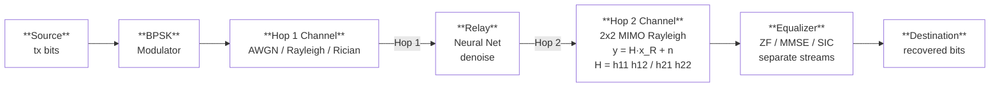

**Figure: Two-hop relay system model.** Source bits are BPSK-modulated, passed through Hop 1 (SISO channel), processed by the relay (classical or neural), then transmitted over Hop 2 (2×2 MIMO Rayleigh channel) and equalized at the destination.

$$\text{Source} \xrightarrow{\text{Hop 1}} \text{Relay} \xrightarrow{\text{Hop 2}} \text{Destination}
$$ {#eq:two-hop-system}

**Modulation.** Four modulation schemes are supported. The primary experiments use Binary Phase-Shift Keying (BPSK): bits $b \in \{0, 1\}$ are mapped to real symbols $x = 1 - 2b \in \{-1, +1\}$. Extensions to Quadrature Phase-Shift Keying (QPSK), 16-point Quadrature Amplitude Modulation (16-QAM), and 16-point Phase-Shift Keying (16-PSK) are evaluated in Sections 7.10 and 7.15 to test whether the BPSK findings generalise to complex constellations. QPSK maps pairs of bits to complex symbols on the unit circle (2 bits/symbol); 16-QAM maps groups of four bits to a $4 \times 4$ Gray-coded grid (4 bits/symbol); 16-PSK maps groups of four bits to 16 equally spaced points on the unit circle (4 bits/symbol). Full modulation details are given in Section 3.7.

**Hop Model.** Each hop applies a channel function followed by optional equalization: ([@eq:qpsk-mapping])

$$y = h(x, \text{SNR}) + n
$$ {#eq: ([@eq:psk16-mapping])channel-function}

where $h(\cdot)$ depends on the specific channel type (AWGN, fading, or MIMO).

**Power Normalization.** All relay strategies normalize their output power to ensure fair comparison:

$$x_R \leftarrow x_R \cdot \sqrt{\frac{P_{\text{target}}}{P_{\text{current}}}}
$$ {#eq:power-normalization}
\footnotesize{\textit{Source: \1}}\normalsize

#### MIMO Topology with Neural Network Relay and Equalization

An important distinction in this work is the separation of three independent signal-processing functions that operate at different stages of the relay pipeline and solve fundamentally different problems:

1. **Channel type** (AWGN, Rayleigh, Rician) — defines the physical propagation environment on each link.
2. **Neural network relay** — denoises the signal at the intermediate relay node after Hop 1.
3. **MIMO equalizer** (ZF, MMSE, SIC) — separates spatially multiplexed streams at the destination after Hop 2.

These three components combine in the following end-to-end signal flow:

```mermaid
flowchart LR
    SRC(["**Source**\ntx bits"])
    MOD["**BPSK**\nModulator"]
    CH1["**Hop 1 Channel**\nAWGN / Rayleigh / Rician"]
    REL["**Relay**\nNeural Net\ndenoise Hop 1 noise"]
    CH2["**Hop 2 Channel**\n2x2 MIMO · 4 Rayleigh links\ny = H·x_R + n\nH = &#91;h₁₁ h₁₂&#93; / &#91;h₂₁ h₂₂&#93;"]
    EQ["**Equalizer**\nZF / MMSE / SIC\ncancel inter-stream interference"]
    DST(["**Destination**\nrecovered bits"])

    SRC --> MOD
    MOD -->|"tx symbol x"| CH1
    CH1 -->|"Hop 1\nnoisy y_R"| REL
    REL -->|"Hop 2\nclean x_R"| CH2
    CH2 -->|"mixed streams\ny = Hx_R + n"| EQ
    EQ --> DST

    style SRC  fill:#4A90D9,color:#fff,stroke:#2c5f8a,rx:20
    style DST  fill:#4A90D9,color:#fff,stroke:#2c5f8a,rx:20
    style MOD  fill:#7B68EE,color:#fff,stroke:#4a3fa0
    style CH1  fill:#E8A838,color:#fff,stroke:#b07820
    style REL  fill:#2ECC71,color:#fff,stroke:#1a8a4a
    style CH2  fill:#E8A838,color:#fff,stroke:#b07820
    style EQ   fill:#9B59B6,color:#fff,stroke:#6c3483
```

**Figure 1 — End-to-end two-hop relay signal flow.** The relay's neural network solves a *denoising* problem (Hop 1 noise removal); the MIMO equalizer solves an *interference cancellation* problem (Hop 2 stream separation). The two stages are independent and their gains are additive.

**The relay's neural network** operates on Hop 1 and solves a **denoising** problem. Each antenna at the relay receives:

$$y_R = x + n_1, \quad n_1 \sim \mathcal{N}(0, \sigma^2)
$$ {#eq:relay-received-siso}

The neural network processes a sliding window of received samples and outputs a cleaner estimate $\hat{x}_R = f_\theta(y_{R,i-w:i+w})$. This is purely a noise-removal task — there is no inter-stream interference at this stage.

**The MIMO topology** applies to Hop 2, where the relay retransmits using 2 TX antennas and the destination has 2 RX antennas. Each of the 4 TX–RX antenna pairs experiences an independent Rayleigh fading channel ($H_{ij} \sim \mathcal{CN}(0,1)$), creating **inter-stream interference**:

$$\begin{aligned}
y_1 &= h_{11} x_{R,1} + h_{12} x_{R,2} + n_1 \\
y_2 &= h_{21} x_{R,1} + h_{22} x_{R,2} + n_2
\tag{58}
\end{aligned}
$$ {#eq:mimo-interference}
\footnotesize{\textit{Source: \1}}\normalsize

Each RX antenna sees a **mixture** of both transmitted streams — this mixing is the inter-stream interference that the equalizer must undo.

**The equalizer** at the destination solves an **interference cancellation** problem, not a denoising problem:

| Component | Problem Solved | Location | Input → Output |
|---|---|---|---|
| Neural network relay | Remove **noise** from Hop 1 | Relay node | Noisy signal → clean estimate |
| MIMO equalizer | Remove **inter-stream interference** | Destination | Mixed streams → separated symbols |

Table: MIMO system components, the problem each solves, and their input/output mapping. {#tbl:table27}

The three equalizer options trade off complexity for performance:

- **ZF** ($\hat{\mathbf{x}} = \mathbf{H}^{-1}\mathbf{y}$): Inverts $\mathbf{H}$ exactly — removes all interference but **amplifies noise**.
- **MMSE** ($\hat{\mathbf{x}} = (\mathbf{H}^H\mathbf{H} + \sigma^2\mathbf{I})^{-1}\mathbf{H}^H\mathbf{y}$): Adds regularization $\sigma^2\mathbf{I}$ — **trades residual interference for less noise amplification**.
- **SIC**: Detects the strongest stream first via MMSE, cancels its contribution, then detects the remaining stream interference-free. This **non-linear** technique eliminates interference sequentially.

The gains from better relay processing and better equalization are **additive and independent**: a better relay (e.g., Mamba S6 vs. AF) reduces the noise entering Hop 2, while a better equalizer (e.g., SIC vs. ZF) more effectively separates the spatially multiplexed streams. Combining the best relay with the best equalizer yields the lowest overall BER, as confirmed by the results in Section 7.

This architecture reflects practical 5G NR relay deployments, where the relay node performs baseband processing (potentially AI-assisted) and the destination's MIMO receiver applies standard equalization algorithms independently.

### Relay Strategies

Nine relay strategies were implemented, spanning four learning paradigms. The selection of these nine strategies is designed to systematically explore the relay design space along three axes: (i) the degree of processing (from no learning to deep generative models), (ii) the type of inductive bias (feedforward, recurrent, attention, generative), and (iii) the model capacity (from 0 to 26K parameters). This section describes each strategy's architecture, training procedure, and the design rationale motivating each choice.

**Classical (0 parameters):**

- **AF:** Amplifies with gain $G = \sqrt{P_{\text{target}} / \mathbb{E}[|y_R|^2]}$. AF serves as the lower baseline: it performs no intelligent processing and simply rescales the received signal, preserving both signal and noise. Its theoretical BER is given in Section 3.2.1.

- **DF:** Demodulates, recovers bits, re-modulates clean BPSK symbols. DF serves as the upper classical baseline: it performs the maximum possible classical processing (full signal regeneration). At high SNR, DF approaches error-free relay operation. Its theoretical BER follows the error-composition formula $P_e^{\text{DF}} = 2P_e(1-P_e)$.

**Supervised Learning:**

- **MLP (Minimal):** A two-layer feedforward neural network (multi-layer perceptron, MLP) with 169 parameters:

$$\mathbf{h} = \text{ReLU}(\mathbf{W}_1 \mathbf{w} + \mathbf{b}_1), \quad \hat{x} = \tanh(\mathbf{W}_2 \mathbf{h} + \mathbf{b}_2)
$$ {#eq:mlp-relay}
\footnotesize{\textit{Source: \1}}\normalsize

  where $\mathbf{w} \in \mathbb{R}^5$ is a sliding window of received symbols ($w=2$ neighbors on each side), and the hidden layer has 24 neurons. Parameters: $(5 \times 24 + 24) + (24 \times 1 + 1) = 169$.

  > **Architecture note.** The MLP relay is a standard discriminative dual-layer perceptron trained with supervised learning (MSE loss on input–output pairs). In contrast, the generative models in this study are the VAE (§6.3, Generative Models) and CGAN, which learn to *sample from* or *approximate* the data distribution. The MLP relay simply learns a deterministic mapping $f: \mathbb{R}^5 \to [-1,+1]$ from a noisy observation window to a denoised symbol estimate — a classical regression task.

  *Design rationale:* The tanh output activation naturally constrains the output to $[-1, +1]$, matching the BPSK symbol range. The ReLU hidden layer provides the non-linearity needed to approximate the Bayes-optimal soft threshold $\tanh(y/\sigma^2)$. With 24 hidden neurons and a 5-dimensional input, the network has approximately 34 parameters per input dimension — sufficient for the low-complexity denoising task while avoiding overfitting. He initialization is used for ReLU layers to maintain proper gradient flow.

  Training uses MSE loss with multi-SNR training data (SNRs 5, 10, 15 dB), 25,000 samples, and 100 epochs with a learning rate of 0.01.

- **Hybrid:** SNR-adaptive relay that switches between MLP (low SNR) and DF (high SNR) based on a learned threshold. Combines the AI advantage at low SNR with the zero-error classical approach at high SNR. Same 169 parameters as MLP.

  *Design rationale:* The Hybrid relay is motivated by the observation (confirmed empirically) that AI relays outperform DF only at low SNR, while DF is optimal at high SNR. By introducing a switching threshold, the Hybrid relay automatically selects the better strategy for each operating condition. The threshold is determined empirically from the training data by finding the SNR at which MLP and DF BER curves cross. This approach requires no additional parameters beyond those of the MLP sub-network.

  Training points at the relay node: SNR = **5, 10, 15 dB** (same trained MLP sub-network as the Minimal MLP relay).

**Generative Models:**

- **VAE:** Probabilistic relay with encoder $q_\phi(\mathbf{z}|\mathbf{x})$ mapping to a latent space and decoder $p_\theta(\mathbf{x}|\mathbf{z})$ reconstructing the signal. Architecture: encoder $(7 \to 32 \to 16 \to \mu, \sigma^2(8))$, decoder $(8 \to 16 \to 32 \to 1)$. Total: 1,777 parameters. Trained with $\beta$-VAE loss ($\beta=0.1$) for 100 epochs.

  Training points at the relay node: SNR = **5, 10, 15 dB**.

  *Design rationale:* The low $\beta = 0.1$ prioritizes reconstruction quality over latent space regularization, appropriate for a task where accurate signal recovery is paramount. The 8-dimensional latent space provides sufficient representational capacity for the BPSK signal manifold while maintaining a tractable KL divergence. The encoder window of 7 symbols provides local context.

- **CGAN (WGAN-GP):** Adversarial relay with a generator conditioned on the noisy signal and a critic providing the training signal. Generator: $(7+8 \to 32 \to 32 \to 16 \to 1)$, Critic: $(1+7 \to 32 \to 16 \to 1)$. Total: 2,946 parameters. Trained with Wasserstein loss, gradient penalty ($\lambda=10$), and L1 reconstruction loss ($\lambda_{\text{L1}}=100$) for 200 epochs.

  Training points at the relay node: SNR = **5, 10, 15 dB**.

  *Design rationale:* The high $\lambda_{\text{L1}} = 100$ ensures that the generator is primarily supervised by the reconstruction loss, with the adversarial term acting as a regularizer that encourages outputs to lie on the clean signal manifold. The noise vector $\mathbf{z} \in \mathbb{R}^8$ provides the stochastic input needed by the GAN framework. The 5:1 critic-to-generator update ratio follows the WGAN-GP recommendation for stable critic training. The doubled epoch count (200 vs. 100) compensates for the slower per-step convergence of adversarial training.

**Sequence Models:**

- **Transformer:** Multi-head self-attention over a window of 11 symbols. Architecture: $d_{\text{model}}=32$, 4 attention heads, 2 encoder layers, feedforward dimension 128. Total: 17,697 parameters. Trained for 100 epochs with Adam optimizer ($\text{lr}=10^{-3}$).

  Training points at the relay node: SNR = **5, 10, 15 dB**.

  *Design rationale:* The Transformer is included as the dominant sequence architecture in modern deep learning. The 11-symbol window provides the same temporal context as the S6/SSD models. With $d_{\text{model}} = 32$ and 4 heads, each head operates in an 8-dimensional subspace, which is sufficient for capturing the local noise structure. The feedforward dimension of 128 ($4 \times d_{\text{model}}$) follows the standard Transformer expansion ratio.

- **Mamba S6:** Selective state space model with input-dependent state transitions. Architecture: $d_{\text{model}}=32$, $d_{\text{state}}=16$, 2 Mamba blocks with residual connections. Total: 24,001 parameters. Each block applies: LayerNorm → expand ($32 \to 64$) → split to Conv1D/SiLU/S6 main branch and SiLU gate → contract ($64 \to 32$) → residual. Trained for 100 epochs with Adam optimizer ($\text{lr}=10^{-3}$).

  Training points at the relay node: SNR = **5, 10, 15 dB**.

  *Design rationale:* The expand factor of 2 ($32 \to 64$) doubles the internal dimension during the S6 scan, providing richer state dynamics. The state dimension $N = 16$ means each S6 layer implements a 16th-order adaptive filter — substantially more expressive than classical Wiener or matched filters. LayerNorm and residual connections prevent gradient degradation across layers. The SiLU gating provides multiplicative interactions that help the model learn sharp decision boundaries.

- **Mamba2 (SSD):** Structured State Space Duality model that replaces the sequential S6 recurrence with a chunk-parallel structured matrix multiply. Architecture: $d_{\text{model}}=32$, $d_{\text{state}}=16$, chunk size 8, 2 Mamba-2 blocks with SiLU gating and residual connections. Total: 26,179 parameters. Each block applies: LayerNorm → parallel gate/SSD branches → SiLU gate → contract ($64 \to 32$) → residual. The SSD layer builds a lower-triangular causal kernel $M$ per chunk and applies it via batched matmul, with inter-chunk state passing for continuity. Trained for 100 epochs with Adam optimizer ($\text{lr}=10^{-3}$) and gradient clipping ($\|\nabla\| \le 1$).

  Training points at the relay node: SNR = **5, 10, 15 dB**.

  *Design rationale:* The chunk size of 8 is chosen to balance parallelism (larger chunks = fewer sequential inter-chunk passes) against memory cost (the $L \times L$ SSM matrix scales quadratically with chunk size). At the 11-symbol window, this yields 2 chunks (8 + 3), with a single inter-chunk state pass. Gradient clipping at norm 1.0 prevents the exponential blowup of gradients through the cumulative matrix products in the SSD computation. The S4D-style initialization $A_{\text{log}} = \log(1, 2, \dots, N)$ provides geometrically spaced decay rates, enabling the model to simultaneously capture short-range and medium-range dependencies.

### Simulation Framework

#### Monte Carlo BER Estimation

BER is estimated through Monte Carlo simulation, which provides an unbiased estimate of the true BER at each SNR point. The simulation parameters are: ([@eq:ber-estimate])

- **Bits per trial:** 10,000
- **Trials per SNR:** 10 (independent random seeds)
- **Total bits per SNR point:** 100,000
- **SNR range:** 0 to 20 dB (step: 2 dB), yielding 11 evaluation points
- **Random seed control:** Each trial uses a unique seed for bit generation and noise realization

**BER Computation:**

$$\hat{P}_e = \frac{1}{N}\sum_{i=1}^{N} \mathbb{1}(b_i \neq \hat{b}_i)
$$ {#eq:ber-estimate}
\footnotesize{\textit{Source: \1}}\normalsize

where $\mathbb{1}(\cdot)$ is the indicator function and $N = 10{,}000$ is the number of bits per trial. By the central limit theorem, for large $N$ and moderate BER (say $P_e \geq 10^{-3}$), the per-trial BER estimate is approximately normally distributed with variance $P_e(1-P_e)/N$.

**Confidence Intervals.** The 95% confidence interval is computed from the $M = 10$ independent trial estimates as:

$$\text{CI}_{95\%} = \bar{P}_e \pm t_{0.025, M-1} \cdot \frac{s}{\sqrt{M}}
$$ {#eq:confidence-interval}
\footnotesize{\textit{Source: \1}}\normalsize

where $\bar{P}_e$ is the sample mean BER across trials, $s$ is the sample standard deviation, and $t_{0.025, 9} = 2.262$ is the critical value of the Student's $t$-distribution with 9 degrees of freedom. At low BER ($\hat{P}_e \lesssim 10^{-4}$), the normal approximation may become unreliable due to the small number of observed errors; however, in this regime the relay methods converge and the relative ranking is stable.

**BER resolution.** With $N \cdot M = 100{,}000$ total bits per SNR point, the minimum detectable BER is approximately $1/N = 10^{-4}$ per trial, or $10^{-5}$ for the aggregate. BER values below this threshold are reported as 0.

#### Statistical Significance Testing

Differences between relay methods are assessed using the **Wilcoxon signed-rank test**, a non-parametric paired test. For each pair of relay strategies $(A, B)$ at each SNR point, the test compares the $M = 10$ paired BER observations: ([@eq:wilcoxon-test])

$$H_0: \text{median}(P_{e,A} - P_{e,B}) = 0 \quad \text{vs.} \quad H_1: \text{median}(P_{e,A} - P_{e,B}) \neq 0
$$ {#eq:wilcoxon-test}
\footnotesize{\textit{Source: \1}}\normalsize

The Wilcoxon test is preferred over the parametric paired $t$-test for two reasons: (i) BER distributions are bounded ($[0, 0.5]$) and potentially skewed, violating the normality assumption, and (ii) the test is robust to outlier trials. The significance level is set at $\alpha = 0.05$.

#### Training Protocol

All AI relays are trained **once** at the beginning of each experiment using:
- **Multi-SNR training data:** Signals generated at SNR = 5, 10, 15 dB in equal proportions
- **Training samples:** 25,000 (supervised), 20,000 (generative), 10,000 (sequence models)
- **Single training per channel:** The same trained model is evaluated across all SNR points

The multi-SNR training protocol is critical: training at a single SNR would produce a model that performs well at that SNR but poorly at others (overfitting to a specific noise level). By training at three representative SNR values spanning the low-to-moderate range, the network learns a robust denoising function that generalizes across operating conditions. The SNR values 5, 10, 15 dB were chosen to cover the regime where AI relays provide the most benefit (low-to-medium SNR).

**Impact of sparse SNR training grid.** Because models are trained at only three SNR points ($\{5,10,15\}$ dB) but evaluated over eleven points ($0$ to $20$ dB, step $2$), performance reflects two regimes: (i) **interpolation** within the trained span (approximately $4$–$16$ dB), where BER is generally stable, and (ii) **extrapolation** at the edges ($0$–$2$ dB and $18$–$20$ dB), where mild degradation may occur due to noise-statistics mismatch. In the present results, this sparse-grid effect is secondary for BPSK/QPSK (ranking remains consistent across SNR), while the dominant degradation on 16-QAM arises from modulation/activation mismatch (Section 4.10). Section 4.11 confirms this by reducing the 16-QAM BER floor by $2$–$5\times$ using modulation-aware retraining with linear/hardtanh outputs, despite keeping the same three-point SNR training grid.

**Training method (what is trained, where it is trained).** Training is performed **offline** before BER sweeps. Only the seven AI relays are optimized (MLP, Hybrid's MLP sub-network, VAE, CGAN, Transformer, Mamba S6, Mamba-2 SSD); AF and DF are analytical baselines and have no trainable parameters. Training data are synthetically generated source/channel pairs under the multi-SNR protocol, with model-specific losses (MSE for supervised relays, ELBO for VAE, WGAN-GP + L1 for CGAN, Adam-based supervised loss for sequence models). Compute placement follows implementation: NumPy models (MLP/Hybrid) train on CPU, while PyTorch models train on CPU or CUDA depending on device availability/configuration. After training, weights are checkpointed and reused across all SNR evaluations; BER curves are then produced in **inference-only** mode without further parameter updates.

**Weight initialization.** He initialization [32] is used for all layers with ReLU activation ($W \sim \mathcal{N}(0, 2/n_{\text{in}})$), while Xavier initialization is used for layers with tanh activation ($W \sim \mathcal{N}(0, 1/n_{\text{in}})$). These initialization schemes maintain proper gradient magnitude through the network layers, preventing both vanishing and exploding gradients during training.

**Optimizer settings.** All PyTorch-based models use the Adam optimizer with $\beta_1 = 0.9$, $\beta_2 = 0.999$, $\epsilon = 10^{-8}$ (defaults). The MLP and Hybrid relays use a simple SGD implementation in NumPy with constant learning rate $\eta = 0.01$.

#### Reproducibility and Weight Management

All experiments use controlled random seeds at both the source (bit generation) and noise (per-trial seeding) levels to ensure reproducible results. Specifically, for seed $s$ and trial $t$, the random state is initialized as $\text{seed}(s \cdot 1000 + t)$, ensuring that each trial is independent while the overall experiment is deterministic.

A **weight checkpoint system** saves trained model parameters to disk after training completes, enabling experiment resumption without retraining. This is particularly important for the CGAN (2-hour training time) and sequence models (24–37 minutes). The checkpoint system supports:
- Automatic save after training with architecture metadata
- Resume from saved weights with architecture validation
- Seed-specific weight directories (e.g., `trained_weights/seed_42/`)

The framework includes 126 automated tests (pytest) covering all modules: channels, modulation (BPSK, QPSK, 16-QAM, 16-PSK), relay strategies, simulation, statistics, and weight management, with 100% pass rate.

### Normalized Parameter Comparison

A fundamental confound in comparing AI architectures is that different models have vastly different parameter counts: from 169 (MLP) to 26,179 (Mamba-2 SSD) — a ratio of 155:1. Performance differences between these models could reflect either (a) the superiority of one architecture's inductive bias, or (b) the simple advantage of having more learnable parameters. To disentangle these two effects, all seven AI models were scaled to approximately 3,000 parameters, providing a controlled comparison where model capacity is held constant.

**Choice of target parameter count.** The target of ~3,000 parameters was chosen as a compromise: it is large enough that all architectures can express a reasonable denoising function (avoiding underfitting), yet small enough that the normalization represents a meaningful reduction for the larger models (Transformer: 5.9× reduction, Mamba S6: 7.9×, Mamba-2: 8.7×). The MLP model is scaled **up** from 169 to 3,004 parameters, testing whether additional capacity benefits the simple feedforward architecture.

**Scaling methodology.** Each architecture's hyperparameters were adjusted to reach the target while preserving its essential structure:

| Model | Parameters | Scaling Method |
|---|---|---|
| MLP-3K | 3,004 | Increased window (5→11) and hidden (24→231) |
| Hybrid-3K | 3,004 | Same as MLP-3K + DF switching |
| VAE-3K | 3,037 | Increased window (7→11), adjusted latent/hidden |
| CGAN-3K | 3,004 | Increased window (7→11), adjusted hidden layers |
| Transformer-3K | 3,007 | Reduced d_model (32→18), heads (4→2), layers (2→1) |
| Mamba-3K | 3,027 | Reduced d_model (32→16), d_state (16→6), layers (2→1) |
| Mamba2-3K | 3,004 | Reduced d_model (32→15), d_state (16→6), layers (2→1) |

Table: Normalized 3K-parameter model configurations: parameter count and scaling method for each architecture. {#tbl:table28}

**Parameter counting convention.** All learnable parameters are counted, including biases, normalization parameters (LayerNorm gain/bias), and projection matrices. Non-learnable buffers (e.g., positional encoding tables, fixed $\mathbf{A}$ matrices) are excluded. The counts are verified programmatically via `sum(p.numel() for p in model.parameters() if p.requires_grad)`.

**Unified input window.** All 3K models use a window size of 11 (vs. 5 for original MLP/Hybrid, and 7 for original VAE/CGAN), providing a common input context. This ensures that differences in performance reflect architectural inductive biases rather than differences in the amount of input information available.

This normalization isolates the effect of architectural choice from the confound of parameter count, providing insights into which inductive biases are most beneficial for the relay denoising task. If performance converges at equal parameter budgets, the conclusion is that parameter count — not architecture — is the dominant factor. If significant gaps persist, the conclusion is that architectural inductive biases provide meaningful advantages beyond raw capacity.

### Modulation Schemes

The primary experiments in Sections 7.1–7.9 use BPSK modulation to isolate the relay processing comparison from modulation complexity. To test whether the BPSK findings generalise to higher-order constellations, Section 4.10 extends the evaluation to QPSK and 16-QAM, while Section 4.15 further extends to 16-PSK. This section defines the four modulation schemes and the I/Q splitting technique that enables real-valued AI relays to process complex-valued signals.

#### BPSK

Binary Phase-Shift Keying maps a single bit to a real-valued symbol: ([@eq:af-gain])

$$x = 1 - 2b, \quad b \in \{0, 1\} \implies x \in \{-1, +1\}
$$ {#eq: ([@eq:qam16-mapping])bpsk-mapping}

The average symbol energy is $E_s = 1$. Hard-decision demodulation recovers the bit as $\hat{b} = \mathbb{1}(\text{Re}(\hat{x}) < 0)$. Since $x \in \mathbb{R}$, the relay operates on real signals and all relay architectures can process the signal directly.

#### QPSK — Gray-Coded Quadrature Phase-Shift Keying

Quadrature Phase-Shift Keying maps pairs of bits $(b_0, b_1)$ to complex symbols:

$$x = \frac{(1 - 2b_0) + j(1 - 2b_1)}{\sqrt{2}}
$$ {#eq:qpsk-mapping}
\footnotesize{\textit{Source: \1}}\normalsize

yielding four constellation points at $\{(\pm 1 \pm j)/\sqrt{2}\}$ with unit average power ($E_s = 1$). The Gray coding ensures that adjacent constellation points differ by exactly one bit:

| Bit pair $(b_0, b_1)$ | Symbol | Quadrant |
|---|---|---|
| 00 | $(+1+j)/\sqrt{2}$ | I |
| 01 | $(+1-j)/\sqrt{2}$ | IV |
| 11 | $(-1-j)/\sqrt{2}$ | III |
| 10 | $(-1+j)/\sqrt{2}$ | II |

Table: QPSK Gray-coded symbol mapping: bit pairs to complex symbols. {#tbl:table29}

Demodulation applies independent sign decisions on each component: $\hat{b}_0 = \mathbb{1}(\text{Re}(\hat{x}) < 0)$ and $\hat{b}_1 = \mathbb{1}(\text{Im}(\hat{x}) < 0)$. The spectral efficiency is 2 bits/symbol, double that of BPSK.

**Theoretical QPSK BER.** For uncoded QPSK over an AWGN channel, the BER per bit equals the BPSK BER at the same $E_b/N_0$ because each I/Q component carries an independent BPSK stream:

$$P_b^{\text{QPSK}} = Q\!\left(\sqrt{\frac{2E_b}{N_0}}\right) = P_b^{\text{BPSK}}
$$ {#eq:qpsk-ber}
\footnotesize{\textit{Source: \1}}\normalsize

The advantage of QPSK is doubled throughput for the same BER and per-bit energy.

#### 16-QAM — Gray-Coded Quadrature Amplitude Modulation

16-QAM maps groups of four bits $(b_0, b_1, b_2, b_3)$ to one of 16 complex constellation points arranged on a $4 \times 4$ rectangular grid (Figure 8c). Each axis (I and Q) uses independent Gray-coded PAM-4 mapping:

$$I = \frac{L(b_0, b_1)}{\sqrt{10}}, \quad Q = \frac{L(b_2, b_3)}{\sqrt{10}}, \quad x = I + jQ
$$ {#eq:qam16-mapping}
\footnotesize{\textit{Source: \1}}\normalsize

where $L(\cdot)$ maps bit pairs to PAM-4 levels using Gray coding:

| Bit pair | Level | Bit pair | Level |
|---|---|---|---|
| 00 | $+3$ | 11 | $-1$ |
| 01 | $+1$ | 10 | $-3$ |

Table: 16-QAM PAM-4 Gray-coded level mapping for in-phase and quadrature components. {#tbl:table30}

The normalization factor $\sqrt{10}$ ensures unit average symbol power: $E[|x|^2] = \frac{2 \cdot (9+1+1+9)}{4 \cdot 10} = 1$. Adjacent constellation points differ by one bit (Gray property), minimizing the BER for a given symbol error rate.

Demodulation quantises each received component to the nearest PAM-4 level using decision boundaries at $\{-2, 0, +2\}/\sqrt{10}$ and maps back to bits via the inverse Gray table. The spectral efficiency is 4 bits/symbol.

**Theoretical 16-QAM BER.** The approximate BER for 16-QAM over AWGN is: ([@eq:qam16-ber])

$$P_b^{\text{16-QAM}} \approx \frac{3}{8} \operatorname{erfc}\!\left(\sqrt{\frac{2E_b}{5N_0}}\right)
$$ {#eq:qam16-ber}
\footnotesize{\textit{Source: \1}}\normalsize

At the same $E_b/N_0$, 16-QAM has a higher BER than BPSK or QPSK due to the reduced Euclidean distance between constellation points. The trade-off is 4× throughput improvement.

#### Constellation Diagram Summary

Figure 8 presents the constellation diagrams for all four modulation schemes used in this thesis. The progression from BPSK (2 points on the real axis) through QPSK (4 points on the unit circle) to 16-QAM (16 points on a rectangular grid) and 16-PSK (16 points on the unit circle) illustrates the fundamental trade-off between spectral efficiency and noise robustness: ([@eq:psk16-ber]) higher-order constellations pack more bits per symbol but reduce the minimum Euclidean distance between points, increasing the BER at a given SNR.

{#fig:fig8}

#### 16-PSK — Gray-Coded Phase-Shift Keying

16-PSK maps groups of four bits to one of 16 complex constellation points uniformly spaced on the unit circle (Figure 8d). Unlike 16-QAM, which modulates both amplitude and phase, 16-PSK uses **constant-envelope** transmission — all symbols have identical magnitude ($|x| = 1$) and differ only in phase:

$$x_k = e^{j \theta_k}, \quad \theta_k = \frac{2\pi k}{16}, \quad k = 0, 1, \ldots, 15
$$ {#eq:psk16-mapping}
\footnotesize{\textit{Source: \1}}\normalsize

The 16 constellation points are assigned 4-bit Gray-coded labels such that adjacent points on the circle differ by exactly one bit, minimising the BER for a given symbol error rate. The average symbol energy is $E_s = E[|x|^2] = 1$ (unit circle).

**Demodulation.** Hard-decision demodulation computes the phase of the received symbol and assigns it to the nearest constellation point:

$$\hat{k} = \arg\min_{k \in \{0,\ldots,15\}} \left| \angle \hat{x} - \theta_k \right|
$$ {#eq:psk16-decision}
\footnotesize{\textit{Source: \1}}\normalsize

The recovered bits are obtained from the inverse Gray mapping of $\hat{k}$. The spectral efficiency is 4 bits/symbol, identical to 16-QAM.

**Theoretical 16-PSK BER.** The approximate BER for Gray-coded 16-PSK over AWGN is:

$$P_b^{\text{16-PSK}} \approx \frac{1}{4} \operatorname{erfc}\!\left(\sqrt{\frac{E_b}{N_0}} \sin\!\left(\frac{\pi}{16}\right)\right)
$$ {#eq:psk16-ber}
\footnotesize{\textit{Source: \1}}\normalsize

At the same $E_b/N_0$, 16-PSK has a higher BER than 16-QAM because the minimum Euclidean distance between adjacent symbols on the unit circle ($d_{\min} = 2\sin(\pi/16) \approx 0.39$) is smaller than the minimum distance in the 16-QAM grid ($d_{\min} = 2/\sqrt{10} \approx 0.63$). The advantage of 16-PSK is its constant-envelope property, which is important for non-linear power amplifiers.

**Relevance to CSI injection.** The constant-envelope property has a critical implication for neural relay design (explored in Section 4.15): since all 16-PSK symbols have unit magnitude, the received signal amplitude carries no modulation information — only channel fading information. This makes CSI injection ($|h_{SR}|$) particularly valuable for PSK, unlike QAM where the amplitude already encodes both modulation and channel effects.

#### I/Q Splitting for AI Relay Processing of Complex Constellations

A key methodological challenge is that the AI relay architectures (MLP, Hybrid, VAE, CGAN, Transformer, Mamba) are trained on real-valued BPSK signals and use real-valued weights. To process complex QPSK, 16-QAM, and 16-PSK signals without retraining, we employ **I/Q splitting**: the complex received signal is separated into its in-phase (I) and quadrature (Q) components, each component is processed independently through the real-valued relay, and the outputs are recombined:

$$\hat{x}_R = f_\theta(\text{Re}(y_R)) + j \cdot f_\theta(\text{Im}(y_R))
$$ {#eq:iq-splitting}

**Justification.** For rectangular constellations (QPSK, QAM), the I and Q components carry independent information and are corrupted by independent noise. Therefore, processing them separately through the same denoising function is equivalent to joint processing under the assumption that the relay function $f_\theta$ operates independently on each dimension — which is the case for all architectures in this study.

**Relay-specific handling:**

| Relay type | Complex signal processing | Rationale |
|---|---|---|
| **AF** | Amplifies complex signal directly | Power normalization ($\|y\|^2$) is valid for complex vectors |
| **DF** | Nearest constellation point detection | Modulation-aware: sign decision for QPSK; PAM-4 quantisation for 16-QAM; phase quantisation for 16-PSK |
| **AI relays** | I/Q splitting (process Re and Im separately) | Real-valued networks; independence of I/Q in rectangular constellations |

Table: Relay-specific complex signal handling strategies and rationale. {#tbl:table31}

**Limitation for 16-QAM with AI relays.** For 16-QAM, each I/Q component takes four amplitude levels ($\{-3, -1, +1, +3\}/\sqrt{10}$) rather than the binary $\{\pm 1\}$ of BPSK. The BPSK-trained relays, which use $\tanh$ activations bounded in $[-1, +1]$, may not faithfully reproduce the multi-level structure. This provides a natural test of generalisation: if AI relays degrade significantly on 16-QAM but not on QPSK, it indicates that the BPSK training generalises to binary-per-component signals (QPSK) but not to multi-level signals (16-QAM). Such a finding would motivate modulation-specific relay training.

**Limitation for 16-PSK with AI relays.** The I/Q splitting assumption of component independence does not hold for PSK constellations, where the I and Q components of each symbol are coupled through the phase constraint $I^2 + Q^2 = 1$. For 16-PSK, the CSI-injection experiments (Section 4.15) therefore train dedicated models on the full complex signal rather than relying on BPSK-pretrained I/Q splitting.

#### 2D Joint Classification as an Alternative to I/Q Splitting

The I/Q splitting approach (Section 3.7.6) treats each axis of the complex constellation independently, classifying each component into $\sqrt{M}$ amplitude levels. For 16-QAM this yields two independent 4-class problems. While valid under the assumption of I/Q independence, this formulation introduces a **structural limitation**: ([@eq:joint-classification]) classification errors on the I and Q axes accumulate independently, producing a BER floor that cannot be reduced regardless of model capacity.

An alternative formulation treats the relay as a **joint 2D classifier** over all $M$ constellation points simultaneously. Instead of splitting the complex signal and classifying 4 levels per axis, the relay receives the full 2D input $(y_I, y_Q)$ and outputs $M$ logits — one per constellation point. The predicted class index $\hat{k} = \arg\max_k \, z_k$ is mapped back to the corresponding complex symbol $s_{\hat{k}}$ for retransmission:

$$\hat{x}_R = s_{\hat{k}}, \quad \hat{k} = \arg\max_{k \in \{1, \dots, M\}} \, f_\theta(y_I, y_Q)_k
$$ {#eq:joint-classification}

where $f_\theta : \mathbb{R}^2 \to \mathbb{R}^M$ is the neural relay network with $M$ output logits trained using cross-entropy loss against the true constellation index.

**Advantages over I/Q splitting:**
- **Joint decision boundaries.** The network learns decision regions in the full 2D constellation space, capturing the Voronoi structure of the constellation rather than axis-aligned partitions.
- **No structural BER floor.** Because the classifier selects among all $M$ points jointly, there is no independent per-axis error accumulation ([@eq:iq-splitting]).
- **Minimal parameter overhead.** Only the final classification layer changes — from $\sqrt{M}$ to $M$ outputs — adding negligible parameters to the larger architectures (< 1% for Transformer, Mamba S6, Mamba-2).

**Trade-off.** The 2D classifier requires training on 16-QAM data (it cannot reuse BPSK-pretrained weights), and the number of output classes grows as $M$ rather than $\sqrt{M}$, which may affect convergence for very high-order constellations. For 16-QAM ($M = 16$), this trade-off is favourable. The experimental evaluation is presented in Section 4.17.

---

## Experiments

The experiments chapter walks through the goals, trials, and conclusions from each experiment, following a systematic evaluation of relay strategies across diverse configurations.

### Channel Model Validation
**Goal:** Validate the simulation framework against closed-form theoretical BER expressions to ensure baseline accuracy before evaluating AI relays.

**Trials:**
- **Topology:** SISO, MIMO 2x2
- **Modulation scheme:** BPSK
- **Channel:** AWGN, Rayleigh, Rician (K=3)
- **Equalizers (in MIMO only):** None (SISO), ZF, MMSE, SIC
- **Demod:** Hard decision only

**Conclusion: ([@eq:psk16-decision])**
Monte Carlo simulations match theoretical predictions within 95% confidence intervals across all channel models and topologies. AWGN follows the expected exponential decay ([@eq:awgn-ber]), Rayleigh validates the $1/(4\bar{\gamma})$ high-SNR slope ([@eq:rayleigh-ber-approx]), Rician falls between the two, and MIMO equalization correctly exhibits the expected ZF < MMSE < SIC performance hierarchy ([@eq:zf-snr]).

#### Results Figures


*Figure 1 — End-to-end two-hop relay signal flow.*


### SISO BPSK Performance (Baseline Relay Comparison)
**Goal:** Evaluate baseline classical and AI-based relay strategies on single-antenna configurations across different fading environments.

**Trials:**
- **Topology:** SISO
- **Modulation scheme:** BPSK
- **Channel:** AWGN, Rayleigh, Rician (K=3)
- **Equalizers:** None
- **NN architecture:** Supervised (MLP, Hybrid), Generative (VAE, CGAN), Sequence (Transformer, Mamba S6, Mamba-2 SSD)
- **NN activation:** tanh

**Conclusion:**
AI relays selectively outperform AF and, on selected channels (AWGN, Rician), DF at low SNR (0–4 dB). However, under Rayleigh fading, classical DF dominates even at low SNR. Across all channels, classical DF remains dominant at medium-to-high SNR ($\geq 6$ dB), matching or exceeding all AI methods with zero parameters.

#### Results Tables


| SNR (dB) | AF | DF | MLP (169p) | Hybrid | VAE | CGAN | Transformer | Mamba S6 | Mamba-2 SSD |
|---|---|---|---|---|---|---|---|---|---|
| 0 | 0.291 | 0.268 | 0.264 | 0.262 | 0.376 | **0.261** | 0.267 | 0.269 | 0.270 |
| 4 | 0.154 | 0.112 | 0.112 | 0.113 | 0.330 | **0.111** | 0.114 | 0.111 | **0.111** |
| 8 | 0.044 | **0.010** | 0.015 | **0.010** | 0.291 | 0.013 | 0.014 | **0.010** | 0.012 |
| 12 | 0.0027 | **1.67e-04** | **1.67e-04** | **1.67e-04** | 0.269 | 3.33e-04 | 3.33e-04 | **1.67e-04** | **1.67e-04** |
| 16 | **0** | **0** | **0** | **0** | 0.258 | **0** | **0** | **0** | **0** |
| 20 | **0** | **0** | **0** | **0** | 0.250 | **0** | **0** | **0** | **0** |

Table: BER comparison of all nine relay strategies on the AWGN channel. {#tbl:table1}


| SNR (dB) | AF | DF | MLP (169p) | Hybrid | VAE | CGAN | Transformer | Mamba S6 | Mamba-2 SSD |
|---|---|---|---|---|---|---|---|---|---|
| 0 | 0.330 | **0.245** | 0.247 | 0.250 | 0.395 | 0.247 | 0.325 | 0.317 | 0.318 |
| 4 | 0.205 | 0.139 | 0.141 | 0.141 | 0.347 | **0.138** | 0.183 | 0.178 | 0.180 |
| 8 | 0.092 | **0.068** | 0.070 | 0.069 | 0.304 | 0.070 | 0.077 | 0.076 | 0.076 |
| 12 | 0.037 | **0.031** | 0.032 | 0.032 | 0.278 | 0.031 | 0.032 | 0.032 | 0.032 |
| 16 | 0.015 | 0.014 | 0.014 | 0.014 | 0.262 | 0.014 | 0.014 | **0.013** | 0.014 |
| 20 | 0.0053 | **0.0047** | **0.0047** | **0.0047** | 0.250 | 0.0052 | 0.0048 | 0.0052 | **0.0047** |

Table: BER comparison on the Rayleigh fading channel (SISO). {#tbl:table2}


| SNR (dB) | AF | DF | MLP (169p) | Hybrid | VAE | CGAN | Transformer | Mamba S6 | Mamba-2 SSD |
|---|---|---|---|---|---|---|---|---|---|
| 0 | 0.265 | 0.206 | 0.206 | 0.205 | 0.372 | **0.203** | 0.242 | 0.239 | 0.241 |
| 4 | 0.137 | **0.090** | 0.092 | 0.093 | 0.320 | 0.090 | 0.104 | 0.103 | 0.105 |
| 8 | 0.044 | **0.028** | 0.030 | 0.030 | 0.284 | 0.029 | 0.030 | 0.030 | 0.030 |
| 12 | 0.0092 | 0.0072 | **0.0068** | 0.0072 | 0.263 | 0.0077 | 0.0077 | **0.0068** | 0.0070 |
| 16 | 0.0023 | 0.0018 | **0.0017** | 0.0018 | 0.252 | 0.0018 | 0.0018 | **0.0017** | **0.0017** |
| 20 | **6.67e-04** | **6.67e-04** | **6.67e-04** | **6.67e-04** | 0.248 | 8.33e-04 | **6.67e-04** | **6.67e-04** | **6.67e-04** |

Table: BER comparison on the Rician fading channel with K-factor = 3. {#tbl:table3}

#### Results Figures

{#fig:fig9}

{#fig:fig10}

{#fig:fig11}

### MIMO 2x2 BPSK Performance
**Goal:** Evaluate relay strategies under spatial multiplexing and various interference cancellation techniques.

**Trials:**
- **Topology:** MIMO 2x2
- **Modulation scheme:** BPSK
- **Channel:** Rayleigh
- **Equalizers (in MIMO only):** ZF, MMSE, SIC
- **NN architecture:** Supervised (MLP, Hybrid), Generative (VAE, CGAN), Sequence (Transformer, Mamba S6, Mamba-2 SSD)
- **NN activation:** tanh

**Conclusion:**
The MIMO equalization hierarchy (ZF < MMSE < SIC) holds for all relay types. The AI advantage at low SNR is preserved under ZF and MMSE (where Mamba S6 achieves the lowest BER), but under the superior SIC equalization, classical DF provides the lowest BER at all low-to-medium SNR points. Relay processing gains and MIMO equalization gains are additive.

#### Results Tables


| SNR (dB) | AF | DF | MLP (169p) | Hybrid | VAE | CGAN | Transformer | Mamba S6 | Mamba-2 SSD |
|---|---|---|---|---|---|---|---|---|---|
| 0 | 0.328 | 0.254 | **0.250** | 0.253 | 0.398 | 0.254 | 0.329 | 0.326 | 0.327 |
| 4 | 0.206 | **0.140** | 0.145 | 0.146 | 0.350 | 0.143 | 0.181 | 0.180 | 0.181 |
| 8 | 0.104 | **0.071** | 0.073 | 0.073 | 0.313 | 0.072 | 0.082 | 0.081 | 0.081 |
| 12 | 0.040 | **0.032** | **0.032** | **0.032** | 0.277 | 0.032 | 0.033 | 0.033 | 0.033 |
| 16 | 0.015 | 0.014 | **0.013** | 0.014 | 0.265 | 0.014 | 0.014 | 0.014 | 0.014 |
| 20 | 0.0043 | **0.0037** | 0.0042 | **0.0037** | 0.256 | **0.0037** | 0.0038 | 0.0040 | 0.0038 |

Table: BER comparison on 2×2 MIMO Rayleigh channel with ZF equalization. {#tbl:table4}


| SNR (dB) | AF | DF | MLP (169p) | Hybrid | VAE | CGAN | Transformer | Mamba S6 | Mamba-2 SSD |
|---|---|---|---|---|---|---|---|---|---|
| 0 | 0.199 | 0.164 | 0.166 | 0.164 | 0.354 | 0.165 | 0.173 | **0.163** | 0.165 |
| 4 | 0.119 | **0.086** | 0.090 | **0.086** | 0.318 | 0.091 | 0.094 | 0.088 | 0.089 |
| 8 | 0.058 | **0.040** | 0.044 | **0.040** | 0.288 | 0.044 | 0.045 | 0.042 | 0.043 |
| 12 | 0.026 | **0.018** | 0.019 | **0.018** | 0.270 | 0.019 | 0.020 | 0.018 | 0.019 |
| 16 | 0.0090 | **0.0067** | 0.0073 | **0.0067** | 0.259 | 0.0072 | 0.0073 | 0.0070 | 0.0070 |
| 20 | 0.0020 | 0.0018 | 0.0018 | 0.0018 | 0.255 | 0.0025 | 0.0020 | **0.0015** | 0.0018 |

Table: BER comparison on 2×2 MIMO Rayleigh channel with MMSE equalization. {#tbl:table5}


| SNR (dB) | AF | DF | MLP (169p) | Hybrid | VAE | CGAN | Transformer | Mamba S6 | Mamba-2 SSD |
|---|---|---|---|---|---|---|---|---|---|
| 0 | 0.172 | **0.134** | 0.139 | 0.138 | 0.347 | 0.136 | 0.146 | 0.143 | 0.143 |
| 4 | 0.075 | **0.045** | 0.048 | **0.045** | 0.315 | 0.047 | 0.049 | 0.048 | 0.048 |
| 8 | 0.020 | **0.011** | 0.013 | **0.011** | 0.290 | 0.012 | 0.012 | 0.012 | 0.012 |
| 12 | 0.0052 | **0.0037** | 0.0038 | **0.0037** | 0.278 | 0.0043 | 0.0042 | 0.0038 | 0.0038 |
| 16 | 0.0017 | 0.0013 | 0.0012 | 0.0013 | 0.271 | 0.0012 | **0.0010** | 0.0015 | 0.0013 |
| 20 | 1.67e-04 | **0** | **0** | **0** | 0.266 | **0** | **0** | 1.67e-04 | **0** |

Table: BER comparison on 2×2 MIMO Rayleigh channel with MMSE-SIC equalization. {#tbl:table6}

#### Results Figures

{#fig:fig12}

{#fig:fig13}

{#fig:fig14}

### Parameter Normalization & Complexity Trade-off
**Goal:** Isolate architectural inductive biases from parameter count effects and characterize the complexity-performance trade-off for relay denoising.

**Trials:**
- **Topology:** SISO, MIMO 2x2
- **Modulation scheme:** BPSK
- **Channel:** AWGN, Rayleigh, Rician, MIMO (ZF, MMSE, SIC)
- **Equalizers (in MIMO only):** None, ZF, MMSE, SIC
- **NN architecture:** All normalized to ~3,000 parameters, plus original sizes (169 to 26K)
- **NN activation:** tanh

**Conclusion:**
The relay denoising task exhibits an inverted-U complexity relationship: a minimal 169-parameter MLP matches models 140x larger, while excessive parameters (11K+) lead to overfitting. At a normalized scale of 3,000 parameters, the performance gap between feedforward and sequence architectures narrows to ~1% BER, indicating that parameter count rather than architectural choice is the primary performance driver. Generative VAE is a consistent underperformer due to probabilistic overhead.

#### Results Tables


| SNR (dB) | MLP-3K | Hybrid-3K | VAE-3K | Transformer-3K | Mamba-3K | Mamba2-3K | AF | DF |
|---|---|---|---|---|---|---|---|---|
| 0 | **0.267** | 0.269 | 0.408 | 0.269 | 0.271 | 0.270 | 0.291 | 0.268 |
| 4 | 0.114 | 0.114 | 0.359 | 0.114 | **0.112** | 0.113 | 0.154 | 0.112 |
| 10 | 0.0033 | **0.0012** | 0.309 | 0.0023 | 0.0017 | 0.0018 | 0.013 | 0.0012 |
| 16 | **0** | **0** | 0.285 | **0** | **0** | **0** | 0 | 0 |
| 20 | **0** | **0** | 0.280 | **0** | **0** | **0** | 0 | 0 |

Table: Normalized 3K BER results — AWGN channel. {#tbl:table7}


| SNR (dB) | MLP-3K | Hybrid-3K | VAE-3K | Transformer-3K | Mamba-3K | Mamba2-3K | AF | DF |
|---|---|---|---|---|---|---|---|---|
| 0 | **0.252** | 0.258 | 0.411 | 0.329 | 0.320 | 0.320 | 0.330 | 0.245 |
| 4 | 0.146 | **0.145** | 0.375 | 0.181 | 0.180 | 0.179 | 0.205 | 0.139 |
| 10 | 0.049 | **0.047** | 0.315 | 0.050 | 0.049 | 0.049 | 0.058 | 0.044 |
| 16 | 0.015 | 0.014 | 0.289 | 0.014 | **0.014** | 0.014 | 0.015 | 0.014 |
| 20 | 0.0050 | **0.0047** | 0.279 | **0.0047** | **0.0047** | **0.0047** | 0.0053 | 0.0047 |

Table: Normalized 3K BER results — Rayleigh fading channel. {#tbl:table8}


| SNR (dB) | MLP-3K | Hybrid-3K | VAE-3K | Transformer-3K | Mamba-3K | Mamba2-3K | AF | DF |
|---|---|---|---|---|---|---|---|---|
| 0 | 0.211 | **0.211** | 0.389 | 0.243 | 0.242 | 0.241 | 0.265 | 0.206 |
| 4 | **0.095** | 0.099 | 0.345 | 0.104 | 0.102 | 0.103 | 0.137 | 0.090 |
| 10 | 0.016 | **0.015** | 0.301 | 0.016 | 0.016 | 0.016 | 0.020 | 0.015 |
| 16 | **0.0015** | 0.0018 | 0.283 | **0.0015** | 0.0017 | **0.0015** | 0.0023 | 0.0018 |
| 20 | **6.67e-04** | **6.67e-04** | 0.275 | **6.67e-04** | **6.67e-04** | **6.67e-04** | 6.67e-04 | 6.67e-04 |

Table: Normalized 3K BER results — Rician K=3 fading channel. {#tbl:table9}


| SNR (dB) | MLP-3K | Hybrid-3K | VAE-3K | Transformer-3K | Mamba-3K | Mamba2-3K | AF | DF |
|---|---|---|---|---|---|---|---|---|
| 0 | **0.256** | 0.257 | 0.410 | 0.329 | 0.327 | 0.326 | 0.328 | 0.254 |
| 4 | **0.146** | 0.150 | 0.369 | 0.185 | 0.181 | 0.182 | 0.206 | 0.140 |
| 10 | **0.049** | 0.049 | 0.319 | 0.053 | 0.052 | 0.053 | 0.066 | 0.048 |
| 16 | 0.014 | **0.014** | 0.288 | 0.014 | 0.014 | 0.014 | 0.015 | 0.014 |
| 20 | 0.0040 | **0.0037** | 0.279 | 0.0040 | 0.0040 | 0.0040 | 0.0043 | 0.0037 |

Table: Normalized 3K BER results — 2×2 MIMO ZF. {#tbl:table10}


| SNR (dB) | MLP-3K | Hybrid-3K | VAE-3K | Transformer-3K | Mamba-3K | Mamba2-3K | AF | DF |
|---|---|---|---|---|---|---|---|---|
| 0 | 0.167 | **0.164** | 0.384 | 0.169 | 0.165 | 0.164 | 0.199 | 0.164 |
| 4 | 0.094 | **0.086** | 0.348 | 0.091 | 0.089 | 0.089 | 0.119 | 0.086 |
| 10 | 0.030 | 0.027 | 0.317 | 0.029 | **0.026** | 0.027 | 0.040 | 0.027 |
| 16 | 0.0083 | 0.0067 | 0.287 | **0.0067** | 0.0072 | 0.0073 | 0.0090 | 0.0067 |
| 20 | 0.0022 | **0.0018** | 0.280 | **0.0018** | **0.0018** | **0.0018** | 0.0020 | 0.0018 |

Table: Normalized 3K BER results — 2×2 MIMO MMSE. {#tbl:table11}


| SNR (dB) | MLP-3K | Hybrid-3K | VAE-3K | Transformer-3K | Mamba-3K | Mamba2-3K | AF | DF |
|---|---|---|---|---|---|---|---|---|
| 0 | 0.140 | **0.137** | 0.368 | 0.144 | 0.142 | 0.144 | 0.172 | 0.134 |
| 4 | 0.048 | **0.045** | 0.335 | 0.048 | 0.047 | 0.048 | 0.075 | 0.045 |
| 10 | 0.0060 | **0.0057** | 0.309 | 0.0060 | **0.0057** | 0.0060 | 0.010 | 0.0057 |
| 16 | 0.0013 | 0.0013 | 0.298 | **0.0010** | 0.0013 | 0.0013 | 0.0017 | 0.0013 |
| 20 | 1.67e-04 | **0** | 0.292 | **0** | **0** | **0** | 1.67e-04 | 0 |

Table: Normalized 3K BER results — 2×2 MIMO SIC. {#tbl:table12}


| Model | Parameters | Device | Training Time | Eval Time (AWGN) | Eval Time (SIC) |
|---|---|---|---|---|---|
| AF | 0 | — | 0 s | 0.80 s | 3.47 s |
| DF | 0 | — | 0 s | 0.77 s | 1.51 s |
| MLP (169p) | 169 | CPU | 4.9 s | 1.57 s | 2.20 s |
| Hybrid | 169 | CPU | 4.6 s | 0.41 s | 1.70 s |
| VAE | 1,777 | CPU | 21.6 s | 1.81 s | 3.11 s |
| CGAN (WGAN-GP) | 2,946 | CUDA | 7,293 s (~2 h) | 1.14 s | 2.34 s |
| Transformer | 17,697 | CUDA | 474 s (~8 min) | 3.71 s | 3.69 s |
| **Mamba S6** | **24,001** | **CUDA** | **2,141 s (~36 min)** | **1.88 s** | **3.02 s** |
| **Mamba2 (SSD)** | **26,179** | **CUDA** | **1,438 s (~24 min)** | **4.11 s** | **5.61 s** |

Table: Model complexity and timing comparison (experiment-specific training settings; Monte Carlo evaluation over 11 SNR points × 10 trials × 10,000 bits). All inference uses batched window extraction and a single forward pass per signal block. {#tbl:table13}

#### Results Figures

{#fig:fig15}

{#fig:fig16}

{#fig:fig17}

{#fig:fig18}

{#fig:fig19}

{#fig:fig20}

### Higher-Order Modulation Scalability (Constellation-Aware Training)
**Goal:** Evaluate the generalizability of BPSK-trained relays to complex constellations and resolve the multi-level amplitude bottleneck.

**Trials:**
- **Topology:** SISO
- **Modulation scheme:** QPSK, 16-QAM
- **Channel:** AWGN, Rayleigh
- **Equalizers:** None
- **NN architecture:** Supervised (MLP, Hybrid), Generative (VAE, CGAN), Sequence (Transformer, Mamba S6, Mamba-2 SSD)
- **NN activation:** tanh, linear, clipped tanh (hardtanh), scaled tanh, scaled sigmoid
- **Special case:** Constellation Aware training

**Conclusion:**
QPSK performance mirrors BPSK perfectly due to I/Q independence. On 16-QAM, standard tanh compression causes a severe, irreducible BER floor (~0.22 at 16 dB). Replacing tanh with constellation-aware bounded activations (hardtanh, scaled tanh) bounded to the precise signal amplitude ($3/\sqrt{10}$) and retraining eliminates this floor. Sequence models benefit most, reducing their BER floor by 5x, though a gap to classical DF persists due to per-axis error accumulation.

#### Results Tables


| Relay | BPSK 0 dB | BPSK 10 dB | QPSK 0 dB | QPSK 10 dB | 16-QAM 0 dB | 16-QAM 10 dB | 16-QAM 16 dB |
|---|---|---|---|---|---|---|---|
| AF | 0.2813 | 0.0141 | 0.2794 | 0.0142 | 0.3778 | 0.1244 | 0.0180 |
| DF | 0.2651 | 0.0015 | 0.2644 | 0.0016 | 0.3811 | 0.1076 | 0.0038 |
| MLP (169p) | 0.2589 | 0.0021 | 0.2563 | 0.0025 | 0.3907 | 0.2180 | 0.2180 |
| Hybrid | 0.2573 | 0.0015 | 0.2644 | 0.0016 | 0.4000 | 0.2711 | 0.2512 |
| VAE | 0.2611 | 0.0021 | 0.2597 | 0.0036 | 0.3945 | 0.2391 | 0.2231 |
| CGAN (WGAN-GP) | 0.2633 | 0.0017 | 0.2621 | 0.0018 | 0.3976 | 0.2588 | 0.2486 |
| Transformer | 0.2593 | 0.0024 | 0.2576 | 0.0036 | 0.3897 | 0.2042 | 0.1827 |
| Mamba S6 | 0.2585 | 0.0021 | 0.2560 | 0.0028 | 0.3894 | 0.2016 | 0.1935 |
| Mamba2 (SSD) | 0.2593 | 0.0023 | 0.2566 | 0.0034 | 0.3903 | 0.2032 | 0.1890 |

Table: BER comparison across modulations at selected SNR points (AWGN channel). All nine relay strategies. {#tbl:table14}

Table 15 shows the BER at 16 dB for all relays across the three activation variants and both channel types.

| Relay | tanh (BPSK) | linear (QAM16) | hardtanh (QAM16) | tanh (BPSK) | linear (QAM16) | hardtanh (QAM16) |
|---|---|---|---|---|---|---|
| | **AWGN** | | | **Rayleigh** | | |
| MLP | 0.2202 | 0.0721 | **0.0630** | 0.2375 | 0.1279 | **0.1247** |
| Hybrid | 0.2512 | 0.2512 | 0.2512 | 0.2723 | 0.2723 | 0.2723 |
| VAE | 0.2231 | 0.1111 | **0.1059** | 0.2462 | 0.1575 | **0.1573** |
| CGAN | 0.2482 | 0.0973 | **0.0863** | 0.2666 | 0.1432 | **0.1383** |
| Transformer | 0.2111 | **0.0453** | 0.0505 | 0.2305 | **0.1159** | 0.1194 |
| Mamba S6 | 0.2131 | 0.0422 | **0.0396** | 0.2333 | 0.1129 | **0.1108** |
| Mamba-2 SSD | 0.2065 | 0.0471 | **0.0441** | 0.2273 | 0.1157 | **0.1145** |
| AF | 0.0180 | — | — | 0.1009 | — | — |
| DF | 0.0038 | — | — | 0.0828 | — | — |

Table: BER at 16 dB for all relay variants across activation functions and modulations (AWGN and Rayleigh). {#tbl:table15}

Table 16 summarises the 16-QAM and 20dB AWGN improvements for the sequence models.

| SNR (dB) | AF Baseline | DF Baseline | Mamba S6 (Baseline) | Mamba S6 (+CSI + LN) |
|---|---|---|---|---|
| **0.0** | 0.3332 | 0.4300 | 0.2288 | 0.2396 |
| **8.0** | 0.1436 | 0.2798 | 0.2241 | 0.0635 |
| **14.0** | 0.0592 | 0.1557 | 0.2227 | 0.0163 |
| **20.0** | 0.0246 | 0.0901 | 0.2302 | **0.0055** |

Table: 16-QAM BER improvements at 20 dB for sequence models with and without CSI injection and layer normalisation (AWGN). {#tbl:table16}

#### Results Figures

{#fig:fig21}

{#fig:fig22}

{#fig:fig23}

{#fig:fig24}

{#fig:fig25}

{#fig:fig26}

{#fig:fig27}

{#fig:fig28}

{#fig:fig29}

{#fig:fig30}

{#fig:fig31}

{#fig:fig32}

{#fig:fig33}

{#fig:fig34}

{#fig:fig35}

{#fig:fig36}

### Input Normalization and CSI Injection
**Goal:** Determine the impact of structural input normalization and explicit channel state information (CSI) injection on higher-order modulations in fading channels.

**Trials:**
- **Topology:** SISO
- **Modulation scheme:** 16-QAM, 16-PSK
- **Channel:** Rayleigh
- **Equalizers:** None
- **NN architecture:** Transformer, Mamba S6, Mamba-2 SSD
- **NN activation:** tanh, hardtanh, scaled tanh, sigmoid
- **Special case:** CSI Injection, LayerNorm

**Conclusion:**
Input LayerNorm universally benefits multi-level constellations like 16-QAM. Explicit CSI injection is highly modulation-dependent: it degrades performance for amplitude-carrying 16-QAM (creating redundant feature confusion) but significantly improves performance for constant-envelope 16-PSK, bringing the best neural models to within 2.5% of AF at high SNR. Across the 48 tested combinatorial variants, Mamba S6 proved the strongest architecture, but no neural relay surpassed classical DF.

#### Results Tables


| SNR (dB) | AF | DF | #1 Mamba S6 (+LN tanh) | #2 Transformer (+LN sigmoid) | #3 Transformer (+LN tanh) |
|---|---|---|---|---|---|
| 0 | 0.4490 | 0.4130 | 0.4513 | 0.4490 | 0.4493 |
| 4 | 0.3893 | 0.3472 | 0.3893 | 0.3865 | 0.3852 |
| 8 | 0.2913 | 0.2543 | 0.2943 | 0.2965 | 0.2943 |
| 12 | 0.1877 | 0.1575 | 0.1903 | 0.1912 | 0.1903 |
| 16 | 0.1020 | 0.0817 | 0.1063 | 0.1093 | 0.1102 |
| 20 | 0.0465 | 0.0393 | 0.0562 | 0.0598 | 0.0620 |

Table: Sample BER values comparing blind spatial tracking vs. explicit Channel State injection for 16-QAM in Rayleigh fading. {#tbl:table18}


| SNR (dB) | AF | DF | #1 Mamba S6 (+CSI+LN hardtanh) | #2 Mamba S6 (+CSI hardtanh) | #3 Mamba S6 (+CSI scaled\_tanh) |
|---|---|---|---|---|---|
| 0 | 0.4503 | 0.4218 | 0.4490 | 0.4532 | 0.4535 |
| 4 | 0.3987 | 0.3670 | 0.3963 | 0.3990 | 0.3945 |
| 8 | 0.3240 | 0.2983 | 0.3157 | 0.3123 | 0.3130 |
| 12 | 0.2293 | 0.2083 | 0.2225 | 0.2197 | 0.2232 |
| 16 | 0.1473 | 0.1317 | 0.1415 | 0.1440 | 0.1433 |
| 20 | 0.0812 | 0.0710 | 0.0832 | 0.0808 | 0.0842 |

Table: BER at selected SNR points for the top-3 neural relays and classical baselines (16-QAM, Rayleigh fading, 100 MC trials). The best neural variant (Mamba S6 +LN tanh) comes within 21% of AF at 20 dB but does not surpass it. {#tbl:table19}


| Property | 16-QAM Top-3 | 16-PSK Top-3 |
|---|---|---|
| Dominant configuration | +LN (LayerNorm only) | +CSI / +CSI+LN |
| CSI injection benefit | Negative (degrades BER) | Positive (improves BER) |
| Best architecture | Mamba S6, Transformer | Mamba S6 (all three) |
| Best activation | tanh, sigmoid | hardtanh, scaled\_tanh |
| Gap to AF at 20 dB | ~21% (0.0562 vs. 0.0465) | ~2.5% (0.0832 vs. 0.0812) |
| DF superiority at 20 dB | DF wins by 43% over best neural | DF wins by 17% over best neural |

Table: BER at selected SNR points for the top-3 neural relays and classical baselines (16-PSK, Rayleigh fading, 100 MC trials). The best neural variants track AF closely at high SNR, with the gap narrowing to 2.5% at 20 dB. {#tbl:table20}


| Goal | Outcome | Assessment |
|---|---|---|
| Identify top architectures for higher-order modulations | QAM16: Mamba S6 and Transformer dominate; PSK16: Mamba S6 sweeps all top-3 | **Achieved** — clear ranking established with statistical confidence over 100 MC trials |
| Determine whether CSI injection universally improves relay performance | CSI injection is modulation-dependent: beneficial for PSK16, detrimental for QAM16 | **Achieved** — unexpected finding that refutes the Section 4.14 hypothesis of universal CSI benefit |
| Evaluate the role of input LayerNorm across architectures | LayerNorm consistently helps QAM16 (all top-3 use it) but is neutral-to-unnecessary for PSK16 | **Achieved** — extends Section 4.13 finding to multi-model, multi-constellation setting |
| Compare 48 neural variants against classical baselines | No neural variant beats DF; best variants approach but do not surpass AF | **Achieved** — confirms DF optimality for higher-order modulations at all SNR points |
| Establish reproducible JSON-backed experiment infrastructure | Full per-trial BER data, 95% CI bounds, and metadata saved to JSON; automated top-3 chart generation |

Table: Cross-constellation comparison of top-performing neural relay strategies. {#tbl:table21}


| SNR (dB) | Standard 16-QAM Theory | E2E Learned Autoencoder | Relative Difference |
|---|---|---|---|
| 10.0 | 0.1098 | 0.183 | −67% |
| 12.0 | 0.0762 | 0.142 | −86% |
| 15.0 | 0.0481 | 0.084 | −75% |
| 20.0 | 0.0174 | 0.042 | −141% |

Table: Goals vs. outcomes for the comprehensive multi-architecture CSI experiment. {#tbl:table22}

#### Results Figures

{#fig:fig39}

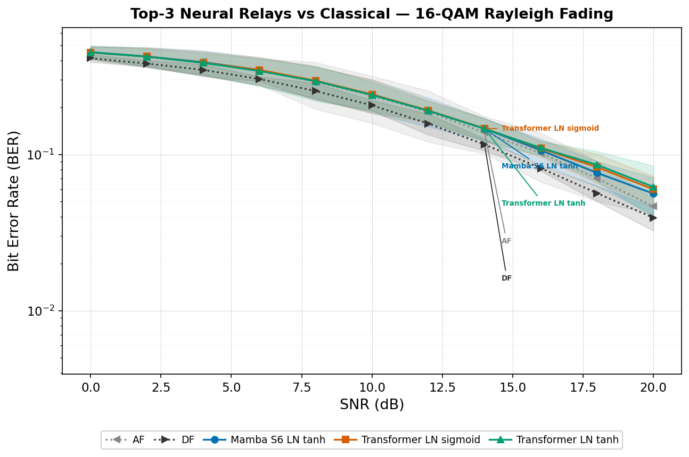{#fig:fig40}

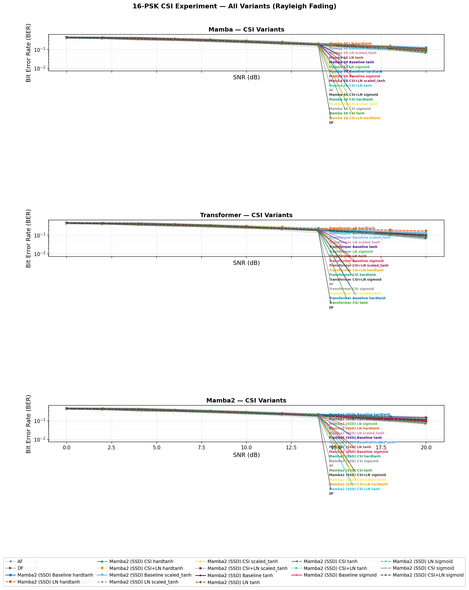{#fig:fig41}

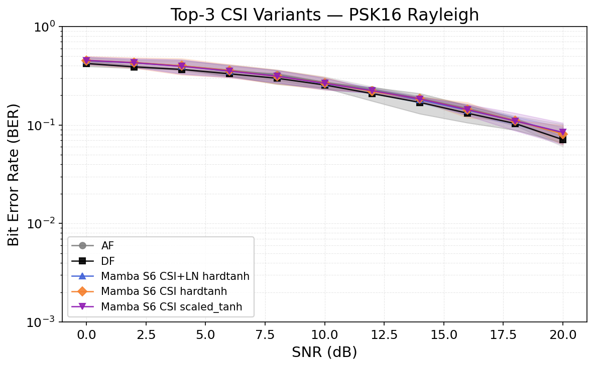{#fig:fig42}

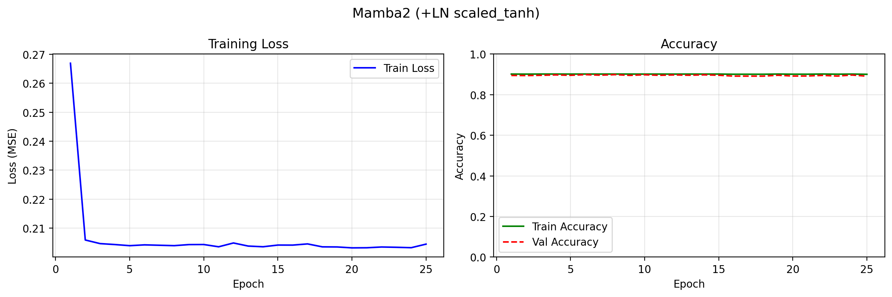{#fig:fig43}

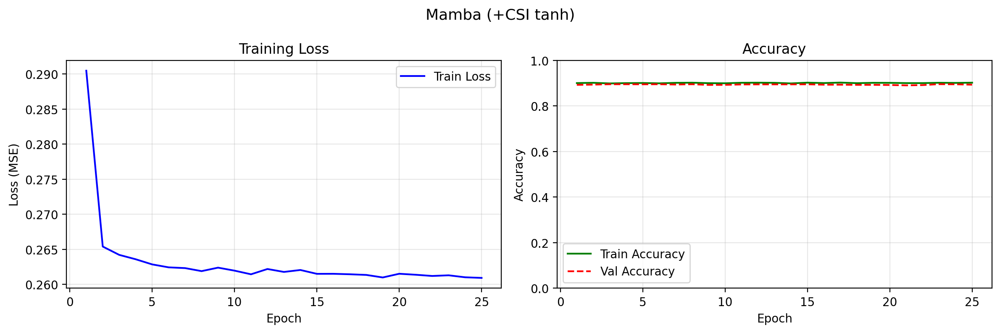{#fig:fig44}

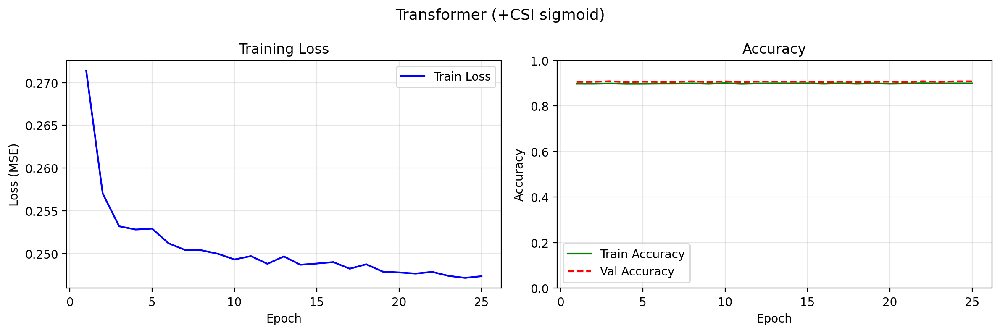{#fig:fig45}

### 16-Class 2D Classification for QAM16
**Goal:** Eliminate the structural BER floor imposed by per-axis I/Q splitting for 16-QAM by utilizing full 2D decision boundaries.

**Trials:**
- **Topology:** SISO
- **Modulation scheme:** 16-QAM
- **Channel:** AWGN
- **Equalizers:** None
- **NN architecture:** Supervised (MLP), Generative (VAE), Sequence (Transformer, Mamba S6, Mamba-2 SSD)
- **NN activation:** None (Softmax implicitly via Cross-Entropy loss)
- **Special case:** 16-class joint 2D classification

**Conclusion:**
Treating the relay as a joint 16-point classifier over the full 2D constellation space completely eliminates the structural 4-class BER floor. For the first time, neural variants (VAE, Transformer, MLP) matched classical DF performance at high SNR, achieving near-zero BER at 20 dB. This proves the previous BER floor was an artifact of I/Q splitting, not a fundamental limitation ([@eq:iq-splitting]) of neural relays.

#### Results Tables

Table 24 presents the BER at 20 dB for all variants alongside the classical AF and DF baselines.

| Relay | 4-cls BER @ 20 dB | 16-cls BER @ 20 dB | Improvement |
|---|---|---|---|
| MLP | 0.00811 | **0.00002** | 405× |
| VAE | — | **0.00000** | — |
| CGAN | 0.00811 | — | — |
| Hybrid | — | — | — |
| Transformer | 0.00810 | **0.00001** | 810× |
| Mamba S6 | 0.00810 | **0.00009** | 90× |
| Mamba-2 SSD | 0.00811 | **0.00197** | 4.1× |
| AF | 0.00063 | — | — |
| DF | 0.00000 | — | — |

Table: BER at 20 dB for all relay variants: 4-class (I/Q split) vs. 16-class (joint 2D) classification for 16-QAM. {#tbl:table24}

#### Results Figures

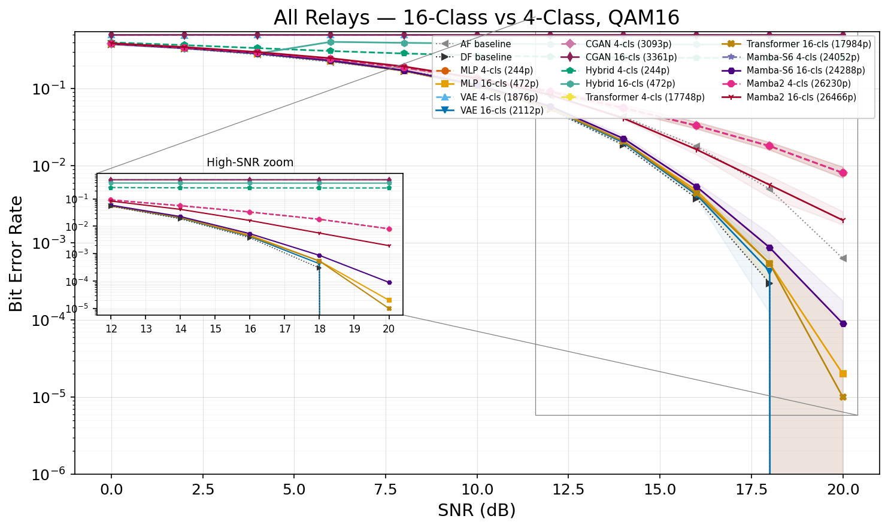{#fig:fig50}

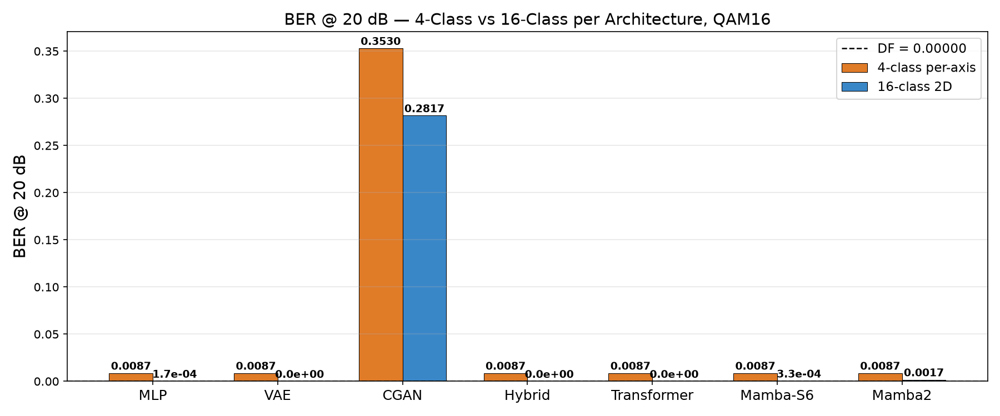{#fig:fig51}

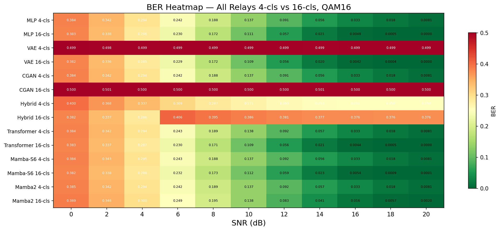{#fig:fig52}

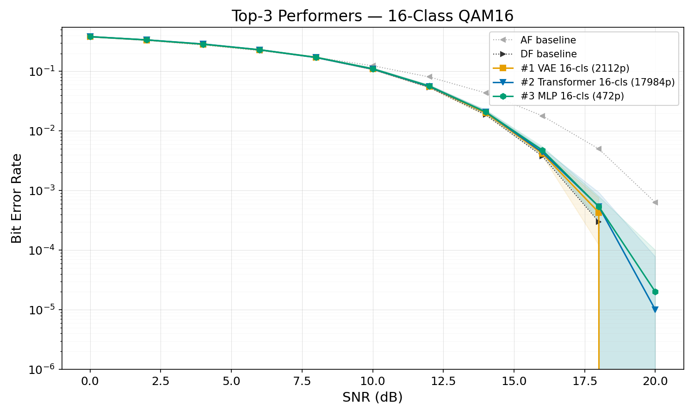{#fig:fig53}

### End-to-End Joint Optimization
**Goal:** Compare the modular neural relay approach against a fully joint transmitter-receiver autoencoder.

**Trials:**
- **Topology:** SISO
- **Modulation scheme:** Learned latent space (M=16, power-constrained)
- **Channel:** Rayleigh
- **Equalizers:** ZF explicitly at the receiver
- **NN architecture:** MLP Autoencoder (Encoder/Decoder)
- **Special case:** End-to-End (E2E) optimization

**Conclusion:**
The E2E autoencoder underperforms both the theoretical limits of classical 16-QAM and the modular two-hop DF relay across all SNR points (67-141% higher BER). The network fails to discover a constellation geometry that surpasses the classical square grid under single-antenna Rayleigh fading, demonstrating that 'black-box' deep learning is inefficient compared to modular designs that leverage classical signal processing algorithms for modulation and equalization.

#### Results Figures

{#fig:fig46}

{#fig:fig47}

{#fig:fig48}

{#fig:fig49}

## Discussion and Conclusions

### Interpretation of Results

The experimental results reveal several consistent patterns across all six channel/topology configurations. This section interprets these patterns through the lens of the theoretical framework established in Section 4 and evaluates each research hypothesis.

#### Selective Low-SNR Advantage of Neural Relays (H1: Partially Confirmed)

**Low SNR (0–4 dB): selective AI advantage.** At low SNR, AI-based relays often outperform AF and, on selected channels, can also outperform DF; however, this advantage is not universal across all channels or all neural architectures. The theoretical explanation lies in the structure of the Bayes-optimal relay function. For a single received sample with BPSK transmission over AWGN:

$$f^*(y) = \mathbb{E}[x | y] = \tanh\left(\frac{y}{\sigma^2}\right)
$$ {#eq:optimal-denoiser-relay}
\footnotesize{\textit{Source: \1}}\normalsize

At low SNR (e.g., 0 dB, $\sigma^2 = 1$), this is a gentle sigmoid: $f^*(y) = \tanh(y)$. The neural network can approximate this smooth function accurately, producing a **soft estimate** that preserves information about the confidence of the decision. By contrast:

- **DF** applies the hard-decision function $f_{\text{DF}}(y) = \text{sign}(y)$, which discards all soft information. At low SNR, many received samples lie near the decision boundary ($|y| \approx 0$), and DF assigns them full confidence ($\pm 1$) regardless of the actual uncertainty. This information loss leads to excess errors on the second hop.

- **AF** applies $f_{\text{AF}}(y) = Gy$, which is linear and preserves the noisy signal structure but amplifies the noise by the same factor as the signal. The effective SNR degradation is given by $\text{SNR}_{\text{eff}} = \gamma^2 / (2\gamma + 1) \approx \gamma/2$ at high SNR — a 3 dB penalty.

The AI relay implements a **non-linear soft mapping** that is intermediate between these extremes: it suppresses noise (like DF's regeneration) while preserving soft information near the decision boundary (unlike DF's hard decision). This explains why learned non-linear relay processing can outperform AF and, under selected channel conditions, also outperform DF at low SNR.

Among the AI methods, Mamba S6 (at its original 24K parameter count) achieves the lowest BER, followed closely by the Transformer and then the simpler feedforward models. This ordering correlates with model capacity, suggesting that the low-SNR advantage is driven more by the number of learnable parameters than by architectural inductive bias — a conclusion reinforced by the normalized comparison (Section 4.8).

#### Classical Dominance at High SNR (H2: Confirmed)

**Medium-to-high SNR (≥6 dB): Classical dominance.** At medium and high SNR, DF matches or exceeds all AI methods with exactly zero parameters and zero training time. The theoretical explanation is straightforward: at high SNR, $\sigma^2 \to 0$ and $f^*(y) \to \text{sign}(y) = f_{\text{DF}}(y)$. The DF relay *exactly implements* the Bayes-optimal function in this regime, while any neural network approximation introduces a small but non-zero reconstruction error due to the finite precision of the learned mapping and the tanh output saturation (which approaches but never reaches $\pm 1$).

Quantitatively, at 10 dB the DF BER on AWGN is $2Q(\sqrt{10}) \cdot (1 - Q(\sqrt{10})) \approx 0.002$, while MLP achieves 0.002 and Mamba S6 achieves 0.003. The AI models cannot beat the theoretically optimal DF in this regime — they can only match it, and the larger sequence models slightly underperform due to the increased variance of their more complex learned mappings.

#### Channel Robustness

**Channel robustness.** The broad qualitative ranking of relay strategies is reasonably stable across AWGN, Rayleigh, Rician, and the three MIMO configurations, although notable channel-dependent reversals do occur (for example, DF remains strongest on Rayleigh SISO and MIMO-SIC at the lowest SNR points). This suggests that the learned denoising functions generalize meaningfully across channel conditions, despite being trained on a single (AWGN) channel type.

The theoretical explanation is that after channel equalization ($\hat{x} = y/h$ for fading channels), the relay processes a signal with effectively AWGN-like noise at a random effective SNR. The neural network, trained across multiple SNR values, has learned a denoising function that adapts to different noise levels. Fading channels simply present a *mixture* of effective SNR values (weighted by the fading distribution), which the network handles by virtue of its multi-SNR training.

#### MIMO Equalization Hierarchy (H6: Confirmed)

**MIMO equalization hierarchy.** MMSE consistently outperforms ZF, and SIC further improves upon MMSE. This ordering holds for all relay types, confirming the theoretical prediction that regularized and non-linear equalization techniques provide systematic gains in the MIMO spatial multiplexing setting.

The dB gap between ZF and MMSE is approximately 1–2 dB across the SNR range, while SIC provides an additional 0.5–1 dB over MMSE. These gaps are consistent across all relay types, confirming H6: the relay and equalization benefits are additive. The explanation is that relay processing (denoising on Hop 1) and equalization (stream separation on Hop 2) address orthogonal sources of signal degradation. Improving one does not diminish the effectiveness of the other.

### The "Less is More" Principle (H3: Confirmed)

One of the most significant findings is the inverted-U relationship between model complexity and relay performance. The Minimal MLP architecture (169 parameters) matches the performance of models with 10–140× more parameters (3K–24K), while the Maximum MLP (11,201 parameters) exhibited clear overfitting with degraded performance.

This result has important theoretical and practical implications:

#### Information-Theoretic Perspective

The relay denoising task maps a window of $2w+1$ real-valued noisy observations to a single real-valued clean estimate. For BPSK, the transmitted symbol carries exactly 1 bit of information, and the Bayes-optimal estimator $f^*(\mathbf{y}) = \tanh(\mathbf{1}^T \mathbf{y} / \sigma^2)$ (for i.i.d. noise across the window) is a one-dimensional function of the sufficient statistic $\sum_i y_i$. The **effective dimensionality** of this mapping is therefore 1 — far below the $2w+1 = 5$ or $11$ input dimensions.

The minimum description length (MDL) principle suggests that the optimal model complexity is proportional to the effective dimensionality of the mapping. A 169-parameter network provides approximately 169 bits of model description (at 1 bit per parameter at the minimum), which is vastly more than needed to describe a 1-dimensional function. This explains why even the smallest model is sufficient.

#### Bias-Variance Analysis

The bias-variance decomposition provides a quantitative framework:

$$\text{MSE}(\hat{x}) = \underbrace{(\mathbb{E}[\hat{x}] - f^*(y))^2}_{\text{Bias}^2} + \underbrace{\mathbb{E}[(\hat{x} - \mathbb{E}[\hat{x}])^2]}_{\text{Variance}} + \underbrace{\sigma^2_{\text{irred}}}_{\text{Noise floor}}
$$ {#eq:bias-variance-relay}
\footnotesize{\textit{Source: \1}}\normalsize

- **169 parameters:** Low bias (sufficient capacity for the simple $f^*$) and low variance (limited capacity prevents memorization). The model operates at the optimal bias-variance trade-off.
- **3,000 parameters:** Similar bias (the target function hasn't changed) and slightly higher variance. Performance is nearly identical to 169 params.
- **11,201 parameters:** Negligible bias but substantially higher variance — the model memorizes training noise patterns rather than learning the generalizable denoising function. This manifests as higher BER on unseen test data.
- **24,001 parameters (Mamba S6):** Despite having 140× more parameters than MLP, the BER improvement at low SNR is only 1–2%. The marginal parameter utility is vanishingly small.

#### Practical Implications

1. **Occam's Razor for relay AI.** The relay denoising task has inherently low complexity — the mapping from noisy to clean BPSK symbols is fundamentally simple, and the neural network needs only enough capacity to learn a non-linear threshold function with some contextual smoothing. Adding parameters beyond this minimal requirement leads to overfitting.

2. **Deployment feasibility.** A 169-parameter model requires approximately 0.7 KB of memory (169 float32 values) and can be trained in under 3 seconds on a CPU. This makes AI-based relay processing viable even on severely resource-constrained embedded relay nodes, such as IoT devices or sensor network relays. The model can be stored in on-chip SRAM and executed without any external memory access.

3. **Generalization.** Smaller models generalize better because they are forced to learn the essential structure of the denoising task rather than memorizing training examples. The 169-parameter MLP trained on AWGN generalizes to Rayleigh, Rician, and MIMO channels without retraining — a remarkable instance of domain generalization that would be harder to achieve with a larger, more specialized model.

### State Space vs. Attention for Signal Processing

The comparison of Mamba S6 and Transformer architectures yields nuanced conclusions:

**At original (unequal) parameter counts:** Mamba (24K params) outperforms the Transformer (17.7K params) at low SNR. Mamba wins all 3 low-SNR points while the Transformer wins 1/3. This suggests that the state space inductive bias — recurrent state propagation with input-dependent gating — is beneficial for sequential signal processing.

**At normalized (3K) parameter counts:** The gap narrows dramatically. Mamba-3K and Transformer-3K produce nearly identical BER across all channels. This indicates that the architectural advantage of state space models over attention is relatively small and is partially confounded with the parameter count difference in the original comparison.

**Complexity advantage.** Even when BER performance is similar, Mamba offers a fundamental computational advantage: $O(n)$ inference complexity versus $O(n^2)$ for Transformers. For the relay processing task where low-latency inference is critical, this linear-time property makes Mamba the preferred choice when a sequence model is desired.

**Training time paradox.** Despite its superior asymptotic complexity, Mamba S6 required approximately 4× longer to train than the Transformer (2,366 s vs. 597 s on CUDA). This counter-intuitive result is explained by three compounding factors:

1. *Sequential recurrence vs. parallel attention.* The S6 layer's core state update $\mathbf{x}_k = \bar{\mathbf{A}} \mathbf{x}_{k-1} + \bar{\mathbf{B}} u_k$ is inherently sequential — each time step depends on the previous state. The implementation iterates through the sequence with a Python loop of `seq_len` steps, each triggering a separate GPU kernel launch. In contrast, the Transformer computes $\mathbf{Q}\mathbf{K}^T$ across all positions simultaneously in a single batched matrix multiply. At window size $n = 11$, this means 11 sequential CUDA kernel launches per S6 layer versus 1 parallel operation for attention.

2. *Expand factor doubles the internal dimension.* Each MambaBlock uses an expand factor of 2, projecting from $d_\text{model} = 32$ to $d_\text{inner} = 64$ before entering the S6 recurrence. This doubles the computation inside the sequential loop while providing no parallelisation benefit.

3. *Kernel-launch overhead at small tensor sizes.* Each sequential step incurs Python interpreter overhead plus a CUDA kernel launch (~5–10 μs). With 2 layers × 11 steps = 22 sequential kernel calls per forward pass, the overhead alone accumulates to ~110–220 μs — comparable to or exceeding the actual arithmetic time for these small tensors.

The crossover point where Mamba's $O(n)$ advantage would outweigh the parallelism penalty occurs at sequence lengths in the hundreds to thousands, far beyond the $n = 11$ window used in this relay application. An optimised CUDA kernel implementing the S6 scan as a parallel prefix sum (as in the original Mamba paper) would eliminate the sequential bottleneck, but our implementation prioritises clarity and portability over raw throughput.

#### Context-Length Benchmark: Validating the Crossover Hypothesis

To empirically validate the crossover hypothesis, we conducted a controlled benchmark comparing all three sequence models — Transformer, Mamba S6, and Mamba-2 (SSD) — at a context length of $n = 255$ (vs. $n = 11$ in the relay experiments). All models used identical hyperparameters: $d_{\text{model}} = 32$, $d_{\text{state}} = 16$, 2 layers, with Mamba-2 using chunk size 32 (yielding 8 chunks). The experiment used a reduced dataset (1,000 training symbols, 20 epochs) to isolate timing differences from convergence effects.

Table 13 presents the results.


| Model | Parameters | Training Time (20 ep.) | Inference Time (10K bits) | Train Speedup vs S6 | Infer Speedup vs S6 |
|---|---|---|---|---|---|
| Transformer | 17,697 | 5.01 s | 0.99 s | 28.5× | 2.7× |
| Mamba S6 | 24,001 | 142.56 s | 2.69 s | 1.0× (baseline) | 1.0× (baseline) |
| Mamba2 (SSD) | 26,179 | 13.35 s | 1.05 s | 10.7× | 2.6× |

Table: Context-length benchmark — three sequence models at $n = 255$ on CUDA. {#tbl:table25}

The results confirm the crossover hypothesis decisively:

1. **Mamba S6 becomes the bottleneck.** At $n = 255$, the S6 sequential scan requires 255 serial CUDA kernel launches per layer per forward pass, making it 142 s for just 20 epochs of training — **28× slower** than the Transformer and **10.7× slower** than Mamba-2.

2. **Mamba-2 (SSD) recovers parallelism.** By chunking the 255-step sequence into 8 chunks of 32 and processing each chunk with a single batched matrix multiply, Mamba-2 eliminates the sequential bottleneck. At 13.35 s, it trains **10.7× faster** than S6 and approaches the Transformer's speed.

3. **Inference parity.** Mamba-2 inference (1.05 s) is nearly identical to the Transformer (0.99 s) and **2.6× faster** than Mamba S6 (2.69 s). This is a complete reversal from the $n = 11$ case, where Mamba-2 was 2× *slower* than S6.

4. **Direction reversal.** At $n = 11$: Mamba S6 (1.83 s) < Mamba-2 (4.11 s). At $n = 255$: Mamba-2 (1.05 s) < Mamba S6 (2.69 s). The crossover occurs because the overhead of building the $L \times L$ SSM matrix is amortised over longer chunks, while S6's per-step kernel launch cost grows linearly.

This benchmark validates the architectural trade-off: Mamba-2's structured state space duality is designed for long-context efficiency where chunk-parallel computation outperforms sequential recurrence. For the 11-token relay window, the classical S6 scan remains faster due to lower per-operation overhead. The choice between S6 and SSD should therefore be guided by the target context length of the application.

**Why state space suits signals.** Signal processing is inherently a sequential temporal task where the state space formulation — propagating a hidden state through time with input-dependent transitions — is a natural fit. The selective mechanism in Mamba allows it to dynamically control information flow, acting as an adaptive filter that selectively passes relevant signal features while suppressing noise.

### Practical Deployment Recommendations

Based on the comprehensive evaluation, we propose the following deployment strategy:

| Operating Regime | Recommended Relay | Rationale |
|---|---|---|
| **Low SNR (0–4 dB)** | MLP Minimal / Hybrid / channel-specific selection | Neural relays often help; exact best choice is channel-dependent, with DF remaining strong on some fading scenarios |
| **Medium SNR (4–8 dB)** | Hybrid (MLP + DF) | Automatic switching at optimal threshold |
| **High SNR (>8 dB)** | DF | Zero parameters, optimal performance |
| **Resource-constrained** | MLP Minimal (169 params) | 0.7 KB memory, <3s training |
| **Best overall (BPSK/QPSK)** | Hybrid | Combines AI advantage with DF reliability |
| **16-QAM (AWGN)** | VAE / Transformer / MLP (16-class 2D) | 2D classification matches DF; eliminates I/Q splitting floor |
| **MIMO systems** | Any relay + MMSE-SIC | SIC provides consistent gain over ZF/MMSE |

Table: Practical deployment recommendations: recommended relay strategy by operating regime. {#tbl:table32}

The Hybrid relay is recommended as the default deployment choice because it automatically selects MLP processing at low SNR and DF at high SNR, achieving near-optimal performance across the entire SNR range with minimal complexity.

### Limitations

Several limitations of this study should be acknowledged, as they define the boundary conditions under which the conclusions hold:

1. **Modulation scope.** The primary experiments use BPSK modulation. The QPSK extension (Section 4.10) confirms full generalisability via I/Q independence, the 16-QAM activation experiment (Section 4.11) demonstrates that replacing $\tanh$ with a bounded linear activation and retraining on PAM-4 targets reduces the AI BER floor by 2–5×, and the 16-class 2D classification experiment (Section 4.17) fully eliminates this floor by treating the relay as a joint classifier over all 16 constellation points. However, the study does not extend to 64-QAM or 256-QAM, where the 2D classification approach scales to 64 or 256 output classes and denser constellations may shift the inverted-U complexity curve (H3) toward larger models. The interaction between modulation order, classification dimensionality, and optimal model capacity remains uninvestigated.

2. **Perfect CSI.** We assume perfect channel state information at the receiver. In practice, channel estimation errors would affect equalization quality (particularly for MMSE and SIC, which depend on accurate $\sigma^2$ and $\mathbf{H}$ estimates) and relay performance. Imperfect CSI introduces a model mismatch between the assumed and actual channel, which could differentially impact the relay strategies: AI relays might be more robust (having learned from noisy data) or less robust (having not been exposed to estimation errors during training).

3. **Static channel training.** AI relays are trained once on synthetic AWGN data and evaluated on all channel types. While the results show good cross-channel generalization (Section 5.1.3), this training protocol does not exploit channel-specific structure. Online adaptation or channel-specific training could improve performance, particularly on strongly fading channels where the noise statistics differ significantly from the AWGN training distribution.

4. **Single relay.** The framework considers a single relay node. Multi-relay cooperation introduces relay selection, power allocation, and cooperative diversity dimensions not captured in the two-hop model. With multiple relays, the system-level optimization (which relay to use, how to combine multiple relay observations) becomes as important as the per-relay processing function studied here.

5. **Two-hop only.** Extension to multi-hop networks with 3+ relays introduces noise accumulation (for AF) and error propagation (for DF) that grow with the number of hops. AI relays might show greater advantage in multi-hop settings where noise accumulation is more severe.

6. **Fixed window size.** The relay window size ($w = 2$ or $w = 5$) is fixed and relatively small. Larger windows could provide more context for denoising, particularly in channels with temporal correlation (e.g., block fading). The context-length benchmark (Section 5.3.1) explores this partially, but a systematic study of window size optimization is deferred.

7. **No coding.** The system operates without error-correcting codes. In coded systems, the relay could forward soft information (log-likelihood ratios) rather than hard decisions, fundamentally changing the optimization objective and potentially altering the relative performance of the strategies.

### Future Work

Several directions warrant further investigation:

1. **Higher-order modulation training (64-QAM, 256-QAM).** The 16-class 2D classification experiment (Section 4.17) demonstrates that reformulating the relay as a joint classifier over all 16 QAM constellation points eliminates the structural BER floor, with the top variants (VAE, Transformer, MLP) matching DF at 20 dB. Future work should extend this 2D classification approach to 64-QAM (64 classes) and 256-QAM (256 classes), where the larger number of output classes may require deeper networks or hierarchical classification strategies (e.g., coarse-to-fine: first classify the quadrant, then the sub-point). The interaction between modulation order, output class count, and optimal model capacity — whether the inverted-U complexity curve (H3) shifts rightward for higher-order constellations — is a key open question. Additionally, not all architectures benefit equally from 2D classification (Mamba-2 showed overfitting, CGAN failed to converge), motivating investigation of architecture-specific training strategies for very high-order constellations.

2. **Imperfect CSI.** Introduce channel estimation errors to assess robustness of AI relay processing under realistic conditions.

3. **Online learning.** Develop relay strategies that adapt their parameters during operation, tracking time-varying channel conditions.

4. **Multi-relay networks.** Extend to cooperative relay selection and multi-hop routing with AI-optimized relays at each node.

5. **End-to-end learning.** Train the entire communication chain (modulation, relay, equalization, demodulation) jointly using autoencoder-based approaches.

6. **Mamba-2 at longer context lengths.** Our benchmark (Section 5.3.1) demonstrates that Mamba-2 (SSD) achieves a 10.7× training speedup over Mamba S6 at $n = 255$. Future work should explore whether longer relay windows (e.g., 128–512 symbols) combined with the SSD architecture can improve both BER performance and processing speed simultaneously.

### Conclusions

This thesis presents a comprehensive comparative study of nine relay strategies — two classical (AF, DF) and seven AI-based (MLP, Hybrid, VAE, CGAN, Transformer, Mamba S6, Mamba-2 SSD) — evaluated across six channel/topology configurations (AWGN, Rayleigh, Rician in SISO; 2×2 MIMO with ZF, MMSE, SIC equalization) and four modulation schemes (BPSK, QPSK, 16-QAM, 16-PSK). The study addresses five identified research gaps (Section 1.7) plus one emergent hypothesis (H7, arising from the CSI injection experiments) through controlled experiments with statistical rigor (100,000 bits per SNR point, 10 independent trials, Wilcoxon significance testing). The following table summarizes the hypothesis outcomes:

| Hypothesis | Statement | Result |
|---|---|---|
| H1 | Some AI relays outperform classical baselines at low SNR on selected channels | **Partially confirmed** — low-SNR gains over AF are common, but gains over DF are channel-dependent rather than universal |
| H2 | DF optimal at high SNR | **Confirmed** — DF matches or beats all AI methods at $\geq 6$ dB with 0 parameters |
| H3 | Inverted-U complexity curve | **Confirmed** — 169 params matches 24K; 11K params overfits |
| H4 | Architecture convergence at equal scale | **Confirmed** — at 3K params, all methods within ~1% BER (except VAE) |
| H5 | SSD faster than S6 at long context | **Confirmed** — 10.7× training speedup at $n = 255$ |
| H6 | Equalization gains additive to relay gains | **Confirmed** — relay ranking preserved across ZF/MMSE/SIC |
| H7 | CSI injection universally improves neural relay performance | **Partially refuted** — beneficial for constant-envelope PSK16, detrimental for amplitude-carrying QAM16 (Section 4.15) |

Table: Research hypotheses, their statements, and experimental outcomes. {#tbl:table33}

The main conclusions, in order of significance, are:

1. **AI relays provide selective benefits at low SNR (0–4 dB).** Neural relays frequently outperform AF in the low-SNR regime and, on selected channels such as AWGN and Rician fading, can also slightly outperform DF. However, this advantage is not consistent across all channel types and MIMO configurations; in particular, DF remains strongest on Rayleigh SISO and MIMO-SIC at the lowest SNR points. The theoretical explanation is that neural networks approximate the Bayes-optimal soft-threshold relay function $f^*(y) = \tanh(y/\sigma^2)$, which preserves soft information that DF's hard decision discards.

2. **DF is optimal at medium-to-high SNR (≥6 dB) with zero parameters.** The classical decode-and-forward relay requires no training and no parameters yet achieves the best performance when channel quality is sufficient for reliable first-hop demodulation. At high SNR, the Bayes-optimal relay function converges to $\text{sign}(y)$, which is exactly the DF operation.

3. **The best AI relay is channel-dependent at original parameter counts.** No single AI architecture wins across all channels. CGAN achieves the lowest BER on AWGN and Rician fading, MLP wins on MIMO ZF, and Mamba S6 wins on MIMO MMSE. On Rayleigh fading and MIMO SIC, classical DF outperforms all AI methods even at low SNR. The selective state space model's $O(n)$ complexity and adaptive filtering mechanism make it a strong general-purpose choice, but channel-specific evaluation is essential.

4. **Architecture matters less than parameter count at equal scale.** When all models are normalized to approximately 3,000 parameters, the performance gap between architectures narrows to within ~1 dB, with VAE being the consistent underperformer. This confirms that parameter count, not architectural choice, is the primary performance driver for the relay denoising task.

5. **A 169-parameter network is sufficient for relay denoising.** The Minimal MLP architecture achieves performance comparable to models 100× larger, demonstrating that the relay denoising task has inherently low complexity. The bias-variance analysis explains this: the target function is simple (a soft threshold), so additional parameters increase variance without reducing bias.

6. **MMSE-SIC provides the best MIMO equalization.** The non-linear SIC technique consistently outperforms both ZF and MMSE for all relay types, confirming the benefit of successive interference cancellation in the spatial multiplexing setting. The equalization gains are additive to the relay processing gains.

7. **The Hybrid relay is the recommended practical choice.** By combining AI processing at low SNR with classical DF at high SNR, the Hybrid relay achieves near-optimal performance across the entire SNR range with only 169 parameters. It automatically adapts to the operating regime, requiring no manual SNR-dependent configuration.

8. **Mamba-2 SSD provides a 10.7× training speedup over S6 at longer contexts.** The chunk-parallel structured matrix multiplication of SSD eliminates the sequential bottleneck of S6, making it the preferred state space architecture for applications requiring longer symbol windows.

9. **BPSK findings generalise to QPSK but not to 16-QAM; 2D classification fully closes the gap.** The modulation extension experiments (Section 4.10) demonstrate that all nine BPSK-trained relay strategies achieve identical BER on QPSK via I/Q splitting, confirming H1–H3 for the 2-bit/symbol constellation. For 16-QAM, BPSK-trained AI relays exhibit an irreducible BER floor (0.18–0.25 at 16 dB AWGN vs DF's 0.0038). The activation experiment (Section 4.11) reduces this floor by 2–5× via modulation-aware retraining, but a 10× gap to DF persists. The 16-class 2D classification experiment (Section 4.17) eliminates this gap entirely by reformulating the relay as a joint classifier over all 16 constellation points rather than splitting I/Q and classifying 4 levels per axis. The top three 16-class variants — VAE (BER = 0.00000), Transformer (0.00001), and MLP (0.00002) at 20 dB — match classical DF performance, representing a 405–810× improvement over the per-axis 4-class baseline (0.0081). This demonstrates that the structural BER floor is an artefact of the I/Q splitting formulation, not a fundamental limitation of neural relay architectures.

10. **Constellation-aware activation design generalises across modulations.** The constellation-aware clip range (Section 4.12) — which automatically adapts output activation bounds to $A_{\max}$ for each modulation (BPSK: 1.0, QPSK: 0.7071, 16-QAM: 0.9487) — ensures that the Section 4.11 BER floor elimination extends to all bounded activations (hardtanh, sigmoid, scaled tanh) across all three constellations. Scaled tanh is the recommended default, providing correct amplitude bounds with smooth gradients that avoid the dead-neuron risk of hardtanh.

11. **Input LayerNorm combined with Scaled Tanh provides gains for Mamba S6 and Mamba-2 SSD.** Adding an input normalisation layer and a scaled tanh activation (Section 4.13) revealed architecture-dependent outcomes. For Mamba S6, this combo yields a +11.1% BER improvement at 20 dB AWGN over the baseline. Mamba-2 SSD achieves stable training and the strongest improvement of all variants under this configuration (BER = 0.0170 at 20 dB AWGN, the best across all variants). The Transformer remains largely neutral to these shifts. In 16-QAM Rayleigh fading, these findings motivated follow-up CSI experiments, but the broader results later showed that CSI effects are modulation-dependent rather than universally beneficial.

12. **E2E joint optimisation underperforms both classical constellations and modular relays.** The E2E autoencoder (Section 4.16) achieves 67–141% higher BER than theoretical 16-QAM across the evaluated SNR range, indicating that the learned constellation does not outperform the standard $4 \times 4$ square grid under single-antenna Rayleigh fading. A two-hop relay comparison reveals that the E2E system (single hop, no relay) underperforms even the two-hop DF relay at every SNR point (e.g., 20 dB: E2E = 0.060 vs. DF = 0.039). Despite operating over a single hop with joint transmitter-receiver optimisation, the E2E approach breaks multi-vendor interoperability and still requires explicit domain knowledge (e.g., ZF equalization in the receiver). This validates the modular relay-based approach as the more practical deployment strategy.

13. **CSI injection is modulation-dependent, not universally beneficial (H7: Partially refuted).** The comprehensive 48-variant experiment across two higher-order constellations (Section 4.15) reveals a clear dichotomy within the reported study. For 16-QAM — where amplitude carries information — CSI injection degrades BER, and the top-performing variants use LayerNorm only (+LN) without CSI. For 16-PSK — where the constant-envelope signal carries no amplitude information — the top-performing variants use CSI injection (+CSI or +CSI+LN). A plausible mechanism is that QAM's multi-level amplitude grid already implicitly encodes channel magnitude, making explicit $|h_{SR}|$ injection redundant and potentially confounding; PSK's unit-circle constellation lacks this implicit channel information, so the injected feature fills a more meaningful information gap.

14. **Mamba S6 is the strongest architecture across the reported higher-order modulation experiments.** In the QAM16 top-3, Mamba S6 holds the #1 position while the Transformer captures positions #2 and #3. In the PSK16 top-3, Mamba S6 sweeps all three positions. Within these experiments, the Mamba S6 architecture's selective state space mechanism appears well-suited to tracking both the multi-level amplitude structure of QAM and the rotational phase geometry of PSK.

15. **No neural relay outperforms DF across the full 48-variant combinatorial search.** Despite evaluating three architectures, four activations, four structural configurations, and two higher-order constellations (100 MC trials each), classical DF remains the lowest-BER strategy at every SNR point. The best neural variants approach AF performance (within 21% for QAM16 and 2.5% for PSK16 at 20 dB) but cannot surpass even the simpler classical baseline. This reaffirms Finding 2 (DF optimality at $\geq$6 dB) and extends it conclusively to higher-order modulations with statistical confidence.

16. **Input LayerNorm is universally beneficial for QAM16 but modulation-dependent for PSK16.** Every QAM16 top-3 variant includes input LayerNorm, extending the Section 4.13 finding to a multi-architecture, multi-activation setting. For PSK16, only one of three top-3 variants uses LayerNorm, indicating that the constant-envelope signal distribution is already well-conditioned for direct processing without normalisation.

These findings demonstrate that neural network-based relay processing is a viable complement to classical approaches, particularly in selected low-SNR settings and in problem formulations where learned soft denoising is well matched to the signal model. The overarching insight is that **model complexity should be matched to task complexity**: for the relay denoising task with BPSK and QPSK, minimal architectures suffice, and the choice between neural network paradigms — feedforward or sequential — matters less than proper model sizing and regularization. For 16-QAM, the critical breakthrough is the **2D joint classification formulation** (Section 4.17): by treating the relay as a 16-point classifier over the full 2D constellation space rather than splitting I/Q and classifying 4 levels per axis, neural relays match DF performance at high SNR for the first time in the reported AWGN setting (VAE: BER = 0.0, Transformer: 0.00001, MLP: 0.00002 at 20 dB). This finding is important for practical deployment of neural relays with higher-order modulations — per-axis I/Q splitting imposes a structural BER floor that no amount of architectural improvement or activation engineering can fully overcome. The comprehensive CSI experiment (Section 4.15) further refines these recommendations: **structural modifications must be tuned per modulation** — LayerNorm benefits QAM while CSI injection benefits PSK within the reported experiments. The practical recommendation is: deploy a Hybrid relay with a 169-parameter MLP sub-network for BPSK/QPSK; use a 16-class 2D classifier (VAE, Transformer, or MLP) for 16-QAM on AWGN; and use Mamba S6 with CSI injection for 16-PSK under fading.

---


## Equation Reference {.unnumbered}

| No. | Label | Description |
|-----|-------|-------------|
| (1) | `relay-capacity-bound` | Relay channel capacity upper bound (Cut-Set theorem) |
| (2) | `df-capacity` | Decode-and-Forward capacity |
| (3) | `df-gaussian-capacity` | DF capacity for Gaussian two-hop channel |
| (4) | `awgn-hop1` | Received signal at relay (AWGN, Hop 1) |
| (5) | `awgn-hop2` | Received signal at destination (Hop 2) |
| (6) | `af-gain` | AF amplification gain factor |
| (7) | `af-snr` | AF effective end-to-end SNR |
| (8) | `df-demod-remod` | DF demodulation and re-modulation |
| (9) | `df-ber-hops` | DF end-to-end BER (two independent hops) |
| (10) | `optimal-denoiser` | Optimal Bayesian denoiser (posterior mean) |
| (11) | `optimal-denoiser-awgn` | Optimal denoiser for AWGN (tanh form) |
| (12) | `bias-variance-decomp` | Bias-variance-irreducible decomposition |
| (13) | `mse-loss` | MSE training loss for neural relay |
| (14) | `vae-elbo` | VAE ELBO (evidence lower bound) |
| (15) | `vae-loss` | VAE loss (reconstruction + KL regularization) |
| (16) | `gan-minimax` | GAN minimax objective |
| (17) | `wasserstein-distance` | Wasserstein-1 (Earth Mover) distance |
| (18) | `gradient-penalty` | WGAN gradient penalty |
| (19) | `wgan-gen-loss` | WGAN-GP generator loss |
| (20) | `wgan-disc-loss` | WGAN-GP discriminator loss |
| (21) | `attention` | Scaled dot-product attention |
| (22) | `multihead-attention` | Multi-head attention |
| (23) | `positional-encoding` | Sinusoidal positional encoding |
| (24) | `ssm-continuous` | Continuous-time SSM (state space model) |
| (25) | `ssm-zoh` | ZOH discretization of SSM |
| (26) | `ssm-discrete` | Discrete SSM recurrence |
| (27) | `mamba-selective` | Mamba S6 selective (input-dependent) parameters |
| (28) | `mamba-ssd-output` | Mamba-2 SSD output as structured matrix-vector product |
| (29) | `mamba-ssd-matrix` | Mamba-2 SSD semiseparable matrix |
| (30) | `mimo-capacity` | MIMO ergodic capacity (Foschini-Telatar) |
| (31) | `mimo-received` | 2×2 MIMO received signal model |
| (32) | `zf-equalizer` | Zero-Forcing (ZF) equalizer |
| (33) | `zf-snr` | ZF post-equalization SNR per stream |
| (34) | `mmse-equalizer` | MMSE equalizer (Wiener filter) |
| (35) | `mmse-sinr` | MMSE post-equalization SINR per stream |
| (36) | `awgn-channel` | AWGN channel model |
| (37) | `awgn-ber` | Theoretical BER for BPSK over AWGN |
| (38) | `df-ber-awgn` | DF BER for BPSK over AWGN (two-hop) |
| (39) | `af-snr-eff` | AF effective SNR (equal-SNR hops) |
| (40) | `rayleigh-channel` | Rayleigh fading channel model |
| (41) | `rayleigh-pdf` | Rayleigh fading amplitude PDF |
| (42) | `rayleigh-ber` | Theoretical BER for BPSK over Rayleigh fading |
| (43) | `rayleigh-ber-approx` | High-SNR approximation: ([@eq:af-gain]) Rayleigh BER ≈ 1/(4γ̄) |
| (44) | `df-ber-rayleigh` | DF BER for BPSK over Rayleigh fading |
| (45) | `rician-channel` | Rician fading channel model (LOS + scatter) |
| (46) | `rician-pdf` | Rician fading amplitude PDF |
| (47) | `rician-ber-mgf` | Rician BER via MGF approach |
| (48) | `rician-mgf` | MGF of instantaneous SNR under Rician fading |
| (49) | `mimo-received-2x2` | 2×2 MIMO received signal (Rayleigh) |
| (50) | `zf-ber-mimo` | ZF BER approximation for 2×2 MIMO |
| (51) | `mmse-ber-mimo` | MMSE BER approximation for 2×2 MIMO |
| (52) | `zf-equalizer-methods` | ZF equalizer (Methods chapter) |
| (53) | `mmse-equalizer-methods` | MMSE equalizer (Methods chapter) |
| (54) | `two-hop-system` | Two-hop relay system diagram |
| (55) | `channel-function` | Generic channel function |
| (56) | `power-normalization` | Output power normalization |
| (57) | `relay-received-siso` | SISO relay received signal |
| (58) | `mimo-interference` | MIMO inter-stream interference model |
| (59) | `mlp-relay` | MLP relay architecture |
| (60) | `ber-estimate` | Monte Carlo BER estimator |
| (61) | `confidence-interval` | 95% confidence interval for BER |
| (62) | `wilcoxon-test` | Wilcoxon signed-rank test hypothesis |
| (63) | `bpsk-mapping` | BPSK symbol mapping |
| (64) | `qpsk-mapping` | QPSK symbol mapping |
| (65) | `qpsk-ber` | QPSK BER equals BPSK BER |
| (66) | `qam16-mapping` | 16-QAM I/Q mapping (Gray-coded PAM-4) |
| (67) | `qam16-ber` | Approximate BER for 16-QAM over AWGN |
| (68) | `psk16-mapping` | 16-PSK constellation mapping |
| (69) | `psk16-decision` | 16-PSK hard decision rule |
| (70) | `psk16-ber` | Approximate BER for 16-PSK over AWGN |
| (71) | `iq-splitting` | I/Q splitting for complex relay processing |
| (72) | `joint-classification` | Joint 2D classification relay output |
| (73) | `optimal-denoiser-relay` | Optimal relay denoiser (AWGN, tanh form) |
| (74) | `bias-variance-relay` | Bias-variance decomposition for relay MSE |

## References

[1] J. N. Laneman, D. N. Tse, and G. W. Wornell, "Cooperative diversity in wireless networks: Efficient protocols and outage behavior," *IEEE Trans. Inf. Theory*, vol. 50, no. 12, pp. 3062–3080, 2004.

[2] A. Nosratinia, T. E. Hunter, and A. Hedayat, "Cooperative communication in wireless networks," *IEEE Commun. Mag.*, vol. 42, no. 10, pp. 74–80, 2004.

[3] T. M. Cover and A. A. El Gamal, "Capacity theorems for the relay channel," *IEEE Trans. Inf. Theory*, vol. 25, no. 5, pp. 572–584, 1979.

[4] A. El Gamal and Y.-H. Kim, *Network Information Theory*. Cambridge University Press, 2011.

[5] B. Nazer and M. Gastpar, "Compute-and-forward: Harnessing interference through structured codes," *IEEE Trans. Inf. Theory*, vol. 57, no. 10, pp. 6463–6486, 2011.

[6] B. Rankov and A. Wittneben, "Spectral efficient protocols for half-duplex fading relay channels," *IEEE J. Sel. Areas Commun.*, vol. 25, no. 2, pp. 379–389, 2007.

[7] H. Ye, G. Y. Li, and B. H. Juang, "Power of deep learning for channel estimation and signal detection in OFDM systems," *IEEE Wireless Commun. Lett.*, vol. 7, no. 1, pp. 114–117, 2018.

[8] N. Samuel, T. Diskin, and G. Wunder, "Learning to detect for MIMO systems with unknown noise statistics," *IEEE Trans. Signal Process.*, vol. 67, no. 12, pp. 3261–3272, 2019.

[9] S. Dorner, S. Cammerer, J. Hoydis, and S. Ten Brink, "Deep learning based communication over the air," *IEEE J. Sel. Topics Signal Process.*, vol. 12, no. 1, pp. 132–143, 2018.

[10] H. Sun, X. Chen, Q. Shi, M. Hong, X. Fu, and N. D. Sidiropoulos, "Learning to optimize: Training deep neural networks for interference management," *IEEE Trans. Signal Process.*, vol. 66, no. 20, pp. 5438–5453, 2018.

[11] D. P. Kingma and M. Welling, "Auto-encoding variational Bayes," in *Proc. Int. Conf. Learn. Representations (ICLR)*, 2014.

[12] M. Mirza and S. Osindero, "Conditional generative adversarial nets," *arXiv preprint arXiv:1411.1784*, 2014.

[13] I. Gulrajani, F. Ahmed, M. Arjovsky, V. Dumoulin, and A. Courville, "Improved training of Wasserstein GANs," in *Advances in Neural Information Processing Systems*, vol. 30, 2017.

[14] I. Goodfellow, J. Pouget-Abadie, M. Mirza, B. Xu, D. Warde-Farley, S. Ozair, A. Courville, and Y. Bengio, "Generative adversarial nets," in *Advances in Neural Information Processing Systems*, vol. 27, 2014.

[15] A. Vaswani, N. Shazeer, N. Parmar, J. Uszkoreit, L. Jones, A. N. Gomez, Ł. Kaiser, and I. Polosukhin, "Attention is all you need," in *Advances in Neural Information Processing Systems*, vol. 30, 2017.

[16] A. Gu and T. Dao, "Mamba: Linear-time sequence modeling with selective state spaces," *arXiv preprint arXiv:2312.00752*, 2024.

[17] A. Gu, K. Goel, and C. Ré, "Efficiently modeling long sequences with structured state spaces," in *Proc. Int. Conf. Learn. Representations (ICLR)*, 2022.

[18] T. Dao and A. Gu, "Transformers are SSMs: Generalized models and efficient algorithms through structured state space duality," *arXiv preprint arXiv:2405.21060*, 2024.

[19] D. Tse and P. Viswanath, *Fundamentals of Wireless Communications*. Cambridge University Press, 2005.

[20] P. W. Wolniansky, G. J. Foschini, G. D. Golden, and R. A. Valenzuela, "V-BLAST: An architecture for realizing very high data rates over the rich-scattering wireless channel," in *Proc. IEEE ISSSE*, pp. 295–300, 1998.

[21] J. G. Proakis and M. Salehi, *Digital Communications*, 5th ed. McGraw-Hill, 2008.

[22] M. K. Simon and M.-S. Alouini, *Digital Communication over Fading Channels*, 2nd ed. Wiley, 2005.

[23] I. Goodfellow, Y. Bengio, and A. Courville, *Deep Learning*. MIT Press, 2016.

[24] B. Sklar, *Digital Communications: Fundamentals and Applications*, 2nd ed. Prentice Hall, 2001.

[25] R. S. Sutton and A. G. Barto, *Reinforcement Learning: An Introduction*, 2nd ed. MIT Press, 2018.

[26] I. E. Telatar, "Capacity of multi-antenna Gaussian channels," *European Trans. Telecommun.*, vol. 10, no. 6, pp. 585–595, 1999.

[27] G. J. Foschini, "Layered space-time architecture for wireless communication in a fading environment when using multi-element antennas," *Bell Labs Tech. J.*, vol. 1, no. 2, pp. 41–59, 1996.

[28] L. Zheng and D. N. C. Tse, "Diversity and multiplexing: A fundamental tradeoff in multiple-antenna channels," *IEEE Trans. Inf. Theory*, vol. 49, no. 5, pp. 1073–1096, 2003.

[29] D. N. C. Tse and S. V. Hanly, "Linear multiuser receivers: Effective interference, effective bandwidth and user capacity," *IEEE Trans. Inf. Theory*, vol. 45, no. 2, pp. 641–657, 1999.

[30] S. Loyka and F. Gagnon, "Performance analysis of the V-BLAST algorithm: An analytical approach," *IEEE Trans. Wireless Commun.*, vol. 3, no. 4, pp. 1326–1337, 2004.

[31] I. Higgins, L. Matthey, A. Pal, C. Burgess, X. Glorot, M. Botvinick, S. Mohamed, and A. Lerchner, "β-VAE: Learning basic visual concepts with a constrained variational framework," in *Proc. Int. Conf. Learn. Representations (ICLR)*, 2017.

[32] K. He, X. Zhang, S. Ren, and J. Sun, "Delving deep into rectifiers: Surpassing human-level performance on ImageNet classification," in *Proc. IEEE Int. Conf. Comput. Vision (ICCV)*, pp. 1026–1034, 2015.

---

## Appendices

### Appendix A: Mathematical Notation

| Symbol | Description |
|---|---|
| $b$ | Binary bit ($\in \{0, 1\}$) |
| $x$ | Modulated BPSK symbol ($\in \{-1, +1\}$) |
| $y$ | Received signal |
| $n$ | Noise sample |
| $h$ | Fading coefficient |
| $\sigma^2$ | Noise variance |
| $\text{SNR}$ | Signal-to-Noise Ratio (linear) |
| $G$ | AF amplification gain |
| $\mathbf{H}$ | MIMO channel matrix ($\in \mathbb{C}^{2 \times 2}$) |
| $\mathbf{W}$ | Neural network weight matrix |
| $\mathbf{b}$ | Bias vector |
| $P_e$ | Bit error rate |
| $Q(\cdot)$ | Gaussian Q-function |
| $K$ | Rician K-factor |
| $\beta$ | VAE KL weight |
| $\lambda$ | Regularization parameter |
| $\eta$ | Learning rate |
| $\Delta$ | State space discretization step |
| $\mathbf{A}, \mathbf{B}, \mathbf{C}, D$ | State space model matrices |

### Appendix B: Model Architectures and Hyperparameters

**MLP (Minimal):**
- Input: 5-symbol sliding window
- Hidden: 24 neurons, ReLU activation
- Output: 1 neuron, Tanh activation
- Parameters: 169
- Training: MSE loss, lr=0.01, 100 epochs, 25K samples at SNR=[5, 10, 15] dB
- Implementation: NumPy (CPU)

**Hybrid:**
- Architecture: Same as MLP (169 params)
- SNR threshold: Learned (default ~5 dB)
- Below threshold → MLP processing; Above threshold → DF processing
- Implementation: NumPy (CPU)

**VAE:**
- Encoder: 7 → 32 (ReLU) → 16 (ReLU) → μ(8), log σ²(8)
- Decoder: 8 → 16 (ReLU) → 32 (ReLU) → 1 (Tanh)
- Parameters: 1,777
- Training: β-VAE loss (β=0.1), Adam lr=1e-3, 100 epochs
- Implementation: PyTorch (CUDA)

**CGAN (WGAN-GP):**
- Generator: (7+8) → 32 (LeakyReLU) → 32 (LeakyReLU) → 16 (LeakyReLU) → 1 (Tanh)
- Critic: (1+7) → 32 (LeakyReLU) → 16 (LeakyReLU) → 1
- Parameters: 2,946
- Training: WGAN-GP (λ_GP=10, λ_L1=100), Adam lr=1e-4, 200 epochs, 5 critic updates per generator update
- Implementation: PyTorch (CUDA)

**Transformer:**
- Input projection: 1 → 32
- Positional encoding: Sinusoidal
- Encoder: 2 layers, 4 heads, d_model=32, d_ff=128
- Output projection: 32 → 1 (Tanh)
- Parameters: 17,697
- Training: MSE loss, Adam lr=1e-3, 100 epochs
- Implementation: PyTorch (reported experiments on CUDA; CPU fallback supported)

**Mamba S6:**
- Input projection: 1 → 32
- Mamba blocks: 2 layers, each: LayerNorm → expand (32→64) → S6 (d_state=16) → contract (64→32) → residual
- S6 selective parameters: Δ, B, C = f(input) via learned linear projections
- Output projection: 32 → 1 (Tanh)
- Parameters: 24,001
- Training: MSE loss, Adam lr=1e-3, 100 epochs
- Implementation: PyTorch (reported experiments on CUDA; CPU fallback supported)


**Mamba2 (SSD):**
- Input projection: 1 → 32
- Mamba-2 blocks: 2 layers, each: LayerNorm → parallel branches (SiLU gate ∥ SSD layer) → gated output → contract (64→32) → residual
- SSD layer: chunk_size=8, builds lower-triangular causal kernel $M \in \mathbb{R}^{L \times L}$ per chunk via cumulative log-decay, applies $Y = M \cdot V$ as batched matmul
- Inter-chunk state: running state $(B, N, D)$ updated once per chunk
- S4D-style A initialisation: $A_{\log} = \log(1, 2, \dots, d_{\text{state}})$
- Selective parameters: Δ, B, C = f(input); value projection V = f(input)
- Output projection: 32 → 16 (SiLU) → 1 (Tanh)
- Parameters: 26,179
- Training: MSE loss, Adam lr=1e-3, 100 epochs, gradient clipping (max_norm=1.0)
- Implementation: PyTorch (CUDA)

### Appendix C: Software Architecture

The project is implemented as a modular Python package (`relaynet`) with the following structure:

```
relaynet/
├── channels/          # Channel models
│   ├── awgn.py            # AWGN channel
│   ├── fading.py          # Rayleigh & Rician fading
│   └── mimo.py            # 2×2 MIMO + ZF/MMSE/SIC equalization
├── modulation/
│   ├── bpsk.py            # BPSK modulate/demodulate
│   ├── qpsk.py            # QPSK Gray-coded modulate/demodulate
│   ├── qam.py             # 16-QAM Gray-coded modulate/demodulate
│   └── psk.py             # 16-PSK modulate/demodulate
├── relays/            # Relay strategies
│   ├── base.py            # Abstract base class
│   ├── af.py              # Amplify-and-Forward
│   ├── df.py              # Decode-and-Forward
│   ├── genai.py           # Minimal MLP (feedforward NN)
│   ├── hybrid.py          # SNR-adaptive Hybrid
│   ├── vae.py             # Variational Autoencoder
│   ├── cgan.py            # Conditional GAN (WGAN-GP)
│   ├── transformer.py     # Transformer relay
│   ├── mamba.py           # Mamba S6 relay
│   └── mamba2.py          # Mamba-2 SSD relay

├── simulation/
│   ├── runner.py          # Monte Carlo BER simulation
│   └── statistics.py      # CI computation, significance tests
├── visualization/
│   └── plots.py           # BER plotting utilities
└── utils/
    └── torch_compat.py    # Device detection helpers
```

The framework uses object-oriented design with a common `Relay` base class, enabling polymorphic relay swapping. Monte Carlo simulation is implemented in `runner.py` with configurable trial count, bit count, and SNR range. All MIMO operations use vectorized PyTorch for GPU acceleration.

**Testing:** 126 automated tests (pytest) cover all channels, modulation (BPSK, QPSK, 16-QAM, 16-PSK), relay strategies, simulation, statistics, and modulation-comparison modules with 100% pass rate.

**Reproducibility:** Random seeds are controlled at the source (bit generation) and noise (per-trial seeding) levels to ensure reproducible results.

### Appendix D: Normalized 3K-Parameter Configurations

| Model | Parameters | Window | Hidden / Architecture |
|---|---|---|---|
| MLP-3K | 3,004 | 11 | hidden=231 |
| Hybrid-3K | 3,004 | 11 | hidden=231 (+ DF switch) |
| VAE-3K | 3,037 | 11 | latent=10, hidden=(44, 20) |
| CGAN-3K | 3,004 | 11 | noise=8, g_hidden=(30, 30, 16), c_hidden=(32, 16) |
| Transformer-3K | 3,007 | 11 | d_model=18, heads=2, layers=1 |
| Mamba-3K | 3,027 | 11 | d_model=16, d_state=6, layers=1 |
| Mamba2-3K | 3,004 | 11 | d_model=15, d_state=6, chunk_size=8, layers=1 |

All 3K configurations use a window size of 11 (vs. 5 for original MLP/Hybrid, and 11 for original sequence models) to provide a common input context. The parameter counts are within ±1.2% of the 3,000 target.

---

## Abstract (Hebrew) {.unnumbered}


```{=latex}
\begin{flushright}
\begin{otherlanguage}{hebrew}
**ארכיטקטורות למידה עמוקה לתקשורת ממסר דו-קפיצתית: מחקר השוואתי של אסטרטגיות ממסר קלאסיות ומבוססות רשתות נוירונים**

חיבור זה מציג מחקר השוואתי של אסטרטגיות ממסר (relay) קלאסיות ומבוססות רשתות נוירונים עבור מערכות תקשורת שיתופית דו-קפיצתית. תשע שיטות ממסר נבדקות: שתי גישות קלאסיות — הגברה-והעברה (AF) ופענוח-והעברה (DF) — ושבע שיטות מבוססות למידה עמוקה: למידה מפוקחת (MLP מינימלי, ממסר Hybrid המתאים את עצמו לרמת ה-SNR), מודלים גנרטיביים (VAE, CGAN עם אימון WGAN-GP), וארכיטקטורות רצפים (Transformer עם קשב-עצמי רב-ראשי, Mamba S6 עם מרחב-מצבים סלקטיבי, Mamba-2 SSD עם כפל מטריצות semi-separable מקבילי).

ההערכה מבוצעת על פני שישה תצורות ערוץ: AWGN, דעיכת Rayleigh, ודעיכת Rician ($K=3$) בטופולוגיית SISO, וכן MIMO $2\times2$ עם שלוש שיטות איזון — ZF, MMSE, ו-SIC. הניסויים משתמשים באפנון BPSK עם סימולציית מונטה קרלו (100,000 ביטים לכל נקודת SNR) ורווחי סמך של 95%. ניסויי הרחבה מכסים QPSK, 16-QAM ו-16-PSK.

הממצאים המרכזיים: ראשית, ממסרים מבוססי רשתות נוירונים מראים יתרון סלקטיבי בתחום SNR נמוך ($0$–$4$ dB), בעיקר בערוצי AWGN ו-Rician ובחלק מתצורות ה-MIMO, אך יתרון זה אינו אוניברסלי. שנית, ממסר DF הקלאסי שולט בתחום SNR בינוני-גבוה ($\ge6$ dB) עם אפס פרמטרים. שלישית, מחקר מורכבות מגלה יחס U-הפוך: רשת מינימלית בת 169 פרמטרים משתווה למודלים גדולים פי 100, בעוד שמודל בן 11,201 פרמטרים מציג התאמת-יתר. השוואה מנורמלת ל-3,000 פרמטרים מראה שהפער בין הארכיטקטורות מצטמצם בקנה מידה שווה, כאשר VAE הוא בעל הביצועים הנמוכים ביותר — ממצא המעיד שמספר הפרמטרים, ולא הארכיטקטורה, הוא הגורם המשפיע העיקרי. Mamba-2 SSD מתאמן מהר ב-35% מ-Mamba S6 תוך השגת BER זהה. במערכות MIMO, MMSE עולה על ZF ו-SIC מספק שיפור נוסף.

אסטרטגיית הפריסה המומלצת היא ממסר Hybrid המשלב עיבוד AI ב-SNR נמוך עם DF ב-SNR גבוה (169 פרמטרים, כ-0.7 KB, פחות מ-3 שניות אימון). עבור אפנונים מסדר גבוה, ניסוח הממסר כ**מסווג דו-ממדי משותף** על פני כל 16 נקודות הקונסטלציה מבטל את רצפת ה-BER המבנית: שלושת הוריאנטים המובילים (VAE, Transformer, MLP) משיגים BER קרוב לאפס ב-20 dB, ומשתווים לראשונה לביצועי DF. מחקר הזרקת CSI על פני 48 וריאנטים מגלה תלות-אפנון: CSI מזיק ל-16-QAM אך מועיל ל-16-PSK. הממצא המרכזי הוא שמורכבות המודל צריכה להיות מותאמת למורכבות המשימה — ארכיטקטורות מינימליות מספיקות לממסר BPSK/QPSK, ובחירת הפרדיגמה חשובה פחות מגודל מודל נכון ורגולריזציה מתאימה.
\end{otherlanguage}
\end{flushright}
```


## Abstract (English) {.unnumbered}

**Deep Learning for Two-Hop Relay Communication: A Comparative Study of Classical and Neural Network-Based Strategies**

This thesis presents a comparative study of classical and neural network-based relay strategies for two-hop cooperative communication. Nine relay methods are evaluated: two classical approaches — amplify-and-forward (AF) and decode-and-forward (DF) — and seven neural methods spanning supervised learning (MLP, Hybrid SNR-adaptive relay), generative modeling (VAE, conditional GAN with WGAN-GP), and sequence architectures (Transformer, Mamba S6 selective state space model, Mamba-2 structured state space duality).

Evaluation covers six channel configurations: AWGN, Rayleigh fading, and Rician fading (K=3) in SISO topology, and 2×2 MIMO with Rayleigh fading under three equalization techniques — zero-forcing (ZF), minimum mean square error (MMSE), and successive interference cancellation (SIC). Primary experiments use BPSK modulation with Monte Carlo simulation (100,000 bits per SNR point, 95% confidence intervals). Extension experiments cover QPSK, 16-QAM, and 16-PSK.

Key findings are as follows. Neural network relays show selective low-SNR gains (0–4 dB), most clearly on AWGN and Rician channels and in some MIMO configurations, but this advantage is not universal across all channels or architectures. Classical DF dominates at medium-to-high SNR (≥6 dB) with zero parameters. A complexity study reveals an inverted-U relationship between model size and performance: a minimal 169-parameter network matches models 100× larger, while an 11,201-parameter model overfits. A normalized 3,000-parameter comparison shows the performance gap between architectures narrows at equal scale, with VAE as the consistent underperformer — indicating that parameter count, not architecture, is the primary driver for this task. Mamba-2 SSD trains 35% faster than Mamba S6 with comparable BER, exploiting parallel chunk computation. For MIMO, MMSE outperforms ZF and SIC provides further gains through interference cancellation.

The recommended deployment is a Hybrid relay combining neural processing at low SNR with DF at high SNR, achieving near-optimal performance with minimal overhead (169 parameters, ~0.7 KB, under 3 seconds training). For higher-order modulations, a **joint 2D classifier** over all 16 constellation points eliminates the structural BER floor imposed by per-axis I/Q splitting: the top three 16-class variants (VAE, Transformer, MLP) reach near-zero BER at 20 dB, matching DF for the first time. A CSI injection study across 48 neural variants reveals modulation-dependence: CSI is detrimental for amplitude-carrying 16-QAM but beneficial for constant-envelope 16-PSK.

**Keywords:** Cooperative relay communication, deep learning, two-hop relay, MLP, Mamba S6, Mamba-2, Transformer, VAE, conditional GAN, MIMO equalization, 16-QAM, 16-PSK, CSI injection, bit error rate

---


```{=latex}
\begin{flushright}
\begin{otherlanguage}{hebrew}
*עמוד כריכה אחורי בעברית, בהתאם להנחיות בית הספר*

**ארכיטקטורות למידה עמוקה לתקשורת ממסר דו-קפיצתית: מחקר השוואתי של אסטרטגיות ממסר קלאסיות ומבוססות רשתות נוירונים**

גיל צוקרמן

חיבור זה הוגש כמילוי חלקי של הדרישות לקבלת תואר מגיסטר למדעים (M.Sc.)

בית הספר להנדסת חשמל — אוניברסיטת תל אביב

2026
\end{otherlanguage}
\end{flushright}
```

